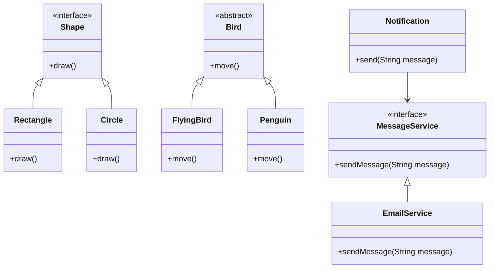

## 2.3 The SOLID Principles

In the realm of software development, especially when working with object-oriented languages like Dart, adhering to design principles is crucial for creating maintainable, scalable, and robust applications. The SOLID principles, a set of five design principles, serve as a guideline for developers to achieve these goals. Let's delve into each of these principles and explore how they can be applied effectively in Dart and Flutter development.

### Single Responsibility Principle (SRP)

**Definition:** A class should have only one reason to change, meaning it should have only one job or responsibility.

The Single Responsibility Principle (SRP) emphasizes that a class should focus on a single task or responsibility. This principle helps in reducing the complexity of the code and makes it easier to maintain and understand. When a class has multiple responsibilities, changes in one responsibility can affect the others, leading to a fragile codebase.

#### Example in Dart

Consider a class that handles both user authentication and logging. This violates the SRP because it has two responsibilities.

```dart
class UserService {
  void authenticate(String username, String password) {
    // Authentication logic
  }

  void log(String message) {
    // Logging logic
  }
}
```

To adhere to the SRP, we should separate these responsibilities into different classes:

```dart
class AuthService {
  void authenticate(String username, String password) {
    // Authentication logic
  }
}

class Logger {
  void log(String message) {
    // Logging logic
  }
}
```

By separating these responsibilities, each class now has a single reason to change, making the code more modular and easier to maintain.

### Open/Closed Principle (OCP)

**Definition:** Software entities (classes, modules, functions, etc.) should be open for extension but closed for modification.

The Open/Closed Principle (OCP) encourages developers to design software that can be extended without modifying existing code. This is achieved through abstraction and polymorphism, allowing new functionality to be added with minimal changes to the existing codebase.

#### Example in Dart

Let's consider a simple example of a shape drawing application:

```dart
class Rectangle {
  void draw() {
    // Drawing logic for rectangle
  }
}

class Circle {
  void draw() {
    // Drawing logic for circle
  }
}
```

If we want to add a new shape, we would need to modify the existing code, which violates the OCP. Instead, we can use an interface to allow for extension:

```dart
abstract class Shape {
  void draw();
}

class Rectangle implements Shape {
  @override
  void draw() {
    // Drawing logic for rectangle
  }
}

class Circle implements Shape {
  @override
  void draw() {
    // Drawing logic for circle
  }
}
```

Now, adding a new shape like a `Triangle` only requires implementing the `Shape` interface, without modifying existing classes.

### Liskov Substitution Principle (LSP)

**Definition:** Objects of a superclass should be replaceable with objects of a subclass without affecting the correctness of the program.

The Liskov Substitution Principle (LSP) ensures that a subclass can stand in for its superclass without altering the desirable properties of the program. This principle is crucial for achieving polymorphism in object-oriented programming.

#### Example in Dart

Consider a base class `Bird` and a subclass `Penguin`:

```dart
class Bird {
  void fly() {
    // Flying logic
  }
}

class Penguin extends Bird {
  @override
  void fly() {
    throw Exception("Penguins can't fly!");
  }
}
```

Here, substituting `Penguin` for `Bird` would break the program, violating the LSP. To adhere to LSP, we should refactor the design:

```dart
abstract class Bird {
  void move();
}

class FlyingBird extends Bird {
  @override
  void move() {
    // Flying logic
  }
}

class Penguin extends Bird {
  @override
  void move() {
    // Walking logic
  }
}
```

Now, `Penguin` can be substituted for `Bird` without breaking the program, as both adhere to the `move` method.

### Interface Segregation Principle (ISP)

**Definition:** Clients should not be forced to depend on interfaces they do not use.

The Interface Segregation Principle (ISP) advocates for creating specific interfaces rather than a single, general-purpose interface. This ensures that implementing classes are not burdened with methods they do not need.

#### Example in Dart

Consider an interface `Machine` with multiple methods:

```dart
abstract class Machine {
  void print();
  void scan();
  void fax();
}
```

A class `Printer` implementing this interface would be forced to provide implementations for all methods, even if it doesn't need them:

```dart
class Printer implements Machine {
  @override
  void print() {
    // Print logic
  }

  @override
  void scan() {
    // Not needed
  }

  @override
  void fax() {
    // Not needed
  }
}
```

To adhere to ISP, we should split the interface into smaller, more specific interfaces:

```dart
abstract class Printer {
  void print();
}

abstract class Scanner {
  void scan();
}

abstract class Fax {
  void fax();
}

class OfficePrinter implements Printer, Scanner {
  @override
  void print() {
    // Print logic
  }

  @override
  void scan() {
    // Scan logic
  }
}
```

Now, `OfficePrinter` only implements the interfaces it needs, adhering to the ISP.

### Dependency Inversion Principle (DIP)

**Definition:** Depend upon abstractions, not concrete classes.

The Dependency Inversion Principle (DIP) suggests that high-level modules should not depend on low-level modules. Both should depend on abstractions. This principle helps in reducing the coupling between different parts of the code.

#### Example in Dart

Consider a class `EmailService` that sends emails:

```dart
class EmailService {
  void sendEmail(String message) {
    // Email sending logic
  }
}

class Notification {
  final EmailService emailService;

  Notification(this.emailService);

  void send(String message) {
    emailService.sendEmail(message);
  }
}
```

Here, `Notification` is tightly coupled with `EmailService`. To adhere to DIP, we can introduce an abstraction:

```dart
abstract class MessageService {
  void sendMessage(String message);
}

class EmailService implements MessageService {
  @override
  void sendMessage(String message) {
    // Email sending logic
  }
}

class Notification {
  final MessageService messageService;

  Notification(this.messageService);

  void send(String message) {
    messageService.sendMessage(message);
  }
}
```

Now, `Notification` depends on the `MessageService` abstraction, allowing for different implementations (e.g., SMS, Push notifications) without modifying the `Notification` class.

### Applying SOLID in Dart

Applying SOLID principles in Dart involves understanding the language's features and leveraging them to adhere to these principles. Dart's strong typing, support for interfaces, and mixins make it well-suited for implementing SOLID principles.

#### Practical Examples and Best Practices

1. **Use Interfaces and Abstract Classes:** Leverage Dart's interfaces and abstract classes to define contracts and ensure adherence to the Open/Closed and Interface Segregation principles.

2. **Favor Composition Over Inheritance:** Use composition to adhere to the Single Responsibility and Dependency Inversion principles. Dart's mixins can be a powerful tool for composition.

3. **Utilize Dependency Injection:** Implement dependency injection to adhere to the Dependency Inversion principle. Use packages like `get_it` for managing dependencies in Flutter applications.

4. **Design for Extensibility:** When designing classes, think about future extensions and how new functionality can be added without modifying existing code.

5. **Refactor Regularly:** Regularly refactor code to ensure adherence to SOLID principles. This helps in maintaining a clean and maintainable codebase.

### Visualizing SOLID Principles

To better understand the relationships and dependencies in SOLID principles, let's visualize them using a class diagram:



This diagram illustrates how interfaces and abstractions are used to adhere to SOLID principles, promoting extensibility and reducing coupling.

### Try It Yourself

To solidify your understanding of the SOLID principles, try modifying the code examples provided. For instance, add a new shape to the `Shape` interface or implement a new `MessageService` for SMS notifications. Experiment with different designs and see how adhering to SOLID principles affects the maintainability and scalability of your code.

### Knowledge Check

- **What is the main goal of the Single Responsibility Principle?**
- **How does the Open/Closed Principle promote extensibility?**
- **Why is the Liskov Substitution Principle important for polymorphism?**
- **How can the Interface Segregation Principle reduce unnecessary dependencies?**
- **What is the benefit of the Dependency Inversion Principle in reducing coupling?**

### Embrace the Journey

Remember, mastering the SOLID principles is a journey. As you continue to apply these principles in your Dart and Flutter projects, you'll find your code becoming more robust, maintainable, and scalable. Keep experimenting, stay curious, and enjoy the process of becoming a more proficient developer.

## Quiz Time!



### What is the main goal of the Single Responsibility Principle?

- [x] A class should have only one reason to change.
- [ ] A class should be open for extension but closed for modification.
- [ ] A class should depend on abstractions, not concrete classes.
- [ ] A class should implement all methods of an interface.

> **Explanation:** The Single Responsibility Principle states that a class should have only one reason to change, meaning it should have only one job or responsibility.

### How does the Open/Closed Principle promote extensibility?

- [x] By allowing software entities to be extended without modifying existing code.
- [ ] By ensuring classes have only one responsibility.
- [ ] By forcing clients to depend on interfaces they do not use.
- [ ] By making high-level modules depend on low-level modules.

> **Explanation:** The Open/Closed Principle promotes extensibility by allowing software entities to be extended without modifying existing code, typically through the use of interfaces and polymorphism.

### Why is the Liskov Substitution Principle important for polymorphism?

- [x] It ensures that a subclass can replace a superclass without affecting program correctness.
- [ ] It requires classes to have only one responsibility.
- [ ] It forces clients to depend on interfaces they do not use.
- [ ] It makes high-level modules depend on low-level modules.

> **Explanation:** The Liskov Substitution Principle is important for polymorphism because it ensures that a subclass can replace a superclass without affecting the correctness of the program.

### How can the Interface Segregation Principle reduce unnecessary dependencies?

- [x] By creating specific interfaces rather than a single, general-purpose interface.
- [ ] By allowing software entities to be extended without modifying existing code.
- [ ] By ensuring classes have only one responsibility.
- [ ] By making high-level modules depend on low-level modules.

> **Explanation:** The Interface Segregation Principle reduces unnecessary dependencies by creating specific interfaces rather than a single, general-purpose interface, ensuring that implementing classes are not burdened with methods they do not need.

### What is the benefit of the Dependency Inversion Principle in reducing coupling?

- [x] It makes high-level modules depend on abstractions, not low-level modules.
- [ ] It ensures classes have only one responsibility.
- [ ] It allows software entities to be extended without modifying existing code.
- [ ] It forces clients to depend on interfaces they do not use.

> **Explanation:** The Dependency Inversion Principle reduces coupling by making high-level modules depend on abstractions, not low-level modules, which promotes flexibility and scalability.

### Which principle suggests using interfaces and abstract classes to define contracts?

- [x] Open/Closed Principle
- [ ] Single Responsibility Principle
- [ ] Liskov Substitution Principle
- [ ] Interface Segregation Principle

> **Explanation:** The Open/Closed Principle suggests using interfaces and abstract classes to define contracts, allowing for extension without modification.

### What is a key practice to adhere to the Single Responsibility Principle?

- [x] Separating different responsibilities into different classes.
- [ ] Creating specific interfaces for each client.
- [ ] Making high-level modules depend on abstractions.
- [ ] Ensuring subclasses can replace superclasses.

> **Explanation:** A key practice to adhere to the Single Responsibility Principle is separating different responsibilities into different classes, ensuring each class has only one reason to change.

### How does the Interface Segregation Principle benefit implementing classes?

- [x] By ensuring they are not burdened with methods they do not need.
- [ ] By allowing them to replace superclasses without affecting correctness.
- [ ] By making them depend on abstractions, not concrete classes.
- [ ] By allowing them to be extended without modification.

> **Explanation:** The Interface Segregation Principle benefits implementing classes by ensuring they are not burdened with methods they do not need, promoting modularity and flexibility.

### What is a common tool in Dart for adhering to the Dependency Inversion Principle?

- [x] Dependency injection
- [ ] Inheritance
- [ ] General-purpose interfaces
- [ ] Concrete classes

> **Explanation:** A common tool in Dart for adhering to the Dependency Inversion Principle is dependency injection, which allows for flexible and scalable code design.

### True or False: The SOLID principles are only applicable to Dart and Flutter development.

- [ ] True
- [x] False

> **Explanation:** False. The SOLID principles are applicable to all object-oriented programming languages, not just Dart and Flutter development.


