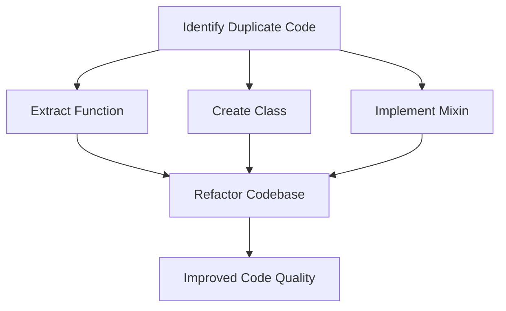

## 2.4 DRY (Don't Repeat Yourself)

In the realm of software development, the DRY (Don't Repeat Yourself) principle stands as a cornerstone for writing clean, efficient, and maintainable code. This principle encourages developers to avoid code duplication, which can lead to increased maintenance costs, bugs, and inconsistencies. In this section, we will delve into the DRY principle, explore its importance in Dart and Flutter development, and provide practical techniques to implement it effectively.

### Principle Explanation

The DRY principle, coined by Andy Hunt and Dave Thomas in their book "The Pragmatic Programmer," emphasizes the importance of reducing repetition in code. The core idea is that every piece of knowledge or logic should have a single, unambiguous representation within a system. By adhering to this principle, developers can create systems that are easier to maintain, extend, and debug.

#### Why Avoid Code Duplication?

1. **Maintainability**: When code is duplicated, any change or bug fix must be applied to multiple locations, increasing the risk of errors and inconsistencies.
2. **Readability**: Redundant code can clutter the codebase, making it harder to understand and navigate.
3. **Efficiency**: Repeated logic can lead to inefficient use of resources and increased execution time.
4. **Scalability**: As applications grow, duplicated code can become a bottleneck for scaling and adding new features.

### Techniques in Dart

Dart, with its rich set of features, provides several mechanisms to adhere to the DRY principle. Let's explore some of these techniques:

#### Utilizing Functions

Functions are fundamental building blocks in Dart that allow us to encapsulate logic and reuse it across different parts of an application. By abstracting common operations into functions, we can eliminate redundancy and enhance code clarity.

```dart
// Function to calculate the area of a rectangle
double calculateRectangleArea(double width, double height) {
  return width * height;
}

// Usage
void main() {
  double area1 = calculateRectangleArea(5.0, 10.0);
  double area2 = calculateRectangleArea(7.5, 3.5);
  print('Area1: $area1, Area2: $area2');
}
```

In this example, the `calculateRectangleArea` function encapsulates the logic for calculating the area of a rectangle, allowing us to reuse it without duplicating the formula.

#### Leveraging Classes

Classes in Dart enable us to group related data and behavior, promoting code reuse and organization. By defining classes, we can create reusable components that encapsulate both state and behavior.

```dart
// Class representing a Rectangle
class Rectangle {
  double width;
  double height;

  Rectangle(this.width, this.height);

  double get area => width * height;
}

// Usage
void main() {
  Rectangle rect1 = Rectangle(5.0, 10.0);
  Rectangle rect2 = Rectangle(7.5, 3.5);
  print('Area1: ${rect1.area}, Area2: ${rect2.area}');
}
```

Here, the `Rectangle` class encapsulates the properties and behavior related to a rectangle, allowing us to create multiple instances without duplicating code.

#### Implementing Mixins

Mixins in Dart provide a way to share functionality between classes without using inheritance. They are particularly useful for adding common behavior to multiple classes, adhering to the DRY principle.

```dart
// Mixin for providing logging functionality
mixin Logger {
  void log(String message) {
    print('Log: $message');
  }
}

// Class using the Logger mixin
class NetworkService with Logger {
  void fetchData() {
    log('Fetching data from network...');
    // Network fetching logic
  }
}

// Usage
void main() {
  NetworkService service = NetworkService();
  service.fetchData();
}
```

In this example, the `Logger` mixin provides logging functionality that can be reused across different classes, eliminating the need to duplicate logging logic.

### Code Refactoring

Refactoring is the process of restructuring existing code without changing its external behavior. It plays a crucial role in implementing the DRY principle by identifying and eliminating duplicate code. Let's explore some refactoring techniques:

#### Identifying Duplicate Code

The first step in refactoring is to identify areas of duplication. This can be done through code reviews, static analysis tools, or simply by examining the codebase for repeated patterns.

#### Extracting Functions

Once duplicate code is identified, extract it into a function. This not only reduces redundancy but also improves code readability and testability.

```dart
// Before refactoring
void processOrder(double amount) {
  print('Processing order of amount: $amount');
  // Additional processing logic
}

void processRefund(double amount) {
  print('Processing refund of amount: $amount');
  // Additional refund logic
}

// After refactoring
void processTransaction(String type, double amount) {
  print('Processing $type of amount: $amount');
  // Additional transaction logic
}

// Usage
void main() {
  processTransaction('order', 100.0);
  processTransaction('refund', 50.0);
}
```

In this refactoring example, the `processOrder` and `processRefund` functions are combined into a single `processTransaction` function, reducing code duplication.

#### Utilizing Inheritance and Interfaces

Inheritance and interfaces can be used to share common behavior among classes. By defining a base class or interface, we can eliminate duplicate code and promote code reuse.

```dart
// Base class for different types of accounts
abstract class Account {
  double balance;

  Account(this.balance);

  void deposit(double amount) {
    balance += amount;
    print('Deposited: $amount, New Balance: $balance');
  }

  void withdraw(double amount);
}

// SavingsAccount class inheriting from Account
class SavingsAccount extends Account {
  SavingsAccount(double balance) : super(balance);

  @override
  void withdraw(double amount) {
    if (balance >= amount) {
      balance -= amount;
      print('Withdrew: $amount, New Balance: $balance');
    } else {
      print('Insufficient funds');
    }
  }
}

// Usage
void main() {
  SavingsAccount account = SavingsAccount(1000.0);
  account.deposit(200.0);
  account.withdraw(500.0);
}
```

In this example, the `Account` class provides common functionality for different types of accounts, while specific behavior is implemented in subclasses, reducing code duplication.

### Visualizing DRY in Dart

To better understand the DRY principle and its application in Dart, let's visualize the process of refactoring duplicate code into reusable components.



**Diagram Description**: This flowchart illustrates the process of applying the DRY principle in Dart. It begins with identifying duplicate code, followed by extracting functions, creating classes, or implementing mixins. The refactored codebase leads to improved code quality.

### Try It Yourself

To solidify your understanding of the DRY principle, try modifying the code examples provided. For instance, add new methods to the `Rectangle` class or extend the `Logger` mixin to include different logging levels. Experiment with refactoring your own codebase to identify and eliminate duplication.

### References and Links

For further reading on the DRY principle and its application in software development, consider exploring the following resources:

- [The Pragmatic Programmer](https://pragprog.com/titles/tpp20/the-pragmatic-programmer-20th-anniversary-edition/) by Andrew Hunt and David Thomas
- [Dart Language Tour](https://dart.dev/guides/language/language-tour)
- [Flutter Documentation](https://flutter.dev/docs)

### Knowledge Check

To reinforce your learning, consider the following questions:

1. What is the primary goal of the DRY principle?
2. How can functions help in adhering to the DRY principle?
3. What role do mixins play in reducing code duplication in Dart?
4. Why is refactoring important in implementing the DRY principle?
5. How can inheritance and interfaces be used to eliminate duplicate code?

### Embrace the Journey

Remember, mastering the DRY principle is a journey. As you continue to develop in Dart and Flutter, keep experimenting with different techniques to reduce code duplication. Stay curious, and enjoy the process of creating clean, efficient, and maintainable code.

## Quiz Time!



### What is the primary goal of the DRY principle?

- [x] To reduce code duplication
- [ ] To increase code complexity
- [ ] To enhance code obfuscation
- [ ] To minimize code readability

> **Explanation:** The DRY principle aims to reduce code duplication, making the codebase easier to maintain and extend.

### How can functions help in adhering to the DRY principle?

- [x] By encapsulating reusable logic
- [ ] By increasing code redundancy
- [ ] By complicating the code structure
- [ ] By reducing code readability

> **Explanation:** Functions encapsulate reusable logic, allowing developers to avoid duplicating code across different parts of an application.

### What role do mixins play in reducing code duplication in Dart?

- [x] They allow sharing functionality between classes
- [ ] They increase code duplication
- [ ] They complicate class hierarchies
- [ ] They reduce code readability

> **Explanation:** Mixins enable sharing functionality between classes without using inheritance, thus reducing code duplication.

### Why is refactoring important in implementing the DRY principle?

- [x] It helps identify and eliminate duplicate code
- [ ] It increases code complexity
- [ ] It reduces code readability
- [ ] It complicates the codebase

> **Explanation:** Refactoring involves restructuring existing code to identify and eliminate duplicate code, adhering to the DRY principle.

### How can inheritance and interfaces be used to eliminate duplicate code?

- [x] By sharing common behavior among classes
- [ ] By increasing code duplication
- [ ] By complicating class hierarchies
- [ ] By reducing code readability

> **Explanation:** Inheritance and interfaces allow sharing common behavior among classes, reducing the need for duplicate code.

### What is a common pitfall of not following the DRY principle?

- [x] Increased maintenance costs
- [ ] Enhanced code readability
- [ ] Improved code efficiency
- [ ] Simplified code structure

> **Explanation:** Not following the DRY principle can lead to increased maintenance costs due to duplicated code that needs to be updated in multiple places.

### Which Dart feature is particularly useful for adding common behavior to multiple classes?

- [x] Mixins
- [ ] Interfaces
- [ ] Enums
- [ ] Generics

> **Explanation:** Mixins are particularly useful in Dart for adding common behavior to multiple classes without using inheritance.

### What is the benefit of extracting duplicate code into a function?

- [x] It enhances code reusability
- [ ] It increases code complexity
- [ ] It reduces code readability
- [ ] It complicates the codebase

> **Explanation:** Extracting duplicate code into a function enhances code reusability and reduces redundancy.

### How does the DRY principle contribute to code scalability?

- [x] By reducing redundancy and making it easier to add new features
- [ ] By increasing code complexity
- [ ] By complicating the codebase
- [ ] By reducing code readability

> **Explanation:** The DRY principle reduces redundancy, making it easier to scale the codebase and add new features.

### True or False: The DRY principle is only applicable to Dart and Flutter development.

- [ ] True
- [x] False

> **Explanation:** The DRY principle is a universal software design principle applicable to all programming languages and development environments.




