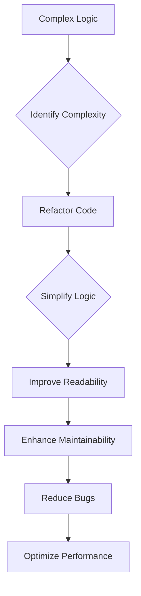

## 2.5 KISS (Keep It Simple, Stupid)

In the realm of software development, the KISS principle—an acronym for "Keep It Simple, Stupid"—serves as a guiding beacon for developers striving to create efficient, maintainable, and robust applications. This principle emphasizes simplicity in design and implementation, advocating for solutions that are straightforward and easy to understand. In this section, we will delve into the importance of simplicity in Dart and Flutter development, explore strategies to achieve simplicity, and provide practical examples to illustrate these concepts.

### Importance of Simplicity

Simplicity in code is not merely an aesthetic choice; it is a fundamental aspect of software engineering that directly impacts the readability, maintainability, and debuggability of code. Let's explore why simplicity is crucial:

1. **Readability**: Simple code is easier to read and understand. When code is clear and concise, developers can quickly grasp its functionality, making it easier to onboard new team members and facilitate collaboration.

2. **Maintainability**: Simplicity reduces the cognitive load required to maintain and update code. With fewer complexities, developers can make changes with confidence, minimizing the risk of introducing bugs.

3. **Debugging**: Simple code is easier to debug. When issues arise, developers can trace through the code more efficiently, identifying and resolving problems with greater ease.

4. **Scalability**: Simplicity lays the foundation for scalable applications. By avoiding unnecessary complexities, developers can build systems that are easier to extend and adapt to changing requirements.

5. **Performance**: Simple solutions often lead to more efficient code execution. By eliminating extraneous logic, developers can optimize performance and reduce resource consumption.

### Strategies for Simplicity

Achieving simplicity in code requires deliberate effort and thoughtful design. Here are some strategies to help you embrace the KISS principle in your Dart and Flutter projects:

#### 1. Write Clear and Concise Code

- **Use Descriptive Names**: Choose meaningful names for variables, functions, and classes that convey their purpose. Avoid abbreviations and cryptic names that obscure intent.
  
- **Limit Function Complexity**: Keep functions focused on a single responsibility. Break down complex logic into smaller, reusable functions to enhance clarity.

- **Avoid Deep Nesting**: Excessive nesting of loops and conditionals can make code difficult to follow. Strive for flat and linear code structures.

#### 2. Avoid Over-Engineering

- **Resist Premature Optimization**: Focus on solving the problem at hand rather than anticipating future needs. Optimize only when necessary and based on evidence.

- **Embrace YAGNI (You Aren't Gonna Need It)**: Implement features only when they are needed. Avoid adding unnecessary functionality that complicates the codebase.

#### 3. Use Built-in Dart Features

- **Leverage Dart's Null Safety**: Utilize Dart's null safety features to prevent null reference errors and simplify null handling.

- **Utilize Collections and Iterables**: Take advantage of Dart's powerful collection and iterable classes to simplify data manipulation.

- **Employ Asynchronous Programming**: Use Dart's async/await syntax to handle asynchronous operations cleanly and concisely.

#### 4. Simplify Complex Logic

- **Refactor Code Regularly**: Continuously improve code by refactoring complex logic into simpler, more manageable pieces.

- **Use Design Patterns Wisely**: Apply design patterns judiciously to solve specific problems without overcomplicating the code.

- **Document Code Thoughtfully**: Provide clear comments and documentation to explain complex logic and decisions.

### Examples: Simplifying Complex Logic in Dart

Let's explore some practical examples of how to apply the KISS principle in Dart to simplify complex logic.

#### Example 1: Simplifying Conditional Logic

Consider a scenario where you need to determine the discount rate based on a customer's membership level. A complex approach might involve nested conditionals:

```dart
double getDiscountRate(String membershipLevel) {
  if (membershipLevel == 'Gold') {
    return 0.2;
  } else {
    if (membershipLevel == 'Silver') {
      return 0.1;
    } else {
      if (membershipLevel == 'Bronze') {
        return 0.05;
      } else {
        return 0.0;
      }
    }
  }
}
```

This code can be simplified using a `switch` statement:

```dart
double getDiscountRate(String membershipLevel) {
  switch (membershipLevel) {
    case 'Gold':
      return 0.2;
    case 'Silver':
      return 0.1;
    case 'Bronze':
      return 0.05;
    default:
      return 0.0;
  }
}
```

By using a `switch` statement, we reduce nesting and improve readability.

#### Example 2: Streamlining Asynchronous Code

Handling asynchronous operations can become complex, especially when dealing with multiple asynchronous tasks. Consider the following example:

```dart
Future<void> fetchData() async {
  final data1 = await fetchDataFromSource1();
  final data2 = await fetchDataFromSource2();
  final data3 = await fetchDataFromSource3();
  processData(data1, data2, data3);
}
```

This code can be simplified using `Future.wait` to execute tasks concurrently:

```dart
Future<void> fetchData() async {
  final results = await Future.wait([
    fetchDataFromSource1(),
    fetchDataFromSource2(),
    fetchDataFromSource3(),
  ]);
  processData(results[0], results[1], results[2]);
}
```

By using `Future.wait`, we streamline the code and improve performance by executing tasks concurrently.

#### Example 3: Utilizing Dart's Collection Methods

Dart provides powerful collection methods that can simplify data manipulation. Consider the following example of filtering and transforming a list:

```dart
List<String> getActiveUsernames(List<User> users) {
  List<String> activeUsernames = [];
  for (var user in users) {
    if (user.isActive) {
      activeUsernames.add(user.username.toUpperCase());
    }
  }
  return activeUsernames;
}
```

This code can be simplified using Dart's collection methods:

```dart
List<String> getActiveUsernames(List<User> users) {
  return users
      .where((user) => user.isActive)
      .map((user) => user.username.toUpperCase())
      .toList();
}
```

By using `where` and `map`, we achieve the same result with less code and improved readability.

### Visualizing the KISS Principle

To better understand the impact of the KISS principle, let's visualize the process of simplifying complex logic using a flowchart.



**Figure 1: Visualizing the Process of Simplifying Complex Logic**

This flowchart illustrates the iterative process of identifying complexity, refactoring code, and achieving simplicity, leading to improved readability, maintainability, and performance.

### References and Links

For further reading on the KISS principle and its application in software development, consider exploring the following resources:

- [KISS Principle on Wikipedia](https://en.wikipedia.org/wiki/KISS_principle)
- [Dart Language Tour](https://dart.dev/guides/language/language-tour)
- [Flutter Documentation](https://flutter.dev/docs)

### Knowledge Check

Let's reinforce our understanding of the KISS principle with some questions and exercises:

1. **Question**: Why is simplicity important in software development?
   - **Answer**: Simplicity enhances readability, maintainability, debugging, scalability, and performance.

2. **Exercise**: Refactor a piece of complex code in your project to make it simpler and more readable.

3. **Challenge**: Identify a section of code in your application that violates the KISS principle and propose a simpler solution.

### Embrace the Journey

Remember, simplicity is a journey, not a destination. As you continue to develop applications in Dart and Flutter, strive to keep your code simple and elegant. Embrace the KISS principle as a guiding philosophy, and enjoy the benefits of clean, maintainable, and efficient code.

### Formatting and Structure

Organize your code with clear headings and subheadings. Use bullet points to break down complex information, and highlight important terms or concepts using bold or italic text sparingly.

### Writing Style

Use first-person plural (we, let's) to create a collaborative feel. Avoid gender-specific pronouns; use they/them or rewrite sentences to be inclusive. Define acronyms and abbreviations upon first use.

## Quiz Time!



### Why is simplicity important in software development?

- [x] Enhances readability, maintainability, and debugging
- [ ] Increases code complexity
- [ ] Makes code harder to understand
- [ ] Reduces performance

> **Explanation:** Simplicity enhances readability, maintainability, and debugging, making code easier to understand and work with.

### What is a key strategy for achieving simplicity in code?

- [x] Write clear and concise code
- [ ] Use complex algorithms
- [ ] Add unnecessary features
- [ ] Increase nesting levels

> **Explanation:** Writing clear and concise code is a key strategy for achieving simplicity, making code easier to read and maintain.

### How can you simplify asynchronous code in Dart?

- [x] Use Future.wait for concurrent execution
- [ ] Use nested loops
- [ ] Avoid using async/await
- [ ] Increase the number of async functions

> **Explanation:** Using Future.wait allows for concurrent execution of asynchronous tasks, simplifying the code and improving performance.

### What is the benefit of using Dart's collection methods?

- [x] Simplifies data manipulation
- [ ] Increases code complexity
- [ ] Makes code harder to read
- [ ] Reduces performance

> **Explanation:** Dart's collection methods simplify data manipulation, making code more concise and readable.

### What does the KISS principle stand for?

- [x] Keep It Simple, Stupid
- [ ] Keep It Safe, Secure
- [ ] Keep It Short, Sweet
- [ ] Keep It Smart, Sophisticated

> **Explanation:** The KISS principle stands for "Keep It Simple, Stupid," emphasizing simplicity in design and implementation.

### How can you avoid over-engineering in your code?

- [x] Resist premature optimization
- [ ] Add unnecessary features
- [ ] Use complex algorithms
- [ ] Increase code complexity

> **Explanation:** Resisting premature optimization helps avoid over-engineering, focusing on solving the problem at hand.

### What is the impact of simplicity on debugging?

- [x] Makes debugging easier
- [ ] Increases debugging time
- [ ] Makes code harder to debug
- [ ] Reduces the need for debugging

> **Explanation:** Simplicity makes debugging easier by reducing the complexity of the code, allowing for quicker identification of issues.

### How does simplicity affect scalability?

- [x] Lays the foundation for scalable applications
- [ ] Limits scalability
- [ ] Increases code complexity
- [ ] Reduces performance

> **Explanation:** Simplicity lays the foundation for scalable applications by avoiding unnecessary complexities.

### What is a common pitfall when trying to achieve simplicity?

- [x] Over-engineering
- [ ] Writing clear code
- [ ] Using built-in features
- [ ] Simplifying logic

> **Explanation:** Over-engineering is a common pitfall that can complicate code, making it harder to maintain and understand.

### True or False: The KISS principle is only applicable to Dart and Flutter development.

- [ ] True
- [x] False

> **Explanation:** The KISS principle is a universal concept applicable to all areas of software development, not just Dart and Flutter.


