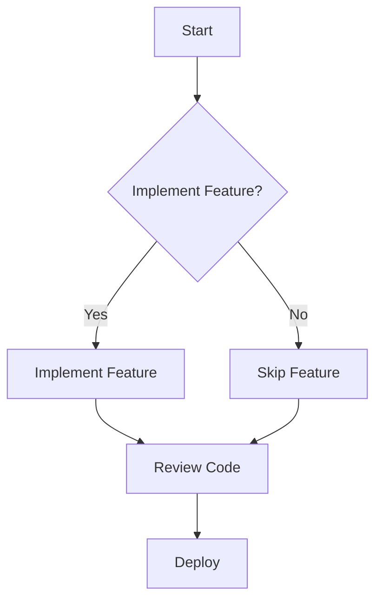

## 2.6 YAGNI (You Aren't Gonna Need It)

In the world of software development, efficiency and simplicity are paramount. The YAGNI principle, which stands for "You Aren't Gonna Need It," is a cornerstone of agile development methodologies. It emphasizes the importance of implementing features only when they are necessary, thereby avoiding unnecessary complexity and preventing feature creep. In this section, we will delve into the YAGNI principle, its significance in Dart and Flutter development, and how it can be applied to create efficient, maintainable code.

### Understanding the YAGNI Principle

The YAGNI principle is a reminder to developers to focus on the current requirements of a project rather than anticipating future needs. It is a call to action to resist the temptation to add features or code that might be useful someday but are not needed at the moment. This principle is particularly relevant in agile development environments, where requirements can change rapidly, and the focus is on delivering functional software quickly.

#### Key Concepts of YAGNI

- **Focus on Requirements**: Implement only what is necessary to meet the current requirements. Avoid adding features based on assumptions about future needs.
- **Avoiding Unnecessary Complexity**: By not implementing features that are not needed, you reduce the complexity of the codebase, making it easier to maintain and understand.
- **Preventing Feature Creep**: Feature creep occurs when additional features are added to a project without proper justification, often leading to increased complexity and potential bugs.

### The Importance of YAGNI in Dart and Flutter Development

Dart and Flutter are powerful tools for building cross-platform applications. However, with great power comes the potential for complexity. The YAGNI principle helps developers maintain a clean and efficient codebase by focusing on what is essential.

#### Benefits of Applying YAGNI

1. **Improved Code Quality**: By writing only the necessary code, you reduce the chances of introducing bugs and make the codebase easier to understand and maintain.
2. **Faster Development**: Focusing on current requirements allows for quicker development cycles, as you are not spending time on features that may never be used.
3. **Easier Refactoring**: A simpler codebase is easier to refactor, allowing for more flexibility in adapting to changing requirements.
4. **Reduced Technical Debt**: By avoiding unnecessary features, you minimize the accumulation of technical debt, which can slow down future development.

### Implementing YAGNI in Dart and Flutter

To effectively implement the YAGNI principle in Dart and Flutter development, follow these guidelines:

#### 1. **Start with a Minimal Viable Product (MVP)**

Focus on building a minimal viable product that meets the core requirements. This approach ensures that you are not spending time on features that are not essential to the product's success.

```dart
class User {
  final String name;
  final String email;

  User(this.name, this.email);
}

// Only implement methods that are currently needed
void sendEmail(User user) {
  // Code to send email
}
```

#### 2. **Use Feature Flags**

Feature flags allow you to toggle features on and off, enabling you to test new features without fully integrating them into the codebase. This approach helps in managing complexity and ensures that only necessary features are active.

```dart
bool isFeatureEnabled = false;

void main() {
  if (isFeatureEnabled) {
    // Implement feature-specific code
  }
}
```

#### 3. **Regularly Review and Refactor Code**

Regular code reviews and refactoring sessions help identify and remove unnecessary code. This practice ensures that the codebase remains clean and adheres to the YAGNI principle.

#### 4. **Prioritize Requirements**

Work closely with stakeholders to prioritize requirements. This collaboration ensures that the development team is focused on delivering features that provide the most value.

#### 5. **Embrace Agile Methodologies**

Agile methodologies, such as Scrum or Kanban, emphasize iterative development and continuous feedback. These practices align well with the YAGNI principle, as they focus on delivering functional software quickly and efficiently.

### Case Studies: YAGNI in Action

To illustrate the effectiveness of the YAGNI principle, let's explore some case studies where it has saved development time and improved code quality.

#### Case Study 1: Simplifying a Flutter Application

A team was tasked with developing a Flutter application for managing tasks. Initially, the team planned to implement a complex tagging system for tasks, anticipating that users might want to categorize their tasks in various ways. However, after applying the YAGNI principle, the team decided to focus on the core functionality of creating, editing, and deleting tasks. As a result, they were able to deliver the application faster and gather user feedback, which indicated that the tagging system was not a priority for most users.

#### Case Study 2: Streamlining a Dart Library

A developer was working on a Dart library for data processing. The initial plan included implementing various data transformation functions that might be useful in the future. By adhering to the YAGNI principle, the developer focused on implementing only the essential functions needed for the current project. This decision reduced the complexity of the library and made it easier to maintain and extend in the future.

### Visualizing YAGNI in Software Development

To better understand the impact of the YAGNI principle, let's visualize the difference between a codebase that adheres to YAGNI and one that does not.



**Diagram Description**: This flowchart illustrates the decision-making process when applying the YAGNI principle. If a feature is not needed, it is skipped, reducing complexity and focusing on essential requirements.

### Knowledge Check: Applying YAGNI

To reinforce your understanding of the YAGNI principle, consider the following questions:

1. How can the YAGNI principle improve code quality?
2. What are some potential pitfalls of not adhering to the YAGNI principle?
3. How can feature flags help in managing complexity?
4. Why is it important to regularly review and refactor code?

### Embrace the Journey

Remember, the YAGNI principle is not about cutting corners or avoiding necessary work. It is about focusing on what is essential and delivering value to users efficiently. As you continue your journey in Dart and Flutter development, keep the YAGNI principle in mind to create clean, maintainable, and efficient code.

### Conclusion

The YAGNI principle is a powerful tool for developers, helping to maintain focus on essential requirements and avoid unnecessary complexity. By implementing YAGNI in your Dart and Flutter projects, you can improve code quality, reduce development time, and deliver value to users more effectively. Embrace the YAGNI principle and watch your development process become more efficient and streamlined.

## Quiz Time!



### What does the YAGNI principle stand for?

- [x] You Aren't Gonna Need It
- [ ] You Always Gonna Need It
- [ ] You Aren't Gonna Neglect It
- [ ] You Always Gonna Neglect It

> **Explanation:** YAGNI stands for "You Aren't Gonna Need It," emphasizing the importance of implementing only necessary features.

### How does the YAGNI principle help in reducing technical debt?

- [x] By avoiding unnecessary features
- [ ] By adding more features
- [ ] By ignoring code reviews
- [ ] By increasing complexity

> **Explanation:** YAGNI helps reduce technical debt by avoiding unnecessary features, thus keeping the codebase simple and maintainable.

### Which development methodology aligns well with the YAGNI principle?

- [x] Agile
- [ ] Waterfall
- [ ] V-Model
- [ ] Spiral

> **Explanation:** Agile methodologies align well with YAGNI as they focus on iterative development and delivering functional software quickly.

### What is a potential pitfall of not adhering to the YAGNI principle?

- [x] Increased complexity
- [ ] Reduced complexity
- [ ] Faster development
- [ ] Improved code quality

> **Explanation:** Not adhering to YAGNI can lead to increased complexity due to unnecessary features.

### How can feature flags assist in implementing YAGNI?

- [x] By allowing features to be toggled on and off
- [ ] By permanently adding features
- [ ] By removing all features
- [ ] By ignoring user feedback

> **Explanation:** Feature flags allow developers to toggle features on and off, helping manage complexity and adhere to YAGNI.

### What is the primary focus of the YAGNI principle?

- [x] Current requirements
- [ ] Future requirements
- [ ] Past requirements
- [ ] All possible requirements

> **Explanation:** The primary focus of YAGNI is on current requirements, avoiding assumptions about future needs.

### How does YAGNI improve code quality?

- [x] By reducing unnecessary code
- [ ] By adding more code
- [ ] By ignoring code reviews
- [ ] By increasing complexity

> **Explanation:** YAGNI improves code quality by reducing unnecessary code, making the codebase easier to maintain.

### What is feature creep?

- [x] Adding features without proper justification
- [ ] Removing features without justification
- [ ] Ignoring user feedback
- [ ] Simplifying the codebase

> **Explanation:** Feature creep occurs when additional features are added without proper justification, often leading to increased complexity.

### Why is regular code review important in YAGNI?

- [x] To identify and remove unnecessary code
- [ ] To add more features
- [ ] To ignore user feedback
- [ ] To increase complexity

> **Explanation:** Regular code reviews help identify and remove unnecessary code, ensuring adherence to the YAGNI principle.

### True or False: YAGNI is about cutting corners in development.

- [ ] True
- [x] False

> **Explanation:** YAGNI is not about cutting corners; it's about focusing on essential requirements and delivering value efficiently.


