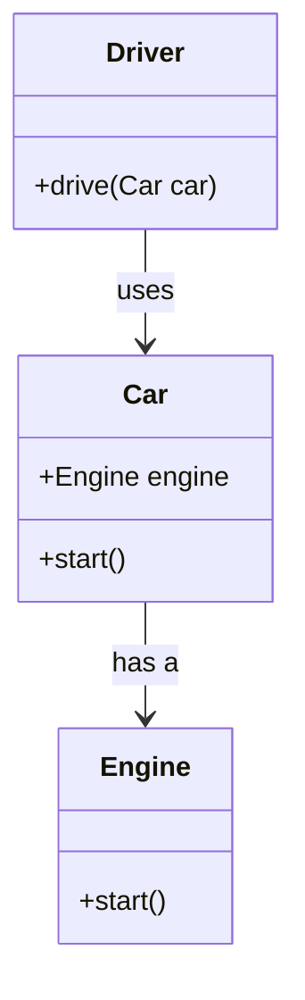

## 2.7 Law of Demeter

In the realm of software design, the Law of Demeter, also known as the Principle of Least Knowledge, stands as a guiding principle for reducing coupling and enhancing the maintainability of code. This principle is particularly relevant in object-oriented programming (OOP) and is crucial for Dart and Flutter developers aiming to create robust, scalable applications. In this section, we will delve into the Law of Demeter, explore its implications in Dart, and provide practical examples to illustrate its application.

### Understanding the Law of Demeter

The Law of Demeter is a design guideline for developing software, particularly object-oriented programs. It was introduced at Northeastern University in 1987 by Ian Holland. The principle can be succinctly stated as: "An object should only interact with its immediate collaborators." This means that a method of an object should only call methods of:

- The object itself
- Its fields
- Its parameters
- Any objects it creates

This principle aims to reduce the dependencies between different parts of a program, leading to more modular and maintainable code. By adhering to the Law of Demeter, developers can create systems where changes in one part of the codebase have minimal impact on other parts.

### Benefits of the Law of Demeter

1. **Reduced Coupling**: By limiting the interactions between objects, the Law of Demeter helps reduce the coupling between different modules. This makes the system more flexible and easier to modify.

2. **Improved Maintainability**: Code that adheres to the Law of Demeter is generally easier to understand and maintain. Changes in one part of the system are less likely to affect other parts.

3. **Enhanced Readability**: By minimizing the number of objects a method interacts with, the code becomes more readable and easier to follow.

4. **Increased Reusability**: Components that follow the Law of Demeter are more likely to be reusable in different contexts, as they are less dependent on the specific details of other components.

### Implementing the Law of Demeter in Dart

Dart, with its strong support for object-oriented programming, provides a conducive environment for implementing the Law of Demeter. Let's explore how we can apply this principle in Dart through practical examples.

#### Example 1: Violating the Law of Demeter

Consider the following Dart code that violates the Law of Demeter:

```dart
class Engine {
  void start() {
    print('Engine started');
  }
}

class Car {
  Engine engine = Engine();

  void start() {
    engine.start();
  }
}

class Driver {
  void drive(Car car) {
    car.engine.start(); // Violates the Law of Demeter
  }
}

void main() {
  Car car = Car();
  Driver driver = Driver();
  driver.drive(car);
}
```

In this example, the `Driver` class directly accesses the `engine` property of the `Car` class, which violates the Law of Demeter. The `Driver` class should not need to know about the internal structure of the `Car` class.

#### Example 2: Adhering to the Law of Demeter

Let's refactor the above code to adhere to the Law of Demeter:

```dart
class Engine {
  void start() {
    print('Engine started');
  }
}

class Car {
  Engine engine = Engine();

  void start() {
    engine.start();
  }
}

class Driver {
  void drive(Car car) {
    car.start(); // Adheres to the Law of Demeter
  }
}

void main() {
  Car car = Car();
  Driver driver = Driver();
  driver.drive(car);
}
```

In this refactored version, the `Driver` class interacts only with the `Car` class and not with its internal `engine` property. This change adheres to the Law of Demeter and makes the code more maintainable.

### Visualizing the Law of Demeter

To better understand the interactions between objects in the context of the Law of Demeter, let's visualize the relationships using a class diagram.



In this diagram, we can see that the `Driver` class interacts only with the `Car` class, and the `Car` class manages its interaction with the `Engine` class. This separation of concerns is a key aspect of the Law of Demeter.

### Key Participants in the Law of Demeter

1. **Client Object**: The object that initiates the interaction. In our example, this is the `Driver` class.

2. **Collaborator Object**: The object that the client interacts with directly. In our example, this is the `Car` class.

3. **Internal Object**: The object that is managed by the collaborator and should not be directly accessed by the client. In our example, this is the `Engine` class.

### Applicability of the Law of Demeter

The Law of Demeter is applicable in various scenarios, particularly when:

- Designing systems with complex interactions between objects.
- Developing large-scale applications where maintainability is a priority.
- Refactoring existing code to improve modularity and reduce dependencies.

### Sample Code Snippet: Applying the Law of Demeter in a Flutter App

Let's consider a Flutter application where we apply the Law of Demeter to manage state and UI interactions.

```dart
class User {
  final String name;
  final String email;

  User(this.name, this.email);
}

class UserManager {
  User _user;

  UserManager(this._user);

  String getUserName() => _user.name;
}

class UserProfileWidget extends StatelessWidget {
  final UserManager userManager;

  UserProfileWidget(this.userManager);

  @override
  Widget build(BuildContext context) {
    return Text('User: ${userManager.getUserName()}');
  }
}

void main() {
  User user = User('Alice', 'alice@example.com');
  UserManager userManager = UserManager(user);

  runApp(MaterialApp(
    home: Scaffold(
      body: Center(
        child: UserProfileWidget(userManager),
      ),
    ),
  ));
}
```

In this example, the `UserProfileWidget` interacts only with the `UserManager` to get the user's name, adhering to the Law of Demeter. The widget does not need to know about the internal structure of the `User` class.

### Design Considerations

When implementing the Law of Demeter, consider the following:

- **Balance**: While the Law of Demeter promotes reduced coupling, excessive adherence can lead to an increase in the number of methods, potentially complicating the codebase. Strive for a balance between adherence and practicality.
- **Encapsulation**: Use encapsulation to hide the internal details of objects, exposing only what is necessary for interaction.
- **Testing**: Ensure that your code is well-tested to verify that interactions between objects are as expected.

### Differences and Similarities with Other Principles

The Law of Demeter is often compared with other design principles, such as:

- **Single Responsibility Principle (SRP)**: Both principles aim to reduce complexity and improve maintainability, but SRP focuses on ensuring that a class has only one reason to change.
- **Encapsulation**: While encapsulation is about hiding the internal state of an object, the Law of Demeter is about limiting the interactions between objects.

### Try It Yourself

Experiment with the code examples provided by modifying the interactions between objects. Try introducing new classes and see how adhering to the Law of Demeter affects the design and maintainability of your code.

### Knowledge Check

- What is the primary goal of the Law of Demeter?
- How does the Law of Demeter reduce coupling in a software system?
- Provide an example of a violation of the Law of Demeter and explain how to refactor it.

### Embrace the Journey

Remember, mastering the Law of Demeter is just one step in your journey to becoming a proficient Dart and Flutter developer. As you continue to explore design patterns and principles, you'll gain a deeper understanding of how to create efficient, maintainable, and scalable applications. Keep experimenting, stay curious, and enjoy the journey!

## Quiz Time!



### What is the primary goal of the Law of Demeter?

- [x] To reduce coupling between objects
- [ ] To increase the number of methods in a class
- [ ] To ensure all classes have multiple responsibilities
- [ ] To allow direct access to all object properties

> **Explanation:** The Law of Demeter aims to reduce coupling between objects, making the system more modular and maintainable.

### Which of the following is a violation of the Law of Demeter?

- [x] Accessing a property of a property of an object
- [ ] Calling a method on the current object
- [ ] Using a parameter passed to a method
- [ ] Creating a new object within a method

> **Explanation:** Accessing a property of a property of an object violates the Law of Demeter, as it involves interacting with an object's internal structure.

### How can the Law of Demeter improve code maintainability?

- [x] By limiting the number of objects a method interacts with
- [ ] By increasing the complexity of method interactions
- [ ] By allowing direct access to all object properties
- [ ] By ensuring all methods have multiple parameters

> **Explanation:** The Law of Demeter improves maintainability by limiting the number of objects a method interacts with, reducing dependencies.

### In the context of the Law of Demeter, what is a "client object"?

- [x] The object that initiates the interaction
- [ ] The object that is managed by the collaborator
- [ ] The object that is created within a method
- [ ] The object that is passed as a parameter

> **Explanation:** A client object is the one that initiates the interaction with other objects.

### Which principle is often compared with the Law of Demeter?

- [x] Single Responsibility Principle (SRP)
- [ ] Open/Closed Principle
- [ ] Liskov Substitution Principle
- [ ] Interface Segregation Principle

> **Explanation:** The Law of Demeter is often compared with the Single Responsibility Principle (SRP) as both aim to reduce complexity and improve maintainability.

### What is a potential downside of excessive adherence to the Law of Demeter?

- [x] Increase in the number of methods
- [ ] Decrease in code readability
- [ ] Increase in coupling between objects
- [ ] Decrease in code maintainability

> **Explanation:** Excessive adherence to the Law of Demeter can lead to an increase in the number of methods, potentially complicating the codebase.

### How does encapsulation relate to the Law of Demeter?

- [x] Both aim to hide internal details of objects
- [ ] Encapsulation allows direct access to all properties
- [ ] The Law of Demeter discourages encapsulation
- [ ] Encapsulation increases coupling between objects

> **Explanation:** Both encapsulation and the Law of Demeter aim to hide internal details of objects, promoting modularity and maintainability.

### What is a "collaborator object" in the context of the Law of Demeter?

- [x] The object that the client interacts with directly
- [ ] The object that is managed by the client
- [ ] The object that is created within a method
- [ ] The object that is passed as a parameter

> **Explanation:** A collaborator object is the one that the client interacts with directly.

### How can you refactor code to adhere to the Law of Demeter?

- [x] By reducing the number of chained method calls
- [ ] By increasing the number of parameters in methods
- [ ] By allowing direct access to all object properties
- [ ] By creating more complex interactions between objects

> **Explanation:** Refactoring code to reduce the number of chained method calls helps adhere to the Law of Demeter.

### True or False: The Law of Demeter is also known as the Principle of Least Knowledge.

- [x] True
- [ ] False

> **Explanation:** True. The Law of Demeter is also known as the Principle of Least Knowledge, emphasizing minimal interaction between objects.




