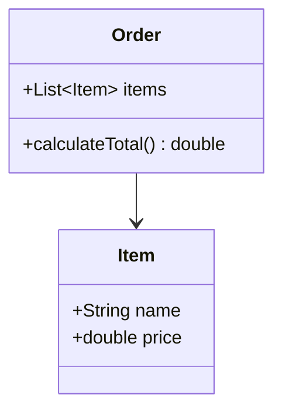
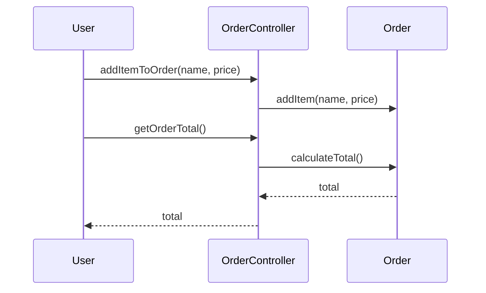

## 2.8 GRASP Principles (General Responsibility Assignment Software Patterns)

In the realm of software design, especially within object-oriented programming (OOP), the assignment of responsibilities to classes and objects is crucial for creating maintainable, scalable, and robust applications. The GRASP principles, or General Responsibility Assignment Software Patterns, provide a set of guidelines to help developers make informed decisions about responsibility assignment. In this section, we will delve into the GRASP principles and explore how they can be effectively applied in Dart and Flutter development.

### Introduction to GRASP

GRASP principles are a collection of nine fundamental principles that guide the assignment of responsibilities to classes and objects in object-oriented design. These principles help developers create systems that are easy to understand, maintain, and extend. The key GRASP principles include:

1. **Information Expert**
2. **Creator**
3. **Controller**
4. **Low Coupling**
5. **High Cohesion**
6. **Polymorphism**
7. **Pure Fabrication**
8. **Indirection**
9. **Protected Variations**

In this guide, we will focus on the first five principles, which are most relevant to Dart and Flutter development.

### Key Patterns

#### Information Expert

**Intent**: Assign responsibility to the class that has the necessary information to fulfill it.

The Information Expert principle suggests that responsibilities should be assigned to the class that has the most information required to complete the task. This principle helps ensure that the class with the most relevant data is responsible for processing it, leading to more cohesive and understandable code.

**Example in Dart**:

```dart
class Order {
  List<Item> items;

  Order(this.items);

  double calculateTotal() {
    double total = 0.0;
    for (var item in items) {
      total += item.price;
    }
    return total;
  }
}

class Item {
  String name;
  double price;

  Item(this.name, this.price);
}
```

In this example, the `Order` class is the Information Expert because it has the list of `Item` objects and is responsible for calculating the total price.

#### Creator

**Intent**: Assign responsibility for creating an instance of a class to the class that aggregates, contains, or closely uses the created class.

The Creator principle helps determine which class should be responsible for creating instances of another class. This principle promotes encapsulation and reduces coupling by ensuring that object creation is handled by a class that has a logical relationship with the created object.

**Example in Dart**:

```dart
class Order {
  List<Item> items = [];

  void addItem(String name, double price) {
    items.add(Item(name, price));
  }
}

class Item {
  String name;
  double price;

  Item(this.name, this.price);
}
```

Here, the `Order` class is the Creator of `Item` objects because it aggregates them and has a direct relationship with the items it contains.

#### Controller

**Intent**: Assign responsibility for handling a system event to a class representing one of the following choices: a) Represents the overall system, b) Represents a use case scenario, or c) Represents a session.

The Controller principle helps in assigning responsibilities for handling system events. It suggests that a class, often called a controller, should be responsible for receiving or handling system events and delegating the work to other classes.

**Example in Dart**:

```dart
class OrderController {
  Order order;

  OrderController(this.order);

  void addItemToOrder(String name, double price) {
    order.addItem(name, price);
  }

  double getOrderTotal() {
    return order.calculateTotal();
  }
}
```

In this example, `OrderController` acts as a controller that manages the interaction between the user interface and the `Order` class.

#### Low Coupling

**Intent**: Assign responsibilities to ensure that coupling remains low. Use this principle to reduce the impact of changes and increase the reusability of code.

Low Coupling refers to minimizing dependencies between classes. By reducing coupling, changes in one class are less likely to affect other classes, making the system more maintainable and flexible.

**Example in Dart**:

```dart
class PaymentProcessor {
  void processPayment(Order order) {
    double total = order.calculateTotal();
    // Process payment logic
  }
}

class Order {
  List<Item> items;

  Order(this.items);

  double calculateTotal() {
    double total = 0.0;
    for (var item in items) {
      total += item.price;
    }
    return total;
  }
}
```

Here, `PaymentProcessor` and `Order` have low coupling because `PaymentProcessor` only depends on the `Order` interface to calculate the total, not on its internal implementation.

#### High Cohesion

**Intent**: Assign responsibilities to ensure that cohesion remains high. High cohesion means that the responsibilities of a class are strongly related and focused.

High Cohesion refers to the degree to which the elements of a class belong together. A class with high cohesion has a single, well-defined purpose, making it easier to understand and maintain.

**Example in Dart**:

```dart
class Order {
  List<Item> items;

  Order(this.items);

  void addItem(Item item) {
    items.add(item);
  }

  double calculateTotal() {
    double total = 0.0;
    for (var item in items) {
      total += item.price;
    }
    return total;
  }
}
```

In this example, the `Order` class has high cohesion because all its methods are related to managing and calculating the total of its items.

### Applying GRASP in Dart

Applying GRASP principles in Dart involves understanding the unique features of the language and how they can be leveraged to implement these principles effectively. Dart's strong typing, mixins, and asynchronous programming capabilities provide a robust foundation for applying GRASP principles.

#### Practical Implementations

1. **Use Dart's Strong Typing**: Leverage Dart's strong typing to ensure that responsibilities are clearly defined and enforced at compile time. This helps in maintaining low coupling and high cohesion.

2. **Leverage Mixins for Code Reuse**: Use mixins to share behavior across classes without creating tight coupling. This aligns with the Low Coupling principle by allowing shared functionality without inheritance.

3. **Utilize Asynchronous Programming**: Dart's asynchronous programming model, with `async` and `await`, can be used to implement controllers that handle asynchronous events, aligning with the Controller principle.

4. **Implement Factory Constructors**: Use factory constructors to implement the Creator principle, allowing classes to control the instantiation of their objects.

#### Benefits of Applying GRASP in Dart

- **Improved Maintainability**: By following GRASP principles, Dart applications become easier to maintain and extend, as responsibilities are clearly defined and encapsulated.
- **Enhanced Reusability**: Low coupling and high cohesion lead to more reusable code components, reducing duplication and increasing efficiency.
- **Scalability**: Well-designed systems based on GRASP principles can scale more easily, as changes in one part of the system have minimal impact on others.

### Visualizing GRASP Principles

To better understand how GRASP principles can be applied in Dart, let's visualize the relationships and responsibilities using Mermaid.js diagrams.

#### Class Diagram for Information Expert



**Description**: This diagram shows the `Order` class as the Information Expert, responsible for calculating the total price of its `Item` objects.

#### Sequence Diagram for Controller



**Description**: This sequence diagram illustrates how the `OrderController` acts as a controller, managing interactions between the user and the `Order` class.

### Knowledge Check

To reinforce your understanding of GRASP principles, consider the following questions:

- How does the Information Expert principle help in assigning responsibilities?
- What is the role of a controller in the Controller principle?
- Why is low coupling important in software design?
- How can high cohesion be achieved in a class?

### Try It Yourself

Experiment with the code examples provided by:

- Modifying the `Order` class to include discounts and see how it affects the Information Expert principle.
- Implementing a new class that uses the Creator principle to instantiate `Order` objects.
- Creating a new controller class that manages multiple orders and handles user interactions.

### Embrace the Journey

Remember, mastering GRASP principles is a journey. As you continue to apply these principles in your Dart and Flutter projects, you'll gain a deeper understanding of object-oriented design and create more robust and maintainable applications. Keep experimenting, stay curious, and enjoy the process of becoming a more skilled developer.

## Quiz Time!



### Which GRASP principle suggests assigning responsibility to the class with the necessary information?

- [x] Information Expert
- [ ] Creator
- [ ] Controller
- [ ] Low Coupling

> **Explanation:** The Information Expert principle assigns responsibility to the class that has the necessary information to fulfill it.

### What is the main goal of the Creator principle?

- [ ] To handle system events
- [x] To assign responsibility for creating instances
- [ ] To ensure low coupling
- [ ] To maintain high cohesion

> **Explanation:** The Creator principle assigns responsibility for creating an instance of a class to the class that aggregates, contains, or closely uses the created class.

### Which principle focuses on minimizing dependencies between classes?

- [ ] Information Expert
- [ ] Creator
- [x] Low Coupling
- [ ] High Cohesion

> **Explanation:** Low Coupling refers to minimizing dependencies between classes to reduce the impact of changes and increase reusability.

### How does the Controller principle help in software design?

- [x] By assigning responsibility for handling system events
- [ ] By ensuring high cohesion
- [ ] By minimizing dependencies
- [ ] By assigning responsibility for creating instances

> **Explanation:** The Controller principle assigns responsibility for handling system events to a class representing the overall system, a use case scenario, or a session.

### Which principle ensures that the responsibilities of a class are strongly related and focused?

- [ ] Information Expert
- [ ] Creator
- [ ] Low Coupling
- [x] High Cohesion

> **Explanation:** High Cohesion ensures that the responsibilities of a class are strongly related and focused, making it easier to understand and maintain.

### What is the benefit of applying GRASP principles in Dart?

- [x] Improved maintainability
- [ ] Increased coupling
- [ ] Reduced cohesion
- [ ] More complex code

> **Explanation:** Applying GRASP principles in Dart leads to improved maintainability, as responsibilities are clearly defined and encapsulated.

### How can factory constructors be used in Dart?

- [x] To implement the Creator principle
- [ ] To handle system events
- [ ] To ensure low coupling
- [ ] To maintain high cohesion

> **Explanation:** Factory constructors in Dart can be used to implement the Creator principle, allowing classes to control the instantiation of their objects.

### What is the role of a controller in the Controller principle?

- [x] To manage interactions between the user interface and other classes
- [ ] To calculate totals
- [ ] To create instances
- [ ] To minimize dependencies

> **Explanation:** In the Controller principle, a controller manages interactions between the user interface and other classes.

### Why is high cohesion important in a class?

- [x] It makes the class easier to understand and maintain
- [ ] It increases dependencies
- [ ] It complicates the design
- [ ] It reduces reusability

> **Explanation:** High cohesion ensures that a class has a single, well-defined purpose, making it easier to understand and maintain.

### True or False: GRASP principles are only applicable to Dart and Flutter development.

- [ ] True
- [x] False

> **Explanation:** GRASP principles are applicable to any object-oriented programming language, not just Dart and Flutter.


