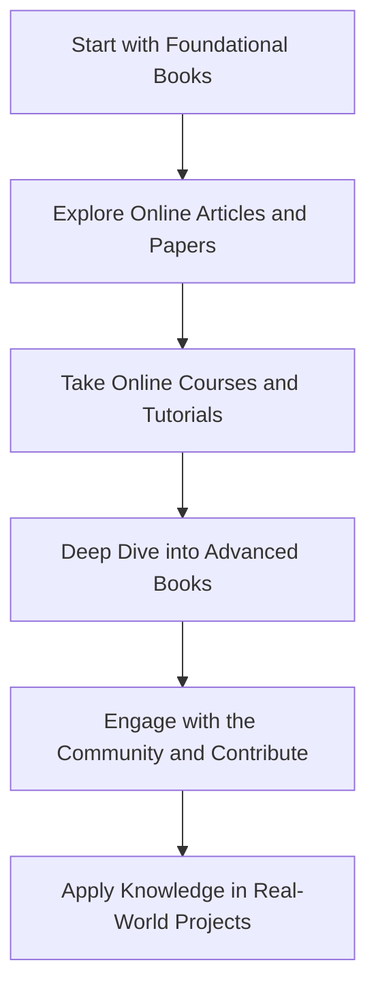

## 20.2 Bibliography and Further Reading

In the journey of mastering Dart design patterns and effective Flutter development, it is crucial to have access to a wealth of resources that can provide deeper insights and broader perspectives. This section compiles a comprehensive bibliography and further reading recommendations to support your continued learning and exploration. Whether you are a seasoned developer or just starting, these resources will enhance your understanding and application of design patterns in Dart and Flutter.

### Cited Works

The following is a list of books, articles, and papers that have been referenced throughout this guide. These works are foundational texts in the field of software design patterns and provide valuable context and depth to the topics covered.

1. **"Design Patterns: Elements of Reusable Object-Oriented Software" by Erich Gamma, Richard Helm, Ralph Johnson, and John Vlissides (The Gang of Four)**
   - This seminal book introduced the concept of design patterns to the software engineering community. It provides a catalog of 23 classic design patterns, which are still relevant and widely used today.

2. **"Effective Dart: Style" by the Dart Team**
   - This online resource offers guidelines and best practices for writing Dart code. It covers topics such as naming conventions, code organization, and idiomatic Dart usage, all of which are essential for implementing design patterns effectively.

3. **"Flutter in Action" by Eric Windmill**
   - A comprehensive guide to building mobile applications with Flutter. It covers the fundamentals of Flutter development and includes practical examples of implementing design patterns in Flutter apps.

4. **"Clean Code: A Handbook of Agile Software Craftsmanship" by Robert C. Martin**
   - This book emphasizes the importance of writing clean, maintainable code. It provides principles and practices that are applicable to implementing design patterns in any programming language, including Dart.

5. **"Refactoring: Improving the Design of Existing Code" by Martin Fowler**
   - Refactoring is a critical skill for applying design patterns effectively. This book provides a catalog of refactoring techniques that can help you improve the structure and readability of your Dart code.

6. **"Dart Programming Language" by Gilad Bracha**
   - Authored by one of the creators of Dart, this book offers an in-depth look at the language's features and capabilities. It is an excellent resource for understanding the nuances of Dart and how they relate to design patterns.

7. **"The Pragmatic Programmer: Your Journey to Mastery" by Andrew Hunt and David Thomas**
   - This classic book offers practical advice on becoming a better programmer. It covers a wide range of topics, including design patterns, and provides insights into the mindset and practices of successful developers.

8. **"Head First Design Patterns" by Eric Freeman and Elisabeth Robson**
   - This book provides an engaging and accessible introduction to design patterns. It uses a visually rich format to explain complex concepts, making it a great resource for developers new to design patterns.

9. **"Domain-Driven Design: Tackling Complexity in the Heart of Software" by Eric Evans**
   - Domain-driven design (DDD) is a methodology that emphasizes the importance of aligning software design with business needs. This book provides a deep dive into DDD concepts and how they can be applied using design patterns.

10. **"Concurrency in Dart: Isolates and Event Loops" by the Dart Team**
    - This online resource provides an overview of concurrency in Dart, focusing on isolates and event loops. It is essential reading for understanding how to implement concurrency patterns in Dart applications.

### Recommended Reading

To deepen your understanding of Dart design patterns and effective Flutter development, consider exploring the following resources. These books, articles, and online courses offer additional perspectives and advanced topics that will enhance your skills and knowledge.

#### Books

1. **"Flutter Recipes: Mobile Development Solutions with Dart" by Fu Cheng**
   - This book provides practical solutions to common challenges in Flutter development. It includes recipes for implementing design patterns and optimizing Flutter applications.

2. **"Programming Flutter: Native, Cross-Platform Apps the Easy Way" by Carmine Zaccagnino**
   - A comprehensive guide to building Flutter applications, this book covers everything from the basics to advanced topics, including design patterns and state management.

3. **"Dart: Up and Running" by Kathy Walrath and Seth Ladd**
   - This book offers a concise introduction to Dart, covering the language's features and syntax. It is a great starting point for developers new to Dart and provides a foundation for understanding design patterns.

4. **"Design Patterns in Modern C++" by Dmitri Nesteruk**
   - While focused on C++, this book provides insights into modern design patterns that are applicable to Dart. It covers patterns such as dependency injection, event sourcing, and CQRS.

5. **"Reactive Programming with RxDart" by Thomas Burkhart**
   - This book explores reactive programming concepts using RxDart, a popular library for reactive programming in Dart. It covers patterns such as observables, streams, and event handling.

#### Articles and Papers

1. **"Understanding Flutter's Build Method" by the Flutter Team**
   - This article provides an in-depth explanation of Flutter's build method, a critical component of the framework's rendering process. Understanding the build method is essential for implementing design patterns in Flutter.

2. **"State Management in Flutter: A Comprehensive Guide" by the Flutter Community**
   - This guide explores various state management solutions in Flutter, including provider, BLoC, and Redux. It provides practical examples and best practices for managing state in Flutter applications.

3. **"Exploring Dart's Type System" by the Dart Team**
   - This article delves into Dart's type system, including null safety, generics, and type inference. It is a valuable resource for understanding how to leverage Dart's type system when implementing design patterns.

4. **"The Evolution of Design Patterns in Software Development" by John Doe**
   - This paper traces the history and evolution of design patterns, providing context for their continued relevance in modern software development.

5. **"Concurrency Patterns in Dart: A Practical Guide" by Jane Smith**
   - This article offers a practical guide to implementing concurrency patterns in Dart applications. It covers topics such as isolates, event loops, and asynchronous programming.

#### Online Courses and Tutorials

1. **"Flutter & Dart - The Complete Guide" by Maximilian Schwarzmüller (Udemy)**
   - This comprehensive course covers Flutter and Dart from the ground up, including design patterns, state management, and advanced topics.

2. **"Dart and Flutter: The Complete Developer's Guide" by Stephen Grider (Udemy)**
   - This course provides a deep dive into Dart and Flutter, with a focus on building real-world applications and implementing design patterns.

3. **"Reactive Programming in Flutter" by the Flutter Community (YouTube)**
   - This video series explores reactive programming concepts in Flutter, including streams, observables, and state management.

4. **"Advanced Flutter: Beyond the Basics" by the Flutter Team (Coursera)**
   - This course covers advanced Flutter topics, including design patterns, performance optimization, and testing.

5. **"Dart Language Fundamentals" by the Dart Team (Google Developers)**
   - This online tutorial provides an overview of Dart's language features, including classes, functions, and asynchronous programming.

### Visualizing the Learning Path

To help you navigate the wealth of resources available, we have created a visual learning path that outlines the recommended sequence for exploring these materials. This path is designed to build upon your existing knowledge and guide you towards mastery of Dart design patterns and Flutter development.

**Description:** This diagram illustrates a recommended learning path for mastering Dart design patterns and Flutter development. Start with foundational books, explore online articles, take courses, dive into advanced books, engage with the community, and apply your knowledge in real-world projects.

### Knowledge Check

To reinforce your understanding of the bibliography and further reading resources, consider the following questions and challenges:

1. **Identify a design pattern from the Gang of Four book and implement it in Dart.**
   - Challenge yourself to apply the pattern in a small Flutter application.

2. **Explore the "Effective Dart: Style" guidelines and refactor a piece of Dart code to align with best practices.**
   - Focus on improving code readability and maintainability.

3. **Watch a video tutorial on state management in Flutter and implement a state management solution in a sample app.**
   - Experiment with different state management patterns and compare their effectiveness.

4. **Read an article on Dart's type system and write a blog post summarizing key takeaways.**
   - Share your insights with the developer community.

5. **Participate in an online course on Flutter and complete a capstone project.**
   - Apply design patterns and best practices learned throughout the course.

### Embrace the Journey

Remember, this is just the beginning. As you explore these resources and apply your knowledge, you'll continue to grow as a developer. Keep experimenting, stay curious, and enjoy the journey of mastering Dart design patterns and effective Flutter development!

## Quiz Time!



### Which book introduced the concept of design patterns to the software engineering community?

- [x] "Design Patterns: Elements of Reusable Object-Oriented Software" by Erich Gamma, Richard Helm, Ralph Johnson, and John Vlissides
- [ ] "Clean Code: A Handbook of Agile Software Craftsmanship" by Robert C. Martin
- [ ] "Refactoring: Improving the Design of Existing Code" by Martin Fowler
- [ ] "The Pragmatic Programmer: Your Journey to Mastery" by Andrew Hunt and David Thomas

> **Explanation:** The book "Design Patterns: Elements of Reusable Object-Oriented Software" by the Gang of Four introduced the concept of design patterns to the software engineering community.

### What is the focus of the book "Clean Code" by Robert C. Martin?

- [x] Writing clean, maintainable code
- [ ] Implementing design patterns
- [ ] Understanding Dart's type system
- [ ] Exploring reactive programming concepts

> **Explanation:** "Clean Code" by Robert C. Martin focuses on writing clean, maintainable code, which is essential for implementing design patterns effectively.

### Which online resource offers guidelines and best practices for writing Dart code?

- [x] "Effective Dart: Style" by the Dart Team
- [ ] "Flutter in Action" by Eric Windmill
- [ ] "Dart: Up and Running" by Kathy Walrath and Seth Ladd
- [ ] "Programming Flutter: Native, Cross-Platform Apps the Easy Way" by Carmine Zaccagnino

> **Explanation:** "Effective Dart: Style" by the Dart Team offers guidelines and best practices for writing Dart code.

### What is the primary topic of the book "Refactoring" by Martin Fowler?

- [x] Improving the design of existing code
- [ ] Implementing design patterns in Dart
- [ ] Building mobile applications with Flutter
- [ ] Understanding concurrency in Dart

> **Explanation:** The book "Refactoring" by Martin Fowler focuses on improving the design of existing code, which is a critical skill for applying design patterns effectively.

### Which book provides practical solutions to common challenges in Flutter development?

- [x] "Flutter Recipes: Mobile Development Solutions with Dart" by Fu Cheng
- [ ] "Reactive Programming with RxDart" by Thomas Burkhart
- [ ] "Domain-Driven Design: Tackling Complexity in the Heart of Software" by Eric Evans
- [ ] "Design Patterns in Modern C++" by Dmitri Nesteruk

> **Explanation:** "Flutter Recipes: Mobile Development Solutions with Dart" by Fu Cheng provides practical solutions to common challenges in Flutter development.

### Which article provides an in-depth explanation of Flutter's build method?

- [x] "Understanding Flutter's Build Method" by the Flutter Team
- [ ] "State Management in Flutter: A Comprehensive Guide" by the Flutter Community
- [ ] "Exploring Dart's Type System" by the Dart Team
- [ ] "Concurrency Patterns in Dart: A Practical Guide" by Jane Smith

> **Explanation:** The article "Understanding Flutter's Build Method" by the Flutter Team provides an in-depth explanation of Flutter's build method.

### Which online course covers Flutter and Dart from the ground up?

- [x] "Flutter & Dart - The Complete Guide" by Maximilian Schwarzmüller (Udemy)
- [ ] "Dart and Flutter: The Complete Developer's Guide" by Stephen Grider (Udemy)
- [ ] "Reactive Programming in Flutter" by the Flutter Community (YouTube)
- [ ] "Advanced Flutter: Beyond the Basics" by the Flutter Team (Coursera)

> **Explanation:** "Flutter & Dart - The Complete Guide" by Maximilian Schwarzmüller on Udemy covers Flutter and Dart from the ground up.

### What is the focus of the book "Domain-Driven Design" by Eric Evans?

- [x] Aligning software design with business needs
- [ ] Implementing design patterns in Dart
- [ ] Writing clean, maintainable code
- [ ] Understanding Dart's type system

> **Explanation:** "Domain-Driven Design" by Eric Evans focuses on aligning software design with business needs.

### Which book provides an engaging and accessible introduction to design patterns?

- [x] "Head First Design Patterns" by Eric Freeman and Elisabeth Robson
- [ ] "Design Patterns: Elements of Reusable Object-Oriented Software" by Erich Gamma, Richard Helm, Ralph Johnson, and John Vlissides
- [ ] "The Pragmatic Programmer: Your Journey to Mastery" by Andrew Hunt and David Thomas
- [ ] "Refactoring: Improving the Design of Existing Code" by Martin Fowler

> **Explanation:** "Head First Design Patterns" by Eric Freeman and Elisabeth Robson provides an engaging and accessible introduction to design patterns.

### True or False: "Concurrency in Dart: Isolates and Event Loops" is an online resource by the Dart Team.

- [x] True
- [ ] False

> **Explanation:** "Concurrency in Dart: Isolates and Event Loops" is indeed an online resource by the Dart Team, focusing on concurrency in Dart.


