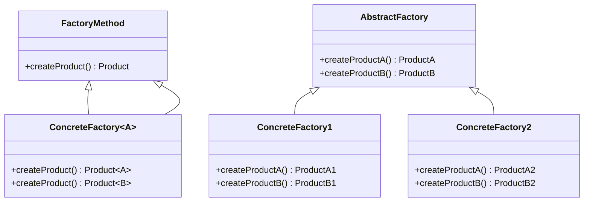
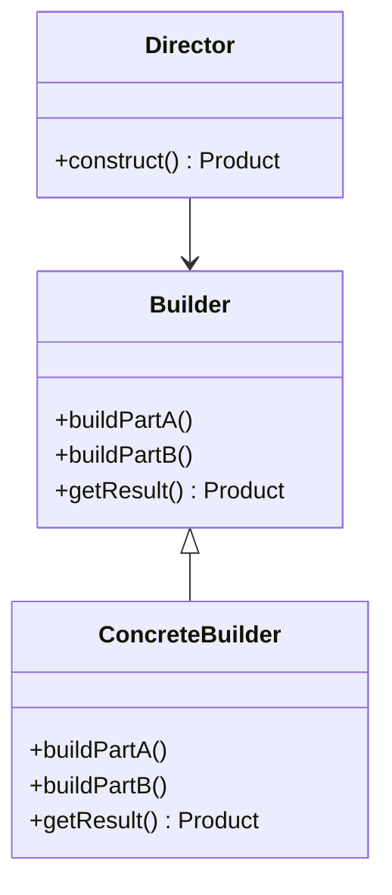
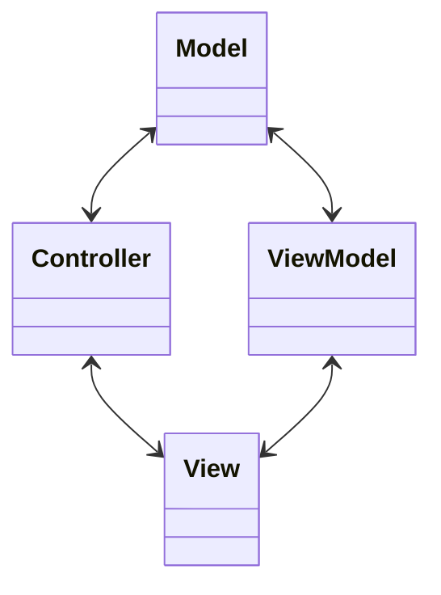
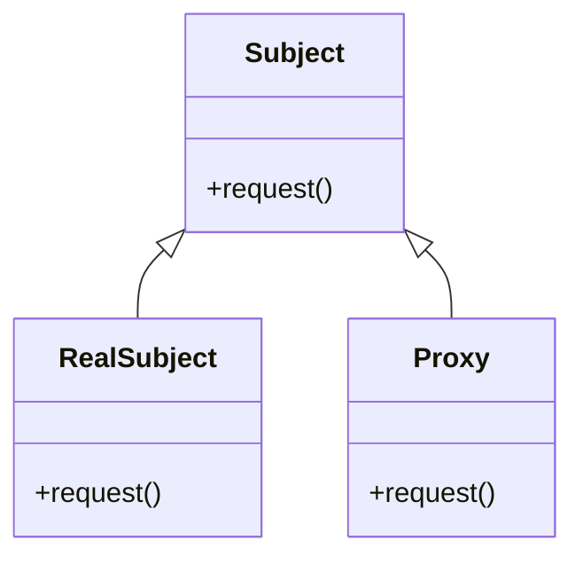

## 20.4 Common Interview Questions on Design Patterns

Design patterns are a crucial aspect of software development, providing reusable solutions to common problems. For Dart and Flutter developers, understanding these patterns is essential, not only for building efficient applications but also for acing technical interviews. This section delves into common interview questions on design patterns, offering insights and guidance on how to respond effectively.

### Sample Questions

#### 1. What are design patterns, and why are they important in software development?

**Answer Guide:**

Design patterns are general, reusable solutions to common problems in software design. They are not finished designs but templates that can be applied to solve recurring design issues. The importance of design patterns lies in their ability to:

- **Promote Reusability**: By providing a proven solution, design patterns help developers avoid reinventing the wheel.
- **Enhance Communication**: They offer a common vocabulary for developers, making it easier to discuss and share design ideas.
- **Improve Code Quality**: Patterns encourage best practices, leading to more maintainable and scalable code.

In Dart and Flutter, design patterns help manage state, handle asynchronous operations, and structure applications effectively.

#### 2. Can you explain the Singleton pattern and provide an example in Dart?

**Answer Guide:**

The Singleton pattern ensures that a class has only one instance and provides a global point of access to it. This is useful for managing shared resources like configuration settings or database connections.

**Dart Example:**

```dart
class Singleton {
  // Private constructor
  Singleton._privateConstructor();

  // The single instance of the class
  static final Singleton _instance = Singleton._privateConstructor();

  // Factory constructor to return the same instance
  factory Singleton() {
    return _instance;
  }

  void someMethod() {
    print('Singleton method called');
  }
}

void main() {
  var singleton1 = Singleton();
  var singleton2 = Singleton();

  // Both references point to the same instance
  print(singleton1 == singleton2); // true
}
```

**Key Points:**

- Use a private constructor to prevent direct instantiation.
- Provide a static instance and a factory constructor to return the instance.

#### 3. What is the difference between the Factory Method and Abstract Factory patterns?

**Answer Guide:**

- **Factory Method**: Defines an interface for creating an object but lets subclasses alter the type of objects that will be created. It is used when a class cannot anticipate the class of objects it must create.

- **Abstract Factory**: Provides an interface for creating families of related or dependent objects without specifying their concrete classes. It is used when there is a need to create a set of related objects.

**Diagram:**



**Key Points:**

- Factory Method is about creating a single product, while Abstract Factory deals with creating families of products.
- Abstract Factory is more complex and provides a higher level of abstraction.

#### 4. How does the Observer pattern work, and where would you use it in Flutter?

**Answer Guide:**

The Observer pattern defines a one-to-many dependency between objects so that when one object changes state, all its dependents are notified and updated automatically. This pattern is useful for implementing event handling systems.

**Flutter Use Case:**

In Flutter, the Observer pattern is often used for state management. For example, the `ChangeNotifier` class in the Provider package is an implementation of the Observer pattern.

**Dart Example:**

```dart
import 'package:flutter/material.dart';

class Counter extends ChangeNotifier {
  int _count = 0;

  int get count => _count;

  void increment() {
    _count++;
    notifyListeners(); // Notify observers
  }
}

void main() {
  final counter = Counter();

  counter.addListener(() {
    print('Counter updated: ${counter.count}');
  });

  counter.increment(); // Triggers the listener
}
```

**Key Points:**

- Use `ChangeNotifier` to implement the Observer pattern in Flutter.
- `notifyListeners()` is used to update all observers.

#### 5. Explain the concept of Dependency Injection and its benefits.

**Answer Guide:**

Dependency Injection (DI) is a design pattern used to implement IoC (Inversion of Control), allowing a class to receive its dependencies from an external source rather than creating them itself. This pattern promotes loose coupling and enhances testability.

**Benefits:**

- **Decoupling**: Reduces the dependency between classes.
- **Testability**: Makes it easier to test classes by injecting mock dependencies.
- **Flexibility**: Allows changing dependencies without modifying the class.

**Dart Example:**

```dart
class Service {
  void performTask() {
    print('Service task performed');
  }
}

class Client {
  final Service service;

  Client(this.service);

  void execute() {
    service.performTask();
  }
}

void main() {
  final service = Service();
  final client = Client(service);

  client.execute();
}
```

**Key Points:**

- Dependencies are passed to the class, usually through the constructor.
- Promotes separation of concerns and enhances maintainability.

#### 6. What is the Strategy pattern, and how can it be applied in Dart?

**Answer Guide:**

The Strategy pattern defines a family of algorithms, encapsulates each one, and makes them interchangeable. This pattern lets the algorithm vary independently from clients that use it.

**Dart Example:**

```dart
abstract class SortingStrategy {
  void sort(List<int> list);
}

class BubbleSort implements SortingStrategy {
  @override
  void sort(List<int> list) {
    // Bubble sort implementation
    print('Sorting using Bubble Sort');
  }
}

class QuickSort implements SortingStrategy {
  @override
  void sort(List<int> list) {
    // Quick sort implementation
    print('Sorting using Quick Sort');
  }
}

class Sorter {
  SortingStrategy strategy;

  Sorter(this.strategy);

  void sort(List<int> list) {
    strategy.sort(list);
  }
}

void main() {
  final list = [5, 3, 8, 1];

  final sorter = Sorter(BubbleSort());
  sorter.sort(list);

  sorter.strategy = QuickSort();
  sorter.sort(list);
}
```

**Key Points:**

- Define a strategy interface and implement different strategies.
- The client can switch strategies at runtime.

#### 7. How does the Builder pattern differ from the Factory pattern?

**Answer Guide:**

- **Builder Pattern**: Separates the construction of a complex object from its representation, allowing the same construction process to create different representations. It is used when the construction process is complex.

- **Factory Pattern**: Focuses on creating objects without exposing the instantiation logic to the client. It is used when the creation process is straightforward.

**Diagram:**



**Key Points:**

- Builder is about constructing complex objects step by step.
- Factory is about creating objects in a single step.

#### 8. What is the purpose of the Adapter pattern, and how would you implement it in Dart?

**Answer Guide:**

The Adapter pattern allows incompatible interfaces to work together. It acts as a bridge between two incompatible interfaces.

**Dart Example:**

```dart
class OldSystem {
  void specificRequest() {
    print('Old system request');
  }
}

class NewSystem {
  void request() {
    print('New system request');
  }
}

class Adapter extends NewSystem {
  final OldSystem oldSystem;

  Adapter(this.oldSystem);

  @override
  void request() {
    oldSystem.specificRequest();
  }
}

void main() {
  final oldSystem = OldSystem();
  final adapter = Adapter(oldSystem);

  adapter.request(); // Calls old system's specificRequest
}
```

**Key Points:**

- Use the Adapter pattern to integrate legacy systems with new systems.
- The adapter class implements the target interface and holds a reference to the adaptee.

#### 9. Describe the Command pattern and its use cases.

**Answer Guide:**

The Command pattern encapsulates a request as an object, thereby allowing for parameterization of clients with queues, requests, and operations. It is useful for implementing undo/redo operations, transaction systems, and more.

**Dart Example:**

```dart
abstract class Command {
  void execute();
}

class Light {
  void turnOn() {
    print('Light is on');
  }

  void turnOff() {
    print('Light is off');
  }
}

class TurnOnCommand implements Command {
  final Light light;

  TurnOnCommand(this.light);

  @override
  void execute() {
    light.turnOn();
  }
}

class TurnOffCommand implements Command {
  final Light light;

  TurnOffCommand(this.light);

  @override
  void execute() {
    light.turnOff();
  }
}

class RemoteControl {
  Command command;

  RemoteControl(this.command);

  void pressButton() {
    command.execute();
  }
}

void main() {
  final light = Light();
  final turnOn = TurnOnCommand(light);
  final turnOff = TurnOffCommand(light);

  final remote = RemoteControl(turnOn);
  remote.pressButton();

  remote.command = turnOff;
  remote.pressButton();
}
```

**Key Points:**

- Commands encapsulate actions and can be queued or logged.
- Useful for implementing undo/redo functionality.

#### 10. How would you explain the Decorator pattern, and when would you use it?

**Answer Guide:**

The Decorator pattern allows behavior to be added to individual objects, either statically or dynamically, without affecting the behavior of other objects from the same class. It is useful for adding responsibilities to objects without subclassing.

**Dart Example:**

```dart
abstract class Coffee {
  String getDescription();
  double cost();
}

class SimpleCoffee implements Coffee {
  @override
  String getDescription() => 'Simple coffee';

  @override
  double cost() => 5.0;
}

class MilkDecorator implements Coffee {
  final Coffee coffee;

  MilkDecorator(this.coffee);

  @override
  String getDescription() => coffee.getDescription() + ', milk';

  @override
  double cost() => coffee.cost() + 1.5;
}

void main() {
  Coffee coffee = SimpleCoffee();
  print('${coffee.getDescription()} costs \$${coffee.cost()}');

  coffee = MilkDecorator(coffee);
  print('${coffee.getDescription()} costs \$${coffee.cost()}');
}
```

**Key Points:**

- Decorators provide a flexible alternative to subclassing for extending functionality.
- They can be combined to add multiple behaviors.

#### 11. What is the difference between the MVC and MVVM architectural patterns?

**Answer Guide:**

- **MVC (Model-View-Controller)**: Separates an application into three main components: Model (data), View (UI), and Controller (business logic). The controller updates the view and the model.

- **MVVM (Model-View-ViewModel)**: Similar to MVC but introduces the ViewModel, which binds the view and the model. The ViewModel handles the presentation logic and data binding.

**Diagram:**



**Key Points:**

- MVC is suitable for applications with simple UI logic.
- MVVM is better for complex UIs with data binding requirements.

#### 12. How does the Proxy pattern differ from the Decorator pattern?

**Answer Guide:**

- **Proxy Pattern**: Provides a surrogate or placeholder for another object to control access to it. It is used for lazy initialization, access control, logging, etc.

- **Decorator Pattern**: Adds behavior to objects dynamically. It is used to extend functionality without modifying the original object.

**Diagram:**



**Key Points:**

- Proxy controls access, while Decorator adds functionality.
- Proxy can be used for security, caching, and lazy loading.

#### 13. What is the purpose of the Composite pattern, and how is it implemented in Flutter?

**Answer Guide:**

The Composite pattern allows you to compose objects into tree structures to represent part-whole hierarchies. It lets clients treat individual objects and compositions of objects uniformly.

**Flutter Use Case:**

In Flutter, the Composite pattern is used in the widget tree, where widgets can contain other widgets.

**Dart Example:**

```dart
abstract class Component {
  void operation();
}

class Leaf implements Component {
  @override
  void operation() {
    print('Leaf operation');
  }
}

class Composite implements Component {
  final List<Component> _children = [];

  void add(Component component) {
    _children.add(component);
  }

  @override
  void operation() {
    for (var child in _children) {
      child.operation();
    }
  }
}

void main() {
  final leaf1 = Leaf();
  final leaf2 = Leaf();
  final composite = Composite();

  composite.add(leaf1);
  composite.add(leaf2);

  composite.operation();
}
```

**Key Points:**

- Use Composite to build complex structures from simple components.
- In Flutter, widgets are composed using this pattern.

#### 14. Explain the concept of the Flyweight pattern and its benefits.

**Answer Guide:**

The Flyweight pattern is used to minimize memory usage by sharing as much data as possible with similar objects. It is useful for applications where many objects are created.

**Benefits:**

- **Memory Efficiency**: Reduces the number of objects created.
- **Performance**: Improves performance by reducing memory footprint.

**Dart Example:**

```dart
class Flyweight {
  final String intrinsicState;

  Flyweight(this.intrinsicState);

  void operation(String extrinsicState) {
    print('Intrinsic: $intrinsicState, Extrinsic: $extrinsicState');
  }
}

class FlyweightFactory {
  final Map<String, Flyweight> _flyweights = {};

  Flyweight getFlyweight(String key) {
    if (!_flyweights.containsKey(key)) {
      _flyweights[key] = Flyweight(key);
    }
    return _flyweights[key]!;
  }
}

void main() {
  final factory = FlyweightFactory();

  final flyweight1 = factory.getFlyweight('A');
  final flyweight2 = factory.getFlyweight('A');

  flyweight1.operation('X');
  flyweight2.operation('Y');

  print(flyweight1 == flyweight2); // true
}
```

**Key Points:**

- Flyweight shares common data among objects.
- Useful for applications with a large number of similar objects.

#### 15. How would you implement the State pattern in Dart?

**Answer Guide:**

The State pattern allows an object to alter its behavior when its internal state changes. It appears as if the object changed its class.

**Dart Example:**

```dart
abstract class State {
  void handle();
}

class ConcreteStateA implements State {
  @override
  void handle() {
    print('Handling state A');
  }
}

class ConcreteStateB implements State {
  @override
  void handle() {
    print('Handling state B');
  }
}

class Context {
  State _state;

  Context(this._state);

  void setState(State state) {
    _state = state;
  }

  void request() {
    _state.handle();
  }
}

void main() {
  final context = Context(ConcreteStateA());

  context.request();

  context.setState(ConcreteStateB());
  context.request();
}
```

**Key Points:**

- Use State pattern to change behavior based on state.
- Encapsulate state-specific behavior in separate classes.

#### 16. What is the purpose of the Memento pattern, and how can it be used in Dart?

**Answer Guide:**

The Memento pattern captures and externalizes an object's internal state so that it can be restored later without violating encapsulation. It is useful for implementing undo/redo functionality.

**Dart Example:**

```dart
class Memento {
  final String state;

  Memento(this.state);
}

class Originator {
  String _state = '';

  void setState(String state) {
    _state = state;
  }

  String getState() => _state;

  Memento saveStateToMemento() {
    return Memento(_state);
  }

  void getStateFromMemento(Memento memento) {
    _state = memento.state;
  }
}

class Caretaker {
  final List<Memento> _mementoList = [];

  void add(Memento state) {
    _mementoList.add(state);
  }

  Memento get(int index) {
    return _mementoList[index];
  }
}

void main() {
  final originator = Originator();
  final caretaker = Caretaker();

  originator.setState('State1');
  caretaker.add(originator.saveStateToMemento());

  originator.setState('State2');
  caretaker.add(originator.saveStateToMemento());

  originator.setState('State3');

  print('Current State: ${originator.getState()}');
  originator.getStateFromMemento(caretaker.get(0));
  print('First saved State: ${originator.getState()}');
  originator.getStateFromMemento(caretaker.get(1));
  print('Second saved State: ${originator.getState()}');
}
```

**Key Points:**

- Memento captures and restores object state.
- Useful for undo/redo functionality.

#### 17. How does the Chain of Responsibility pattern work, and where would you use it?

**Answer Guide:**

The Chain of Responsibility pattern passes a request along a chain of handlers. Each handler decides either to process the request or to pass it to the next handler in the chain. It is useful for handling requests with multiple handlers.

**Dart Example:**

```dart
abstract class Handler {
  Handler? nextHandler;

  void setNext(Handler handler) {
    nextHandler = handler;
  }

  void handleRequest(String request) {
    if (nextHandler != null) {
      nextHandler!.handleRequest(request);
    }
  }
}

class ConcreteHandlerA extends Handler {
  @override
  void handleRequest(String request) {
    if (request == 'A') {
      print('Handler A processed the request');
    } else {
      super.handleRequest(request);
    }
  }
}

class ConcreteHandlerB extends Handler {
  @override
  void handleRequest(String request) {
    if (request == 'B') {
      print('Handler B processed the request');
    } else {
      super.handleRequest(request);
    }
  }
}

void main() {
  final handlerA = ConcreteHandlerA();
  final handlerB = ConcreteHandlerB();

  handlerA.setNext(handlerB);

  handlerA.handleRequest('A');
  handlerA.handleRequest('B');
}
```

**Key Points:**

- Chain of Responsibility decouples sender and receiver.
- Useful for handling requests with multiple handlers.

#### 18. What is the purpose of the Template Method pattern, and how can it be implemented in Dart?

**Answer Guide:**

The Template Method pattern defines the skeleton of an algorithm in a method, deferring some steps to subclasses. It allows subclasses to redefine certain steps of an algorithm without changing its structure.

**Dart Example:**

```dart
abstract class AbstractClass {
  void templateMethod() {
    stepOne();
    stepTwo();
    stepThree();
  }

  void stepOne() {
    print('Step one');
  }

  void stepTwo();

  void stepThree() {
    print('Step three');
  }
}

class ConcreteClass extends AbstractClass {
  @override
  void stepTwo() {
    print('Concrete step two');
  }
}

void main() {
  final concreteClass = ConcreteClass();
  concreteClass.templateMethod();
}
```

**Key Points:**

- Template Method defines the algorithm structure.
- Subclasses implement specific steps.

#### 19. How would you explain the Visitor pattern, and when is it useful?

**Answer Guide:**

The Visitor pattern allows you to add new operations to existing object structures without modifying the structures. It is useful for operations that need to be performed on a set of objects with different types.

**Dart Example:**

```dart
abstract class Element {
  void accept(Visitor visitor);
}

class ConcreteElementA implements Element {
  @override
  void accept(Visitor visitor) {
    visitor.visitConcreteElementA(this);
  }
}

class ConcreteElementB implements Element {
  @override
  void accept(Visitor visitor) {
    visitor.visitConcreteElementB(this);
  }
}

abstract class Visitor {
  void visitConcreteElementA(ConcreteElementA element);
  void visitConcreteElementB(ConcreteElementB element);
}

class ConcreteVisitor implements Visitor {
  @override
  void visitConcreteElementA(ConcreteElementA element) {
    print('Visited ConcreteElementA');
  }

  @override
  void visitConcreteElementB(ConcreteElementB element) {
    print('Visited ConcreteElementB');
  }
}

void main() {
  final elements = [ConcreteElementA(), ConcreteElementB()];
  final visitor = ConcreteVisitor();

  for (var element in elements) {
    element.accept(visitor);
  }
}
```

**Key Points:**

- Visitor adds operations to object structures.
- Useful for operations on objects with different types.

#### 20. What are some common pitfalls when using design patterns?

**Answer Guide:**

- **Overuse**: Applying patterns unnecessarily can lead to complex and hard-to-maintain code.
- **Misuse**: Using the wrong pattern for a problem can complicate the solution.
- **Complexity**: Some patterns add complexity and may not be suitable for simple problems.
- **Performance**: Certain patterns can introduce performance overhead.

**Key Points:**

- Use patterns judiciously and only when they provide clear benefits.
- Understand the problem and choose the appropriate pattern.

### Answer Guides: Insights into How to Respond Effectively

When answering interview questions on design patterns, consider the following tips:

- **Understand the Pattern**: Clearly explain the pattern's intent, structure, and use cases.
- **Provide Examples**: Use code examples to illustrate how the pattern is implemented.
- **Discuss Benefits and Drawbacks**: Highlight the advantages and potential pitfalls of using the pattern.
- **Relate to Real-World Scenarios**: Connect the pattern to practical applications or experiences.
- **Be Concise and Clear**: Keep your explanations straightforward and avoid unnecessary jargon.

### Try It Yourself

Experiment with the provided code examples by modifying them to suit different scenarios. For instance, try implementing additional strategies in the Strategy pattern example or adding more handlers in the Chain of Responsibility example. This hands-on practice will deepen your understanding of how these patterns work in Dart and Flutter.

## Quiz Time!



### What is the primary purpose of design patterns in software development?

- [x] To provide reusable solutions to common problems
- [ ] To increase the complexity of code
- [ ] To replace the need for documentation
- [ ] To ensure code is always object-oriented

> **Explanation:** Design patterns offer reusable solutions to common problems, promoting best practices and improving code quality.

### Which pattern ensures a class has only one instance and provides a global point of access to it?

- [x] Singleton
- [ ] Factory Method
- [ ] Observer
- [ ] Strategy

> **Explanation:** The Singleton pattern ensures a class has only one instance and provides a global point of access to it.

### In the Factory Method pattern, who is responsible for creating the objects?

- [ ] The client
- [x] The subclasses
- [ ] The main class
- [ ] The interface

> **Explanation:** In the Factory Method pattern, subclasses are responsible for creating the objects.

### What is the main advantage of using the Observer pattern in Flutter?

- [x] It allows for automatic updates of UI components when data changes.
- [ ] It simplifies the code structure.
- [ ] It eliminates the need for state management.
- [ ] It improves performance by reducing widget rebuilds.

> **Explanation:** The Observer pattern allows for automatic updates of UI components when data changes, making it ideal for state management in Flutter.

### Which pattern is used to add behavior to individual objects dynamically?

- [ ] Singleton
- [ ] Factory Method
- [x] Decorator
- [ ] Proxy

> **Explanation:** The Decorator pattern is used to add behavior to individual objects dynamically.

### What is a key benefit of the Dependency Injection pattern?

- [x] It promotes loose coupling and enhances testability.
- [ ] It simplifies the user interface.
- [ ] It increases the number of classes.
- [ ] It eliminates the need for constructors.

> **Explanation:** Dependency Injection promotes loose coupling and enhances testability by allowing dependencies to be injected rather than created within the class.

### Which pattern allows you to compose objects into tree structures to represent part-whole hierarchies?

- [ ] Singleton
- [ ] Factory Method
- [ ] Observer
- [x] Composite

> **Explanation:** The Composite pattern allows you to compose objects into tree structures to represent part-whole hierarchies.

### What is the primary use case for the Flyweight pattern?

- [x] To minimize memory usage by sharing data among similar objects
- [ ] To increase the number of objects created
- [ ] To simplify the user interface
- [ ] To enhance security

> **Explanation:** The Flyweight pattern minimizes memory usage by sharing data among similar objects.

### In the Chain of Responsibility pattern, what happens if a handler cannot process a request?

- [ ] The request is discarded.
- [x] The request is passed to the next handler in the chain.
- [ ] The request is processed by the client.
- [ ] The request is logged for future reference.

> **Explanation:** In the Chain of Responsibility pattern, if a handler cannot process a request, it is passed to the next handler in the chain.

### True or False: The Visitor pattern allows you to add new operations to existing object structures without modifying the structures.

- [x] True
- [ ] False

> **Explanation:** True. The Visitor pattern allows you to add new operations to existing object structures without modifying the structures.



Remember, mastering design patterns is a journey. As you continue to explore and apply these patterns, you'll gain deeper insights and become more adept at crafting efficient, maintainable, and scalable applications. Keep experimenting, stay curious, and enjoy the journey!
