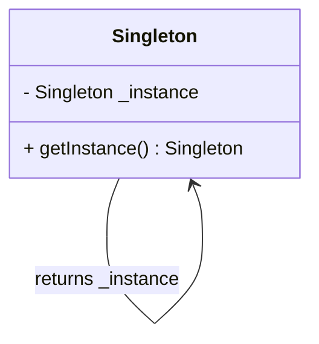
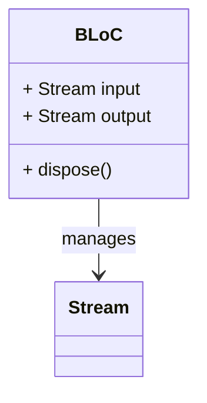

## 20.6 Frequently Asked Questions (FAQ)

Welcome to the Frequently Asked Questions (FAQ) section of the "Mastering Dart Design Patterns: The Comprehensive Guide to Effective Flutter Development." This section aims to address common inquiries and provide clarifications on typical misunderstandings related to Dart design patterns. Whether you're a seasoned developer or just starting with Dart and Flutter, these FAQs will help deepen your understanding and enhance your development skills.

### 1. What are Design Patterns in Dart?

**Answer:** Design patterns in Dart are standard solutions to common problems in software design. They provide a template for how to solve a problem that can be used in many different situations. In Dart, design patterns help developers create more efficient, scalable, and maintainable code. They are categorized into creational, structural, behavioral, and concurrency patterns, each serving a specific purpose in application development.

### 2. Why are Design Patterns Important in Flutter Development?

**Answer:** Design patterns are crucial in Flutter development because they promote best practices and provide a proven way to solve recurring design problems. They help in organizing code, making it more readable and maintainable. By using design patterns, developers can ensure that their applications are scalable and can handle future changes with minimal impact on the existing codebase.

### 3. How Do Design Patterns Differ from Algorithms?

**Answer:** Design patterns and algorithms serve different purposes. An algorithm is a step-by-step procedure for solving a specific problem, often related to data processing or computation. In contrast, a design pattern is a high-level solution to a design problem in a given context. While algorithms focus on the "how" of solving a problem, design patterns focus on the "what" and "why" of structuring code to solve a problem.

### 4. Can You Explain the Singleton Pattern in Dart?

**Answer:** The Singleton pattern ensures that a class has only one instance and provides a global point of access to it. In Dart, this can be achieved by using a factory constructor or a static instance. Here's a simple example:

```dart
class Singleton {
  static final Singleton _instance = Singleton._internal();

  factory Singleton() {
    return _instance;
  }

  Singleton._internal();
}

void main() {
  var singleton1 = Singleton();
  var singleton2 = Singleton();

  print(singleton1 == singleton2); // true
}
```

In this example, the `Singleton` class has a private constructor `_internal` and a static instance `_instance`. The factory constructor returns the same instance every time it is called.

### 5. What is the Difference Between Factory Method and Abstract Factory Patterns?

**Answer:** The Factory Method pattern defines an interface for creating an object but lets subclasses alter the type of objects that will be created. In contrast, the Abstract Factory pattern provides an interface for creating families of related or dependent objects without specifying their concrete classes.

- **Factory Method**: Focuses on a single product.
- **Abstract Factory**: Focuses on families of products.

### 6. How Does the BLoC Pattern Work in Flutter?

**Answer:** The BLoC (Business Logic Component) pattern separates business logic from the UI. It uses streams to manage state and events. Here's a simple example:

```dart
import 'dart:async';

class CounterBloc {
  int _counter = 0;
  final _counterController = StreamController<int>();

  Stream<int> get counterStream => _counterController.stream;

  void increment() {
    _counter++;
    _counterController.sink.add(_counter);
  }

  void dispose() {
    _counterController.close();
  }
}

void main() {
  final bloc = CounterBloc();

  bloc.counterStream.listen((count) {
    print('Counter: $count');
  });

  bloc.increment(); // Counter: 1
  bloc.increment(); // Counter: 2
}
```

In this example, the `CounterBloc` class manages the counter state and exposes a stream to listen for changes. The `increment` method updates the counter and adds the new value to the stream.

### 7. What is the Role of the Provider Pattern in Flutter?

**Answer:** The Provider pattern is a wrapper around InheritedWidget to make it easier to expose and consume data throughout the widget tree. It simplifies state management by allowing widgets to listen to changes in data and rebuild accordingly. Here's a basic example:

```dart
import 'package:flutter/material.dart';
import 'package:provider/provider.dart';

class Counter with ChangeNotifier {
  int _count = 0;

  int get count => _count;

  void increment() {
    _count++;
    notifyListeners();
  }
}

void main() {
  runApp(
    ChangeNotifierProvider(
      create: (_) => Counter(),
      child: MyApp(),
    ),
  );
}

class MyApp extends StatelessWidget {
  @override
  Widget build(BuildContext context) {
    return MaterialApp(
      home: Scaffold(
        appBar: AppBar(title: Text('Provider Example')),
        body: Center(
          child: Consumer<Counter>(
            builder: (context, counter, child) {
              return Text('Count: ${counter.count}');
            },
          ),
        ),
        floatingActionButton: FloatingActionButton(
          onPressed: () => context.read<Counter>().increment(),
          child: Icon(Icons.add),
        ),
      ),
    );
  }
}
```

In this example, the `Counter` class extends `ChangeNotifier`, and the `ChangeNotifierProvider` is used to provide the `Counter` instance to the widget tree. The `Consumer` widget listens for changes and rebuilds when the counter value changes.

### 8. How Can I Implement Dependency Injection in Dart?

**Answer:** Dependency Injection (DI) is a design pattern used to achieve Inversion of Control (IoC) between classes and their dependencies. In Dart, you can implement DI using packages like `get_it` or `injectable`. Here's a simple example using `get_it`:

```dart
import 'package:get_it/get_it.dart';

class ApiService {
  void fetchData() {
    print('Fetching data...');
  }
}

final getIt = GetIt.instance;

void setup() {
  getIt.registerSingleton<ApiService>(ApiService());
}

void main() {
  setup();

  var apiService = getIt<ApiService>();
  apiService.fetchData(); // Fetching data...
}
```

In this example, `GetIt` is used to register and retrieve the `ApiService` instance, allowing for easy dependency management.

### 9. What is the Difference Between Stateful and Stateless Widgets in Flutter?

**Answer:** In Flutter, widgets are the building blocks of the UI. They can be either stateful or stateless:

- **Stateless Widgets**: These widgets do not have any mutable state. They are immutable and are rebuilt when their configuration changes. Use them when the UI does not change over time.

- **Stateful Widgets**: These widgets maintain mutable state that can change during the widget's lifetime. Use them when the UI needs to update dynamically based on user interaction or other factors.

### 10. How Do Streams Work in Dart?

**Answer:** Streams in Dart are a sequence of asynchronous events. They are used to handle data that is received over time, such as user input or data from a network. Streams can be single-subscription or broadcast, depending on how many listeners they support. Here's a simple example:

```dart
import 'dart:async';

void main() {
  final streamController = StreamController<int>();

  streamController.stream.listen((data) {
    print('Received: $data');
  });

  streamController.sink.add(1); // Received: 1
  streamController.sink.add(2); // Received: 2

  streamController.close();
}
```

In this example, a `StreamController` is used to create a stream, and data is added to the stream using the `sink`.

### 11. What is the Observer Pattern and How is it Used in Dart?

**Answer:** The Observer pattern is a behavioral design pattern where an object (subject) maintains a list of dependents (observers) and notifies them of state changes. In Dart, this can be implemented using streams or the `ChangeNotifier` class. Here's a simple example using `ChangeNotifier`:

```dart
import 'package:flutter/material.dart';

class Counter extends ChangeNotifier {
  int _count = 0;

  int get count => _count;

  void increment() {
    _count++;
    notifyListeners();
  }
}

void main() {
  final counter = Counter();

  counter.addListener(() {
    print('Counter changed: ${counter.count}');
  });

  counter.increment(); // Counter changed: 1
  counter.increment(); // Counter changed: 2
}
```

In this example, the `Counter` class extends `ChangeNotifier`, and listeners are notified whenever the counter value changes.

### 12. How Can I Handle Errors and Exceptions in Dart?

**Answer:** Dart provides a robust error handling mechanism using `try`, `catch`, and `finally` blocks. You can catch specific exceptions or handle all exceptions generically. Here's an example:

```dart
void main() {
  try {
    int result = 10 ~/ 0;
    print(result);
  } catch (e) {
    print('Error: $e');
  } finally {
    print('Execution completed.');
  }
}
```

In this example, a division by zero error is caught, and the error message is printed. The `finally` block executes regardless of whether an exception is thrown.

### 13. What is the Role of Mixins in Dart?

**Answer:** Mixins in Dart are a way to reuse a class's code in multiple class hierarchies. They allow you to add functionality to classes without using inheritance. Here's a simple example:

```dart
mixin Logger {
  void log(String message) {
    print('Log: $message');
  }
}

class MyClass with Logger {
  void doSomething() {
    log('Doing something');
  }
}

void main() {
  var myClass = MyClass();
  myClass.doSomething(); // Log: Doing something
}
```

In this example, the `Logger` mixin provides a `log` method that can be used in any class that includes the mixin.

### 14. How Does the MVC Pattern Apply to Flutter?

**Answer:** The MVC (Model-View-Controller) pattern separates an application into three interconnected components:

- **Model**: Manages the data and business logic.
- **View**: Displays the data and sends user commands to the controller.
- **Controller**: Acts as an intermediary between the model and the view.

In Flutter, the MVC pattern can be implemented using packages like `flutter_mvc` or by structuring your code to separate concerns.

### 15. What is the Purpose of the Command Pattern?

**Answer:** The Command pattern encapsulates a request as an object, thereby allowing for parameterization of clients with queues, requests, and operations. It also provides support for undoable operations. In Dart, this can be implemented by defining a command interface and concrete command classes.

### 16. How Can I Optimize Performance in Flutter Apps?

**Answer:** Performance optimization in Flutter involves several strategies:

- **Widget Build Optimization**: Minimize rebuilds by using `const` constructors and avoiding unnecessary widget rebuilds.
- **Lazy Loading**: Load data or resources only when needed.
- **Image and Asset Optimization**: Use appropriate image formats and sizes.
- **Efficient Use of Isolates**: Offload heavy computations to isolates to keep the UI responsive.
- **Caching Strategies**: Cache data to reduce network requests and improve load times.

### 17. What is the Role of Isolates in Dart?

**Answer:** Isolates are Dart's way of achieving concurrency. They allow you to run code in parallel without shared memory, which prevents race conditions. Each isolate has its own memory and communicates with other isolates via message passing.

### 18. How Do I Manage State in Flutter Applications?

**Answer:** State management in Flutter can be achieved using various patterns and libraries, such as:

- **Stateful Widgets**: Use `setState` to manage local state.
- **Provider**: A wrapper around InheritedWidget for managing state.
- **BLoC**: Uses streams to manage state and business logic.
- **Redux**: A predictable state container for managing application state.
- **Riverpod**: A modern, flexible state management library.

### 19. What is the Difference Between Synchronous and Asynchronous Programming in Dart?

**Answer:** Synchronous programming executes tasks sequentially, blocking the execution of subsequent tasks until the current task completes. Asynchronous programming, on the other hand, allows tasks to run concurrently, enabling non-blocking operations. Dart uses `Future` and `async/await` to handle asynchronous operations.

### 20. How Can I Implement Localization in Flutter?

**Answer:** Localization in Flutter involves translating the app's content into different languages. You can use the `intl` package to handle localization. Here's a basic setup:

1. Add the `intl` package to your `pubspec.yaml`.
2. Create ARB files for each language.
3. Use the `Intl` class to load and format messages.

### Visualizing Design Patterns in Dart

To enhance your understanding of design patterns in Dart, let's visualize some of the key concepts using Mermaid.js diagrams.

#### Singleton Pattern Diagram



**Description:** This diagram illustrates the Singleton pattern, showing the private `_instance` and the `getInstance` method that returns the single instance.

#### BLoC Pattern Diagram



**Description:** This diagram represents the BLoC pattern, highlighting the input and output streams managed by the BLoC class.

### Knowledge Check

To reinforce your understanding, consider the following questions:

1. What is the primary purpose of design patterns in software development?
2. How does the Singleton pattern ensure a single instance of a class?
3. What are the key differences between the Factory Method and Abstract Factory patterns?
4. How does the BLoC pattern separate business logic from the UI in Flutter?
5. What is the role of streams in Dart, and how do they facilitate asynchronous programming?

### Embrace the Journey

Remember, mastering design patterns in Dart and Flutter is a journey. As you continue to explore and experiment with these patterns, you'll gain a deeper understanding of how to build efficient, scalable, and maintainable applications. Keep experimenting, stay curious, and enjoy the journey!

## Quiz Time!



### What is the primary purpose of design patterns in software development?

- [x] To provide standard solutions to common design problems
- [ ] To optimize code execution speed
- [ ] To reduce the number of lines of code
- [ ] To enforce strict coding standards

> **Explanation:** Design patterns provide standard solutions to common design problems, helping developers create more efficient and maintainable code.

### How does the Singleton pattern ensure a single instance of a class?

- [x] By using a private constructor and a static instance
- [ ] By using multiple constructors
- [ ] By creating a new instance every time
- [ ] By using public variables

> **Explanation:** The Singleton pattern uses a private constructor and a static instance to ensure that only one instance of the class exists.

### What are the key differences between the Factory Method and Abstract Factory patterns?

- [x] Factory Method focuses on a single product, while Abstract Factory focuses on families of products
- [ ] Factory Method is used for creating multiple instances, while Abstract Factory is for single instances
- [ ] Factory Method is a structural pattern, while Abstract Factory is a behavioral pattern
- [ ] Factory Method is used in Dart, while Abstract Factory is not

> **Explanation:** The Factory Method pattern focuses on creating a single product, while the Abstract Factory pattern deals with creating families of related products.

### How does the BLoC pattern separate business logic from the UI in Flutter?

- [x] By using streams to manage state and events
- [ ] By using global variables
- [ ] By embedding logic directly in widgets
- [ ] By using multiple inheritance

> **Explanation:** The BLoC pattern uses streams to manage state and events, separating business logic from the UI.

### What is the role of streams in Dart?

- [x] To handle asynchronous events and data sequences
- [ ] To manage synchronous operations
- [ ] To store static data
- [ ] To execute code in parallel

> **Explanation:** Streams in Dart handle asynchronous events and data sequences, allowing for non-blocking operations.

### How can you implement Dependency Injection in Dart?

- [x] By using packages like `get_it` or `injectable`
- [ ] By using global variables
- [ ] By creating multiple instances of a class
- [ ] By using inheritance

> **Explanation:** Dependency Injection in Dart can be implemented using packages like `get_it` or `injectable` to manage dependencies.

### What is the difference between Stateful and Stateless Widgets in Flutter?

- [x] Stateful Widgets maintain mutable state, while Stateless Widgets do not
- [ ] Stateful Widgets are faster than Stateless Widgets
- [ ] Stateful Widgets are used for static content, while Stateless Widgets are for dynamic content
- [ ] Stateful Widgets are deprecated

> **Explanation:** Stateful Widgets maintain mutable state that can change over time, while Stateless Widgets do not have mutable state.

### How does the Observer pattern work in Dart?

- [x] By maintaining a list of observers and notifying them of state changes
- [ ] By using global variables
- [ ] By embedding logic directly in widgets
- [ ] By using multiple inheritance

> **Explanation:** The Observer pattern maintains a list of observers and notifies them of state changes, often using streams or `ChangeNotifier`.

### What is the role of Isolates in Dart?

- [x] To achieve concurrency without shared memory
- [ ] To manage synchronous operations
- [ ] To store static data
- [ ] To execute code in sequence

> **Explanation:** Isolates in Dart achieve concurrency by running code in parallel without shared memory, using message passing for communication.

### True or False: The Provider pattern in Flutter is a wrapper around InheritedWidget.

- [x] True
- [ ] False

> **Explanation:** The Provider pattern is indeed a wrapper around InheritedWidget, making it easier to expose and consume data throughout the widget tree.


