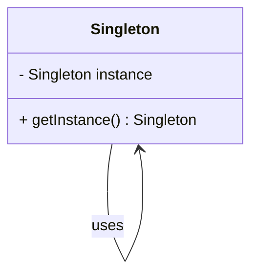
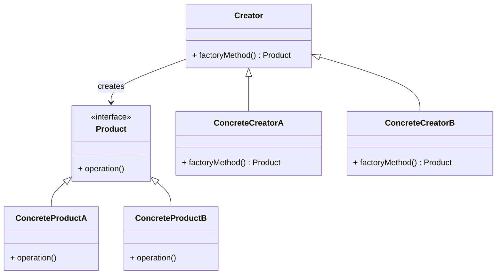

## 20.7 Sample Projects and Code Examples

Welcome to the section where theory meets practice. In this chapter, we will delve into sample projects and code examples that illustrate the application of design patterns in Dart and Flutter development. These examples are crafted to enhance your understanding and provide a solid foundation for building scalable and maintainable applications.

### Practical Applications

Design patterns are not just theoretical constructs; they are practical tools that can significantly improve the quality of your code. Let's explore some repositories and projects that demonstrate the implementation of various design patterns in real-world scenarios.

#### 1. **Flutter E-commerce App**

**Objective:** Implement a full-featured e-commerce application using a combination of design patterns.

**Patterns Used:**
- **Singleton** for managing a single instance of the cart.
- **Factory Method** for creating product objects.
- **Observer** for updating the UI when the cart changes.
- **Repository** for data access and management.

**Project Structure:**

```plaintext
flutter_ecommerce/
│
├── lib/
│   ├── models/
│   │   ├── product.dart
│   │   └── cart.dart
│   ├── repositories/
│   │   ├── product_repository.dart
│   │   └── cart_repository.dart
│   ├── services/
│   │   └── api_service.dart
│   ├── views/
│   │   ├── product_list.dart
│   │   └── cart_view.dart
│   └── main.dart
└── pubspec.yaml
```

**Key Code Snippets:**

- **Singleton Pattern for Cart Management:**

```dart
class Cart {
  static final Cart _instance = Cart._internal();
  List<Product> _products = [];

  factory Cart() {
    return _instance;
  }

  Cart._internal();

  void addProduct(Product product) {
    _products.add(product);
  }

  List<Product> get products => _products;
}
```

- **Factory Method for Product Creation:**

```dart
abstract class ProductFactory {
  Product createProduct(String type);
}

class ConcreteProductFactory implements ProductFactory {
  @override
  Product createProduct(String type) {
    switch (type) {
      case 'Electronics':
        return Electronics();
      case 'Clothing':
        return Clothing();
      default:
        throw Exception('Unknown product type');
    }
  }
}
```

- **Observer Pattern for UI Updates:**

```dart
class CartObserver {
  void update() {
    // Update UI
  }
}

class Cart {
  List<CartObserver> _observers = [];

  void addObserver(CartObserver observer) {
    _observers.add(observer);
  }

  void notifyObservers() {
    for (var observer in _observers) {
      observer.update();
    }
  }

  void addProduct(Product product) {
    _products.add(product);
    notifyObservers();
  }
}
```

**Try It Yourself:**
- Modify the `ProductFactory` to include more product types.
- Implement a discount feature using the **Strategy Pattern**.

#### 2. **Real-Time Chat Application**

**Objective:** Build a chat application that supports real-time messaging using design patterns.

**Patterns Used:**
- **Mediator** for managing communication between chat components.
- **Command** for executing chat commands.
- **State** for managing user connection states.

**Project Structure:**

```plaintext
chat_app/
│
├── lib/
│   ├── models/
│   │   ├── message.dart
│   │   └── user.dart
│   ├── controllers/
│   │   ├── chat_controller.dart
│   │   └── user_controller.dart
│   ├── services/
│   │   └── socket_service.dart
│   ├── views/
│   │   ├── chat_view.dart
│   │   └── user_view.dart
│   └── main.dart
└── pubspec.yaml
```

**Key Code Snippets:**

- **Mediator Pattern for Chat Management:**

```dart
class ChatMediator {
  List<User> _users = [];

  void addUser(User user) {
    _users.add(user);
  }

  void sendMessage(String message, User sender) {
    for (var user in _users) {
      if (user != sender) {
        user.receiveMessage(message);
      }
    }
  }
}
```

- **Command Pattern for Chat Commands:**

```dart
abstract class ChatCommand {
  void execute();
}

class SendMessageCommand implements ChatCommand {
  final String message;
  final User sender;

  SendMessageCommand(this.message, this.sender);

  @override
  void execute() {
    // Send message logic
  }
}
```

- **State Pattern for User Connection:**

```dart
abstract class UserState {
  void connect();
  void disconnect();
}

class ConnectedState implements UserState {
  @override
  void connect() {
    // Already connected
  }

  @override
  void disconnect() {
    // Disconnect logic
  }
}

class DisconnectedState implements UserState {
  @override
  void connect() {
    // Connect logic
  }

  @override
  void disconnect() {
    // Already disconnected
  }
}
```

**Try It Yourself:**
- Extend the `ChatMediator` to support group chats.
- Implement a notification system using the **Observer Pattern**.

### Educational Tools

Educational tools are essential for learning and experimentation. Here, we provide codebases designed to help you understand and apply design patterns effectively.

#### 3. **Design Pattern Playground**

**Objective:** Create a playground where developers can experiment with different design patterns.

**Features:**
- Interactive examples of each design pattern.
- Step-by-step guides and explanations.
- Challenges and exercises to reinforce learning.

**Project Structure:**

```plaintext
design_pattern_playground/
│
├── lib/
│   ├── patterns/
│   │   ├── singleton_example.dart
│   │   ├── factory_example.dart
│   │   └── observer_example.dart
│   ├── utils/
│   │   └── pattern_utils.dart
│   ├── views/
│   │   ├── pattern_list.dart
│   │   └── pattern_detail.dart
│   └── main.dart
└── pubspec.yaml
```

**Key Code Snippets:**

- **Singleton Example:**

```dart
class Logger {
  static final Logger _instance = Logger._internal();

  factory Logger() {
    return _instance;
  }

  Logger._internal();

  void log(String message) {
    print('Log: $message');
  }
}
```

- **Factory Example:**

```dart
abstract class Shape {
  void draw();
}

class Circle implements Shape {
  @override
  void draw() {
    print('Drawing Circle');
  }
}

class Square implements Shape {
  @override
  void draw() {
    print('Drawing Square');
  }
}

class ShapeFactory {
  Shape createShape(String type) {
    switch (type) {
      case 'Circle':
        return Circle();
      case 'Square':
        return Square();
      default:
        throw Exception('Unknown shape type');
    }
  }
}
```

- **Observer Example:**

```dart
class Subject {
  List<Observer> _observers = [];

  void addObserver(Observer observer) {
    _observers.add(observer);
  }

  void notifyObservers() {
    for (var observer in _observers) {
      observer.update();
    }
  }
}

abstract class Observer {
  void update();
}

class ConcreteObserver implements Observer {
  @override
  void update() {
    print('Observer updated');
  }
}
```

**Try It Yourself:**
- Add more patterns to the playground.
- Create a user interface to select and view pattern examples.

### Contributions

We encourage readers to contribute their own examples and projects. Sharing knowledge and experiences can greatly benefit the community and foster a collaborative learning environment.

#### 4. **Community Contributions**

**Objective:** Build a repository where developers can share their implementations of design patterns.

**Features:**
- Open-source repository for community contributions.
- Guidelines for submitting examples.
- Review and feedback system to ensure quality.

**Project Structure:**

```plaintext
community_patterns/
│
├── contributions/
│   ├── user1/
│   │   ├── pattern1_example.dart
│   │   └── pattern2_example.dart
│   ├── user2/
│   │   ├── pattern3_example.dart
│   │   └── pattern4_example.dart
│   └── README.md
└── pubspec.yaml
```

**Key Code Snippets:**

- **Contribution Example:**

```dart
// User1's Singleton Example
class Database {
  static final Database _instance = Database._internal();

  factory Database() {
    return _instance;
  }

  Database._internal();

  void connect() {
    print('Database connected');
  }
}
```

- **Contribution Guidelines:**

```markdown

1. Fork the repository.
2. Create a new branch for your contribution.
3. Add your pattern example in a new folder under `contributions/`.
4. Submit a pull request for review.
```

**Try It Yourself:**
- Contribute your own pattern examples.
- Review and provide feedback on other contributions.

### Visualizing Design Patterns

To enhance understanding, let's visualize some of the design patterns using Hugo-compatible Mermaid.js diagrams.

#### Singleton Pattern



**Description:** The Singleton pattern ensures that a class has only one instance and provides a global point of access to it.

#### Factory Method Pattern



**Description:** The Factory Method pattern defines an interface for creating an object but lets subclasses alter the type of objects that will be created.

### Knowledge Check

Before we conclude, let's reinforce what we've learned with some questions and challenges.

- **Question:** How does the Singleton pattern ensure a single instance?
- **Challenge:** Implement a new design pattern in the playground and share it with the community.

### Embrace the Journey

Remember, mastering design patterns is a journey. As you explore these examples and projects, you'll gain a deeper understanding of how to apply these patterns effectively in your own projects. Keep experimenting, stay curious, and enjoy the journey!

## Quiz Time!



### What is the main purpose of the Singleton pattern?

- [x] To ensure a class has only one instance
- [ ] To create multiple instances of a class
- [ ] To define a family of algorithms
- [ ] To separate the construction of a complex object from its representation

> **Explanation:** The Singleton pattern ensures that a class has only one instance and provides a global point of access to it.

### Which pattern is used to create objects without specifying the exact class of object that will be created?

- [ ] Singleton
- [x] Factory Method
- [ ] Observer
- [ ] Mediator

> **Explanation:** The Factory Method pattern defines an interface for creating an object but lets subclasses alter the type of objects that will be created.

### In the Observer pattern, what is the role of the Subject?

- [x] To maintain a list of observers and notify them of changes
- [ ] To execute commands
- [ ] To manage communication between components
- [ ] To define a family of algorithms

> **Explanation:** In the Observer pattern, the Subject maintains a list of observers and notifies them of any state changes.

### What is the primary benefit of using the Mediator pattern?

- [x] To reduce the complexity of communication between multiple objects
- [ ] To ensure a class has only one instance
- [ ] To create objects without specifying their class
- [ ] To define a family of algorithms

> **Explanation:** The Mediator pattern reduces the complexity of communication between multiple objects by centralizing the communication logic.

### Which pattern is best suited for managing user connection states in a chat application?

- [ ] Singleton
- [ ] Factory Method
- [ ] Observer
- [x] State

> **Explanation:** The State pattern is used to manage the state of an object, making it suitable for managing user connection states.

### What is the role of the ConcreteProduct in the Factory Method pattern?

- [x] To implement the Product interface
- [ ] To define a family of algorithms
- [ ] To manage communication between components
- [ ] To ensure a class has only one instance

> **Explanation:** In the Factory Method pattern, ConcreteProduct classes implement the Product interface and define the specific behavior of the product.

### How can the Observer pattern be used in a real-time chat application?

- [x] To update the UI when new messages are received
- [ ] To manage user connection states
- [ ] To create chat commands
- [ ] To ensure a single instance of the chat manager

> **Explanation:** The Observer pattern can be used to update the UI when new messages are received by notifying observers of changes.

### What is the main advantage of using design patterns in software development?

- [x] To provide proven solutions to common problems
- [ ] To increase the complexity of the code
- [ ] To ensure a single instance of a class
- [ ] To define a family of algorithms

> **Explanation:** Design patterns provide proven solutions to common problems, making code more maintainable and scalable.

### Which pattern would you use to implement a discount feature in an e-commerce app?

- [ ] Singleton
- [ ] Factory Method
- [x] Strategy
- [ ] Observer

> **Explanation:** The Strategy pattern is used to define a family of algorithms, making it suitable for implementing a discount feature.

### True or False: The Factory Method pattern allows subclasses to alter the type of objects that will be created.

- [x] True
- [ ] False

> **Explanation:** The Factory Method pattern defines an interface for creating an object but lets subclasses alter the type of objects that will be created.


