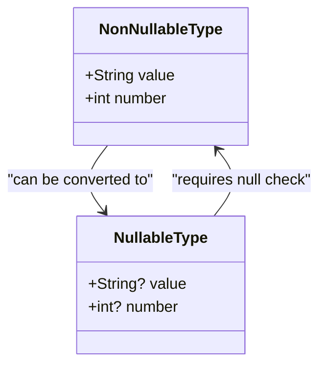

## 3.1 Null Safety in Dart

Null safety is a transformative feature in Dart that aims to eliminate null reference exceptions, a common source of runtime errors in many programming languages. By understanding and leveraging null safety, developers can write more robust, error-free code. In this section, we will delve into the concepts of nullable and non-nullable types, the use of late variables, and best practices for handling nulls effectively in your Dart and Flutter applications.

### Understanding Null Safety

Null safety in Dart is designed to prevent null reference exceptions, which occur when a program attempts to access a member of a null object. These exceptions are notorious for causing unexpected crashes and are often difficult to debug. Dart's null safety feature ensures that variables cannot contain null values unless explicitly declared as nullable, thus providing a safer and more predictable programming environment.

#### The Problem with Null References

Null references have been a significant issue in programming since their inception. Tony Hoare, who introduced the null reference in 1965, famously referred to it as his "billion-dollar mistake." The primary problem with null references is that they allow for the possibility of runtime errors when a program attempts to access a member of a null object. These errors can be challenging to trace and fix, leading to unstable applications.

#### How Dart Solves the Problem

Dart addresses the null reference problem by introducing null safety, which is a type system feature that distinguishes between nullable and non-nullable types. With null safety, Dart ensures that:

- Non-nullable types cannot contain null values.
- Nullable types can contain null values, but their use is explicitly marked in the code.

This distinction allows developers to catch potential null reference errors at compile time, rather than at runtime, significantly reducing the likelihood of encountering such errors in production.

### Nullable and Non-Nullable Types

In Dart, every variable is either nullable or non-nullable. Understanding the difference between these two types is crucial for mastering null safety.

#### Non-Nullable Types

A non-nullable type is a type that cannot hold a null value. By default, all types in Dart are non-nullable unless explicitly marked as nullable. This means that when you declare a variable without a nullable type annotation, Dart guarantees that the variable will never be null.

```dart
int nonNullableInt = 42; // This variable cannot be null
```

In the example above, `nonNullableInt` is an integer that cannot be null. If you try to assign a null value to it, the Dart compiler will produce an error.

#### Nullable Types

A nullable type is a type that can hold a null value. To declare a nullable type, you append a question mark (`?`) to the type annotation.

```dart
int? nullableInt = null; // This variable can be null
```

Here, `nullableInt` is an integer that can be null. The question mark indicates that the variable is nullable, allowing it to hold a null value.

#### Type Annotations and Declarations

Type annotations in Dart are used to specify whether a variable is nullable or non-nullable. This explicit declaration helps the Dart compiler enforce null safety rules and catch potential null reference errors at compile time.

```dart
String? nullableString; // Nullable type
String nonNullableString = "Hello, Dart!"; // Non-nullable type
```

In the example above, `nullableString` is a nullable type, while `nonNullableString` is a non-nullable type. The use of type annotations ensures that the Dart compiler can enforce null safety rules.

### Late Variables

Late variables in Dart are a powerful feature that allows you to declare non-nullable variables that are initialized after their declaration. This is particularly useful in scenarios where a variable's value is not immediately available but is guaranteed to be initialized before it is used.

#### Declaring Late Variables

To declare a late variable, you use the `late` keyword before the variable type. This tells the Dart compiler that the variable will be initialized later, but it will not be null when accessed.

```dart
late String nonNullableString;

void initialize() {
  nonNullableString = "Initialized!";
}

void main() {
  initialize();
  print(nonNullableString); // Output: Initialized!
}
```

In the example above, `nonNullableString` is declared as a late variable. It is initialized in the `initialize` function before being accessed in the `main` function. The use of the `late` keyword ensures that the variable is not accessed before it is initialized.

#### When to Use Late Variables

Late variables are particularly useful in the following scenarios:

- **Dependency Injection**: When a variable's value is injected at runtime, but it is guaranteed to be initialized before use.
- **Lazy Initialization**: When a variable's value is expensive to compute and should only be initialized when needed.
- **Circular Dependencies**: When two or more variables depend on each other for initialization.

By using late variables, you can ensure that your code remains null-safe while accommodating scenarios where a variable's value is not immediately available.

### Best Practices for Handling Nulls

Handling nulls effectively is crucial for writing robust, error-free code. Here are some best practices to consider when working with null safety in Dart:

#### Use Nullable Types Sparingly

While nullable types are necessary in some scenarios, they should be used sparingly. Overusing nullable types can lead to code that is difficult to read and maintain. Instead, prefer non-nullable types whenever possible, and only use nullable types when absolutely necessary.

#### Leverage the Null-Aware Operators

Dart provides several null-aware operators that make it easier to work with nullable types. These operators include:

- **Null-aware access (`?.`)**: Safely access a member of a nullable object.
- **Null-aware assignment (`??=`)**: Assign a value to a variable only if it is null.
- **Null-coalescing (`??`)**: Provide a default value if a nullable expression evaluates to null.

```dart
String? nullableString;
String nonNullableString = nullableString ?? "Default Value"; // Null-coalescing
```

In the example above, the null-coalescing operator (`??`) is used to provide a default value if `nullableString` is null.

#### Avoid Using `null` as a Default Value

Using `null` as a default value can lead to unexpected null reference errors. Instead, provide meaningful default values for your variables and parameters.

```dart
void greet(String name) {
  print("Hello, $name!");
}

void main() {
  greet("Dart"); // Output: Hello, Dart!
  // greet(null); // Error: The argument type 'Null' can't be assigned to the parameter type 'String'.
}
```

In the example above, the `greet` function expects a non-nullable `String` parameter. Passing `null` as an argument will result in a compile-time error.

#### Use Late Variables for Lazy Initialization

When a variable's value is expensive to compute, consider using a late variable for lazy initialization. This ensures that the variable is only initialized when needed, improving performance and reducing unnecessary computations.

```dart
late String expensiveComputation;

String computeValue() {
  print("Computing value...");
  return "Computed Value";
}

void main() {
  expensiveComputation = computeValue(); // The computation occurs here
  print(expensiveComputation); // Output: Computing value... Computed Value
}
```

In the example above, the `expensiveComputation` variable is initialized using a late variable, ensuring that the computation only occurs when the variable is accessed.

#### Use Assertions to Validate Non-Nullable Variables

Assertions can be used to validate that non-nullable variables are properly initialized before use. This is particularly useful in scenarios where a variable's value is set through external means, such as dependency injection.

```dart
late String nonNullableString;

void initialize(String? value) {
  assert(value != null, "Value cannot be null");
  nonNullableString = value!;
}

void main() {
  initialize("Dart");
  print(nonNullableString); // Output: Dart
}
```

In the example above, an assertion is used to validate that the `value` parameter is not null before assigning it to the `nonNullableString` variable.

### Visualizing Null Safety in Dart

To better understand how null safety works in Dart, let's visualize the relationship between nullable and non-nullable types using a class diagram.



**Diagram Description**: The class diagram above illustrates the relationship between non-nullable and nullable types in Dart. A `NonNullableType` can be converted to a `NullableType` without any issues. However, converting a `NullableType` to a `NonNullableType` requires a null check to ensure that the value is not null.

### Try It Yourself

To solidify your understanding of null safety in Dart, try modifying the code examples provided in this section. Experiment with different scenarios, such as:

- Changing non-nullable types to nullable types and observing the compiler's behavior.
- Using null-aware operators to simplify your code.
- Implementing late variables for lazy initialization in your projects.

### References and Links

For further reading on null safety in Dart, consider exploring the following resources:

- [Dart Language Tour: Null Safety](https://dart.dev/guides/language/language-tour#null-safety)
- [Effective Dart: Null Safety](https://dart.dev/guides/language/effective-dart/design#consider-using-null-aware-operators)
- [Dart Null Safety FAQ](https://dart.dev/null-safety/faq)

### Knowledge Check

To reinforce your understanding of null safety in Dart, consider the following questions:

- What is the primary purpose of null safety in Dart?
- How do you declare a nullable type in Dart?
- When should you use late variables in your code?
- What are some best practices for handling nulls in Dart?

### Embrace the Journey

Remember, mastering null safety in Dart is just the beginning of your journey to becoming a proficient Dart and Flutter developer. As you progress, you'll encounter more complex scenarios and patterns that will challenge your understanding of null safety. Keep experimenting, stay curious, and enjoy the journey!

## Quiz Time!



### What is the primary purpose of null safety in Dart?

- [x] To eliminate null reference exceptions
- [ ] To improve code readability
- [ ] To enhance performance
- [ ] To simplify syntax

> **Explanation:** Null safety in Dart is designed to eliminate null reference exceptions, which are a common source of runtime errors.

### How do you declare a nullable type in Dart?

- [ ] By using the `late` keyword
- [x] By appending a question mark (`?`) to the type
- [ ] By using the `null` keyword
- [ ] By using the `nullable` keyword

> **Explanation:** In Dart, a nullable type is declared by appending a question mark (`?`) to the type annotation.

### What is a late variable in Dart?

- [ ] A variable that is always initialized to null
- [x] A non-nullable variable that is initialized after declaration
- [ ] A variable that can only be used in asynchronous code
- [ ] A variable that is initialized at compile time

> **Explanation:** A late variable in Dart is a non-nullable variable that is initialized after its declaration, ensuring it is not null when accessed.

### Which operator is used to provide a default value if a nullable expression evaluates to null?

- [ ] `?.`
- [ ] `??=`
- [x] `??`
- [ ] `!`

> **Explanation:** The null-coalescing operator (`??`) is used to provide a default value if a nullable expression evaluates to null.

### When should you use late variables in your code?

- [x] For lazy initialization
- [ ] For variables that are always null
- [x] For dependency injection
- [ ] For variables that are initialized at compile time

> **Explanation:** Late variables are useful for lazy initialization and scenarios like dependency injection where a variable's value is not immediately available.

### What is the null-aware access operator in Dart?

- [x] `?.`
- [ ] `??`
- [ ] `??=`
- [ ] `!`

> **Explanation:** The null-aware access operator (`?.`) is used to safely access a member of a nullable object.

### Why should you avoid using `null` as a default value?

- [x] It can lead to unexpected null reference errors
- [ ] It improves code readability
- [x] It makes code difficult to maintain
- [ ] It enhances performance

> **Explanation:** Using `null` as a default value can lead to unexpected null reference errors and make code difficult to maintain.

### What is the purpose of assertions in Dart?

- [x] To validate that non-nullable variables are properly initialized
- [ ] To improve performance
- [ ] To simplify syntax
- [ ] To enhance code readability

> **Explanation:** Assertions in Dart are used to validate that non-nullable variables are properly initialized before use.

### How can you convert a `NullableType` to a `NonNullableType` in Dart?

- [ ] By using the `late` keyword
- [x] By performing a null check
- [ ] By using the `nullable` keyword
- [ ] By using the `null` keyword

> **Explanation:** Converting a `NullableType` to a `NonNullableType` requires a null check to ensure that the value is not null.

### True or False: All types in Dart are non-nullable by default.

- [x] True
- [ ] False

> **Explanation:** In Dart, all types are non-nullable by default unless explicitly marked as nullable.


