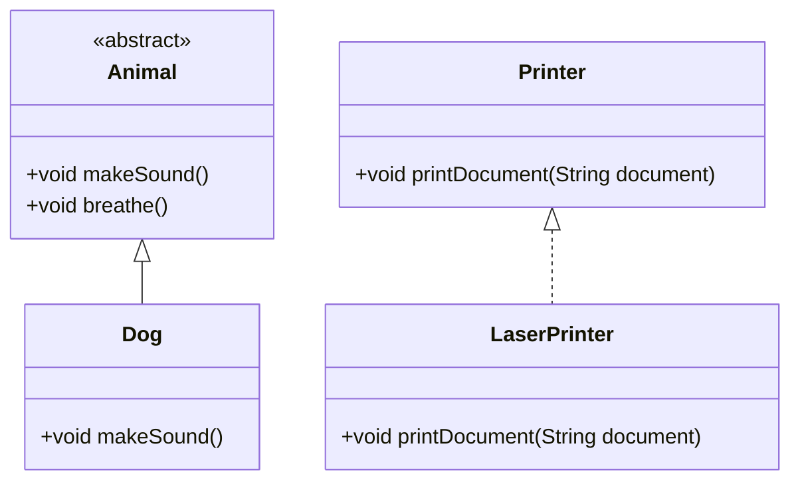

## 3.10 Abstract Classes and Interfaces

In the realm of object-oriented programming, abstract classes and interfaces are fundamental concepts that enable developers to design flexible and reusable code. Dart, being a modern language, provides robust support for these concepts, allowing developers to create sophisticated applications with ease. In this section, we will delve into the intricacies of abstract classes and interfaces in Dart, exploring their definitions, implementations, and the role they play in achieving polymorphism.

### Understanding Abstract Classes

**Abstract classes** in Dart are classes that cannot be instantiated directly. They are designed to be extended by other classes, providing a common base with abstract methods that must be implemented by subclasses. This allows for a clear separation of concerns and promotes code reuse.

#### Defining Abstract Classes

To define an abstract class in Dart, you use the `abstract` keyword. An abstract class can contain both abstract methods (methods without a body) and concrete methods (methods with a body). Here's a simple example:

```dart
abstract class Animal {
  // Abstract method
  void makeSound();

  // Concrete method
  void breathe() {
    print('Breathing...');
  }
}

class Dog extends Animal {
  @override
  void makeSound() {
    print('Bark!');
  }
}

void main() {
  Dog dog = Dog();
  dog.makeSound(); // Output: Bark!
  dog.breathe();   // Output: Breathing...
}
```

In this example, `Animal` is an abstract class with an abstract method `makeSound()` and a concrete method `breathe()`. The `Dog` class extends `Animal` and provides an implementation for the `makeSound()` method.

#### Key Characteristics of Abstract Classes

- **Cannot be instantiated**: Abstract classes serve as blueprints and cannot be used to create objects directly.
- **Can contain both abstract and concrete methods**: This allows for a mix of enforced and optional behavior.
- **Supports inheritance**: Subclasses must implement all abstract methods, ensuring a consistent interface.

### Implementing Interfaces in Dart

In Dart, every class implicitly defines an interface. This means that any class can be used as an interface, and other classes can implement it. Unlike abstract classes, interfaces do not provide any implementation, only method signatures.

#### Using Classes as Interfaces

To use a class as an interface, you simply implement it in another class. Here's an example:

```dart
class Printer {
  void printDocument(String document);
}

class LaserPrinter implements Printer {
  @override
  void printDocument(String document) {
    print('Printing document: $document');
  }
}

void main() {
  LaserPrinter printer = LaserPrinter();
  printer.printDocument('Hello, World!');
}
```

In this example, `Printer` acts as an interface with a method `printDocument()`. The `LaserPrinter` class implements this interface and provides the method's functionality.

#### Key Characteristics of Interfaces

- **Defines method signatures**: Interfaces specify what methods a class must implement, without providing the implementation.
- **Supports multiple interfaces**: A class can implement multiple interfaces, allowing for flexible design.

### Achieving Polymorphism

**Polymorphism** is a core concept in object-oriented programming that allows objects to be treated as instances of their parent class or interface. This enables dynamic method binding, where the method that gets executed is determined at runtime.

#### Polymorphism with Abstract Classes

Abstract classes facilitate polymorphism by allowing subclasses to be treated as instances of the abstract class. Here's an example:

```dart
abstract class Shape {
  void draw();
}

class Circle extends Shape {
  @override
  void draw() {
    print('Drawing a circle');
  }
}

class Square extends Shape {
  @override
  void draw() {
    print('Drawing a square');
  }
}

void main() {
  List<Shape> shapes = [Circle(), Square()];
  for (var shape in shapes) {
    shape.draw();
  }
}
```

In this example, both `Circle` and `Square` are subclasses of `Shape`. The list `shapes` contains instances of both subclasses, and the `draw()` method is called polymorphically.

#### Polymorphism with Interfaces

Interfaces also support polymorphism, allowing objects to be treated as instances of the interface they implement. Here's an example:

```dart
class Vehicle {
  void start();
}

class Car implements Vehicle {
  @override
  void start() {
    print('Car starting');
  }
}

class Bike implements Vehicle {
  @override
  void start() {
    print('Bike starting');
  }
}

void main() {
  List<Vehicle> vehicles = [Car(), Bike()];
  for (var vehicle in vehicles) {
    vehicle.start();
  }
}
```

In this example, both `Car` and `Bike` implement the `Vehicle` interface. The list `vehicles` contains instances of both classes, and the `start()` method is called polymorphically.

### Visualizing Abstract Classes and Interfaces

To better understand the relationship between abstract classes, interfaces, and their implementations, let's visualize these concepts using a class diagram.



In this diagram, `Animal` is an abstract class with an abstract method `makeSound()` and a concrete method `breathe()`. `Dog` extends `Animal` and provides an implementation for `makeSound()`. Similarly, `Printer` is used as an interface, and `LaserPrinter` implements it.

### Design Considerations

When deciding between abstract classes and interfaces, consider the following:

- **Use abstract classes** when you want to provide a common base with some shared implementation. This is useful when subclasses share common behavior.
- **Use interfaces** when you want to define a contract that multiple classes can implement, without enforcing any specific implementation. This is ideal for defining capabilities that can be shared across unrelated classes.
- **Prefer composition over inheritance**: While abstract classes and interfaces are powerful, always consider whether composition might be a better fit for your design.

### Differences and Similarities

Abstract classes and interfaces are often confused, but they serve different purposes:

- **Abstract classes** can have both abstract and concrete methods, while interfaces only define method signatures.
- **Abstract classes** support inheritance, allowing subclasses to share common behavior. Interfaces do not provide any implementation.
- **Interfaces** allow for multiple implementations, enabling a class to implement multiple interfaces. Dart does not support multiple inheritance, so a class can only extend one abstract class.

### Try It Yourself

To solidify your understanding of abstract classes and interfaces, try modifying the examples above:

- Add a new subclass to the `Animal` abstract class and implement the `makeSound()` method.
- Create a new interface and implement it in multiple classes, then use polymorphism to call the interface methods.

### Knowledge Check

Before moving on, let's review some key points:

- Abstract classes cannot be instantiated and are meant to be extended.
- Interfaces define method signatures and can be implemented by multiple classes.
- Polymorphism allows objects to be treated as instances of their parent class or interface.

### Embrace the Journey

Remember, mastering abstract classes and interfaces is just one step in your journey to becoming a proficient Dart developer. As you continue to explore these concepts, you'll gain a deeper understanding of how to design flexible and reusable code. Keep experimenting, stay curious, and enjoy the journey!

## Quiz Time!



### What is the primary purpose of an abstract class in Dart?

- [x] To provide a common base with abstract methods for subclasses to implement
- [ ] To define a contract without any implementation
- [ ] To allow multiple inheritance
- [ ] To encapsulate data

> **Explanation:** Abstract classes provide a common base with abstract methods that subclasses must implement.

### How do you define an abstract class in Dart?

- [x] Using the `abstract` keyword
- [ ] Using the `interface` keyword
- [ ] Using the `class` keyword
- [ ] Using the `extends` keyword

> **Explanation:** The `abstract` keyword is used to define an abstract class in Dart.

### Can abstract classes in Dart contain concrete methods?

- [x] Yes
- [ ] No

> **Explanation:** Abstract classes can contain both abstract and concrete methods.

### What is the role of interfaces in Dart?

- [x] To define method signatures that classes must implement
- [ ] To provide a common base with shared implementation
- [ ] To allow multiple inheritance
- [ ] To encapsulate data

> **Explanation:** Interfaces define method signatures that classes must implement, without providing any implementation.

### How do you implement an interface in Dart?

- [x] Using the `implements` keyword
- [ ] Using the `extends` keyword
- [ ] Using the `abstract` keyword
- [ ] Using the `with` keyword

> **Explanation:** The `implements` keyword is used to implement an interface in Dart.

### Can a class implement multiple interfaces in Dart?

- [x] Yes
- [ ] No

> **Explanation:** A class can implement multiple interfaces in Dart, allowing for flexible design.

### What is polymorphism in the context of Dart?

- [x] The ability to treat objects as instances of their parent class or interface
- [ ] The ability to define multiple classes with the same name
- [ ] The ability to inherit from multiple classes
- [ ] The ability to encapsulate data

> **Explanation:** Polymorphism allows objects to be treated as instances of their parent class or interface.

### Which of the following is a key difference between abstract classes and interfaces?

- [x] Abstract classes can have concrete methods, interfaces cannot
- [ ] Interfaces can have concrete methods, abstract classes cannot
- [ ] Abstract classes support multiple inheritance, interfaces do not
- [ ] Interfaces support inheritance, abstract classes do not

> **Explanation:** Abstract classes can have concrete methods, while interfaces only define method signatures.

### What keyword is used to extend an abstract class in Dart?

- [x] `extends`
- [ ] `implements`
- [ ] `with`
- [ ] `abstract`

> **Explanation:** The `extends` keyword is used to extend an abstract class in Dart.

### True or False: Interfaces in Dart can provide method implementations.

- [ ] True
- [x] False

> **Explanation:** Interfaces in Dart only define method signatures and do not provide any implementation.


