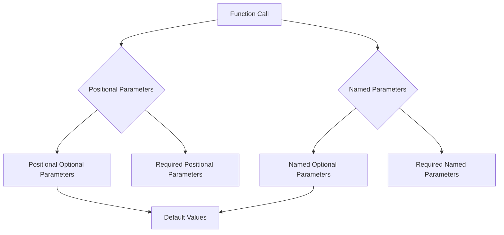

## 3.11 Optional and Named Parameters

In the world of programming, functions are the building blocks of any application. They allow us to encapsulate logic, promote code reuse, and enhance maintainability. Dart, being a modern programming language, offers a rich set of features to define functions with flexibility and clarity. Among these features are optional and named parameters, which provide developers with powerful tools to write more expressive and readable code.

### Understanding Function Parameters in Dart

Before diving into optional and named parameters, let's first understand the basic concept of function parameters in Dart. Parameters are the inputs to a function, allowing it to operate on different data. In Dart, parameters can be categorized into three main types:

1. **Positional Parameters**: These are the most common type of parameters, where the order of arguments passed to the function matters.
2. **Optional Parameters**: These parameters are not mandatory and can be omitted when calling the function.
3. **Named Parameters**: These parameters are specified by name, enhancing the readability of function calls.

### Positional Optional Parameters

Positional optional parameters are defined using square brackets `[]`. They allow you to specify parameters that can be omitted when calling the function. If omitted, these parameters take on a default value, which can be specified in the function definition.

#### Syntax and Example

```dart
void printDetails(String name, [int age = 18, String city = 'Unknown']) {
  print('Name: $name, Age: $age, City: $city');
}

void main() {
  printDetails('Alice'); // Name: Alice, Age: 18, City: Unknown
  printDetails('Bob', 25); // Name: Bob, Age: 25, City: Unknown
  printDetails('Charlie', 30, 'New York'); // Name: Charlie, Age: 30, City: New York
}
```

In this example, `age` and `city` are positional optional parameters. If they are not provided, they default to `18` and `'Unknown'`, respectively.

#### Key Points

- Positional optional parameters must be enclosed in square brackets.
- Default values can be specified for positional optional parameters.
- If no default value is provided, the parameter defaults to `null`.

### Named Optional Parameters

Named optional parameters are defined using curly braces `{}`. They allow you to specify parameters by name, making the function call more readable and self-documenting.

#### Syntax and Example

```dart
void printDetails({String name = 'Unknown', int age = 18, String city = 'Unknown'}) {
  print('Name: $name, Age: $age, City: $city');
}

void main() {
  printDetails(); // Name: Unknown, Age: 18, City: Unknown
  printDetails(name: 'Alice'); // Name: Alice, Age: 18, City: Unknown
  printDetails(age: 25, city: 'Los Angeles'); // Name: Unknown, Age: 25, City: Los Angeles
}
```

In this example, all parameters are named optional parameters. You can specify any combination of them when calling the function.

#### Key Points

- Named optional parameters must be enclosed in curly braces.
- Default values can be specified for named optional parameters.
- Named parameters enhance the readability of function calls.

### Required Named Parameters

Dart also allows you to define required named parameters using the `required` keyword. This ensures that certain parameters must be provided when calling the function, even if they are named.

#### Syntax and Example

```dart
void printDetails({required String name, int age = 18, String city = 'Unknown'}) {
  print('Name: $name, Age: $age, City: $city');
}

void main() {
  // printDetails(); // Error: The parameter 'name' is required.
  printDetails(name: 'Alice'); // Name: Alice, Age: 18, City: Unknown
  printDetails(name: 'Bob', age: 25); // Name: Bob, Age: 25, City: Unknown
}
```

In this example, `name` is a required named parameter, meaning it must be provided when calling the function.

#### Key Points

- Required named parameters are specified using the `required` keyword.
- They ensure that certain parameters are always provided, enhancing function robustness.

### Default Values in Dart

Default values play a crucial role in optional parameters, allowing you to specify a fallback value if the parameter is not provided. This can help prevent `null` values and make your functions more robust.

#### Example with Default Values

```dart
void greet(String name, [String greeting = 'Hello']) {
  print('$greeting, $name!');
}

void main() {
  greet('Alice'); // Hello, Alice!
  greet('Bob', 'Hi'); // Hi, Bob!
}
```

In this example, the `greeting` parameter has a default value of `'Hello'`. If not provided, it defaults to this value.

### Clarity and Readability with Named Parameters

Named parameters significantly enhance the clarity and readability of function calls. By specifying parameters by name, you make the code more self-explanatory and easier to understand.

#### Example of Enhanced Readability

```dart
void createUser({required String username, required String email, String role = 'User'}) {
  print('Creating user: $username, Email: $email, Role: $role');
}

void main() {
  createUser(username: 'john_doe', email: 'john@example.com'); // Creating user: john_doe, Email: john@example.com, Role: User
  createUser(username: 'jane_doe', email: 'jane@example.com', role: 'Admin'); // Creating user: jane_doe, Email: jane@example.com, Role: Admin
}
```

In this example, the use of named parameters makes it clear which values correspond to which parameters, enhancing the readability of the code.

### Visualizing Parameter Usage

To better understand the flow of parameter usage in Dart functions, let's visualize it using a flowchart.



**Figure 1**: Visualizing the flow of parameter usage in Dart functions.

### Design Considerations

When designing functions with optional and named parameters, consider the following:

- **Use Default Values**: Provide default values for optional parameters to prevent `null` values and enhance function robustness.
- **Enhance Readability**: Use named parameters to make function calls more readable and self-documenting.
- **Ensure Required Parameters**: Use the `required` keyword for parameters that must always be provided, ensuring function correctness.
- **Balance Flexibility and Complexity**: While optional and named parameters offer flexibility, avoid overcomplicating function signatures.

### Differences and Similarities

Optional and named parameters can sometimes be confused with each other. Here's a quick comparison:

- **Positional Optional vs. Named Optional**: Positional optional parameters rely on the order of arguments, while named optional parameters are specified by name.
- **Required Named vs. Required Positional**: Required named parameters are specified by name and must be provided, while required positional parameters are specified by position.

### Try It Yourself

To solidify your understanding of optional and named parameters, try modifying the following code examples:

1. Add a new named optional parameter to the `createUser` function and provide a default value.
2. Convert the `greet` function to use named parameters instead of positional optional parameters.
3. Experiment with different combinations of required and optional parameters in a new function.

### Knowledge Check

- What is the difference between positional optional and named optional parameters?
- How do default values enhance the robustness of functions?
- Why are named parameters beneficial for function readability?

### Embrace the Journey

Remember, mastering optional and named parameters is just one step in your journey to becoming a proficient Dart developer. As you continue to explore Dart's features, you'll discover new ways to write clean, efficient, and expressive code. Keep experimenting, stay curious, and enjoy the journey!

### References and Links

- [Dart Language Tour: Functions](https://dart.dev/guides/language/language-tour#functions)
- [Effective Dart: Design](https://dart.dev/guides/language/effective-dart/design)
- [Dart API Reference](https://api.dart.dev/)

## Quiz Time!



### What is the primary benefit of using named parameters in Dart?

- [x] Enhancing function call readability
- [ ] Reducing the number of parameters
- [ ] Improving performance
- [ ] Enforcing parameter order

> **Explanation:** Named parameters enhance the readability of function calls by allowing parameters to be specified by name, making the code more self-explanatory.

### How do you define a required named parameter in Dart?

- [x] Using the `required` keyword
- [ ] Using square brackets `[]`
- [ ] Using curly braces `{}`
- [ ] Using the `final` keyword

> **Explanation:** Required named parameters are defined using the `required` keyword, ensuring they must be provided when calling the function.

### What happens if you omit a positional optional parameter without a default value?

- [x] It defaults to `null`
- [ ] It causes a runtime error
- [ ] It defaults to an empty string
- [ ] It defaults to zero

> **Explanation:** If a positional optional parameter is omitted and no default value is provided, it defaults to `null`.

### Which of the following is a key advantage of using default values for optional parameters?

- [x] Preventing `null` values
- [ ] Reducing code size
- [ ] Improving execution speed
- [ ] Enforcing parameter order

> **Explanation:** Default values help prevent `null` values by providing a fallback value if the parameter is not provided.

### How are named optional parameters defined in Dart?

- [x] Using curly braces `{}`
- [ ] Using square brackets `[]`
- [ ] Using the `required` keyword
- [ ] Using the `final` keyword

> **Explanation:** Named optional parameters are defined using curly braces `{}`, allowing them to be specified by name.

### What is the purpose of the `required` keyword in Dart?

- [x] To enforce that a named parameter must be provided
- [ ] To define a constant parameter
- [ ] To specify a default value
- [ ] To indicate a deprecated parameter

> **Explanation:** The `required` keyword is used to enforce that a named parameter must be provided when calling the function.

### Which parameter type relies on the order of arguments?

- [x] Positional parameters
- [ ] Named parameters
- [ ] Required parameters
- [ ] Default parameters

> **Explanation:** Positional parameters rely on the order of arguments passed to the function.

### Can you provide default values for required named parameters?

- [ ] Yes
- [x] No

> **Explanation:** Required named parameters cannot have default values, as they must always be provided when calling the function.

### What is a common use case for named parameters?

- [x] Enhancing code readability
- [ ] Improving performance
- [ ] Reducing memory usage
- [ ] Enforcing strict typing

> **Explanation:** Named parameters are commonly used to enhance code readability by allowing parameters to be specified by name.

### True or False: Named parameters can only be optional.

- [ ] True
- [x] False

> **Explanation:** Named parameters can be either optional or required, depending on whether the `required` keyword is used.




