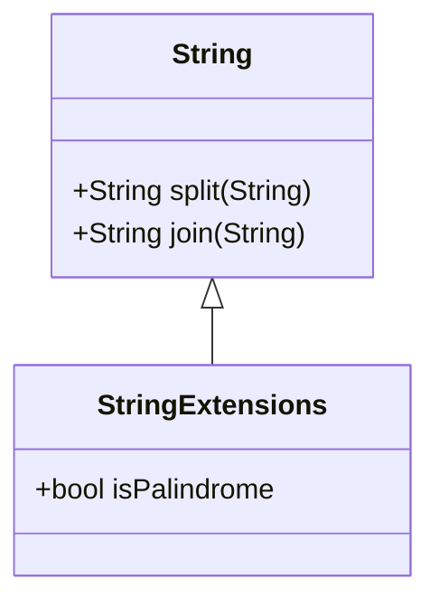

## 3.12 Extension Methods

In the realm of software development, the ability to extend existing functionality without altering the original source code is a powerful tool. Dart, a language designed for client-side development, offers a feature known as **extension methods** that allows developers to add new functionality to existing libraries and classes. This section will delve into the intricacies of extension methods, exploring how they can be used to enhance your codebase effectively and efficiently.

### Introduction to Extension Methods

Extension methods in Dart provide a mechanism to add new capabilities to existing classes without modifying their source code. This feature is particularly useful when working with third-party libraries or when you want to keep your code organized by separating concerns.

#### What Are Extension Methods?

Extension methods allow you to add new methods to existing types. They enable you to extend the functionality of classes, enums, and other types without subclassing or altering the original implementation. This is achieved by defining a new method within an extension block, which can then be called as if it were a part of the original class.

#### Why Use Extension Methods?

- **Enhance Readability**: By adding methods that are contextually relevant to the class, you can make your code more intuitive and easier to read.
- **Avoid Code Duplication**: Extension methods help in reducing code duplication by allowing you to reuse functionality across different parts of your application.
- **Maintainability**: By keeping extensions separate from the original class, you maintain a clean separation of concerns, making your codebase easier to maintain and update.

### Creating Extension Methods

Let's explore how to create and use extension methods in Dart.

#### Basic Syntax

To define an extension method, you use the `extension` keyword followed by a name for the extension and the `on` keyword to specify the type you are extending. Here's a simple example:

```dart
extension StringExtensions on String {
  bool get isPalindrome {
    return this == this.split('').reversed.join('');
  }
}
```

In this example, we define an extension on the `String` class to check if a string is a palindrome. The `isPalindrome` method can now be called on any `String` instance.

#### Using Extension Methods

Once defined, you can use the extension method as if it were a native method of the class:

```dart
void main() {
  String word = 'level';
  print(word.isPalindrome); // Output: true
}
```

### Advanced Usage Patterns

Extension methods can be used in various scenarios to enhance your codebase. Let's explore some advanced usage patterns.

#### Extending Built-in Types

Dart's built-in types, such as `int`, `double`, and `List`, can be extended to add custom functionality. For example, you might want to add a method to the `int` type to check if a number is even:

```dart
extension IntExtensions on int {
  bool get isEven => this % 2 == 0;
}
```

#### Chaining Extension Methods

You can chain extension methods to create fluent interfaces, making your code more expressive:

```dart
extension ListExtensions<T> on List<T> {
  List<T> addIfNotExists(T element) {
    if (!this.contains(element)) {
      this.add(element);
    }
    return this;
  }
}
```

This allows you to chain method calls:

```dart
void main() {
  List<int> numbers = [1, 2, 3];
  numbers.addIfNotExists(4).addIfNotExists(2);
  print(numbers); // Output: [1, 2, 3, 4]
}
```

### Best Practices for Extension Methods

While extension methods are powerful, they should be used judiciously. Here are some best practices to consider:

#### Naming Conventions

Choose descriptive names for your extensions and methods to avoid conflicts and improve readability. Use prefixes or suffixes to indicate the purpose of the extension.

#### Avoid Overuse

Overusing extension methods can lead to cluttered code and make it difficult to understand the original class's functionality. Use them sparingly and only when they add significant value.

#### Conflict Resolution

Be mindful of method name conflicts, especially when working with multiple extensions on the same type. Dart resolves conflicts by using the most specific extension available, but it's best to avoid conflicts altogether.

### Visualizing Extension Methods

To better understand how extension methods work, let's visualize the process using a class diagram.



**Diagram Description**: This diagram illustrates how the `StringExtensions` class extends the functionality of the `String` class by adding the `isPalindrome` method.

### Try It Yourself

Experiment with extension methods by modifying the examples provided. Try adding new methods to different types or chaining multiple extension methods together. This hands-on approach will help solidify your understanding of how extension methods can enhance your codebase.

### References and Further Reading

For more information on extension methods and other Dart features, consider exploring the following resources:

- [Dart Language Tour](https://dart.dev/guides/language/language-tour)
- [Effective Dart: Usage](https://dart.dev/guides/language/effective-dart/usage)
- [Dart API Documentation](https://api.dart.dev/)

### Knowledge Check

Let's reinforce your understanding of extension methods with a few questions:

1. What is the primary purpose of extension methods in Dart?
2. How do you define an extension method on a class?
3. What are some best practices for using extension methods?
4. How can you avoid conflicts when using multiple extensions on the same type?

### Conclusion

Extension methods are a powerful feature in Dart that allow you to enhance existing classes without modifying their source code. By following best practices and using them judiciously, you can create more readable, maintainable, and efficient code. Remember, this is just the beginning. As you progress, you'll discover even more ways to leverage extension methods to build robust and scalable applications. Keep experimenting, stay curious, and enjoy the journey!

## Quiz Time!



### What is the primary purpose of extension methods in Dart?

- [x] To add new functionality to existing classes without modifying their source code.
- [ ] To create new classes from scratch.
- [ ] To replace existing methods in a class.
- [ ] To delete methods from a class.

> **Explanation:** Extension methods allow developers to add new methods to existing classes without altering the original source code, enhancing functionality while maintaining code integrity.

### How do you define an extension method on a class in Dart?

- [x] Use the `extension` keyword followed by a name and the `on` keyword with the type.
- [ ] Use the `class` keyword followed by the type name.
- [ ] Use the `extends` keyword followed by the type name.
- [ ] Use the `implements` keyword followed by the type name.

> **Explanation:** The correct syntax involves using the `extension` keyword followed by a name for the extension and the `on` keyword to specify the type being extended.

### What is a best practice when using extension methods?

- [x] Use descriptive names to avoid conflicts and improve readability.
- [ ] Overuse them to add as many methods as possible.
- [ ] Avoid using them on built-in types.
- [ ] Use them to replace existing methods.

> **Explanation:** Descriptive names help avoid conflicts and improve code readability, making it easier to understand the purpose of each extension method.

### How can you avoid conflicts when using multiple extensions on the same type?

- [x] Use unique method names and descriptive prefixes or suffixes.
- [ ] Use the same method names across all extensions.
- [ ] Avoid using extensions altogether.
- [ ] Use the `override` keyword.

> **Explanation:** Unique method names and descriptive prefixes or suffixes help prevent conflicts when multiple extensions are applied to the same type.

### What is a potential downside of overusing extension methods?

- [x] It can lead to cluttered code and make it difficult to understand the original class's functionality.
- [ ] It can improve code readability.
- [ ] It can reduce code duplication.
- [ ] It can enhance maintainability.

> **Explanation:** Overusing extension methods can clutter the codebase, making it harder to understand the original class's functionality and purpose.

### Can extension methods be used to modify existing methods in a class?

- [ ] Yes, they can modify existing methods.
- [x] No, they cannot modify existing methods.
- [ ] Yes, but only in certain cases.
- [ ] No, they can only delete methods.

> **Explanation:** Extension methods cannot modify existing methods; they can only add new methods to a class.

### What is a benefit of using extension methods on built-in types?

- [x] They allow you to add custom functionality to types like `int` and `String`.
- [ ] They replace existing functionality in built-in types.
- [ ] They delete methods from built-in types.
- [ ] They make built-in types immutable.

> **Explanation:** Extension methods enable developers to add custom functionality to built-in types, enhancing their capabilities without altering the original implementation.

### How do extension methods contribute to code maintainability?

- [x] By keeping extensions separate from the original class, maintaining a clean separation of concerns.
- [ ] By merging all functionality into a single class.
- [ ] By replacing existing methods with new ones.
- [ ] By deleting unnecessary methods.

> **Explanation:** Extension methods maintain a clean separation of concerns by keeping new functionality separate from the original class, enhancing code maintainability.

### Can extension methods be chained together?

- [x] Yes, they can be chained to create fluent interfaces.
- [ ] No, they must be used individually.
- [ ] Yes, but only with certain types.
- [ ] No, they cannot be used in conjunction with other methods.

> **Explanation:** Extension methods can be chained together to create fluent interfaces, making the code more expressive and readable.

### True or False: Extension methods can be used to delete methods from a class.

- [ ] True
- [x] False

> **Explanation:** Extension methods cannot delete methods from a class; they are designed to add new functionality without altering the existing code.


