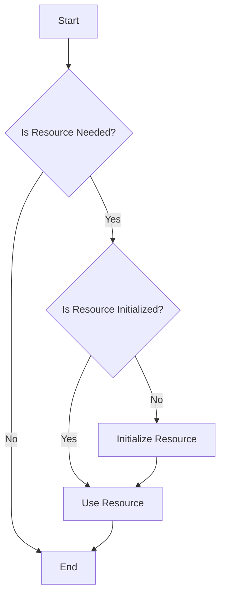

## 3.13 Late Variables and Lazy Initialization

In the world of Dart programming, the `late` keyword and lazy initialization are powerful tools that can significantly enhance the performance and flexibility of your applications. Understanding how to effectively use these features is crucial for any Dart or Flutter developer aiming to write efficient and maintainable code. In this section, we will delve into the concepts of late variables and lazy initialization, explore their use cases, and discuss the performance considerations associated with them.

### Understanding the `late` Keyword

The `late` keyword in Dart is used to defer the initialization of a variable until it is actually needed. This can be particularly useful in scenarios where a variable is non-nullable but cannot be initialized immediately. By marking a variable as `late`, you tell the Dart compiler that the variable will be initialized at a later point in time before it is accessed.

#### Syntax and Basic Usage

To declare a late variable, simply prefix the variable declaration with the `late` keyword. Here's a basic example:

```dart
late String greeting;

void initializeGreeting() {
  greeting = "Hello, Dart!";
}

void main() {
  initializeGreeting();
  print(greeting); // Outputs: Hello, Dart!
}
```

In this example, the `greeting` variable is declared as `late`, allowing it to be initialized in the `initializeGreeting` function before it is used in the `main` function.

#### Use Cases for Late Variables

Late variables are particularly useful in the following scenarios:

1. **Non-nullable Variables**: When you have a non-nullable variable that cannot be initialized at the point of declaration, using `late` allows you to defer its initialization until a later point in the program.

2. **Expensive Initialization**: If the initialization of a variable is computationally expensive or involves I/O operations, deferring its initialization until it is actually needed can improve the performance of your application.

3. **Circular Dependencies**: In cases where two or more objects depend on each other for initialization, using `late` can help break the circular dependency by deferring the initialization of one or more variables.

### Lazy Initialization

Lazy initialization is a design pattern that defers the creation of an object until it is needed. This can be particularly useful in optimizing the performance of your application by avoiding unnecessary computations or resource allocations.

#### Implementing Lazy Initialization

In Dart, lazy initialization can be implemented using the `late` keyword in combination with a getter. Here's an example:

```dart
class ExpensiveResource {
  ExpensiveResource() {
    print("ExpensiveResource initialized");
  }

  void performTask() {
    print("Task performed");
  }
}

class ResourceManager {
  late ExpensiveResource _resource;

  ExpensiveResource get resource {
    if (_resource == null) {
      _resource = ExpensiveResource();
    }
    return _resource;
  }
}

void main() {
  ResourceManager manager = ResourceManager();
  manager.resource.performTask(); // Outputs: ExpensiveResource initialized
                                  //          Task performed
}
```

In this example, the `ExpensiveResource` object is not created until the `resource` getter is accessed for the first time. This defers the initialization of the resource until it is actually needed, potentially improving the performance of the application.

#### Performance Considerations

While lazy initialization can improve performance by deferring expensive computations, it also introduces some trade-offs:

- **Memory Usage**: Lazy initialization can reduce memory usage by avoiding the allocation of resources that are never used. However, if the resource is eventually needed, the memory usage will be the same as if it had been initialized eagerly.

- **Initialization Overhead**: Deferring initialization can introduce a slight overhead when the resource is first accessed. This overhead is usually negligible, but it can be a consideration in performance-critical applications.

- **Thread Safety**: In multi-threaded applications, lazy initialization can introduce thread safety issues if not implemented carefully. In Dart, this is less of a concern due to the single-threaded nature of the event loop, but it is still something to be aware of.

### Best Practices for Using Late Variables and Lazy Initialization

To effectively use late variables and lazy initialization in your Dart applications, consider the following best practices:

1. **Use Late Variables Sparingly**: While late variables can be useful, overusing them can make your code harder to understand and maintain. Use them only when necessary, such as when dealing with non-nullable variables that cannot be initialized immediately.

2. **Document Initialization Points**: Clearly document where and when late variables are initialized in your code. This can help prevent bugs and make your code easier to understand for other developers.

3. **Consider Thread Safety**: If you are using Dart's `Isolates` for concurrency, be mindful of potential thread safety issues when using lazy initialization. Ensure that your code is safe to run in a concurrent environment.

4. **Profile Your Code**: Use Dart's profiling tools to measure the performance impact of lazy initialization in your application. This can help you identify any potential bottlenecks and optimize your code accordingly.

### Visualizing Lazy Initialization

To better understand how lazy initialization works, let's visualize the process using a flowchart:



**Figure 1: Lazy Initialization Flowchart**

This flowchart illustrates the decision-making process involved in lazy initialization. The resource is only initialized if it is needed and has not already been initialized.

### Try It Yourself

To get a better understanding of late variables and lazy initialization, try modifying the code examples provided in this section. Experiment with different scenarios, such as:

- Deferring the initialization of multiple variables in a class.
- Implementing lazy initialization for a resource that is only needed in certain conditions.
- Measuring the performance impact of lazy initialization in a sample application.

### Knowledge Check

To reinforce your understanding of late variables and lazy initialization, consider the following questions:

- What are the benefits of using late variables in Dart?
- How does lazy initialization improve the performance of an application?
- What are some potential trade-offs of using lazy initialization?
- How can you ensure thread safety when using lazy initialization in a concurrent environment?

### Conclusion

Late variables and lazy initialization are powerful tools in the Dart programming language that can help you write more efficient and maintainable code. By deferring the initialization of variables and resources until they are actually needed, you can optimize the performance of your applications and reduce unnecessary computations. Remember to use these features judiciously and document your code to ensure that it remains understandable and maintainable.

## Quiz Time!



### What is the primary purpose of the `late` keyword in Dart?

- [x] To defer the initialization of a variable until it is needed
- [ ] To initialize a variable immediately
- [ ] To declare a variable as nullable
- [ ] To make a variable immutable

> **Explanation:** The `late` keyword is used to defer the initialization of a variable until it is actually needed.

### Which of the following is a use case for late variables?

- [x] Non-nullable variables that cannot be initialized immediately
- [ ] Variables that are always initialized at the point of declaration
- [ ] Variables that are never used
- [ ] Variables that are always null

> **Explanation:** Late variables are useful for non-nullable variables that cannot be initialized at the point of declaration.

### What is lazy initialization?

- [x] A design pattern that defers the creation of an object until it is needed
- [ ] A method of initializing all variables at the start of a program
- [ ] A way to make variables immutable
- [ ] A technique for initializing variables in parallel

> **Explanation:** Lazy initialization is a design pattern that defers the creation of an object until it is actually needed.

### What is a potential trade-off of using lazy initialization?

- [x] Initialization overhead when the resource is first accessed
- [ ] Increased memory usage
- [ ] Decreased performance
- [ ] Immediate initialization of all resources

> **Explanation:** Lazy initialization can introduce a slight overhead when the resource is first accessed.

### How can you ensure thread safety when using lazy initialization in a concurrent environment?

- [x] Use synchronization mechanisms to protect shared resources
- [ ] Avoid using lazy initialization altogether
- [ ] Initialize all resources at the start of the program
- [ ] Use only single-threaded applications

> **Explanation:** Synchronization mechanisms can help ensure thread safety when using lazy initialization in a concurrent environment.

### What is the benefit of using lazy initialization?

- [x] Reduced memory usage by avoiding unnecessary resource allocation
- [ ] Immediate availability of all resources
- [ ] Increased complexity of code
- [ ] Decreased performance

> **Explanation:** Lazy initialization can reduce memory usage by avoiding the allocation of resources that are never used.

### When should you use late variables?

- [x] When dealing with non-nullable variables that cannot be initialized immediately
- [ ] When all variables can be initialized at the point of declaration
- [ ] When variables are always nullable
- [ ] When variables are never used

> **Explanation:** Late variables are useful for non-nullable variables that cannot be initialized at the point of declaration.

### What is a best practice for using late variables?

- [x] Document where and when they are initialized
- [ ] Use them for all variables
- [ ] Avoid using them altogether
- [ ] Initialize them immediately

> **Explanation:** Documenting where and when late variables are initialized can help prevent bugs and make the code easier to understand.

### What is the impact of lazy initialization on memory usage?

- [x] It can reduce memory usage by avoiding unnecessary resource allocation
- [ ] It always increases memory usage
- [ ] It has no impact on memory usage
- [ ] It always decreases memory usage

> **Explanation:** Lazy initialization can reduce memory usage by avoiding the allocation of resources that are never used.

### True or False: Lazy initialization is always the best choice for optimizing performance.

- [ ] True
- [x] False

> **Explanation:** Lazy initialization can improve performance in some cases, but it also introduces trade-offs and is not always the best choice.



Remember, mastering late variables and lazy initialization is just one step in your journey to becoming a proficient Dart and Flutter developer. Keep experimenting, stay curious, and enjoy the process of learning and growing as a developer!
