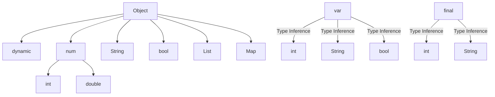

## 3.14 Dart's Type System and Type Inference

Dart's type system is a cornerstone of its language design, offering a blend of static and dynamic typing that empowers developers to write robust, maintainable code. In this section, we will delve into the intricacies of Dart's type system, explore the concept of type inference, and understand the role of dynamic typing. By mastering these concepts, you will be better equipped to leverage Dart's full potential in your Flutter applications.

### Strong Typing in Dart

Dart is a strongly typed language, meaning that every variable has a type, and the type is checked at compile time. This strong typing helps catch errors early in the development process, reducing runtime errors and enhancing code reliability.

#### How Dart Enforces Type Safety

Dart enforces type safety by ensuring that variables are used in a manner consistent with their declared types. This is achieved through static type checking, which occurs at compile time. Let's explore some key aspects of Dart's type safety:

- **Type Declarations**: In Dart, you can explicitly declare the type of a variable. This makes your code more readable and helps the compiler catch type-related errors.

  ```dart
  int age = 30;
  String name = "Alice";
  ```

- **Type Checking**: Dart checks the types of variables at compile time, ensuring that operations on variables are type-safe. For example, you cannot assign a string to an integer variable without an explicit conversion.

  ```dart
  int age = 30;
  // age = "thirty"; // Error: A value of type 'String' can't be assigned to a variable of type 'int'.
  ```

- **Type Promotion**: Dart can promote the type of a variable within certain scopes, such as within an `if` statement, when it can guarantee that the variable is of a specific type.

  ```dart
  void printLength(Object obj) {
    if (obj is String) {
      // obj is promoted to String within this block
      print(obj.length);
    }
  }
  ```

### Type Inference in Dart

Type inference is a powerful feature in Dart that allows the compiler to deduce the type of a variable based on the assigned value. This reduces boilerplate code and enhances readability without sacrificing type safety.

#### Letting the Compiler Infer Types with `var` and `final`

Dart provides the `var` and `final` keywords to facilitate type inference:

- **`var` Keyword**: When you declare a variable with `var`, Dart infers the type from the initial value assigned to the variable.

  ```dart
  var age = 30; // Dart infers the type as int
  var name = "Alice"; // Dart infers the type as String
  ```

- **`final` Keyword**: The `final` keyword is used to declare a variable that can be set only once. Dart infers the type from the initial value, similar to `var`, but the variable cannot be reassigned.

  ```dart
  final city = "New York"; // Dart infers the type as String
  // city = "Los Angeles"; // Error: 'city' can't be used as a setter because it's final.
  ```

#### Benefits of Type Inference

Type inference offers several benefits:

- **Reduced Boilerplate**: By inferring types, you can write less code without losing type safety.
- **Improved Readability**: Code becomes cleaner and easier to read, as you don't have to explicitly declare types everywhere.
- **Flexibility**: You can focus on the logic of your code without worrying about type declarations.

### Dynamic Type in Dart

While Dart is primarily a statically typed language, it also supports dynamic typing through the `dynamic` keyword. This allows for more flexibility but should be used judiciously to avoid potential pitfalls.

#### Using `dynamic` and When to Avoid It

The `dynamic` keyword allows you to declare variables without specifying a type, deferring type checking until runtime. This can be useful in certain scenarios, such as when working with JSON data or interfacing with dynamically typed languages.

```dart
dynamic value = "Hello";
value = 42; // No error, as 'value' is dynamic
```

However, using `dynamic` comes with trade-offs:

- **Loss of Type Safety**: Since type checking is deferred to runtime, you lose the compile-time safety that Dart's static typing provides.
- **Potential for Runtime Errors**: Errors that could be caught at compile time may only surface at runtime, leading to potential crashes or unexpected behavior.
- **Reduced Readability**: Code that relies heavily on `dynamic` can become harder to understand and maintain.

#### Best Practices for Using `dynamic`

- **Limit Usage**: Use `dynamic` sparingly and only when necessary. Prefer explicit types or type inference with `var` and `final` whenever possible.
- **Type Checks**: When using `dynamic`, perform explicit type checks to ensure that variables are used correctly.

  ```dart
  dynamic value = getValue();
  if (value is String) {
    print(value.length);
  }
  ```

### Visualizing Dart's Type System

To better understand Dart's type system, let's visualize the relationship between different types and how type inference works.



**Diagram Description**: This diagram illustrates the hierarchy of Dart's type system, with `Object` as the root type. It shows how `dynamic` is a subtype of `Object`, and how `var` and `final` leverage type inference to deduce types like `int`, `String`, and `bool`.

### Try It Yourself

To solidify your understanding of Dart's type system and type inference, try modifying the following code examples:

1. **Experiment with Type Inference**: Change the initial values of variables declared with `var` and observe how Dart infers different types.

   ```dart
   var number = 10; // Try changing to 10.5 or "ten"
   var isActive = true; // Try changing to 1 or "true"
   ```

2. **Explore Type Promotion**: Modify the `printLength` function to handle other types and see how Dart promotes types within conditional blocks.

   ```dart
   void printLength(Object obj) {
     if (obj is String) {
       print(obj.length);
     } else if (obj is List) {
       print(obj.length);
     }
   }
   ```

3. **Use `dynamic` Carefully**: Declare a variable with `dynamic` and perform operations that require type checks to ensure safety.

   ```dart
   dynamic data = fetchData();
   if (data is Map) {
     print(data['key']);
   }
   ```

### Knowledge Check

Before we conclude, let's reinforce what we've learned with a few questions:

- What is the primary benefit of Dart's strong typing?
- How does type inference with `var` and `final` enhance code readability?
- When should you use the `dynamic` keyword, and what are the potential risks?

### Summary

In this section, we've explored Dart's type system and type inference, understanding how strong typing ensures type safety and how type inference reduces boilerplate code. We've also examined the role of `dynamic` typing and the importance of using it judiciously. By mastering these concepts, you can write more robust and maintainable Dart code, enhancing your Flutter development skills.

### Embrace the Journey

Remember, mastering Dart's type system is just one step in your journey as a Flutter developer. As you continue to explore and experiment with Dart, you'll discover new ways to leverage its powerful features. Stay curious, keep learning, and enjoy the process of becoming a more skilled and confident developer.

## Quiz Time!



### What is the primary benefit of Dart's strong typing?

- [x] It catches type-related errors at compile time.
- [ ] It allows for dynamic type changes at runtime.
- [ ] It eliminates the need for type declarations.
- [ ] It supports multiple programming paradigms.

> **Explanation:** Dart's strong typing ensures that type-related errors are caught at compile time, enhancing code reliability.

### How does type inference with `var` and `final` enhance code readability?

- [x] By reducing boilerplate code.
- [ ] By allowing dynamic type changes.
- [ ] By enforcing explicit type declarations.
- [ ] By supporting multiple inheritance.

> **Explanation:** Type inference reduces the need for explicit type declarations, making code cleaner and easier to read.

### When should you use the `dynamic` keyword?

- [x] When interfacing with dynamically typed languages.
- [ ] When you want to enforce type safety.
- [ ] When you need compile-time type checking.
- [ ] When you want to avoid runtime errors.

> **Explanation:** The `dynamic` keyword is useful when working with dynamically typed languages or data, but it should be used carefully to avoid runtime errors.

### What is a potential risk of using `dynamic`?

- [x] Loss of compile-time type safety.
- [ ] Increased code readability.
- [ ] Enhanced performance.
- [ ] Simplified error handling.

> **Explanation:** Using `dynamic` can lead to a loss of compile-time type safety, increasing the risk of runtime errors.

### What is type promotion in Dart?

- [x] The ability to treat a variable as a more specific type within a certain scope.
- [ ] The automatic conversion of types at runtime.
- [ ] The process of inferring types from variable names.
- [ ] The enforcement of type declarations.

> **Explanation:** Type promotion allows Dart to treat a variable as a more specific type within certain scopes, such as conditional blocks.

### How does Dart's type system enhance code reliability?

- [x] By enforcing type safety at compile time.
- [ ] By allowing dynamic type changes.
- [ ] By supporting multiple programming paradigms.
- [ ] By eliminating the need for type declarations.

> **Explanation:** Dart's type system enhances code reliability by enforcing type safety at compile time, reducing runtime errors.

### What is the role of `final` in Dart's type inference?

- [x] To declare a variable that can be set only once.
- [ ] To allow dynamic type changes.
- [ ] To enforce explicit type declarations.
- [ ] To support multiple inheritance.

> **Explanation:** The `final` keyword is used to declare a variable that can be set only once, with its type inferred from the initial value.

### How can you ensure type safety when using `dynamic`?

- [x] By performing explicit type checks.
- [ ] By avoiding type declarations.
- [ ] By using `var` instead of `dynamic`.
- [ ] By relying on runtime type inference.

> **Explanation:** When using `dynamic`, performing explicit type checks ensures that variables are used correctly, maintaining type safety.

### What is the root type in Dart's type hierarchy?

- [x] Object
- [ ] int
- [ ] String
- [ ] dynamic

> **Explanation:** In Dart's type hierarchy, `Object` is the root type from which all other types are derived.

### True or False: Dart's type inference eliminates the need for type declarations.

- [ ] True
- [x] False

> **Explanation:** While type inference reduces the need for explicit type declarations, it does not eliminate them entirely. Explicit types can still be declared for clarity and specificity.


