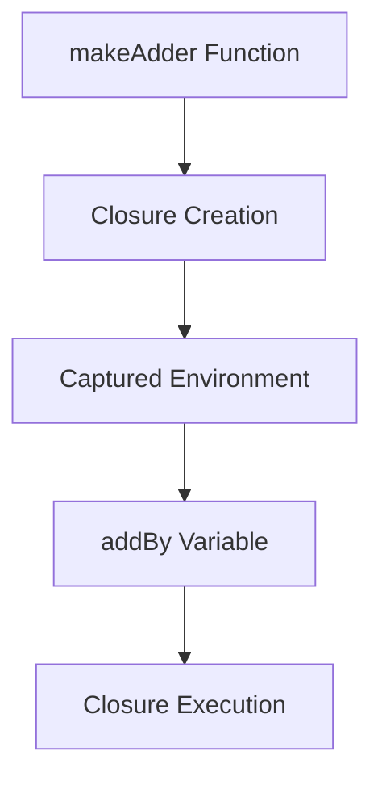

## 3.15 Functional Features: Closures and Lambdas

In this section, we delve into the functional programming features of Dart, focusing on closures and lambdas. These concepts are pivotal in writing concise, expressive, and efficient code. By mastering these features, you can leverage Dart's full potential in building robust Flutter applications.

### Introduction to Anonymous Functions

Anonymous functions, also known as lambda expressions or closures, are functions defined without a name. They are often used as arguments to higher-order functions or for short-lived operations. In Dart, anonymous functions are first-class citizens, meaning they can be assigned to variables, passed as arguments, and returned from other functions.

#### Defining Anonymous Functions

In Dart, an anonymous function is defined using the `=>` syntax for single-expression functions or the `{}` syntax for multi-statement functions. Here's an example of both:

```dart
// Single-expression anonymous function
var add = (int a, int b) => a + b;

// Multi-statement anonymous function
var multiply = (int a, int b) {
  int result = a * b;
  return result;
};

// Using the functions
void main() {
  print(add(2, 3)); // Output: 5
  print(multiply(4, 5)); // Output: 20
}
```

### Closures in Dart

Closures are functions that capture variables from their surrounding lexical scope. This means that a closure can access and modify variables declared outside its own scope, even after the outer function has finished executing.

#### Understanding Closures

A closure is created when a function is defined within another function and references variables from the outer function. This allows the inner function to "close over" the environment in which it was created.

```dart
Function makeAdder(int addBy) {
  return (int i) => addBy + i;
}

void main() {
  var add2 = makeAdder(2);
  var add5 = makeAdder(5);

  print(add2(3)); // Output: 5
  print(add5(3)); // Output: 8
}
```

In this example, `makeAdder` returns a closure that captures the `addBy` variable. Each time `makeAdder` is called, a new closure is created with its own captured `addBy` value.

#### Visualizing Closures

To better understand closures, let's visualize how they capture variables from their environment.



**Diagram Description:** This diagram illustrates the process of creating a closure in Dart. The `makeAdder` function creates a closure that captures the `addBy` variable from its environment. This captured environment is then used when the closure is executed.

### Functional Programming Techniques

Functional programming is a paradigm that treats computation as the evaluation of mathematical functions and avoids changing state or mutable data. Dart supports several functional programming techniques, including higher-order functions and immutability.

#### Higher-Order Functions

Higher-order functions are functions that can take other functions as arguments or return them as results. This allows for more abstract and flexible code.

```dart
void printResult(int Function(int, int) operation, int a, int b) {
  print(operation(a, b));
}

void main() {
  printResult((a, b) => a + b, 3, 4); // Output: 7
  printResult((a, b) => a * b, 3, 4); // Output: 12
}
```

In this example, `printResult` is a higher-order function that takes an operation function as an argument and applies it to the given numbers.

#### Immutability

Immutability is a core concept in functional programming, where data structures are not modified after they are created. Instead, new data structures are created with the desired changes.

```dart
void main() {
  final List<int> numbers = [1, 2, 3];
  final List<int> newNumbers = [...numbers, 4];

  print(numbers); // Output: [1, 2, 3]
  print(newNumbers); // Output: [1, 2, 3, 4]
}
```

In this example, the original list `numbers` remains unchanged, and a new list `newNumbers` is created with the additional element.

### Practical Applications of Closures and Lambdas

Closures and lambdas are widely used in Dart and Flutter for various purposes, such as event handling, asynchronous programming, and state management.

#### Event Handling

In Flutter, closures are often used as callbacks for handling events like button presses.

```dart
import 'package:flutter/material.dart';

void main() => runApp(MyApp());

class MyApp extends StatelessWidget {
  @override
  Widget build(BuildContext context) {
    return MaterialApp(
      home: Scaffold(
        appBar: AppBar(title: Text('Closure Example')),
        body: Center(
          child: ElevatedButton(
            onPressed: () {
              print('Button pressed!');
            },
            child: Text('Press Me'),
          ),
        ),
      ),
    );
  }
}
```

In this example, the `onPressed` callback is a closure that captures the context in which it was created.

#### Asynchronous Programming

Closures are also used in asynchronous programming to handle future results.

```dart
Future<void> fetchData() async {
  await Future.delayed(Duration(seconds: 2));
  print('Data fetched');
}

void main() {
  fetchData().then((_) {
    print('Operation complete');
  });
}
```

Here, the closure passed to `then` captures the environment and executes once the future is complete.

### Try It Yourself

To deepen your understanding of closures and lambdas, try modifying the examples provided:

- **Modify the `makeAdder` function** to create a subtractor instead.
- **Experiment with higher-order functions** by creating a function that applies multiple operations to a list of numbers.
- **Create a Flutter app** that uses closures for managing state changes.

### Key Takeaways

- **Closures** capture variables from their surrounding scope, allowing functions to access and modify these variables even after the outer function has finished executing.
- **Lambdas** are anonymous functions that can be used for short-lived operations or passed as arguments to higher-order functions.
- **Functional programming techniques** in Dart, such as higher-order functions and immutability, enable more abstract and flexible code.

### References and Further Reading

- [Dart Language Tour](https://dart.dev/guides/language/language-tour#functions)
- [Flutter Documentation](https://flutter.dev/docs)
- [Functional Programming in Dart](https://dart.dev/guides/language/functional-programming)

### Embrace the Journey

Remember, mastering closures and lambdas is just the beginning of your journey into functional programming with Dart. As you continue to explore these concepts, you'll discover new ways to write more efficient and expressive code. Keep experimenting, stay curious, and enjoy the journey!

## Quiz Time!



### What is an anonymous function in Dart?

- [x] A function defined without a name
- [ ] A function that cannot be called
- [ ] A function that is always asynchronous
- [ ] A function that returns a closure

> **Explanation:** An anonymous function is defined without a name and can be used as a first-class citizen in Dart.

### What is a closure in Dart?

- [x] A function that captures variables from its surrounding scope
- [ ] A function that cannot be modified
- [ ] A function that is always synchronous
- [ ] A function that returns a lambda

> **Explanation:** A closure captures variables from its surrounding lexical scope, allowing it to access and modify them even after the outer function has executed.

### Which of the following is a higher-order function?

- [x] A function that takes another function as an argument
- [ ] A function that returns a string
- [ ] A function that modifies a global variable
- [ ] A function that uses a loop

> **Explanation:** A higher-order function is one that takes another function as an argument or returns a function as a result.

### What is the purpose of immutability in functional programming?

- [x] To prevent changes to data structures after they are created
- [ ] To allow functions to modify global state
- [ ] To enable asynchronous programming
- [ ] To simplify error handling

> **Explanation:** Immutability prevents changes to data structures after they are created, promoting safer and more predictable code.

### How can closures be used in asynchronous programming?

- [x] By capturing the environment and executing once a future is complete
- [ ] By modifying global variables
- [ ] By returning a new function
- [ ] By using loops

> **Explanation:** Closures can capture the environment and execute once a future is complete, making them useful for handling asynchronous operations.

### What is the syntax for defining a single-expression anonymous function in Dart?

- [x] `=>`
- [ ] `{}`
- [ ] `()`
- [ ] `[]`

> **Explanation:** The `=>` syntax is used for defining single-expression anonymous functions in Dart.

### Which of the following is a benefit of using lambdas?

- [x] They allow for concise and expressive code
- [ ] They are always faster than named functions
- [ ] They cannot capture variables from their scope
- [ ] They are only used in asynchronous programming

> **Explanation:** Lambdas allow for concise and expressive code, making them useful for short-lived operations.

### What is a common use case for closures in Flutter?

- [x] Event handling
- [ ] Global state management
- [ ] Loop iteration
- [ ] Error handling

> **Explanation:** Closures are commonly used in Flutter for event handling, such as button press callbacks.

### How do higher-order functions contribute to functional programming?

- [x] By allowing functions to be passed as arguments or returned as results
- [ ] By modifying global variables
- [ ] By simplifying error handling
- [ ] By enabling synchronous programming

> **Explanation:** Higher-order functions allow functions to be passed as arguments or returned as results, contributing to more abstract and flexible code.

### True or False: Closures can modify variables from their captured environment.

- [x] True
- [ ] False

> **Explanation:** Closures can modify variables from their captured environment, allowing them to maintain state across function calls.


