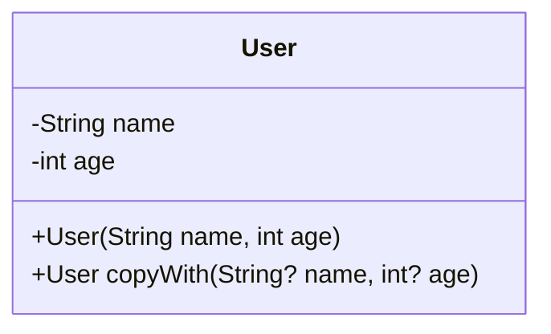

## 3.16 Immutable Data Structures

In the world of software development, immutability is a concept that has gained significant traction, especially in functional programming paradigms. Dart, being a versatile language, offers robust support for immutable data structures, which are particularly beneficial in Flutter development. This section will delve into the intricacies of immutable data structures in Dart, exploring their benefits, implementation strategies, and practical applications.

### Understanding Immutability

Immutability refers to the state of an object that cannot be modified after it is created. This concept is pivotal in ensuring thread safety, reducing side effects, and making code more predictable and easier to reason about. In Dart, immutability is achieved through the use of `final` and `const` keywords, as well as by designing data classes that inherently support immutability.

#### Benefits of Immutability

1. **Thread Safety**: Immutable objects are inherently thread-safe, as their state cannot change after creation. This eliminates the need for synchronization mechanisms, making concurrent programming simpler and less error-prone.

2. **Predictable Code**: With immutability, you can be confident that an object's state will not change unexpectedly, leading to more predictable and reliable code.

3. **Simplified Debugging**: Since immutable objects do not change state, debugging becomes easier. You can trace the flow of data without worrying about unexpected mutations.

4. **Functional Programming**: Immutability is a cornerstone of functional programming, enabling developers to write cleaner, more declarative code.

5. **Caching and Memoization**: Immutable objects can be safely cached and reused, as their state remains constant. This can lead to performance optimizations through memoization.

### Implementing Immutability in Dart

Dart provides several mechanisms to implement immutability, primarily through the use of the `final` and `const` keywords.

#### Using `final` and `const`

- **`final` Keyword**: The `final` keyword in Dart is used to declare a variable that can be set only once. Once assigned, the variable's reference cannot be changed, but the object it points to can still be mutable.

  ```dart
  final List<int> numbers = [1, 2, 3];
  numbers.add(4); // This is allowed, as the list itself is mutable.
  // numbers = [5, 6, 7]; // This would cause an error, as the reference cannot be changed.
  ```

- **`const` Keyword**: The `const` keyword goes a step further by making the object itself immutable. A `const` object is deeply immutable, meaning that neither the reference nor the object can be changed.

  ```dart
  const List<int> numbers = [1, 2, 3];
  // numbers.add(4); // This would cause an error, as the list is immutable.
  ```

#### Data Classes and Immutability

Data classes in Dart are a powerful way to create immutable objects. By using `final` fields and providing a copy method, you can create classes that are both immutable and easy to work with.

##### Creating Immutable Data Classes

To create an immutable data class, follow these steps:

1. **Use `final` for Fields**: Declare all fields as `final` to ensure they are set only once.

2. **Provide a Constructor**: Use a constructor to initialize all fields.

3. **Implement a `copyWith` Method**: Provide a method to create a copy of the object with modified fields.

Here's an example of an immutable data class in Dart:

```dart
class User {
  final String name;
  final int age;

  const User({required this.name, required this.age});

  User copyWith({String? name, int? age}) {
    return User(
      name: name ?? this.name,
      age: age ?? this.age,
    );
  }
}

void main() {
  const user = User(name: 'Alice', age: 30);
  final updatedUser = user.copyWith(age: 31);

  print(user.name); // Alice
  print(updatedUser.age); // 31
}
```

### Practical Applications of Immutability

Immutability is not just a theoretical concept; it has practical applications that can significantly enhance your Flutter development experience.

#### State Management

In Flutter, state management is a crucial aspect of building responsive and interactive applications. Immutability plays a vital role in state management solutions like Redux, BLoC, and Provider, where the state is represented as immutable objects.

- **Redux**: In Redux, the state is immutable, and changes are made by dispatching actions that produce a new state.

- **BLoC**: The BLoC pattern leverages streams and immutable state to manage application logic and UI updates.

- **Provider**: Provider can work with immutable data structures to ensure that UI components rebuild only when necessary.

#### UI Consistency

Immutable data structures help maintain UI consistency by ensuring that the UI reflects the current state of the application without unexpected changes. This is particularly important in Flutter, where the UI is rebuilt in response to state changes.

#### Performance Optimization

Immutable objects can be safely shared across different parts of an application, reducing the need for redundant copies and improving performance. This is especially beneficial in scenarios involving large data sets or complex UI components.

### Visualizing Immutability in Dart

To better understand how immutability works in Dart, let's visualize the concept using a class diagram.



This diagram represents the `User` class, highlighting its immutable fields and the `copyWith` method used to create modified copies.

### Try It Yourself

Experiment with the following code to deepen your understanding of immutability in Dart:

1. Modify the `User` class to include additional fields, such as `email` and `address`.
2. Implement a `toString` method to print the user's details in a readable format.
3. Create a list of `User` objects and demonstrate how to update a user's information using the `copyWith` method.

### Knowledge Check

Before we conclude, let's reinforce your understanding of immutable data structures with a few questions:

- What is the primary benefit of using immutable data structures in concurrent programming?
- How does the `const` keyword differ from the `final` keyword in Dart?
- Why is immutability important in state management solutions like Redux and BLoC?

### Conclusion

Immutability is a powerful concept that can greatly enhance the robustness and maintainability of your Dart and Flutter applications. By leveraging immutable data structures, you can achieve thread safety, predictable code, and improved performance. As you continue your journey in Flutter development, remember to embrace immutability as a best practice for building scalable and reliable applications.

## Quiz Time!



### What is the primary benefit of using immutable data structures in concurrent programming?

- [x] Thread safety
- [ ] Faster execution
- [ ] Reduced memory usage
- [ ] Easier syntax

> **Explanation:** Immutable data structures are inherently thread-safe because their state cannot change after creation, eliminating the need for synchronization.

### How does the `const` keyword differ from the `final` keyword in Dart?

- [x] `const` makes the object deeply immutable, while `final` only makes the reference immutable.
- [ ] `const` is used for variables, while `final` is used for methods.
- [ ] `const` allows for runtime changes, while `final` does not.
- [ ] `const` is only applicable to primitive types.

> **Explanation:** The `const` keyword makes both the reference and the object immutable, whereas `final` only prevents the reference from being reassigned.

### Why is immutability important in state management solutions like Redux and BLoC?

- [x] It ensures that state changes are predictable and traceable.
- [ ] It allows for dynamic UI updates without rebuilding.
- [ ] It reduces the need for error handling.
- [ ] It simplifies the use of global variables.

> **Explanation:** Immutability ensures that state changes are predictable and traceable, which is crucial for managing application state effectively.

### What is a key feature of immutable data classes in Dart?

- [x] They use `final` fields and provide a `copyWith` method.
- [ ] They allow for mutable fields.
- [ ] They require the use of `var` for all fields.
- [ ] They cannot be instantiated.

> **Explanation:** Immutable data classes use `final` fields to ensure immutability and provide a `copyWith` method to create modified copies.

### Which keyword in Dart ensures that a variable can only be set once?

- [x] final
- [ ] const
- [ ] var
- [ ] static

> **Explanation:** The `final` keyword ensures that a variable can only be set once, making the reference immutable.

### What is the purpose of the `copyWith` method in an immutable data class?

- [x] To create a new instance with modified fields
- [ ] To delete the current instance
- [ ] To convert the object to a string
- [ ] To compare two instances

> **Explanation:** The `copyWith` method is used to create a new instance of the class with modified fields, maintaining immutability.

### How can immutability improve performance in Flutter applications?

- [x] By allowing safe sharing of objects without redundant copies
- [ ] By reducing the need for garbage collection
- [ ] By increasing the speed of method execution
- [ ] By simplifying the build process

> **Explanation:** Immutability allows objects to be safely shared across different parts of an application, reducing the need for redundant copies and improving performance.

### What is a common use case for immutable data structures in Flutter?

- [x] State management
- [ ] UI animations
- [ ] Network requests
- [ ] File I/O operations

> **Explanation:** Immutable data structures are commonly used in state management to ensure predictable and consistent state changes.

### Which of the following is NOT a benefit of immutability?

- [ ] Thread safety
- [ ] Predictable code
- [ ] Simplified debugging
- [x] Increased memory usage

> **Explanation:** Immutability generally leads to thread safety, predictable code, and simplified debugging, but it does not inherently increase memory usage.

### True or False: Immutable objects can be safely cached and reused.

- [x] True
- [ ] False

> **Explanation:** Immutable objects can be safely cached and reused because their state does not change, making them ideal for performance optimizations.



Remember, mastering immutability is just the beginning. As you progress, you'll build more complex and interactive Flutter applications. Keep experimenting, stay curious, and enjoy the journey!
