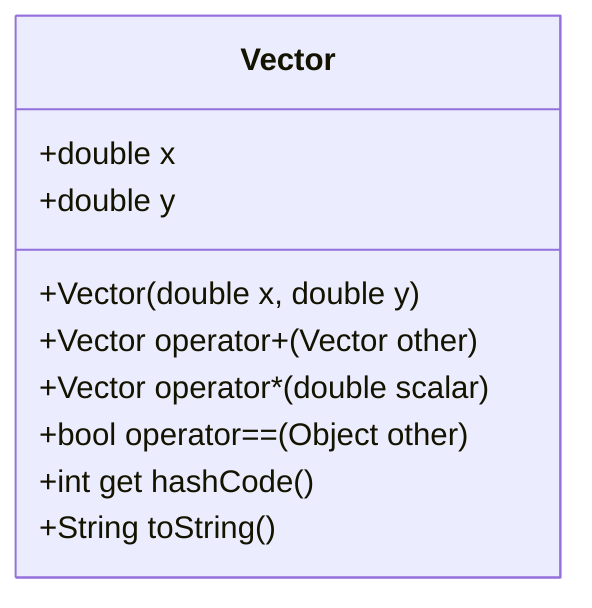

## 3.17 Operator Overloading

Operator overloading is a powerful feature in Dart that allows developers to define custom behaviors for operators. This capability can significantly enhance the functionality of mathematical classes and custom data structures, making them more intuitive and easier to use. In this section, we will explore the concept of operator overloading in Dart, provide detailed examples, and discuss best practices to ensure your code remains logical and intuitive.

### Understanding Operator Overloading

Operator overloading allows you to redefine the way operators work with your custom classes. This means you can specify how operators like `+`, `-`, `*`, and others behave when applied to instances of your classes. This feature is particularly useful when working with mathematical classes, such as vectors or matrices, where operations like addition and multiplication are common.

#### Key Concepts

- **Operators**: Symbols that represent computations like addition, subtraction, and multiplication.
- **Overloading**: Providing a new definition for an existing operator in the context of a custom class.
- **Intuitive Use**: Ensuring that the overloaded operators behave in a way that is expected and logical for users of the class.

### Defining Custom Operators

In Dart, you can overload operators by defining special methods in your class. These methods use the `operator` keyword followed by the operator you wish to overload. Let's explore how to define custom operators with a practical example.

#### Example: Overloading the `+` Operator

Consider a `Vector` class that represents a mathematical vector. We want to overload the `+` operator to allow adding two vectors together.

```dart
class Vector {
  final double x;
  final double y;

  Vector(this.x, this.y);

  // Overloading the + operator
  Vector operator +(Vector other) {
    return Vector(this.x + other.x, this.y + other.y);
  }

  @override
  String toString() => 'Vector($x, $y)';
}

void main() {
  Vector v1 = Vector(1.0, 2.0);
  Vector v2 = Vector(3.0, 4.0);
  Vector v3 = v1 + v2; // Using the overloaded + operator
  print(v3); // Output: Vector(4.0, 6.0)
}
```

In this example, the `+` operator is overloaded to add the corresponding components of two vectors. The `operator +` method takes another `Vector` as an argument and returns a new `Vector` with the summed components.

### Use Cases for Operator Overloading

Operator overloading is particularly useful in scenarios where you want to make your custom classes behave like built-in types. Here are some common use cases:

- **Mathematical Classes**: Classes representing mathematical entities like vectors, matrices, and complex numbers can benefit from operator overloading to perform arithmetic operations naturally.
- **Custom Data Structures**: Enhance data structures like sets, lists, or maps with intuitive operations.
- **Domain-Specific Languages (DSLs)**: Create more readable and expressive code by defining operators that align with the domain's semantics.

### Best Practices for Operator Overloading

While operator overloading can make your code more intuitive, it's important to follow best practices to avoid confusion and maintain code readability.

#### Keep It Intuitive

Ensure that the overloaded operators behave in a way that is expected by users. For example, the `+` operator should perform addition-like operations, and the `*` operator should perform multiplication-like operations.

#### Avoid Overloading for Unrelated Operations

Do not overload operators for operations that are unrelated to their typical use. This can lead to confusion and make your code harder to understand.

#### Document Your Overloaded Operators

Provide clear documentation for your overloaded operators, explaining what they do and how they should be used. This is especially important for operators that have non-standard behavior.

#### Use Overloading Sparingly

Overloading should be used judiciously. Overusing it can lead to code that is difficult to read and maintain. Only overload operators when it significantly improves the usability of your class.

### Advanced Operator Overloading

Dart allows overloading a variety of operators, including arithmetic, relational, and logical operators. Let's explore some advanced examples.

#### Overloading the `*` Operator

Continuing with our `Vector` class, let's overload the `*` operator to perform scalar multiplication.

```dart
class Vector {
  final double x;
  final double y;

  Vector(this.x, this.y);

  // Overloading the + operator
  Vector operator +(Vector other) {
    return Vector(this.x + other.x, this.y + other.y);
  }

  // Overloading the * operator for scalar multiplication
  Vector operator *(double scalar) {
    return Vector(this.x * scalar, this.y * scalar);
  }

  @override
  String toString() => 'Vector($x, $y)';
}

void main() {
  Vector v1 = Vector(1.0, 2.0);
  Vector v2 = v1 * 3.0; // Using the overloaded * operator
  print(v2); // Output: Vector(3.0, 6.0)
}
```

In this example, the `*` operator is overloaded to multiply a vector by a scalar value, scaling its components accordingly.

#### Overloading Relational Operators

You can also overload relational operators like `==` to compare instances of your class.

```dart
class Vector {
  final double x;
  final double y;

  Vector(this.x, this.y);

  // Overloading the == operator
  @override
  bool operator ==(Object other) {
    if (identical(this, other)) return true;
    if (other is! Vector) return false;
    return this.x == other.x && this.y == other.y;
  }

  @override
  int get hashCode => x.hashCode ^ y.hashCode;

  @override
  String toString() => 'Vector($x, $y)';
}

void main() {
  Vector v1 = Vector(1.0, 2.0);
  Vector v2 = Vector(1.0, 2.0);
  print(v1 == v2); // Output: true
}
```

Here, the `==` operator is overloaded to compare two vectors for equality by checking if their components are equal.

### Visualizing Operator Overloading

To better understand how operator overloading works, let's visualize the process using a class diagram.



This diagram represents the `Vector` class with its properties and overloaded operators, illustrating how the class is structured and how operator overloading is implemented.

### Try It Yourself

To deepen your understanding of operator overloading, try modifying the code examples provided. Here are some suggestions:

- **Add a `-` Operator**: Implement the subtraction operator to subtract one vector from another.
- **Overload the `/` Operator**: Implement division for scalar values.
- **Create a `ComplexNumber` Class**: Define a class for complex numbers and overload operators for addition, subtraction, multiplication, and division.

### References and Further Reading

For more information on operator overloading in Dart, consider exploring the following resources:

- [Dart Language Tour](https://dart.dev/guides/language/language-tour#operators)
- [Effective Dart: Usage](https://dart.dev/guides/language/effective-dart/usage)

### Knowledge Check

Before we conclude, let's reinforce what we've learned with a few questions:

1. What is operator overloading, and why is it useful?
2. How do you overload an operator in Dart?
3. What are some best practices to follow when overloading operators?
4. Why is it important to keep overloaded operators intuitive?
5. Can you overload the `==` operator in Dart? How?

### Embrace the Journey

Remember, mastering operator overloading is just one step in your journey to becoming a proficient Dart developer. As you continue to explore and experiment with Dart's features, you'll find new ways to make your code more expressive and efficient. Keep experimenting, stay curious, and enjoy the journey!

## Quiz Time!



### What is operator overloading in Dart?

- [x] A feature that allows defining custom behaviors for operators in custom classes.
- [ ] A method to override existing functions in Dart.
- [ ] A way to create new operators in Dart.
- [ ] A feature to enhance performance in Dart applications.

> **Explanation:** Operator overloading allows developers to define custom behaviors for operators when applied to instances of custom classes.

### Which keyword is used to overload an operator in Dart?

- [ ] override
- [x] operator
- [ ] custom
- [ ] redefine

> **Explanation:** The `operator` keyword is used in Dart to define custom behaviors for operators.

### What is a common use case for operator overloading?

- [x] Enhancing mathematical classes like vectors and matrices.
- [ ] Improving the performance of Dart applications.
- [ ] Simplifying the syntax of Dart language.
- [ ] Creating new data types in Dart.

> **Explanation:** Operator overloading is commonly used to enhance mathematical classes by allowing intuitive operations like addition and multiplication.

### Why should overloaded operators be intuitive?

- [x] To ensure they behave in a way that users expect.
- [ ] To improve the performance of the application.
- [ ] To make the code more complex.
- [ ] To reduce the number of lines of code.

> **Explanation:** Keeping overloaded operators intuitive ensures that they behave in a way that users expect, making the code easier to understand and use.

### What should you avoid when overloading operators?

- [x] Overloading operators for unrelated operations.
- [ ] Documenting the overloaded operators.
- [ ] Using the `operator` keyword.
- [ ] Implementing arithmetic operations.

> **Explanation:** Overloading operators for unrelated operations can lead to confusion and make the code harder to understand.

### Can you overload the `==` operator in Dart?

- [x] Yes
- [ ] No

> **Explanation:** The `==` operator can be overloaded in Dart to compare instances of custom classes for equality.

### What is the purpose of the `hashCode` method when overloading the `==` operator?

- [x] To provide a hash code for the object that is consistent with the equality operator.
- [ ] To improve the performance of the `==` operator.
- [ ] To create a unique identifier for the object.
- [ ] To override the default behavior of the `==` operator.

> **Explanation:** The `hashCode` method provides a hash code for the object that is consistent with the equality operator, ensuring that objects that are equal have the same hash code.

### What is a potential pitfall of overusing operator overloading?

- [x] It can lead to code that is difficult to read and maintain.
- [ ] It can improve the performance of the application.
- [ ] It can simplify the syntax of Dart language.
- [ ] It can create new data types in Dart.

> **Explanation:** Overusing operator overloading can lead to code that is difficult to read and maintain, as it can obscure the intended functionality of the code.

### What is the benefit of documenting overloaded operators?

- [x] It provides clear explanations of what the operators do and how they should be used.
- [ ] It improves the performance of the application.
- [ ] It reduces the number of lines of code.
- [ ] It simplifies the syntax of Dart language.

> **Explanation:** Documenting overloaded operators provides clear explanations of what the operators do and how they should be used, making the code easier to understand.

### True or False: Operator overloading can only be used for arithmetic operators in Dart.

- [ ] True
- [x] False

> **Explanation:** Operator overloading in Dart can be used for a variety of operators, including arithmetic, relational, and logical operators.


