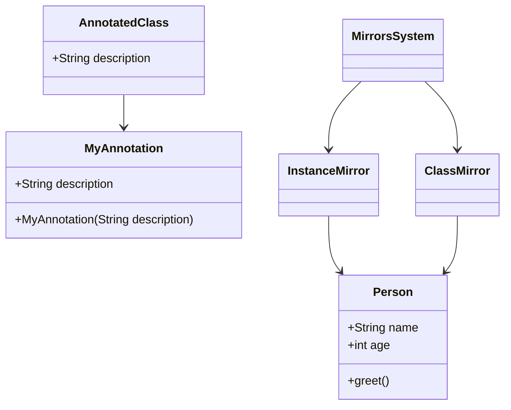

## 3.18 Meta-programming with Annotations and Reflection

Meta-programming is a powerful technique that allows developers to write code that can generate or manipulate other code. In Dart, meta-programming is primarily achieved through annotations and reflection. These features enable developers to add metadata to code elements and inspect or modify code at runtime, respectively. This section will delve into the concepts of annotations and reflection, their applications, and the considerations to keep in mind when using them in Flutter development.

### Understanding Annotations in Dart

Annotations in Dart are a form of metadata that you can attach to various code elements such as classes, methods, and fields. They provide additional information that can be used by tools and libraries to perform specific tasks. Annotations are defined using the `@` symbol followed by a class name.

#### Defining and Using Annotations

To define an annotation, you simply create a class and use it with the `@` symbol. Here's a basic example:

```dart
// Define an annotation
class MyAnnotation {
  final String description;
  const MyAnnotation(this.description);
}

// Use the annotation
@MyAnnotation('This is a sample annotation')
class AnnotatedClass {
  // Class implementation
}
```

In this example, `MyAnnotation` is a class that serves as an annotation. It takes a string parameter `description`, which provides metadata about the annotated element.

#### Common Use Cases for Annotations

Annotations are commonly used for:

- **Documentation**: Providing additional information about code elements.
- **Code Generation**: Tools like `json_serializable` use annotations to generate code.
- **Validation**: Libraries can use annotations to enforce constraints or rules.

### Reflection in Dart

Reflection is the ability of a program to inspect and modify its structure and behavior at runtime. In Dart, reflection is provided by the `dart:mirrors` library, which allows you to examine and manipulate objects, classes, and libraries dynamically.

#### Key Concepts of Reflection

Reflection in Dart involves several key concepts:

- **Mirrors**: These are objects that provide a reflective view of other objects. There are different types of mirrors, such as `ClassMirror`, `InstanceMirror`, and `LibraryMirror`.
- **Mirrors System**: The entry point for reflection, which provides access to all mirrors.

#### Using Reflection in Dart

Here's a simple example demonstrating how to use reflection to inspect a class:

```dart
import 'dart:mirrors';

class Person {
  String name;
  int age;

  Person(this.name, this.age);

  void greet() {
    print('Hello, my name is $name.');
  }
}

void main() {
  // Create an instance of Person
  var person = Person('Alice', 30);

  // Get the mirror of the instance
  InstanceMirror instanceMirror = reflect(person);

  // Get the mirror of the class
  ClassMirror classMirror = instanceMirror.type;

  // List all methods of the class
  classMirror.declarations.forEach((key, value) {
    if (value is MethodMirror) {
      print('Method: ${MirrorSystem.getName(key)}');
    }
  });

  // Invoke a method dynamically
  instanceMirror.invoke(#greet, []);
}
```

In this example, we use reflection to list all methods of the `Person` class and invoke the `greet` method dynamically.

### Limitations and Considerations

While annotations and reflection are powerful, they come with certain limitations and considerations:

- **Performance Overhead**: Reflection can introduce performance overhead due to its dynamic nature.
- **Code Obfuscation**: Reflection may not work well with code obfuscation, which is commonly used in Flutter apps for security.
- **Limited Support**: The `dart:mirrors` library is not supported in Flutter for web and may have limited support in other environments.

### Best Practices for Using Annotations and Reflection

To effectively use annotations and reflection in Dart, consider the following best practices:

- **Use Annotations for Metadata**: Leverage annotations to provide metadata for tools and libraries, but avoid overusing them.
- **Minimize Reflection Usage**: Use reflection sparingly, as it can impact performance and compatibility.
- **Consider Alternatives**: Explore alternatives like code generation, which can achieve similar results without the drawbacks of reflection.

### Try It Yourself

To get hands-on experience with annotations and reflection, try modifying the code examples provided. Experiment with creating your own annotations and using reflection to inspect different classes and objects. Consider the impact of these techniques on performance and compatibility in your Flutter applications.

### Visualizing Meta-programming Concepts

To better understand the relationship between annotations, reflection, and the code they interact with, let's visualize these concepts using a class diagram:



This diagram illustrates how annotations and reflection interact with classes and objects in Dart.

### Further Reading and Resources

For more information on annotations and reflection in Dart, consider exploring the following resources:

- [Dart Language Tour](https://dart.dev/guides/language/language-tour)
- [Dart Annotations](https://dart.dev/guides/language/language-tour#metadata)
- [Dart Reflection](https://dart.dev/guides/libraries/library-tour#dartmirrors)

### Knowledge Check

To reinforce your understanding of meta-programming with annotations and reflection, consider the following questions and challenges:

- What are the primary use cases for annotations in Dart?
- How does reflection differ from annotations in terms of functionality and performance?
- Experiment with creating a custom annotation and using it in a Dart class.
- Reflect on a Dart object and list all its methods and fields.

### Embrace the Journey

Remember, mastering meta-programming with annotations and reflection is just one step in your journey to becoming a proficient Dart and Flutter developer. Keep experimenting, stay curious, and enjoy the process of learning and growing your skills.

## Quiz Time!



### What is the primary purpose of annotations in Dart?

- [x] To add metadata to code elements
- [ ] To execute code at runtime
- [ ] To improve performance
- [ ] To handle exceptions

> **Explanation:** Annotations in Dart are used to add metadata to code elements, providing additional information for tools and libraries.

### Which library provides reflection capabilities in Dart?

- [ ] dart:core
- [x] dart:mirrors
- [ ] dart:async
- [ ] dart:convert

> **Explanation:** The `dart:mirrors` library provides reflection capabilities in Dart, allowing inspection and manipulation of code at runtime.

### What is a potential drawback of using reflection in Flutter apps?

- [ ] Improved performance
- [x] Performance overhead
- [ ] Increased security
- [ ] Simplified code

> **Explanation:** Reflection can introduce performance overhead due to its dynamic nature, which can impact the performance of Flutter apps.

### How are annotations defined in Dart?

- [ ] Using the `#` symbol
- [x] Using the `@` symbol followed by a class name
- [ ] Using the `&` symbol
- [ ] Using the `*` symbol

> **Explanation:** Annotations in Dart are defined using the `@` symbol followed by a class name, which provides metadata for code elements.

### What is a common use case for annotations in Dart?

- [x] Code generation
- [ ] Memory management
- [ ] Error handling
- [ ] Thread synchronization

> **Explanation:** Annotations are commonly used for code generation, where tools use metadata to generate additional code.

### Which of the following is a key concept of reflection in Dart?

- [ ] Annotations
- [x] Mirrors
- [ ] Generics
- [ ] Mixins

> **Explanation:** Mirrors are a key concept of reflection in Dart, providing a reflective view of objects, classes, and libraries.

### What should be considered when using reflection in Dart?

- [ ] It improves code readability
- [x] It may not work well with code obfuscation
- [ ] It reduces code size
- [ ] It simplifies error handling

> **Explanation:** Reflection may not work well with code obfuscation, which is often used in Flutter apps for security purposes.

### How can you minimize the impact of reflection on performance?

- [ ] Use reflection for all code elements
- [ ] Avoid using annotations
- [x] Use reflection sparingly
- [ ] Rely on runtime type checks

> **Explanation:** To minimize the impact of reflection on performance, it should be used sparingly and only when necessary.

### What is an alternative to using reflection for dynamic behavior in Dart?

- [ ] Annotations
- [ ] Mixins
- [x] Code generation
- [ ] Error handling

> **Explanation:** Code generation is an alternative to using reflection, providing dynamic behavior without the performance drawbacks.

### True or False: Annotations can be used to enforce constraints or rules in Dart.

- [x] True
- [ ] False

> **Explanation:** Annotations can be used by libraries to enforce constraints or rules, providing additional functionality based on metadata.




