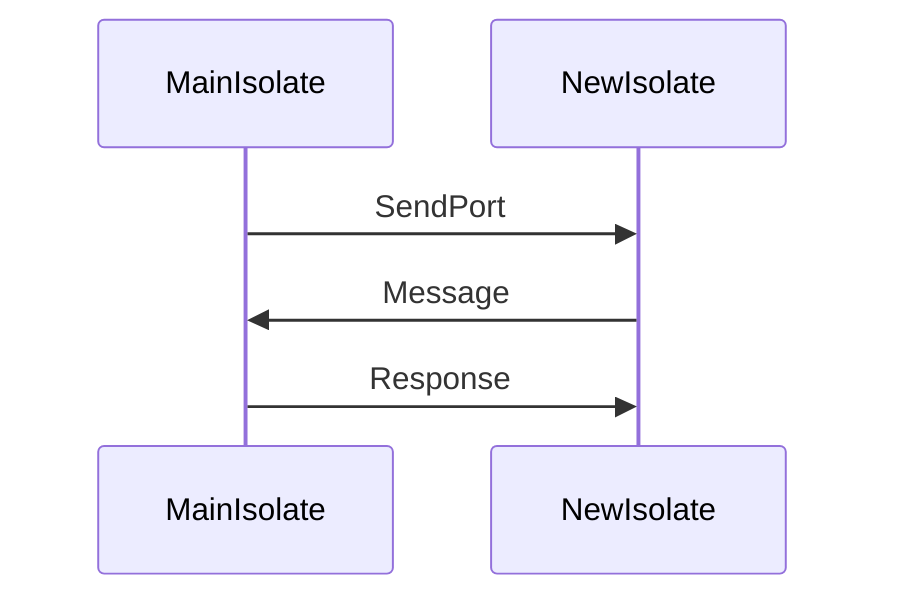

## 3.19 Concurrent Programming with Isolates

In the world of software development, concurrency is a crucial concept that allows applications to perform multiple tasks simultaneously, improving performance and responsiveness. Dart, the language behind Flutter, offers a unique approach to concurrency through the use of isolates. In this section, we will delve into the concept of isolates, how they differ from traditional threads, and how to effectively use them in your Dart and Flutter applications.

### Understanding Isolates

Isolates are Dart's way of achieving concurrency. Unlike traditional threads, which share memory, isolates are independent workers that do not share memory. Each isolate has its own memory heap and runs in its own event loop. This design choice eliminates the need for locks and makes concurrent programming safer and less error-prone.

#### Key Characteristics of Isolates

- **Isolation**: Each isolate has its own memory space, meaning there is no shared state between isolates. This eliminates race conditions and makes concurrent programming safer.
- **Message Passing**: Isolates communicate with each other by passing messages through ports. This is similar to how actors communicate in the actor model.
- **Event Loop**: Each isolate runs its own event loop, processing messages and events independently.

### Communication Between Isolates

Since isolates do not share memory, they communicate by sending messages. Dart provides a mechanism called ports for this purpose. Each isolate can have multiple ports, and messages are sent through these ports.

#### Creating and Using Ports

To communicate between isolates, you need to create ports. A `SendPort` is used to send messages, while a `ReceivePort` is used to receive messages.

```dart
import 'dart:isolate';

void main() async {
  // Create a ReceivePort to receive messages
  final receivePort = ReceivePort();

  // Spawn a new isolate
  final isolate = await Isolate.spawn(isolateEntry, receivePort.sendPort);

  // Listen for messages from the isolate
  receivePort.listen((message) {
    print('Received message: $message');
    receivePort.close();
    isolate.kill(priority: Isolate.immediate);
  });
}

// Entry point for the isolate
void isolateEntry(SendPort sendPort) {
  // Send a message back to the main isolate
  sendPort.send('Hello from the isolate!');
}
```

In this example, we create a `ReceivePort` in the main isolate and pass its `SendPort` to the new isolate. The new isolate sends a message back to the main isolate using the `SendPort`.

### Isolates vs. Threads

Isolates and threads both allow for concurrent execution, but they have fundamental differences:

- **Memory Sharing**: Threads share memory, which can lead to complex synchronization issues. Isolates do not share memory, which simplifies concurrency.
- **Communication**: Threads communicate through shared memory, while isolates communicate through message passing.
- **Safety**: Isolates are safer because they eliminate race conditions and the need for locks.

#### Use Cases for Isolates

- **CPU-bound Tasks**: Use isolates for tasks that require heavy computation, such as image processing or data analysis.
- **Background Processing**: Offload tasks that do not need to interact with the UI to isolates, keeping the main thread responsive.
- **Parallel Execution**: Run multiple tasks in parallel to improve performance.

### Creating and Managing Isolates

Creating an isolate is straightforward using the `Isolate.spawn` method. However, managing isolates involves handling their lifecycle and communication.

#### Spawning an Isolate

To spawn an isolate, use the `Isolate.spawn` method, which takes an entry point function and an initial message.

```dart
import 'dart:isolate';

void main() async {
  final receivePort = ReceivePort();
  await Isolate.spawn(isolateTask, receivePort.sendPort);

  receivePort.listen((message) {
    print('Message from isolate: $message');
    receivePort.close();
  });
}

void isolateTask(SendPort sendPort) {
  sendPort.send('Task completed');
}
```

#### Terminating an Isolate

To terminate an isolate, use the `Isolate.kill` method. You can specify a priority to control how quickly the isolate is terminated.

```dart
isolate.kill(priority: Isolate.immediate);
```

### Advanced Isolate Communication

For more complex communication patterns, you can use `SendPort` and `ReceivePort` to implement request-response patterns or broadcast messages to multiple listeners.

#### Request-Response Pattern

```dart
import 'dart:isolate';

void main() async {
  final receivePort = ReceivePort();
  final isolate = await Isolate.spawn(isolateTask, receivePort.sendPort);

  final responsePort = ReceivePort();
  receivePort.listen((message) {
    if (message is SendPort) {
      message.send('Request from main');
    } else {
      print('Response from isolate: $message');
      responsePort.close();
      isolate.kill(priority: Isolate.immediate);
    }
  });

  responsePort.listen((message) {
    print('Received response: $message');
  });
}

void isolateTask(SendPort sendPort) {
  final responsePort = ReceivePort();
  sendPort.send(responsePort.sendPort);

  responsePort.listen((message) {
    print('Received request: $message');
    sendPort.send('Response from isolate');
  });
}
```

### Visualizing Isolate Communication

To better understand how isolates communicate, let's visualize the process using a sequence diagram.



This diagram illustrates the message-passing mechanism between the main isolate and a new isolate.

### Design Considerations

When using isolates, consider the following:

- **Overhead**: Spawning an isolate has overhead, so use them judiciously.
- **Communication Latency**: Message passing introduces latency, which can affect performance.
- **Resource Management**: Ensure that isolates are properly terminated to free up resources.

### Differences and Similarities with Other Patterns

Isolates are often compared to threads and actors. While they share similarities with the actor model in terms of message passing, they differ from threads in memory management and safety.

### Try It Yourself

Experiment with the code examples provided. Try modifying the message-passing logic or creating multiple isolates to see how they interact. This hands-on approach will deepen your understanding of isolates.

### Knowledge Check

- **What are isolates in Dart, and how do they differ from threads?**
- **How do isolates communicate with each other?**
- **What are some use cases for isolates in Dart applications?**

### Embrace the Journey

Remember, mastering concurrency with isolates is a journey. As you experiment and build more complex applications, you'll gain a deeper understanding of Dart's concurrency model. Stay curious and keep exploring!

### References and Links

- [Dart Isolates Documentation](https://dart.dev/guides/libraries/concurrency)
- [Concurrency in Dart](https://dart.dev/tutorials/language/concurrency)
- [Flutter and Dart Concurrency](https://flutter.dev/docs/cookbook/networking/background-parsing)

## Quiz Time!



### What is a key characteristic of Dart isolates?

- [x] They do not share memory.
- [ ] They share memory like threads.
- [ ] They require locks for synchronization.
- [ ] They use shared state for communication.

> **Explanation:** Dart isolates do not share memory, which eliminates the need for locks and makes concurrent programming safer.

### How do isolates communicate in Dart?

- [x] Through message passing using ports.
- [ ] By sharing memory.
- [ ] Using global variables.
- [ ] Through direct function calls.

> **Explanation:** Isolates communicate by sending messages through ports, as they do not share memory.

### What method is used to spawn a new isolate in Dart?

- [x] Isolate.spawn
- [ ] Isolate.create
- [ ] Isolate.start
- [ ] Isolate.run

> **Explanation:** The `Isolate.spawn` method is used to create a new isolate in Dart.

### What is the purpose of a `ReceivePort` in Dart?

- [x] To receive messages from other isolates.
- [ ] To send messages to other isolates.
- [ ] To share memory between isolates.
- [ ] To terminate an isolate.

> **Explanation:** A `ReceivePort` is used to receive messages from other isolates.

### Which of the following is a use case for isolates?

- [x] CPU-bound tasks
- [ ] UI rendering
- [ ] Network requests
- [ ] Database queries

> **Explanation:** Isolates are ideal for CPU-bound tasks that require heavy computation.

### How do you terminate an isolate in Dart?

- [x] Using the `Isolate.kill` method.
- [ ] By closing the `ReceivePort`.
- [ ] By sending a termination message.
- [ ] By calling `Isolate.stop`.

> **Explanation:** The `Isolate.kill` method is used to terminate an isolate in Dart.

### What is a potential drawback of using isolates?

- [x] Communication latency
- [ ] Shared memory issues
- [ ] Race conditions
- [ ] Deadlocks

> **Explanation:** Message passing between isolates introduces communication latency.

### What is the role of a `SendPort` in Dart?

- [x] To send messages to other isolates.
- [ ] To receive messages from other isolates.
- [ ] To terminate an isolate.
- [ ] To share memory between isolates.

> **Explanation:** A `SendPort` is used to send messages to other isolates.

### What is the main advantage of using isolates over threads?

- [x] Safety due to no shared memory.
- [ ] Faster execution.
- [ ] Easier debugging.
- [ ] Lower resource usage.

> **Explanation:** Isolates are safer because they do not share memory, eliminating race conditions.

### True or False: Isolates in Dart can share memory.

- [x] False
- [ ] True

> **Explanation:** Isolates do not share memory; they communicate through message passing.


