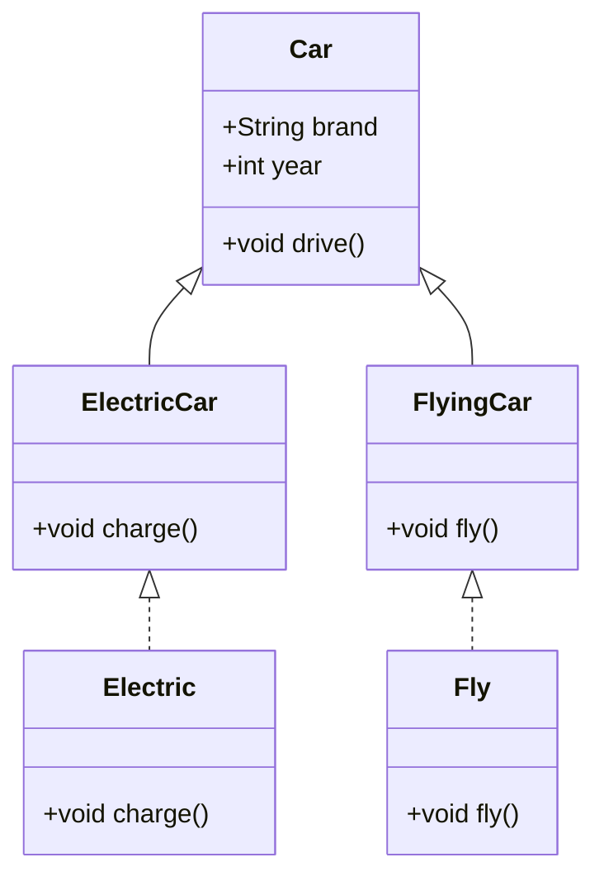

## 3.2 Classes, Mixins, and Extensions

In the world of Dart programming, understanding the concepts of classes, mixins, and extensions is crucial for building robust and scalable applications. These features allow developers to create reusable, maintainable, and efficient code, which is especially important in Flutter development. In this section, we will delve into these concepts, providing a comprehensive guide to mastering them.

### Classes and Objects: Defining and Instantiating Classes

#### Understanding Classes in Dart

Classes are the blueprint for creating objects in Dart. They encapsulate data for the object and define behaviors through methods. A class in Dart is defined using the `class` keyword followed by the class name.

```dart
class Car {
  String brand;
  int year;

  // Constructor
  Car(this.brand, this.year);

  // Method
  void displayInfo() {
    print('Car brand: $brand, Year: $year');
  }
}
```

In the example above, `Car` is a class with two properties: `brand` and `year`. It also includes a constructor and a method `displayInfo`.

#### Instantiating Objects

To create an instance of a class, use the `new` keyword or simply call the constructor. Dart allows you to omit the `new` keyword for brevity.

```dart
void main() {
  Car myCar = Car('Toyota', 2020);
  myCar.displayInfo(); // Output: Car brand: Toyota, Year: 2020
}
```

#### Constructors in Dart

Dart provides several ways to define constructors:

- **Default Constructor**: Automatically provided if no constructor is defined.
- **Named Constructors**: Allow multiple ways to create an instance.

```dart
class Car {
  String brand;
  int year;

  // Named constructor
  Car.withBrand(this.brand) : year = 2021;

  void displayInfo() {
    print('Car brand: $brand, Year: $year');
  }
}

void main() {
  Car myCar = Car.withBrand('Honda');
  myCar.displayInfo(); // Output: Car brand: Honda, Year: 2021
}
```

#### Factory Constructors

Factory constructors are used when a constructor does not always create a new instance of its class. They can return an existing instance or a subclass instance.

```dart
class Logger {
  static final Logger _instance = Logger._internal();

  factory Logger() {
    return _instance;
  }

  Logger._internal();

  void log(String message) {
    print('Log: $message');
  }
}

void main() {
  Logger logger1 = Logger();
  Logger logger2 = Logger();
  print(logger1 == logger2); // Output: true
}
```

### Mixins: Adding Functionality to Classes Without Inheritance

#### What are Mixins?

Mixins are a way of reusing a class's code in multiple class hierarchies. They allow you to add functionality to classes without using inheritance. In Dart, mixins are defined using the `mixin` keyword.

```dart
mixin Electric {
  void charge() {
    print('Charging...');
  }
}

class Car {
  void drive() {
    print('Driving...');
  }
}

class ElectricCar extends Car with Electric {}

void main() {
  ElectricCar myCar = ElectricCar();
  myCar.drive(); // Output: Driving...
  myCar.charge(); // Output: Charging...
}
```

#### Using Mixins

Mixins are applied using the `with` keyword. A class can use multiple mixins, and they are applied in the order they are listed.

```dart
mixin Fly {
  void fly() {
    print('Flying...');
  }
}

class FlyingCar extends Car with Electric, Fly {}

void main() {
  FlyingCar myCar = FlyingCar();
  myCar.drive(); // Output: Driving...
  myCar.charge(); // Output: Charging...
  myCar.fly(); // Output: Flying...
}
```

#### Constraints on Mixins

Mixins can have constraints, meaning they can only be applied to classes that extend or implement a specific class.

```dart
class Vehicle {}

mixin Electric on Vehicle {
  void charge() {
    print('Charging...');
  }
}

class ElectricCar extends Vehicle with Electric {}

void main() {
  ElectricCar myCar = ElectricCar();
  myCar.charge(); // Output: Charging...
}
```

### Extension Methods: Adding New Methods to Existing Classes

#### Understanding Extension Methods

Extension methods allow you to add new functionality to existing libraries. They enable you to add methods to any type, even if you don't have access to the source code.

```dart
extension NumberParsing on String {
  int toInt() {
    return int.parse(this);
  }
}

void main() {
  print('123'.toInt()); // Output: 123
}
```

#### Creating Extension Methods

To create an extension method, use the `extension` keyword followed by the extension name and `on` keyword with the type you want to extend.

```dart
extension StringExtension on String {
  String capitalize() {
    return this[0].toUpperCase() + substring(1);
  }
}

void main() {
  print('hello'.capitalize()); // Output: Hello
}
```

#### Limitations of Extension Methods

While extension methods are powerful, they have limitations:

- They cannot override existing methods.
- They cannot access private members of the class they extend.

### Visualizing Class Hierarchies and Extensions

To better understand how classes, mixins, and extensions interact, let's visualize these relationships using a class diagram.



In this diagram, `Car` is a base class, `ElectricCar` and `FlyingCar` are subclasses that use mixins `Electric` and `Fly` respectively.

### Try It Yourself

Experiment with the code examples provided. Try adding new methods to existing classes using extension methods, or create your own mixins to add functionality to multiple classes. Consider how these features can be used to simplify your code and reduce redundancy.

### References and Links

- [Dart Language Tour](https://dart.dev/guides/language/language-tour)
- [Mixins in Dart](https://dart.dev/guides/language/language-tour#adding-features-to-a-class-mixins)
- [Extension Methods](https://dart.dev/guides/language/extension-methods)

### Knowledge Check

1. What is the primary purpose of a class in Dart?
2. How do mixins differ from inheritance?
3. What are the limitations of extension methods?

### Embrace the Journey

Remember, mastering these concepts is just the beginning. As you continue to explore Dart and Flutter, you'll find new ways to apply these features to create more efficient and maintainable code. Keep experimenting, stay curious, and enjoy the journey!

## Quiz Time!



### What is the primary purpose of a class in Dart?

- [x] To serve as a blueprint for creating objects
- [ ] To define global variables
- [ ] To handle exceptions
- [ ] To manage memory

> **Explanation:** A class in Dart serves as a blueprint for creating objects, encapsulating data and behaviors.

### How do mixins differ from inheritance?

- [x] Mixins allow code reuse without forming a parent-child relationship
- [ ] Mixins are used for error handling
- [ ] Mixins are a type of constructor
- [ ] Mixins are used to define global variables

> **Explanation:** Mixins allow code reuse without forming a parent-child relationship, unlike inheritance which establishes such a relationship.

### What is a limitation of extension methods?

- [x] They cannot override existing methods
- [ ] They can access private members
- [ ] They can be used to create constructors
- [ ] They can define global variables

> **Explanation:** Extension methods cannot override existing methods and cannot access private members of the class they extend.

### Which keyword is used to define a mixin in Dart?

- [x] mixin
- [ ] class
- [ ] interface
- [ ] extends

> **Explanation:** The `mixin` keyword is used to define a mixin in Dart.

### Can extension methods access private members of a class?

- [x] No
- [ ] Yes
- [ ] Only if they are in the same file
- [ ] Only if they are in the same package

> **Explanation:** Extension methods cannot access private members of a class, regardless of their location.

### What is the purpose of a factory constructor?

- [x] To return an existing instance or a subclass instance
- [ ] To define a new class
- [ ] To handle exceptions
- [ ] To manage memory

> **Explanation:** A factory constructor is used to return an existing instance or a subclass instance, rather than always creating a new instance.

### How do you apply a mixin to a class?

- [x] Using the `with` keyword
- [ ] Using the `extends` keyword
- [ ] Using the `implements` keyword
- [ ] Using the `class` keyword

> **Explanation:** The `with` keyword is used to apply a mixin to a class in Dart.

### What is a named constructor?

- [x] A constructor with a specific name for creating instances
- [ ] A constructor that handles exceptions
- [ ] A constructor that manages memory
- [ ] A constructor that defines global variables

> **Explanation:** A named constructor is a constructor with a specific name that provides multiple ways to create an instance of a class.

### Can a class use multiple mixins?

- [x] Yes
- [ ] No
- [ ] Only if they are in the same file
- [ ] Only if they are in the same package

> **Explanation:** A class can use multiple mixins, and they are applied in the order they are listed.

### True or False: Extension methods can override existing methods in a class.

- [ ] True
- [x] False

> **Explanation:** Extension methods cannot override existing methods in a class.


