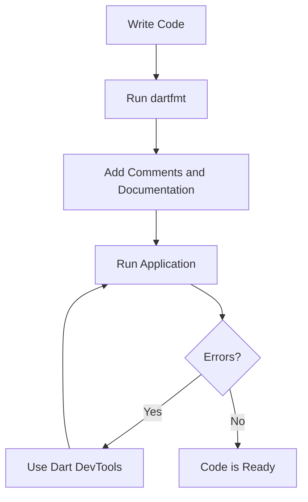

## 3.20 Best Practices in Dart Development

In the realm of software development, adhering to best practices is crucial for creating maintainable, efficient, and scalable applications. Dart, with its robust features and capabilities, offers a plethora of opportunities for developers to write clean and efficient code. In this section, we will delve into the best practices for Dart development, focusing on code style guidelines, effective comments and documentation, and debugging tools. These practices will not only enhance your coding skills but also ensure that your Dart applications are of the highest quality.

### Code Style Guidelines

Code style is not just about aesthetics; it plays a significant role in code readability and maintainability. Dart provides a set of guidelines and tools to help developers maintain a consistent code style across their projects.

#### Consistent Formatting with `dartfmt`

One of the most effective ways to ensure consistent code formatting is by using `dartfmt`, Dart's built-in code formatter. This tool automatically formats your Dart code according to the official style guide, saving you time and effort.

```dart
// Before dartfmt
void main() { print('Hello, World!'); }

// After dartfmt
void main() {
  print('Hello, World!');
}
```

**Key Benefits of Using `dartfmt`:**

- **Consistency**: Ensures that all code follows the same formatting rules, making it easier to read and understand.
- **Efficiency**: Saves time by automating the formatting process.
- **Collaboration**: Facilitates collaboration by reducing code style conflicts among team members.

#### Naming Conventions

Adhering to naming conventions is another critical aspect of maintaining a consistent code style. Dart follows specific conventions for naming variables, classes, and functions:

- **Variables and Functions**: Use `camelCase` (e.g., `myVariable`, `calculateSum`).
- **Classes**: Use `PascalCase` (e.g., `MyClass`, `UserProfile`).
- **Constants**: Use `ALL_CAPS_WITH_UNDERSCORES` (e.g., `MAX_COUNT`, `PI`).

#### Organizing Code

Organizing your code into logical sections and using consistent indentation and spacing can significantly improve readability. Here are some tips:

- **Use Blank Lines**: Separate logical sections of code with blank lines.
- **Indentation**: Use two spaces for indentation, as per Dart's style guide.
- **Line Length**: Keep lines under 80 characters to enhance readability.

### Effective Comments and Documentation

Comments and documentation are essential for understanding and maintaining code. They provide context and explanations that are not immediately apparent from the code itself.

#### Using Doc Comments (`///`) for API Docs

Dart supports doc comments, which are used to generate API documentation. These comments start with `///` and are placed above the declarations they describe.

```dart
/// Calculates the sum of two integers.
/// 
/// Returns the sum of [a] and [b].
int add(int a, int b) {
  return a + b;
}
```

**Best Practices for Writing Doc Comments:**

- **Be Concise**: Keep comments brief and to the point.
- **Use Markdown**: Dart doc comments support Markdown, allowing you to format text and include links.
- **Explain Parameters and Return Values**: Clearly describe what each parameter does and what the function returns.

#### Inline Comments

While doc comments are used for API documentation, inline comments are used to explain specific lines or blocks of code. Use them sparingly to clarify complex logic.

```dart
int factorial(int n) {
  // Base case: factorial of 0 is 1
  if (n == 0) return 1;
  
  // Recursive case
  return n * factorial(n - 1);
}
```

### Debugging Tools

Debugging is an integral part of the development process. Dart provides powerful tools to help you identify and fix issues in your code.

#### Leveraging Dart DevTools

Dart DevTools is a suite of debugging and performance tools for Dart and Flutter applications. It provides a wide range of features to help you debug and optimize your code.

**Key Features of Dart DevTools:**

- **Inspector**: Visualize and explore the widget tree in Flutter applications.
- **Logging**: View logs and debug output in real-time.
- **Performance**: Analyze performance and identify bottlenecks.
- **Memory**: Monitor memory usage and detect leaks.

#### Using the Dart Debugger

The Dart debugger is a powerful tool for stepping through your code and inspecting variables. It allows you to set breakpoints, step into functions, and evaluate expressions.

```dart
void main() {
  int result = add(2, 3);
  print(result); // Set a breakpoint here to inspect the value of 'result'
}

int add(int a, int b) {
  return a + b;
}
```

**Tips for Effective Debugging:**

- **Set Breakpoints**: Use breakpoints to pause execution and inspect the state of your application.
- **Step Through Code**: Use step-over, step-into, and step-out to navigate through your code.
- **Inspect Variables**: Check the values of variables at different points in your code to identify issues.

### Try It Yourself

To solidify your understanding of these best practices, try applying them to a small Dart project. Format your code with `dartfmt`, add doc comments to your functions, and use Dart DevTools to debug your application. Experiment with different debugging techniques and see how they help you identify and fix issues.

### Visualizing Code Style and Debugging Workflow

To better understand the workflow of maintaining code style and debugging, let's visualize the process using a flowchart.



**Diagram Explanation:**

- **Write Code**: Start by writing your Dart code.
- **Run `dartfmt`**: Format your code using `dartfmt` to ensure consistency.
- **Add Comments and Documentation**: Add doc comments and inline comments to explain your code.
- **Run Application**: Execute your application to test its functionality.
- **Errors?**: Check if there are any errors or issues.
- **Use Dart DevTools**: If there are errors, use Dart DevTools to debug and fix them.
- **Code is Ready**: Once all errors are resolved, your code is ready for deployment.

### References and Links

For further reading and resources on Dart best practices, consider exploring the following links:

- [Dart Style Guide](https://dart.dev/guides/language/effective-dart/style)
- [Dart Documentation Guide](https://dart.dev/guides/language/effective-dart/documentation)
- [Dart DevTools](https://flutter.dev/docs/development/tools/devtools/overview)

### Knowledge Check

To reinforce your understanding of Dart best practices, consider the following questions:

1. What is the primary purpose of using `dartfmt` in Dart development?
2. How can doc comments improve the maintainability of your code?
3. What are some key features of Dart DevTools that aid in debugging?
4. Why is it important to follow naming conventions in Dart?
5. How can inline comments enhance code readability?

### Embrace the Journey

Remember, mastering Dart best practices is a continuous journey. As you progress, you'll find new ways to improve your code and streamline your development process. Keep experimenting, stay curious, and enjoy the journey!

### Quiz Time!



### What is the primary purpose of using `dartfmt` in Dart development?

- [x] To ensure consistent code formatting
- [ ] To compile Dart code
- [ ] To debug Dart applications
- [ ] To generate API documentation

> **Explanation:** `dartfmt` is used to automatically format Dart code according to the official style guide, ensuring consistency across projects.

### How can doc comments improve the maintainability of your code?

- [x] By providing clear explanations of code functionality
- [ ] By increasing code execution speed
- [ ] By reducing code size
- [ ] By obfuscating code logic

> **Explanation:** Doc comments provide clear explanations of code functionality, making it easier for developers to understand and maintain the code.

### What are some key features of Dart DevTools that aid in debugging?

- [x] Inspector, Logging, Performance Analysis
- [ ] Code Compilation, Syntax Highlighting
- [ ] Code Obfuscation, Minification
- [ ] API Documentation, Code Formatting

> **Explanation:** Dart DevTools offers features like Inspector, Logging, and Performance Analysis to aid in debugging and optimizing Dart applications.

### Why is it important to follow naming conventions in Dart?

- [x] To enhance code readability and maintainability
- [ ] To increase code execution speed
- [ ] To reduce memory usage
- [ ] To obfuscate code logic

> **Explanation:** Following naming conventions enhances code readability and maintainability by providing a consistent structure for naming variables, functions, and classes.

### How can inline comments enhance code readability?

- [x] By explaining complex logic and providing context
- [ ] By reducing code execution time
- [ ] By increasing code size
- [ ] By obfuscating code logic

> **Explanation:** Inline comments explain complex logic and provide context, making it easier for developers to understand the code.

### What is the recommended line length for Dart code to enhance readability?

- [x] 80 characters
- [ ] 100 characters
- [ ] 120 characters
- [ ] 60 characters

> **Explanation:** Keeping lines under 80 characters is recommended to enhance readability and maintainability of Dart code.

### Which of the following is a key benefit of using `dartfmt`?

- [x] Automates code formatting
- [ ] Increases code execution speed
- [ ] Reduces code size
- [ ] Obfuscates code logic

> **Explanation:** `dartfmt` automates code formatting, ensuring consistency and saving time for developers.

### What is the purpose of using breakpoints in debugging?

- [x] To pause execution and inspect the state of the application
- [ ] To increase code execution speed
- [ ] To reduce memory usage
- [ ] To obfuscate code logic

> **Explanation:** Breakpoints are used to pause execution and inspect the state of the application, helping developers identify and fix issues.

### How can Dart DevTools help in optimizing performance?

- [x] By analyzing performance and identifying bottlenecks
- [ ] By increasing code execution speed
- [ ] By reducing code size
- [ ] By obfuscating code logic

> **Explanation:** Dart DevTools provides performance analysis tools to help developers identify bottlenecks and optimize their applications.

### True or False: Inline comments should be used extensively to explain every line of code.

- [ ] True
- [x] False

> **Explanation:** Inline comments should be used sparingly to explain complex logic or provide context, not to explain every line of code.


