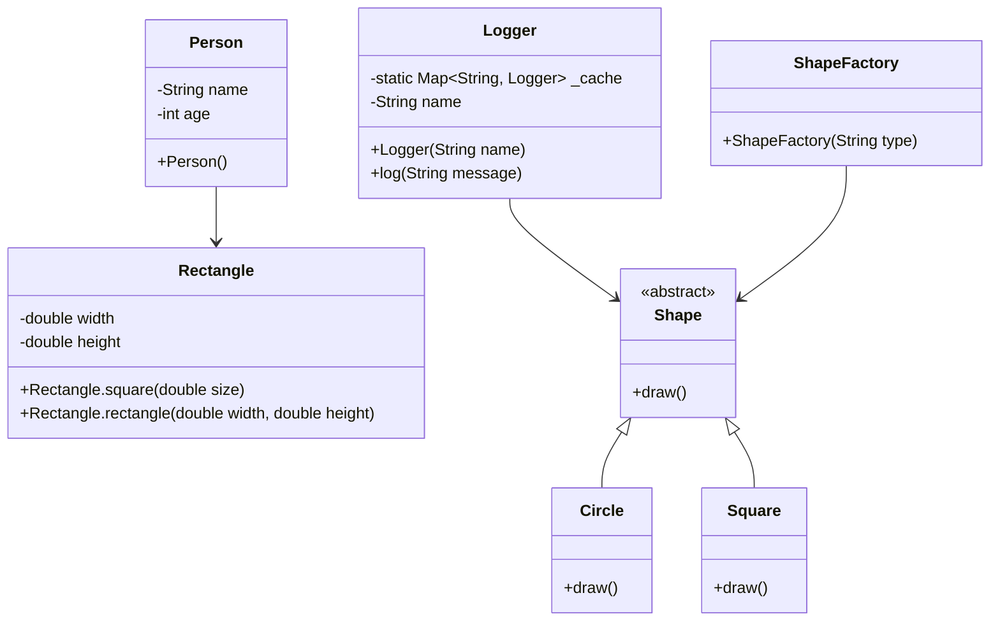

## 3.3 Constructors and Factory Constructors

In the realm of Dart programming, constructors play a pivotal role in object initialization, setting the stage for how objects are created and manipulated. Understanding the nuances of constructors, including the powerful factory constructors, is essential for any developer aiming to master Dart and Flutter development. This section delves into the various types of constructors available in Dart, their usage, and best practices to harness their full potential.

### Understanding Constructors in Dart

Constructors are special methods that are invoked when an object is created. They are responsible for initializing the object's properties and setting up any necessary state. In Dart, constructors can be categorized into several types, each serving a unique purpose.

#### Default Constructors

A default constructor is the simplest form of a constructor. It is automatically provided by Dart if no other constructors are defined. The default constructor initializes an object with default values.

```dart
class Person {
  String name;
  int age;

  // Default constructor
  Person() {
    name = 'Unknown';
    age = 0;
  }
}

void main() {
  var person = Person();
  print('Name: ${person.name}, Age: ${person.age}');
}
```

In this example, the `Person` class has a default constructor that initializes the `name` and `age` properties with default values.

#### Named Constructors

Named constructors provide a way to create multiple constructors for a class, each with a unique name. This is particularly useful when you need to initialize an object in different ways.

```dart
class Rectangle {
  double width;
  double height;

  // Named constructor
  Rectangle.square(double size) {
    width = size;
    height = size;
  }

  Rectangle.rectangle(this.width, this.height);
}

void main() {
  var square = Rectangle.square(5.0);
  var rectangle = Rectangle.rectangle(5.0, 10.0);
  print('Square: ${square.width} x ${square.height}');
  print('Rectangle: ${rectangle.width} x ${rectangle.height}');
}
```

Here, the `Rectangle` class has two named constructors: `square` and `rectangle`. Each constructor initializes the object differently based on the provided parameters.

### Factory Constructors

Factory constructors in Dart are a unique type of constructor that can return an instance of the class or a subtype. They are particularly useful when you need to control the instance creation process, such as implementing singleton patterns or caching instances.

#### Implementing Factory Constructors

A factory constructor is defined using the `factory` keyword. It can return an existing instance or create a new one based on certain conditions.

```dart
class Logger {
  static final Map<String, Logger> _cache = <String, Logger>{};

  final String name;

  // Factory constructor
  factory Logger(String name) {
    return _cache.putIfAbsent(name, () => Logger._internal(name));
  }

  Logger._internal(this.name);

  void log(String message) {
    print('$name: $message');
  }
}

void main() {
  var logger1 = Logger('UI');
  var logger2 = Logger('UI');
  print(logger1 == logger2); // true
}
```

In this example, the `Logger` class uses a factory constructor to ensure that only one instance of a logger with a specific name is created. The `_cache` map stores instances, and the `putIfAbsent` method checks if an instance already exists before creating a new one.

#### Usage Scenarios for Factory Constructors

Factory constructors are ideal in scenarios where:

- **Singleton Pattern**: When you need to ensure that only one instance of a class is created.
- **Caching**: When you want to return existing instances from a cache to save resources.
- **Subtypes**: When you need to return an instance of a subtype based on certain conditions.

### Default and Named Constructors: Different Ways to Initialize Objects

Dart provides flexibility in object initialization through default and named constructors. Understanding when and how to use these constructors is crucial for effective Dart programming.

#### Default Constructors

As previously discussed, default constructors are automatically provided if no other constructors are defined. They are suitable for simple object initialization where default values suffice.

#### Named Constructors

Named constructors offer more flexibility by allowing multiple ways to initialize an object. They are particularly useful when:

- **Multiple Initialization Paths**: You need different ways to initialize an object based on varying requirements.
- **Clarity**: Named constructors can make your code more readable by clearly indicating the purpose of each constructor.

### Factory Constructors: Returning Objects from a Cache or a Subtype

Factory constructors provide a powerful mechanism for controlling object creation. They can return objects from a cache or create instances of subtypes, offering flexibility and efficiency.

#### Returning Objects from a Cache

As demonstrated in the `Logger` example, factory constructors can return objects from a cache, ensuring that resources are used efficiently by reusing existing instances.

#### Returning Subtypes

Factory constructors can also return instances of subtypes, allowing for polymorphic behavior.

```dart
abstract class Shape {
  void draw();
}

class Circle implements Shape {
  void draw() {
    print('Drawing a circle');
  }
}

class Square implements Shape {
  void draw() {
    print('Drawing a square');
  }
}

class ShapeFactory {
  // Factory constructor
  factory ShapeFactory(String type) {
    if (type == 'circle') {
      return Circle();
    } else if (type == 'square') {
      return Square();
    } else {
      throw 'Unknown shape type';
    }
  }
}

void main() {
  Shape circle = ShapeFactory('circle');
  Shape square = ShapeFactory('square');
  circle.draw();
  square.draw();
}
```

In this example, the `ShapeFactory` class uses a factory constructor to return instances of different shapes based on the provided type. This demonstrates how factory constructors can facilitate polymorphic behavior by returning subtypes.

### Usage Scenarios: When to Use Factory Constructors Over Regular Ones

Choosing between factory constructors and regular constructors depends on the specific requirements of your application. Here are some scenarios where factory constructors are preferable:

- **Singleton Implementation**: When you need to ensure that only one instance of a class is created and reused.
- **Resource Management**: When you want to manage resources efficiently by reusing existing instances from a cache.
- **Polymorphic Behavior**: When you need to return instances of subtypes based on certain conditions.
- **Complex Initialization Logic**: When the initialization logic is complex and requires conditional instance creation.

### Visualizing Constructors and Factory Constructors

To better understand the flow and relationships between constructors and factory constructors, let's visualize these concepts using a class diagram.



**Diagram Description**: This class diagram illustrates the relationships between different classes and constructors. The `Person` class uses a default constructor, while the `Rectangle` class demonstrates named constructors. The `Logger` class showcases a factory constructor for caching, and the `ShapeFactory` class uses a factory constructor to return subtypes.

### Key Takeaways

- **Constructors** are essential for initializing objects in Dart, with default and named constructors offering flexibility in object creation.
- **Factory Constructors** provide control over the instance creation process, allowing for caching, singleton implementation, and returning subtypes.
- **Usage Scenarios** for factory constructors include singleton patterns, resource management, polymorphic behavior, and complex initialization logic.
- **Visualizing** constructors and factory constructors through diagrams can enhance understanding of their relationships and flow.

### Try It Yourself

To deepen your understanding of constructors and factory constructors, try modifying the code examples provided. Experiment with creating your own classes and constructors, and explore different scenarios where factory constructors can be beneficial.

### References and Further Reading

- [Dart Language Tour - Constructors](https://dart.dev/guides/language/language-tour#constructors)
- [Effective Dart: Design](https://dart.dev/guides/language/effective-dart/design)
- [Flutter Documentation](https://flutter.dev/docs)

### Embrace the Journey

Remember, mastering constructors and factory constructors is just one step in your Dart and Flutter development journey. As you continue to explore and experiment, you'll gain deeper insights into the language's capabilities. Stay curious, keep learning, and enjoy the process!

## Quiz Time!



### What is the primary purpose of a constructor in Dart?

- [x] To initialize an object's properties and set up its state.
- [ ] To destroy an object and free its resources.
- [ ] To create a new class in Dart.
- [ ] To handle exceptions in Dart.

> **Explanation:** Constructors are special methods used to initialize an object's properties and set up its state when the object is created.

### Which keyword is used to define a factory constructor in Dart?

- [ ] class
- [x] factory
- [ ] constructor
- [ ] new

> **Explanation:** The `factory` keyword is used to define a factory constructor in Dart, allowing for controlled instance creation.

### What is a key advantage of using factory constructors?

- [x] They can return existing instances from a cache.
- [ ] They automatically generate unique IDs for objects.
- [ ] They simplify the syntax of class definitions.
- [ ] They eliminate the need for parameters in constructors.

> **Explanation:** Factory constructors can return existing instances from a cache, which is useful for resource management and implementing singleton patterns.

### In which scenario would a factory constructor be preferable over a regular constructor?

- [x] When implementing a singleton pattern.
- [ ] When initializing an object with default values.
- [ ] When creating an object with no parameters.
- [ ] When defining multiple constructors for a class.

> **Explanation:** Factory constructors are preferable when implementing a singleton pattern, as they allow for controlled instance creation and reuse.

### What is a named constructor in Dart?

- [x] A constructor with a unique name that allows multiple ways to initialize an object.
- [ ] A constructor that initializes an object with default values.
- [ ] A constructor that automatically generates a unique name for an object.
- [ ] A constructor that is used only for abstract classes.

> **Explanation:** Named constructors have unique names and allow for multiple ways to initialize an object, providing flexibility in object creation.

### How can factory constructors facilitate polymorphic behavior?

- [x] By returning instances of subtypes based on certain conditions.
- [ ] By automatically converting objects to different types.
- [ ] By eliminating the need for type checks in Dart.
- [ ] By enforcing strict type constraints on objects.

> **Explanation:** Factory constructors can facilitate polymorphic behavior by returning instances of subtypes based on certain conditions, allowing for dynamic type handling.

### What is the default behavior of a constructor if none is defined in a Dart class?

- [x] Dart provides a default constructor that initializes an object with default values.
- [ ] The class cannot be instantiated without a defined constructor.
- [ ] Dart automatically generates a factory constructor.
- [ ] The class is considered abstract and cannot be used directly.

> **Explanation:** If no constructor is defined, Dart provides a default constructor that initializes an object with default values.

### Which of the following is a valid use case for a factory constructor?

- [x] Caching instances for resource management.
- [ ] Automatically generating random numbers.
- [ ] Simplifying syntax for class definitions.
- [ ] Handling exceptions in Dart.

> **Explanation:** Factory constructors are useful for caching instances, which helps in managing resources efficiently.

### What is the role of the `putIfAbsent` method in the Logger example?

- [x] It checks if an instance already exists in the cache before creating a new one.
- [ ] It automatically deletes old instances from the cache.
- [ ] It generates a unique ID for each instance.
- [ ] It handles exceptions during instance creation.

> **Explanation:** The `putIfAbsent` method checks if an instance already exists in the cache and only creates a new one if it doesn't, ensuring efficient resource use.

### True or False: Factory constructors can only return instances of the class they are defined in.

- [ ] True
- [x] False

> **Explanation:** Factory constructors can return instances of the class they are defined in or instances of subtypes, allowing for flexible instance creation.




