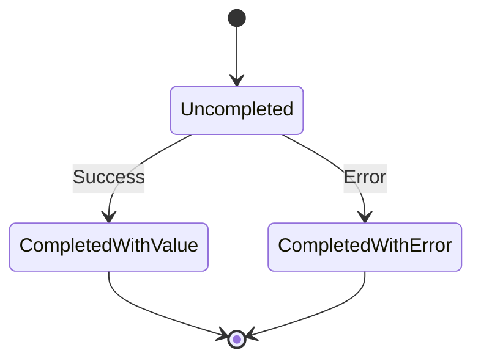
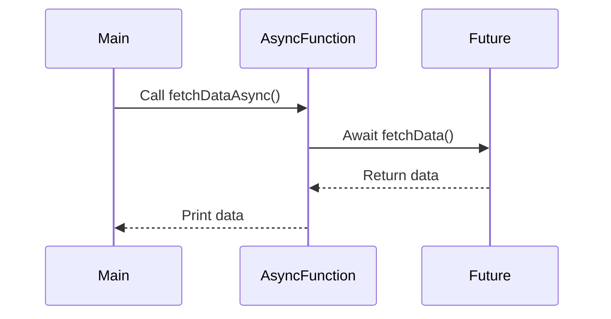

## 3.5 Asynchronous Programming with Futures and async/await

Asynchronous programming is a cornerstone of modern software development, enabling applications to perform tasks concurrently without blocking the main execution thread. In Dart, asynchronous programming is primarily facilitated through **Futures** and the **async/await** syntax. This section will guide you through understanding these concepts, their implementation, and best practices for error handling in asynchronous code.

### Understanding Futures in Dart

**Futures** in Dart represent a potential value or error that will be available at some point in the future. They are akin to promises in JavaScript and are essential for handling asynchronous operations such as network requests, file I/O, and timers.

#### Key Concepts of Futures

- **Single Value or Error**: A Future can complete with a value or an error, but not both.
- **Unidirectional**: Once a Future is completed, it cannot be changed.
- **Chaining**: Futures can be chained using `then`, `catchError`, and `whenComplete` methods to handle results or errors.

#### Creating and Using Futures

To create a Future, you can use the `Future` constructor or the `Future.value` and `Future.error` methods for immediate completion. Here's a simple example:

```dart
Future<String> fetchData() {
  return Future.delayed(Duration(seconds: 2), () => 'Data loaded');
}

void main() {
  fetchData().then((data) {
    print(data);
  }).catchError((error) {
    print('Error: $error');
  });
}
```

In this example, `fetchData` simulates a network request that completes after a delay, returning a string. The `then` method is used to handle the successful completion, while `catchError` manages any errors.

#### Visualizing Future States

Futures can be in one of three states: uncompleted, completed with a value, or completed with an error. The following diagram illustrates these states:



### Async and Await: Simplifying Asynchronous Code

The **async/await** syntax in Dart allows you to write asynchronous code that reads like synchronous code, making it easier to understand and maintain.

#### Using Async and Await

To use `await`, you must mark the function as `async`. This allows you to pause the execution of the function until the awaited Future completes. Here's how you can rewrite the previous example using async/await:

```dart
Future<void> fetchDataAsync() async {
  try {
    String data = await fetchData();
    print(data);
  } catch (error) {
    print('Error: $error');
  }
}

void main() {
  fetchDataAsync();
}
```

In this version, `fetchDataAsync` is an asynchronous function that waits for `fetchData` to complete before printing the result. The `try-catch` block is used for error handling.

#### Benefits of Async/Await

- **Readability**: Code is more readable and resembles synchronous code.
- **Error Handling**: Use of `try-catch` for handling exceptions is straightforward.
- **Sequential Execution**: Allows for sequential execution of asynchronous operations.

### Error Handling in Asynchronous Code

Handling errors in asynchronous code is crucial for building robust applications. Dart provides several mechanisms to manage exceptions in Futures and async/await.

#### Catching Errors in Futures

Use the `catchError` method to handle errors in Futures. You can also specify a test function to catch specific types of errors:

```dart
Future<void> fetchDataWithError() {
  return Future.error('Network error');
}

void main() {
  fetchDataWithError().catchError((error) {
    print('Caught error: $error');
  }, test: (e) => e is String);
}
```

#### Error Handling with Async/Await

With async/await, use `try-catch` blocks to handle exceptions. This approach is similar to synchronous error handling:

```dart
Future<void> fetchDataAsyncWithError() async {
  try {
    String data = await fetchDataWithError();
    print(data);
  } catch (error) {
    print('Caught error: $error');
  }
}

void main() {
  fetchDataAsyncWithError();
}
```

### Advanced Concepts and Best Practices

#### Chaining Futures

Chaining allows you to perform multiple asynchronous operations in sequence. Use `then` to chain Futures and `whenComplete` to execute code after completion, regardless of success or failure:

```dart
Future<void> processData() {
  return fetchData()
      .then((data) => print('Processing $data'))
      .whenComplete(() => print('Operation complete'));
}

void main() {
  processData();
}
```

#### Handling Multiple Futures

Dart provides `Future.wait` to handle multiple Futures concurrently. This method waits for all Futures to complete and returns a list of results:

```dart
Future<void> fetchMultipleData() async {
  List<Future<String>> futures = [fetchData(), fetchData()];
  List<String> results = await Future.wait(futures);
  results.forEach(print);
}

void main() {
  fetchMultipleData();
}
```

#### Cancellation of Futures

While Dart does not natively support Future cancellation, you can implement cancellation logic using `Completer`:

```dart
class CancellableOperation {
  final Completer<void> _completer = Completer<void>();

  Future<void> get future => _completer.future;

  void cancel() {
    if (!_completer.isCompleted) {
      _completer.completeError('Operation cancelled');
    }
  }
}

void main() {
  CancellableOperation operation = CancellableOperation();

  operation.future.catchError((error) {
    print(error);
  });

  operation.cancel();
}
```

### Visualizing Asynchronous Flow

To better understand the flow of asynchronous operations, consider the following sequence diagram illustrating async/await:



### Try It Yourself

Experiment with the code examples provided. Try modifying the delay in `fetchData`, introduce intentional errors, or chain additional asynchronous operations to see how the flow changes.

### Knowledge Check

- What are the three states of a Future?
- How does async/await improve code readability?
- What is the purpose of `Future.wait`?

### Conclusion

Asynchronous programming in Dart using Futures and async/await is a powerful paradigm that enhances the responsiveness and performance of applications. By mastering these concepts, you can build efficient, scalable, and maintainable Dart and Flutter applications. Remember, this is just the beginning. Keep experimenting, stay curious, and enjoy the journey!

## Quiz Time!



### What is a Future in Dart?

- [x] A representation of a potential value or error that will be available in the future.
- [ ] A synchronous operation that completes immediately.
- [ ] A data structure for storing multiple values.
- [ ] A type of Dart function.

> **Explanation:** A Future in Dart represents a potential value or error that will be available at some point in the future, allowing for asynchronous operations.

### How do you handle errors in a Future?

- [x] Using the `catchError` method.
- [ ] Using a `try-catch` block.
- [ ] By ignoring them.
- [ ] Using the `finally` keyword.

> **Explanation:** Errors in a Future can be handled using the `catchError` method, which allows you to specify a function to handle the error.

### What keyword is used to pause execution until a Future completes?

- [x] `await`
- [ ] `async`
- [ ] `pause`
- [ ] `stop`

> **Explanation:** The `await` keyword is used to pause the execution of an async function until the Future completes.

### What must you do to a function to use `await`?

- [x] Mark it with the `async` keyword.
- [ ] Mark it with the `await` keyword.
- [ ] Use a `try-catch` block.
- [ ] Declare it as a Future.

> **Explanation:** To use `await`, the function must be marked with the `async` keyword, indicating it is asynchronous.

### Which method allows handling multiple Futures concurrently?

- [x] `Future.wait`
- [ ] `Future.all`
- [ ] `Future.join`
- [ ] `Future.merge`

> **Explanation:** `Future.wait` is used to handle multiple Futures concurrently, waiting for all to complete before proceeding.

### What is the benefit of using async/await over traditional Future chaining?

- [x] Improved readability and maintainability.
- [ ] Faster execution.
- [ ] Reduced memory usage.
- [ ] Increased complexity.

> **Explanation:** Async/await improves readability and maintainability by allowing asynchronous code to be written in a style similar to synchronous code.

### How can you cancel a Future in Dart?

- [x] Implement custom cancellation logic using a `Completer`.
- [ ] Use the `cancel` method on the Future.
- [ ] Use the `stop` keyword.
- [ ] Futures cannot be cancelled.

> **Explanation:** Dart does not natively support Future cancellation, but you can implement custom cancellation logic using a `Completer`.

### What is the purpose of the `whenComplete` method?

- [x] To execute code after a Future completes, regardless of success or failure.
- [ ] To handle errors in a Future.
- [ ] To pause a Future.
- [ ] To cancel a Future.

> **Explanation:** The `whenComplete` method executes code after a Future completes, regardless of whether it was successful or resulted in an error.

### What is the primary advantage of using Futures in Dart?

- [x] They allow for non-blocking asynchronous operations.
- [ ] They simplify synchronous code.
- [ ] They increase code complexity.
- [ ] They are faster than synchronous operations.

> **Explanation:** Futures allow for non-blocking asynchronous operations, enabling applications to perform tasks concurrently without blocking the main execution thread.

### True or False: Async/await can only be used with Futures.

- [x] True
- [ ] False

> **Explanation:** Async/await is specifically designed to work with Futures in Dart, allowing for asynchronous operations to be written in a synchronous style.


