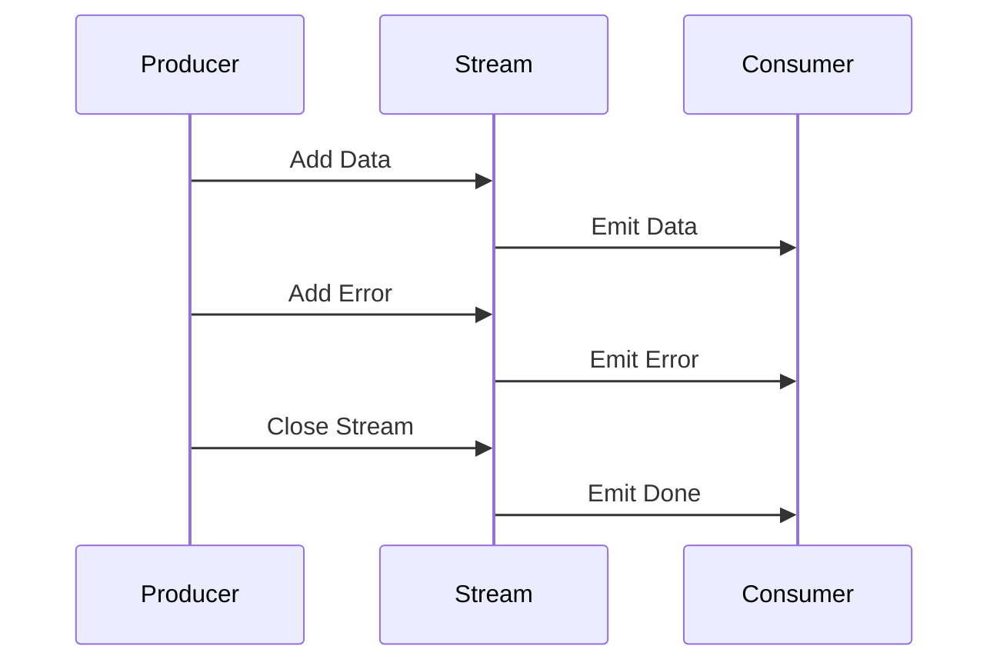

## 3.6 Streams and Reactive Programming

In the world of modern application development, handling asynchronous data efficiently is crucial. Dart, with its robust support for streams and reactive programming, provides developers with powerful tools to manage data flow in applications. In this section, we will delve into the concepts of streams and reactive programming in Dart, exploring how they can be leveraged to build responsive and efficient applications.

### Understanding Streams

Streams in Dart are a fundamental concept for dealing with sequences of asynchronous data. They allow you to work with data that arrives over time, such as user input, network responses, or file I/O. Streams can be thought of as a series of events that you can listen to and react to as they occur.

#### What are Streams?

A stream is a sequence of asynchronous events. These events can be data events, error events, or a done event indicating that no more events will be emitted. Streams are particularly useful when you need to handle data that is not available all at once but arrives over time.

There are two types of streams in Dart:

1. **Single Subscription Streams**: These streams can only be listened to once. They are suitable for events that are expected to happen only once, such as HTTP requests.

2. **Broadcast Streams**: These streams can be listened to multiple times. They are ideal for events that can happen multiple times, such as mouse clicks or WebSocket messages.

#### Creating Streams

Streams can be created in several ways in Dart. One common method is using a `StreamController`, which allows you to create a custom stream and control when events are added to it.

```dart
import 'dart:async';

void main() {
  // Create a StreamController
  final controller = StreamController<int>();

  // Add data to the stream
  controller.sink.add(1);
  controller.sink.add(2);
  controller.sink.add(3);

  // Close the stream
  controller.close();

  // Listen to the stream
  controller.stream.listen((data) {
    print('Received: $data');
  });
}
```

In this example, we create a `StreamController` of type `int`, add some data to the stream, and then listen to the stream to print the received data.

### Stream Controllers

Stream controllers are the backbone of creating custom streams in Dart. They provide a way to control the flow of data into a stream and manage the lifecycle of the stream.

#### Creating a Stream Controller

A `StreamController` can be created using its constructor. You can specify whether the stream should be a single subscription or a broadcast stream by setting the `sync` parameter.

```dart
final controller = StreamController<int>(sync: true);
```

#### Adding Data to a Stream

Data can be added to a stream using the `sink.add()` method. This method allows you to push data events into the stream.

```dart
controller.sink.add(42);
```

#### Closing a Stream

Once you are done adding data to a stream, you should close the stream using the `close()` method. This signals to listeners that no more data will be added.

```dart
controller.close();
```

### Listening and Subscribing

Listening to a stream is how you react to the data events it emits. Dart provides several ways to listen to streams, allowing you to handle data, errors, and completion events effectively.

#### Listening to a Stream

To listen to a stream, you use the `listen()` method. This method takes a callback function that is called whenever a new data event is emitted.

```dart
controller.stream.listen((data) {
  print('Data received: $data');
});
```

#### Handling Errors

Streams can also emit error events. You can handle these errors by providing an `onError` callback to the `listen()` method.

```dart
controller.stream.listen(
  (data) {
    print('Data received: $data');
  },
  onError: (error) {
    print('Error: $error');
  },
);
```

#### Handling Completion

When a stream is closed, it emits a done event. You can handle this event by providing an `onDone` callback to the `listen()` method.

```dart
controller.stream.listen(
  (data) {
    print('Data received: $data');
  },
  onDone: () {
    print('Stream closed');
  },
);
```

### Reactive Programming

Reactive programming is a programming paradigm that focuses on asynchronous data streams and the propagation of change. It allows you to build systems that react to changes in data over time, making it ideal for applications that require real-time updates.

#### Reactive Programming in Dart

Dart's support for streams makes it a natural fit for reactive programming. By using streams, you can create reactive systems that respond to changes in data and propagate those changes throughout your application.

#### Key Concepts of Reactive Programming

1. **Observables**: In reactive programming, data sources are often referred to as observables. These are entities that emit data over time, similar to streams in Dart.

2. **Observers**: Observers are entities that subscribe to observables and react to the data they emit.

3. **Operators**: Operators are functions that allow you to transform, filter, and combine observables.

### Implementing Reactive Programming in Dart

To implement reactive programming in Dart, you can use the `rxdart` package, which provides a rich set of operators for working with streams.

#### Using RxDart

RxDart extends Dart's native Stream API to provide additional capabilities for reactive programming. It includes operators for transforming, filtering, and combining streams.

```dart
import 'package:rxdart/rxdart.dart';

void main() {
  // Create a BehaviorSubject
  final subject = BehaviorSubject<int>();

  // Add data to the subject
  subject.add(1);
  subject.add(2);
  subject.add(3);

  // Listen to the subject
  subject.listen((data) {
    print('Received: $data');
  });

  // Close the subject
  subject.close();
}
```

In this example, we use a `BehaviorSubject` from the `rxdart` package to create a reactive stream. A `BehaviorSubject` is a type of stream that remembers the last value it emitted and replays it to new subscribers.

### Visualizing Streams and Reactive Programming

To better understand how streams and reactive programming work, let's visualize the flow of data using a sequence diagram.



This diagram illustrates the interaction between a producer, a stream, and a consumer. The producer adds data and errors to the stream, which then emits these events to the consumer. When the stream is closed, it emits a done event.

### Best Practices for Using Streams

When working with streams in Dart, there are several best practices to keep in mind to ensure your code is efficient and maintainable.

1. **Close Streams**: Always close streams when they are no longer needed to free up resources and avoid memory leaks.

2. **Handle Errors**: Implement error handling for streams to ensure your application can gracefully handle unexpected issues.

3. **Use Broadcast Streams for Multiple Listeners**: If you need to listen to a stream multiple times, use a broadcast stream to avoid errors.

4. **Leverage RxDart for Complex Operations**: Use the `rxdart` package for complex stream operations, such as combining and transforming streams.

### Try It Yourself

Now that we've covered the basics of streams and reactive programming in Dart, it's time to experiment with the concepts. Try modifying the code examples provided to create your own custom streams and reactive systems. For instance, you can:

- Create a stream that emits random numbers and filters out even numbers.
- Implement a reactive system that combines two streams and emits the sum of their values.
- Experiment with different operators from the `rxdart` package to transform and combine streams.

### Knowledge Check

Before we wrap up, let's reinforce what we've learned with a few questions:

1. What are the two types of streams in Dart?
2. How do you add data to a stream?
3. What is the purpose of a `StreamController`?
4. How can you handle errors in a stream?
5. What is reactive programming, and how does it relate to streams?

### Conclusion

Streams and reactive programming are powerful tools in Dart that allow you to handle asynchronous data efficiently. By understanding how to create and work with streams, you can build responsive applications that react to changes in data over time. Remember, this is just the beginning. As you progress, you'll discover more advanced techniques and patterns that will further enhance your Dart and Flutter development skills. Keep experimenting, stay curious, and enjoy the journey!

## Quiz Time!



### What are the two types of streams in Dart?

- [x] Single Subscription Streams and Broadcast Streams
- [ ] Data Streams and Error Streams
- [ ] Synchronous Streams and Asynchronous Streams
- [ ] Observable Streams and Observer Streams

> **Explanation:** Dart has two types of streams: Single Subscription Streams, which can be listened to once, and Broadcast Streams, which can be listened to multiple times.

### How do you add data to a stream in Dart?

- [x] Using the `sink.add()` method
- [ ] Using the `stream.add()` method
- [ ] Using the `controller.add()` method
- [ ] Using the `streamController.add()` method

> **Explanation:** Data is added to a stream in Dart using the `sink.add()` method of a `StreamController`.

### What is the purpose of a `StreamController` in Dart?

- [x] To create and manage custom streams
- [ ] To listen to stream events
- [ ] To transform stream data
- [ ] To handle stream errors

> **Explanation:** A `StreamController` is used to create and manage custom streams, allowing you to control the flow of data into the stream.

### How can you handle errors in a Dart stream?

- [x] By providing an `onError` callback to the `listen()` method
- [ ] By using a `try-catch` block
- [ ] By using the `catchError()` method
- [ ] By using the `handleError()` method

> **Explanation:** Errors in a Dart stream can be handled by providing an `onError` callback to the `listen()` method.

### What is reactive programming?

- [x] A paradigm focused on asynchronous data streams and change propagation
- [ ] A programming language for building reactive systems
- [ ] A design pattern for handling user input
- [ ] A method for optimizing network requests

> **Explanation:** Reactive programming is a paradigm that focuses on asynchronous data streams and the propagation of change, allowing systems to react to data changes over time.

### Which package extends Dart's native Stream API for reactive programming?

- [x] RxDart
- [ ] StreamBuilder
- [ ] FlutterReactive
- [ ] DartReactive

> **Explanation:** The `RxDart` package extends Dart's native Stream API to provide additional capabilities for reactive programming.

### What is a `BehaviorSubject` in RxDart?

- [x] A type of stream that remembers the last value emitted
- [ ] A stream that can only be listened to once
- [ ] A stream that emits only error events
- [ ] A stream that automatically closes after emitting data

> **Explanation:** A `BehaviorSubject` is a type of stream in RxDart that remembers the last value it emitted and replays it to new subscribers.

### How can you transform a stream in Dart?

- [x] By using operators from the `rxdart` package
- [ ] By using the `transform()` method
- [ ] By using the `map()` method
- [ ] By using the `filter()` method

> **Explanation:** Streams in Dart can be transformed using operators from the `rxdart` package, which provides a rich set of functions for stream manipulation.

### What is the difference between a single subscription stream and a broadcast stream?

- [x] A single subscription stream can only be listened to once, while a broadcast stream can be listened to multiple times.
- [ ] A single subscription stream emits data only once, while a broadcast stream emits data continuously.
- [ ] A single subscription stream handles errors automatically, while a broadcast stream does not.
- [ ] A single subscription stream is synchronous, while a broadcast stream is asynchronous.

> **Explanation:** A single subscription stream can only be listened to once, whereas a broadcast stream can be listened to multiple times, making it suitable for events that occur multiple times.

### True or False: Streams in Dart can only emit data events.

- [ ] True
- [x] False

> **Explanation:** Streams in Dart can emit data events, error events, and a done event indicating that no more events will be emitted.


