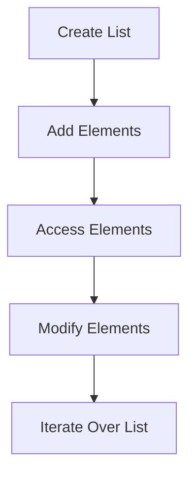
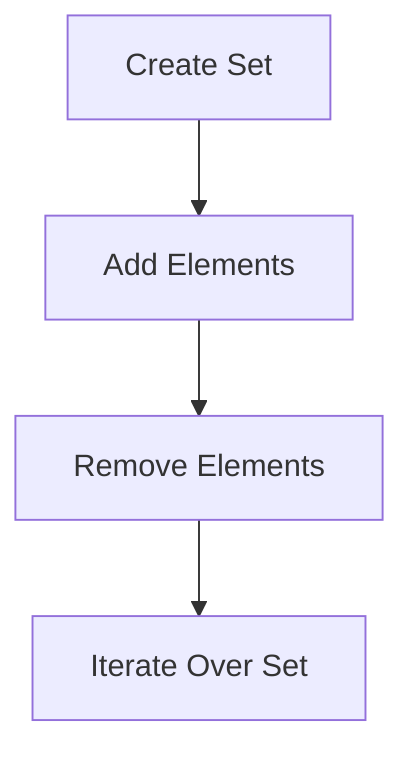
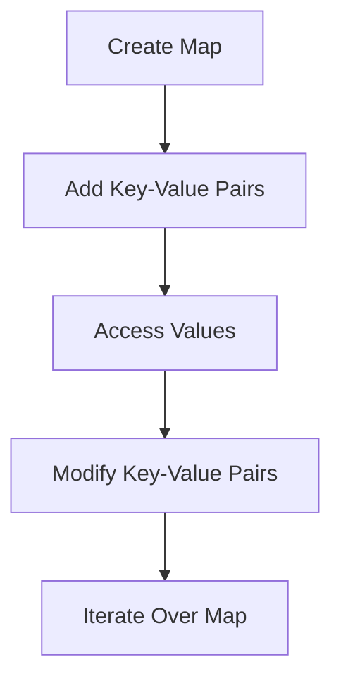

## 3.7 Iterable and Collections

In the world of Dart programming, understanding iterables and collections is crucial for effective software development. Dart provides a rich set of built-in data structures, including Lists, Sets, and Maps, which are essential for managing and manipulating data. In this section, we will delve into these data structures, explore iteration techniques, and learn about collection operators that enhance Dart's functional programming capabilities.

### Introduction to Dart Collections

Dart collections are fundamental building blocks for managing data. They provide a way to store, retrieve, and manipulate groups of objects. The primary collection types in Dart are:

- **Lists**: Ordered collections of elements.
- **Sets**: Unordered collections of unique elements.
- **Maps**: Collections of key-value pairs.

Each of these collections has its own characteristics and use cases, which we will explore in detail.

### Lists: Ordered Collections

Lists in Dart are ordered collections of elements, similar to arrays in other programming languages. They are versatile and can store elements of any type, including other lists.

#### Creating Lists

To create a list in Dart, you can use the `List` class or the list literal syntax:

```dart
// Using the List class
List<int> numbers = List<int>.empty(growable: true);
numbers.add(1);
numbers.add(2);
numbers.add(3);

// Using list literals
List<String> fruits = ['Apple', 'Banana', 'Cherry'];
```

#### Accessing List Elements

You can access list elements using their index, which starts at 0:

```dart
String firstFruit = fruits[0]; // 'Apple'
int numberOfFruits = fruits.length; // 3
```

#### Modifying Lists

Lists in Dart are mutable, meaning you can change their contents:

```dart
fruits[1] = 'Blueberry'; // Replaces 'Banana' with 'Blueberry'
fruits.add('Date'); // Adds 'Date' to the list
fruits.remove('Apple'); // Removes 'Apple' from the list
```

#### Iterating Over Lists

Dart provides several ways to iterate over lists:

- **For Loop**: A traditional way to iterate using indices.

  ```dart
  for (int i = 0; i < fruits.length; i++) {
    print(fruits[i]);
  }
  ```

- **For-Each Loop**: A more concise way to iterate over elements.

  ```dart
  for (String fruit in fruits) {
    print(fruit);
  }
  ```

- **forEach Method**: A functional approach using a callback function.

  ```dart
  fruits.forEach((fruit) => print(fruit));
  ```

### Sets: Unordered Collections of Unique Elements

Sets are collections of unique elements, meaning they do not allow duplicate values. They are useful when you need to ensure that each element appears only once.

#### Creating Sets

You can create a set using the `Set` class or set literals:

```dart
// Using the Set class
Set<int> uniqueNumbers = Set<int>();
uniqueNumbers.add(1);
uniqueNumbers.add(2);
uniqueNumbers.add(3);

// Using set literals
Set<String> colors = {'Red', 'Green', 'Blue'};
```

#### Modifying Sets

Sets are mutable, and you can add or remove elements:

```dart
colors.add('Yellow'); // Adds 'Yellow' to the set
colors.remove('Red'); // Removes 'Red' from the set
```

#### Iterating Over Sets

You can iterate over sets using similar methods as lists:

```dart
for (String color in colors) {
  print(color);
}

colors.forEach((color) => print(color));
```

### Maps: Key-Value Pairs

Maps are collections of key-value pairs, where each key is unique. They are similar to dictionaries in other programming languages.

#### Creating Maps

You can create a map using the `Map` class or map literals:

```dart
// Using the Map class
Map<String, int> ages = Map<String, int>();
ages['Alice'] = 30;
ages['Bob'] = 25;

// Using map literals
Map<String, String> capitals = {
  'USA': 'Washington, D.C.',
  'France': 'Paris',
  'Japan': 'Tokyo'
};
```

#### Accessing Map Elements

You can access map values using their keys:

```dart
int aliceAge = ages['Alice']; // 30
String capitalOfFrance = capitals['France']; // 'Paris'
```

#### Modifying Maps

Maps are mutable, allowing you to add, update, or remove key-value pairs:

```dart
ages['Charlie'] = 35; // Adds a new key-value pair
ages['Alice'] = 31; // Updates the value for 'Alice'
ages.remove('Bob'); // Removes the key-value pair for 'Bob'
```

#### Iterating Over Maps

You can iterate over maps using keys, values, or entries:

```dart
// Iterating over keys
for (String country in capitals.keys) {
  print(country);
}

// Iterating over values
for (String capital in capitals.values) {
  print(capital);
}

// Iterating over entries
capitals.forEach((country, capital) {
  print('$country: $capital');
});
```

### Collection Operators and Functional Programming Tools

Dart provides a rich set of collection operators and functional programming tools that make working with collections more expressive and concise.

#### The `where` Method

The `where` method filters elements based on a condition:

```dart
List<int> numbers = [1, 2, 3, 4, 5];
List<int> evenNumbers = numbers.where((number) => number.isEven).toList();
```

#### The `map` Method

The `map` method transforms each element in a collection:

```dart
List<String> upperCaseFruits = fruits.map((fruit) => fruit.toUpperCase()).toList();
```

#### The `any` and `every` Methods

The `any` method checks if any element satisfies a condition, while `every` checks if all elements satisfy a condition:

```dart
bool hasLongFruit = fruits.any((fruit) => fruit.length > 5);
bool allFruitsStartWithA = fruits.every((fruit) => fruit.startsWith('A'));
```

#### The `reduce` and `fold` Methods

The `reduce` and `fold` methods combine elements into a single value:

```dart
int sum = numbers.reduce((a, b) => a + b);

int product = numbers.fold(1, (a, b) => a * b);
```

### Visualizing Dart Collections

To better understand the relationships and operations within Dart collections, let's visualize them using Mermaid.js diagrams.

#### List Operations



*Diagram: A flowchart illustrating the operations on a Dart list.*

#### Set Operations



*Diagram: A flowchart illustrating the operations on a Dart set.*

#### Map Operations



*Diagram: A flowchart illustrating the operations on a Dart map.*

### Best Practices for Using Collections

- **Choose the Right Collection**: Use lists for ordered data, sets for unique elements, and maps for key-value pairs.
- **Use Immutable Collections**: When possible, use immutable collections to prevent unintended modifications.
- **Leverage Functional Programming**: Use collection operators like `map`, `where`, and `reduce` to write concise and expressive code.
- **Optimize Performance**: Be mindful of the performance implications of collection operations, especially with large datasets.

### Try It Yourself

Experiment with the following code snippets to deepen your understanding of Dart collections:

1. **Modify the List Example**: Add more elements and try different iteration methods.
2. **Create a Set of Numbers**: Add duplicate numbers and observe how the set handles them.
3. **Build a Map of Countries and Capitals**: Add more countries and practice iterating over keys and values.

### Knowledge Check

- What is the difference between a list and a set in Dart?
- How can you transform all elements in a list to uppercase using Dart's collection operators?
- What method would you use to check if all elements in a list satisfy a certain condition?

### Conclusion

Understanding Dart's iterables and collections is essential for effective software development. By mastering lists, sets, and maps, and leveraging collection operators, you can write more efficient and expressive code. Remember, this is just the beginning. As you progress, you'll build more complex and interactive applications. Keep experimenting, stay curious, and enjoy the journey!

## Quiz Time!



### What is a key characteristic of a Dart List?

- [x] Ordered collection of elements
- [ ] Unordered collection of unique elements
- [ ] Collection of key-value pairs
- [ ] Immutable collection

> **Explanation:** A Dart List is an ordered collection of elements, allowing duplicates and maintaining the order of insertion.

### How do you create a set in Dart using literals?

- [x] `Set<String> colors = {'Red', 'Green', 'Blue'};`
- [ ] `List<String> colors = ['Red', 'Green', 'Blue'];`
- [ ] `Map<String, String> colors = {'Red': 'Green', 'Blue': 'Yellow'};`
- [ ] `var colors = new Set();`

> **Explanation:** The correct syntax for creating a set using literals is `Set<String> colors = {'Red', 'Green', 'Blue'};`.

### Which method is used to filter elements in a Dart collection?

- [ ] `map`
- [x] `where`
- [ ] `reduce`
- [ ] `fold`

> **Explanation:** The `where` method is used to filter elements in a Dart collection based on a condition.

### What does the `map` method do in Dart?

- [ ] Filters elements based on a condition
- [x] Transforms each element in a collection
- [ ] Combines elements into a single value
- [ ] Checks if any element satisfies a condition

> **Explanation:** The `map` method transforms each element in a collection, returning a new collection with the transformed elements.

### How can you check if all elements in a list satisfy a condition?

- [ ] `any`
- [x] `every`
- [ ] `reduce`
- [ ] `fold`

> **Explanation:** The `every` method checks if all elements in a list satisfy a given condition.

### What is a key characteristic of a Dart Set?

- [ ] Ordered collection of elements
- [x] Unordered collection of unique elements
- [ ] Collection of key-value pairs
- [ ] Immutable collection

> **Explanation:** A Dart Set is an unordered collection of unique elements, meaning it does not allow duplicates.

### Which method would you use to iterate over a map's keys in Dart?

- [x] `forEach`
- [ ] `map`
- [ ] `reduce`
- [ ] `fold`

> **Explanation:** The `forEach` method can be used to iterate over a map's keys, values, or entries in Dart.

### What is the purpose of the `reduce` method in Dart?

- [ ] Filters elements based on a condition
- [ ] Transforms each element in a collection
- [x] Combines elements into a single value
- [ ] Checks if any element satisfies a condition

> **Explanation:** The `reduce` method combines elements in a collection into a single value using a specified operation.

### How do you access a value in a Dart Map using a key?

- [x] `map[key]`
- [ ] `map.get(key)`
- [ ] `map.key`
- [ ] `map.value(key)`

> **Explanation:** You access a value in a Dart Map using the syntax `map[key]`.

### Dart Lists are immutable by default.

- [ ] True
- [x] False

> **Explanation:** Dart Lists are mutable by default, meaning their contents can be changed after creation.


