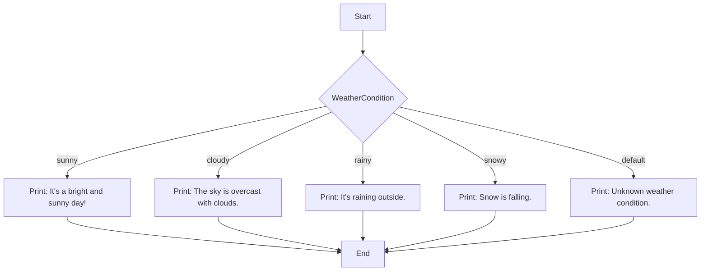

## 3.8 Enumerations and Switch Cases

In the world of Dart programming, enumerations (enums) and switch cases are powerful tools that allow developers to manage control flow and enhance code readability. This section delves into the intricacies of defining enums, utilizing switch statements, and adhering to best practices to ensure robust and maintainable code. By the end of this chapter, you'll have a comprehensive understanding of how to leverage these features effectively in your Dart and Flutter applications.

### Defining Enums

Enums, short for enumerated types, are a special kind of class in Dart that represents a fixed number of constant values. They are particularly useful when you need to define a variable that can only take one out of a small set of possible values. Enums improve code clarity and reduce errors by providing a way to work with named constants.

#### Creating Enumerated Types

To define an enum in Dart, use the `enum` keyword followed by the name of the enum and a list of constant values enclosed in curly braces. Here's a simple example:

```dart
enum WeatherCondition {
  sunny,
  cloudy,
  rainy,
  snowy
}
```

In this example, `WeatherCondition` is an enum with four possible values: `sunny`, `cloudy`, `rainy`, and `snowy`. Each value is a constant and can be used to represent different weather conditions in your application.

#### Accessing Enum Values

Once an enum is defined, you can access its values using dot notation. Here's how you can use the `WeatherCondition` enum:

```dart
void main() {
  WeatherCondition currentCondition = WeatherCondition.sunny;

  print('The current weather condition is $currentCondition.');
}
```

This code snippet assigns the `sunny` value to the `currentCondition` variable and prints it. Enums provide a type-safe way to work with a set of related constants, making your code more readable and less error-prone.

#### Enum Properties and Methods

Dart enums come with some built-in properties and methods that can be quite handy:

- **`index`**: Returns the zero-based position of the enum value.
- **`values`**: Returns a list of all enum values.

Here's an example demonstrating these properties:

```dart
void main() {
  WeatherCondition condition = WeatherCondition.cloudy;

  print('Condition: $condition');
  print('Index: ${condition.index}');

  for (var value in WeatherCondition.values) {
    print('Weather condition: $value');
  }
}
```

This code will output the current condition, its index, and iterate over all possible weather conditions.

### Using Switch Statements

Switch statements in Dart provide a clean and efficient way to execute different code blocks based on the value of an enum. They are particularly useful when dealing with enums, as they allow you to handle each possible value explicitly.

#### Controlling Flow Based on Enum Values

A switch statement evaluates an expression and executes the corresponding case block that matches the expression's value. Here's how you can use a switch statement with the `WeatherCondition` enum:

```dart
void describeWeather(WeatherCondition condition) {
  switch (condition) {
    case WeatherCondition.sunny:
      print('It\'s a bright and sunny day!');
      break;
    case WeatherCondition.cloudy:
      print('The sky is overcast with clouds.');
      break;
    case WeatherCondition.rainy:
      print('It\'s raining outside.');
      break;
    case WeatherCondition.snowy:
      print('Snow is falling.');
      break;
  }
}

void main() {
  describeWeather(WeatherCondition.rainy);
}
```

In this example, the `describeWeather` function uses a switch statement to print a message based on the current weather condition. The `break` statement is crucial to prevent fall-through, where multiple case blocks are executed.

#### Ensuring Exhaustive Switch Cases

When using switch statements with enums, it's important to handle all possible enum values. This ensures that your code is robust and less prone to errors. If you miss handling a case, the Dart analyzer will warn you, helping you catch potential bugs early.

#### Default Handling

While it's good practice to handle all enum values explicitly, you can use a `default` case to catch any unexpected values. This is particularly useful if your enum might be extended in the future:

```dart
void describeWeather(WeatherCondition condition) {
  switch (condition) {
    case WeatherCondition.sunny:
      print('It\'s a bright and sunny day!');
      break;
    case WeatherCondition.cloudy:
      print('The sky is overcast with clouds.');
      break;
    case WeatherCondition.rainy:
      print('It\'s raining outside.');
      break;
    case WeatherCondition.snowy:
      print('Snow is falling.');
      break;
    default:
      print('Unknown weather condition.');
  }
}
```

The `default` case acts as a safety net, ensuring that your code can handle any unforeseen enum values gracefully.

### Best Practices

To make the most of enums and switch cases in Dart, consider the following best practices:

- **Use Enums for Related Constants**: Enums are ideal for representing a fixed set of related constants. Use them to improve code readability and maintainability.
- **Handle All Enum Values**: Always ensure that your switch statements handle all possible enum values. This prevents runtime errors and makes your code more robust.
- **Avoid Fall-Through**: Use the `break` statement to prevent fall-through in switch cases. This ensures that only the intended case block is executed.
- **Use Default Sparingly**: While a `default` case can be useful, it's best to handle all known enum values explicitly. Use `default` only as a fallback for unexpected values.
- **Leverage Enum Properties**: Utilize the `index` and `values` properties to work with enums more effectively. These properties can simplify tasks like iterating over all enum values.

### Visualizing Enums and Switch Cases

To better understand how enums and switch cases work together, let's visualize the control flow using a Mermaid.js diagram:



This flowchart illustrates how the `describeWeather` function evaluates the `WeatherCondition` enum and executes the corresponding case block.

### Try It Yourself

Now that we've covered the basics of enums and switch cases, it's time to experiment with the concepts. Try modifying the `WeatherCondition` enum to include additional weather types, such as `windy` or `stormy`. Update the `describeWeather` function to handle these new cases, and observe how the switch statement adapts to the changes.

### Knowledge Check

To reinforce your understanding of enums and switch cases, consider the following questions:

- What are the benefits of using enums over traditional constants?
- How does a switch statement improve code readability compared to multiple if-else statements?
- Why is it important to handle all possible enum values in a switch statement?

### Embrace the Journey

Remember, mastering enums and switch cases is just one step in your journey to becoming a proficient Dart developer. As you continue to explore Dart's language features, you'll discover new ways to write clean, efficient, and maintainable code. Keep experimenting, stay curious, and enjoy the process of learning and growing as a developer.

## Quiz Time!



### What is an enum in Dart?

- [x] A special class representing a fixed number of constant values.
- [ ] A function that returns multiple values.
- [ ] A variable that can change its type.
- [ ] A type of loop in Dart.

> **Explanation:** An enum is a special class in Dart used to define a fixed number of constant values, improving code clarity and reducing errors.

### How do you access an enum value in Dart?

- [x] Using dot notation.
- [ ] Using square brackets.
- [ ] Using parentheses.
- [ ] Using curly braces.

> **Explanation:** Enum values in Dart are accessed using dot notation, such as `WeatherCondition.sunny`.

### What is the purpose of a switch statement?

- [x] To execute different code blocks based on the value of an expression.
- [ ] To iterate over a collection.
- [ ] To define a new class.
- [ ] To declare a variable.

> **Explanation:** A switch statement is used to execute different code blocks based on the value of an expression, providing a clean way to handle multiple conditions.

### Why is it important to handle all enum values in a switch statement?

- [x] To prevent runtime errors and ensure code robustness.
- [ ] To make the code run faster.
- [ ] To reduce the number of lines of code.
- [ ] To avoid using the `default` case.

> **Explanation:** Handling all enum values in a switch statement prevents runtime errors and ensures that the code is robust and maintainable.

### What is the role of the `default` case in a switch statement?

- [x] To handle any unexpected or unhandled values.
- [ ] To execute the first case block.
- [ ] To terminate the switch statement.
- [ ] To initialize variables.

> **Explanation:** The `default` case in a switch statement acts as a fallback to handle any unexpected or unhandled values.

### Which property of an enum returns its zero-based position?

- [x] `index`
- [ ] `values`
- [ ] `length`
- [ ] `position`

> **Explanation:** The `index` property of an enum returns its zero-based position, allowing you to determine the order of enum values.

### How can you iterate over all values of an enum?

- [x] Using the `values` property.
- [ ] Using a `for` loop with a counter.
- [ ] Using the `index` property.
- [ ] Using a `while` loop.

> **Explanation:** The `values` property of an enum returns a list of all enum values, which can be iterated over using a loop.

### What is the benefit of using enums for related constants?

- [x] They improve code readability and maintainability.
- [ ] They make the code run faster.
- [ ] They reduce memory usage.
- [ ] They allow for dynamic typing.

> **Explanation:** Enums improve code readability and maintainability by providing a type-safe way to work with related constants.

### What is the consequence of missing a `break` statement in a switch case?

- [x] Fall-through occurs, executing subsequent case blocks.
- [ ] The switch statement terminates immediately.
- [ ] The code will not compile.
- [ ] The `default` case is executed.

> **Explanation:** Missing a `break` statement in a switch case causes fall-through, where subsequent case blocks are executed unintentionally.

### True or False: Enums in Dart can have methods and fields.

- [x] True
- [ ] False

> **Explanation:** True. Enums in Dart can have methods and fields, allowing for more complex behavior and data encapsulation.



By mastering enums and switch cases, you're well on your way to writing more efficient and maintainable Dart code. Keep exploring and applying these concepts in your projects to unlock the full potential of Dart's language features.
