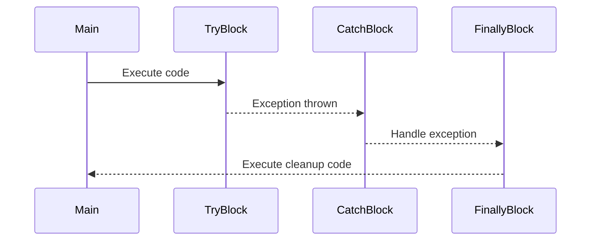

## 3.9 Error Handling and Exceptions

Error handling is a critical aspect of software development, ensuring that applications can gracefully handle unexpected situations and provide meaningful feedback to users. In Dart, error handling is primarily managed through exceptions. This section will delve into the mechanisms Dart provides for handling errors, including try-catch-finally constructs, custom exceptions, and asynchronous error handling.

### Understanding Exceptions in Dart

Exceptions in Dart are objects that represent an error or unexpected event. Unlike some languages where exceptions are used for control flow, in Dart, they are primarily used to signal errors. Dart's exception handling mechanism allows developers to separate error-handling code from regular code, making applications more robust and maintainable.

#### Types of Exceptions

Dart provides several built-in exceptions, such as `FormatException`, `IOException`, and `StateError`. These exceptions cover a wide range of common error scenarios. However, Dart also allows developers to create custom exceptions to handle specific error conditions unique to their applications.

### Try-Catch-Finally Constructs

The try-catch-finally construct is the cornerstone of error handling in Dart. It allows developers to capture exceptions and handle them appropriately, ensuring that the application can continue running or terminate gracefully.

#### Try Block

The `try` block contains the code that might throw an exception. If an exception occurs, the control is transferred to the `catch` block.

```dart
void main() {
  try {
    int result = 10 ~/ 0; // This will throw an IntegerDivisionByZeroException
    print(result);
  } catch (e) {
    print('An error occurred: $e');
  }
}
```

In the example above, dividing by zero throws an `IntegerDivisionByZeroException`, which is caught by the `catch` block.

#### Catch Block

The `catch` block is used to handle exceptions. Dart allows you to catch exceptions in a flexible manner, either by catching all exceptions or specific types.

```dart
void main() {
  try {
    int result = 10 ~/ 0;
    print(result);
  } on IntegerDivisionByZeroException {
    print('Cannot divide by zero.');
  } catch (e, s) {
    print('An error occurred: $e');
    print('Stack trace: $s');
  }
}
```

In this example, the `on` keyword is used to catch a specific exception type, while the `catch` block captures any exception. The stack trace can also be captured for debugging purposes.

#### Finally Block

The `finally` block contains code that should always execute, regardless of whether an exception was thrown or not. This is useful for resource cleanup, such as closing files or network connections.

```dart
void main() {
  try {
    int result = 10 ~/ 0;
    print(result);
  } catch (e) {
    print('An error occurred: $e');
  } finally {
    print('This code runs no matter what.');
  }
}
```

### Custom Exceptions

Custom exceptions allow developers to define their own error types, providing more meaningful error messages and handling specific error conditions.

#### Defining Custom Exceptions

To define a custom exception, create a class that implements the `Exception` interface. It's a good practice to override the `toString` method to provide a meaningful error message.

```dart
class CustomException implements Exception {
  final String message;
  CustomException(this.message);

  @override
  String toString() => 'CustomException: $message';
}

void main() {
  try {
    throw CustomException('This is a custom exception');
  } catch (e) {
    print(e);
  }
}
```

#### Throwing Custom Exceptions

Custom exceptions can be thrown using the `throw` keyword, just like built-in exceptions.

```dart
void checkValue(int value) {
  if (value < 0) {
    throw CustomException('Value cannot be negative');
  }
}

void main() {
  try {
    checkValue(-1);
  } catch (e) {
    print(e);
  }
}
```

### Asynchronous Error Handling

Dart's asynchronous programming model, which includes Futures and Streams, requires a different approach to error handling.

#### Futures

Futures represent a computation that will complete in the future. Errors in Futures can be handled using the `catchError` method or by using `try-catch` within an `async` function.

```dart
Future<int> divideAsync(int a, int b) async {
  if (b == 0) {
    throw CustomException('Cannot divide by zero');
  }
  return a ~/ b;
}

void main() async {
  try {
    int result = await divideAsync(10, 0);
    print(result);
  } catch (e) {
    print('Caught an error: $e');
  }
}
```

#### Streams

Streams provide a sequence of asynchronous events. Errors in Streams can be handled using the `handleError` method or by providing an `onError` callback.

```dart
Stream<int> numberStream() async* {
  for (int i = 0; i < 5; i++) {
    if (i == 3) {
      throw CustomException('Error at index $i');
    }
    yield i;
  }
}

void main() {
  numberStream().listen(
    (data) => print('Data: $data'),
    onError: (error) => print('Error: $error'),
    onDone: () => print('Stream closed'),
  );
}
```

### Visualizing Error Handling Flow

To better understand how error handling works in Dart, let's visualize the flow using a sequence diagram.



### Best Practices for Error Handling

1. **Use Specific Exceptions**: Catch specific exceptions to handle known error conditions, and use a generic catch block for unexpected errors.
2. **Provide Meaningful Messages**: Always provide meaningful error messages to help with debugging and user feedback.
3. **Avoid Silent Failures**: Ensure that exceptions are logged or reported, even if they are caught and handled.
4. **Use Custom Exceptions Wisely**: Define custom exceptions for specific error conditions that are not covered by built-in exceptions.
5. **Handle Asynchronous Errors**: Always handle errors in asynchronous code to prevent unhandled exceptions.

### Try It Yourself

Experiment with the code examples provided in this section. Try modifying the conditions that trigger exceptions, or create your own custom exceptions to handle different error scenarios. This hands-on practice will deepen your understanding of error handling in Dart.

### Knowledge Check

- What is the purpose of the `finally` block in a try-catch-finally construct?
- How can you catch specific exceptions in Dart?
- What is the difference between handling errors in Futures and Streams?
- Why is it important to provide meaningful error messages?

### Embrace the Journey

Remember, mastering error handling is an ongoing journey. As you continue to develop with Dart, you'll encounter new challenges and learn new techniques. Keep experimenting, stay curious, and enjoy the process of becoming a more proficient developer.

## Quiz Time!



### What is the primary purpose of the `try` block in Dart's error handling?

- [x] To execute code that might throw an exception
- [ ] To handle exceptions that are thrown
- [ ] To clean up resources after an exception
- [ ] To define custom exceptions

> **Explanation:** The `try` block is used to execute code that might throw an exception. If an exception occurs, control is transferred to the `catch` block.

### How can you catch a specific type of exception in Dart?

- [x] Using the `on` keyword followed by the exception type
- [ ] Using the `catch` keyword followed by the exception type
- [ ] Using the `finally` keyword followed by the exception type
- [ ] Using the `throw` keyword followed by the exception type

> **Explanation:** The `on` keyword is used to catch a specific type of exception in Dart.

### What is the role of the `finally` block in a try-catch-finally construct?

- [x] To execute code that should run regardless of whether an exception occurred
- [ ] To handle exceptions that are thrown
- [ ] To define custom exceptions
- [ ] To execute code only if an exception is caught

> **Explanation:** The `finally` block is used to execute code that should run regardless of whether an exception occurred, such as cleanup code.

### How do you handle errors in a Future in Dart?

- [x] Using the `catchError` method or `try-catch` within an `async` function
- [ ] Using the `onError` callback
- [ ] Using the `finally` block
- [ ] Using the `throw` keyword

> **Explanation:** Errors in a Future can be handled using the `catchError` method or `try-catch` within an `async` function.

### Which of the following is a best practice for error handling in Dart?

- [x] Provide meaningful error messages
- [ ] Use silent failures
- [ ] Catch all exceptions with a single catch block
- [ ] Avoid logging exceptions

> **Explanation:** Providing meaningful error messages is a best practice for error handling in Dart, as it helps with debugging and user feedback.

### What is a custom exception in Dart?

- [x] An exception defined by the developer to handle specific error conditions
- [ ] A built-in exception provided by Dart
- [ ] An exception that cannot be caught
- [ ] An exception that is automatically logged

> **Explanation:** A custom exception is defined by the developer to handle specific error conditions that are not covered by built-in exceptions.

### How do you throw a custom exception in Dart?

- [x] Using the `throw` keyword followed by an instance of the custom exception
- [ ] Using the `catch` keyword followed by an instance of the custom exception
- [ ] Using the `finally` keyword followed by an instance of the custom exception
- [ ] Using the `on` keyword followed by an instance of the custom exception

> **Explanation:** Custom exceptions can be thrown using the `throw` keyword followed by an instance of the custom exception.

### What is the purpose of the `catch` block in Dart's error handling?

- [x] To handle exceptions that are thrown
- [ ] To execute code that might throw an exception
- [ ] To clean up resources after an exception
- [ ] To define custom exceptions

> **Explanation:** The `catch` block is used to handle exceptions that are thrown in the `try` block.

### How can you handle errors in a Stream in Dart?

- [x] Using the `handleError` method or `onError` callback
- [ ] Using the `catchError` method
- [ ] Using the `finally` block
- [ ] Using the `throw` keyword

> **Explanation:** Errors in a Stream can be handled using the `handleError` method or `onError` callback.

### True or False: The `finally` block will execute only if an exception is caught.

- [ ] True
- [x] False

> **Explanation:** The `finally` block will execute regardless of whether an exception is caught, making it ideal for cleanup code.


