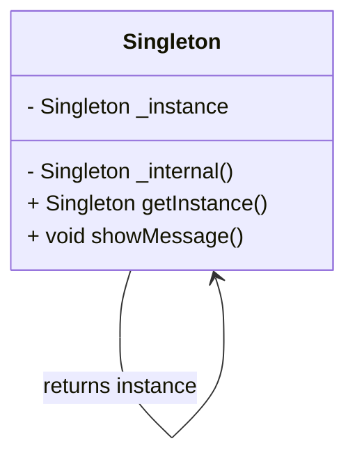

## 4.1 Singleton Design Pattern

In the realm of software design patterns, the Singleton pattern stands out as a fundamental creational pattern. It ensures that a class has only one instance and provides a global point of access to it. This pattern is particularly useful in scenarios where a single object is needed to coordinate actions across the system.

### **Intent of the Singleton Pattern**

The primary intent of the Singleton pattern is to restrict the instantiation of a class to a single object. This is crucial in scenarios where having multiple instances would lead to inconsistent behavior or resource conflicts. By ensuring a single instance, the Singleton pattern provides a controlled access point to the instance, often used for managing shared resources or configurations.

### **Key Participants**

1. **Singleton Class**: The class that is restricted to a single instance.
2. **Static Instance**: A static variable that holds the single instance of the class.
3. **Private Constructor**: A constructor that is private to prevent external instantiation.
4. **Public Static Method**: A method that provides access to the instance.

### **Implementing Singleton in Dart**

Dart, with its robust language features, offers several ways to implement the Singleton pattern. Let's explore these methods in detail.

#### **Using Factory Constructors**

A factory constructor in Dart can be used to return the same instance every time it is called. This approach is straightforward and leverages Dart's factory constructor feature.

```dart
class Singleton {
  // Private static instance of the class
  static final Singleton _instance = Singleton._internal();

  // Private named constructor
  Singleton._internal();

  // Factory constructor that returns the same instance
  factory Singleton() {
    return _instance;
  }

  // Example method
  void showMessage() {
    print("Singleton instance method called.");
  }
}

void main() {
  // Both variables point to the same instance
  var singleton1 = Singleton();
  var singleton2 = Singleton();

  // Verify that both variables hold the same instance
  print(singleton1 == singleton2); // Outputs: true

  singleton1.showMessage(); // Outputs: Singleton instance method called.
}
```

In this example, the `Singleton` class uses a factory constructor to ensure that only one instance of the class is created. The private named constructor `_internal` prevents external instantiation, and the static variable `_instance` holds the single instance.

#### **Private Constructors with Static Instances**

Another common approach to implementing the Singleton pattern in Dart is using a private constructor along with a static instance. This method provides more control over the instance creation process.

```dart
class Singleton {
  // Private static instance variable
  static Singleton? _instance;

  // Private constructor
  Singleton._();

  // Static method to get the instance
  static Singleton getInstance() {
    if (_instance == null) {
      _instance = Singleton._();
    }
    return _instance!;
  }

  // Example method
  void showMessage() {
    print("Singleton instance method called.");
  }
}

void main() {
  // Both variables point to the same instance
  var singleton1 = Singleton.getInstance();
  var singleton2 = Singleton.getInstance();

  // Verify that both variables hold the same instance
  print(singleton1 == singleton2); // Outputs: true

  singleton1.showMessage(); // Outputs: Singleton instance method called.
}
```

Here, the `Singleton` class uses a private constructor `_()` and a static method `getInstance()` to control the instantiation process. The static variable `_instance` is initialized only once, ensuring a single instance.

#### **Lazy Initialization**

Lazy initialization is a technique where the instance is created only when it is first needed. This can be particularly useful in scenarios where the Singleton instance is resource-intensive to create.

```dart
class Singleton {
  // Private static instance variable
  static Singleton? _instance;

  // Private constructor
  Singleton._();

  // Static method to get the instance with lazy initialization
  static Singleton getInstance() {
    _instance ??= Singleton._();
    return _instance!;
  }

  // Example method
  void showMessage() {
    print("Singleton instance method called.");
  }
}

void main() {
  // Both variables point to the same instance
  var singleton1 = Singleton.getInstance();
  var singleton2 = Singleton.getInstance();

  // Verify that both variables hold the same instance
  print(singleton1 == singleton2); // Outputs: true

  singleton1.showMessage(); // Outputs: Singleton instance method called.
}
```

In this example, the `getInstance()` method uses the null-aware operator `??=` to initialize the `_instance` variable only if it is null, achieving lazy initialization.

#### **Thread Safety Considerations**

In a multi-threaded environment, ensuring that only one instance of the Singleton class is created can be challenging. Dart's asynchronous nature requires careful handling to maintain thread safety.

One approach to ensure thread safety is using the `synchronized` package, which provides a way to lock critical sections of code.

```dart
import 'package:synchronized/synchronized.dart';

class Singleton {
  // Private static instance variable
  static Singleton? _instance;
  static final _lock = Lock();

  // Private constructor
  Singleton._();

  // Static method to get the instance with thread safety
  static Future<Singleton> getInstance() async {
    if (_instance == null) {
      await _lock.synchronized(() async {
        if (_instance == null) {
          _instance = Singleton._();
        }
      });
    }
    return _instance!;
  }

  // Example method
  void showMessage() {
    print("Singleton instance method called.");
  }
}

void main() async {
  // Both variables point to the same instance
  var singleton1 = await Singleton.getInstance();
  var singleton2 = await Singleton.getInstance();

  // Verify that both variables hold the same instance
  print(singleton1 == singleton2); // Outputs: true

  singleton1.showMessage(); // Outputs: Singleton instance method called.
}
```

In this example, the `getInstance()` method uses the `synchronized` package to ensure that the instance creation process is thread-safe.

### **Use Cases and Examples**

The Singleton pattern is widely used in software development for various scenarios. Let's explore some common use cases.

#### **App Configuration**

In many applications, a centralized configuration object is needed to manage settings and preferences. The Singleton pattern provides a way to ensure that there is only one configuration object throughout the application.

```dart
class AppConfig {
  static final AppConfig _instance = AppConfig._internal();

  // Private constructor
  AppConfig._internal();

  // Factory constructor
  factory AppConfig() {
    return _instance;
  }

  // Configuration settings
  String apiUrl = "https://api.example.com";
  String appName = "MyApp";

  // Example method
  void printConfig() {
    print("API URL: $apiUrl, App Name: $appName");
  }
}

void main() {
  var config1 = AppConfig();
  var config2 = AppConfig();

  // Verify that both variables hold the same instance
  print(config1 == config2); // Outputs: true

  config1.printConfig(); // Outputs: API URL: https://api.example.com, App Name: MyApp
}
```

In this example, the `AppConfig` class uses the Singleton pattern to manage application settings, ensuring consistent access across the app.

#### **Logging**

A logging system often requires a single logger instance to manage log entries. The Singleton pattern ensures that all parts of the application use the same logger instance.

```dart
class Logger {
  static final Logger _instance = Logger._internal();

  // Private constructor
  Logger._internal();

  // Factory constructor
  factory Logger() {
    return _instance;
  }

  // Log method
  void log(String message) {
    print("Log: $message");
  }
}

void main() {
  var logger1 = Logger();
  var logger2 = Logger();

  // Verify that both variables hold the same instance
  print(logger1 == logger2); // Outputs: true

  logger1.log("This is a log message."); // Outputs: Log: This is a log message.
}
```

In this example, the `Logger` class uses the Singleton pattern to provide a single logging instance, ensuring consistent logging behavior.

#### **Shared Resources**

Managing access to shared resources, such as databases or network connections, is another common use case for the Singleton pattern. By ensuring a single instance, resource conflicts and inconsistencies can be avoided.

```dart
class DatabaseConnection {
  static final DatabaseConnection _instance = DatabaseConnection._internal();

  // Private constructor
  DatabaseConnection._internal();

  // Factory constructor
  factory DatabaseConnection() {
    return _instance;
  }

  // Connect method
  void connect() {
    print("Database connected.");
  }
}

void main() {
  var db1 = DatabaseConnection();
  var db2 = DatabaseConnection();

  // Verify that both variables hold the same instance
  print(db1 == db2); // Outputs: true

  db1.connect(); // Outputs: Database connected.
}
```

In this example, the `DatabaseConnection` class uses the Singleton pattern to manage a single database connection, ensuring consistent access.

### **Design Considerations**

When implementing the Singleton pattern, several design considerations should be taken into account:

- **Global Access**: While the Singleton pattern provides a global access point, it can lead to tightly coupled code. Consider using dependency injection to manage dependencies more effectively.
- **Testing**: Singletons can be challenging to test due to their global state. Consider using interfaces or mock objects to facilitate testing.
- **Performance**: Lazy initialization can improve performance by delaying instance creation until it is needed.
- **Thread Safety**: In multi-threaded environments, ensure that the Singleton implementation is thread-safe to prevent multiple instances.

### **Differences and Similarities**

The Singleton pattern is often compared to other creational patterns, such as the Factory Method and Abstract Factory patterns. While all these patterns deal with object creation, the Singleton pattern is unique in its focus on ensuring a single instance.

- **Factory Method**: Focuses on creating objects without specifying the exact class. Unlike Singleton, it does not restrict the number of instances.
- **Abstract Factory**: Provides an interface for creating families of related objects. It is more complex than Singleton and does not enforce a single instance.

### **Visualizing the Singleton Pattern**

To better understand the Singleton pattern, let's visualize its structure using a class diagram.



**Diagram Description**: This class diagram illustrates the Singleton pattern. The `Singleton` class has a private static instance variable `_instance`, a private constructor `_internal()`, and a public static method `getInstance()` that returns the single instance. The `showMessage()` method represents an example method that can be called on the Singleton instance.

### **Try It Yourself**

To deepen your understanding of the Singleton pattern, try modifying the code examples:

- **Experiment with Lazy Initialization**: Modify the `getInstance()` method to use lazy initialization and observe the behavior.
- **Implement Thread Safety**: Use the `synchronized` package to ensure thread safety in a multi-threaded environment.
- **Create a Singleton Logger**: Implement a logger class using the Singleton pattern and test it in a sample application.

### **Knowledge Check**

Before moving on, let's reinforce what we've learned:

- **What is the primary intent of the Singleton pattern?**
- **How does a factory constructor help in implementing the Singleton pattern in Dart?**
- **What are some common use cases for the Singleton pattern?**

### **Embrace the Journey**

Remember, mastering design patterns is a journey. The Singleton pattern is just one of many patterns that can enhance your Dart and Flutter development skills. As you progress, you'll discover more patterns and techniques that will help you build robust, scalable applications. Keep experimenting, stay curious, and enjoy the journey!

## Quiz Time!



### What is the primary intent of the Singleton pattern?

- [x] To ensure a class has only one instance and provide a global point of access to it.
- [ ] To create multiple instances of a class.
- [ ] To provide a way to create objects without specifying the exact class.
- [ ] To create families of related objects.

> **Explanation:** The Singleton pattern ensures a class has only one instance and provides a global point of access to it, which is its primary intent.

### How does a factory constructor help in implementing the Singleton pattern in Dart?

- [x] By returning the same instance every time it is called.
- [ ] By creating a new instance each time it is called.
- [ ] By providing an interface for creating families of related objects.
- [ ] By delaying instance creation until it is needed.

> **Explanation:** A factory constructor in Dart can be used to return the same instance every time it is called, which is a key aspect of implementing the Singleton pattern.

### What is a common use case for the Singleton pattern?

- [x] Managing shared resources like databases.
- [ ] Creating multiple instances of a class.
- [ ] Providing an interface for creating families of related objects.
- [ ] Creating objects without specifying the exact class.

> **Explanation:** Managing shared resources like databases is a common use case for the Singleton pattern, as it ensures consistent access.

### Which of the following is a design consideration for the Singleton pattern?

- [x] Thread safety in multi-threaded environments.
- [ ] Creating multiple instances of a class.
- [ ] Providing an interface for creating families of related objects.
- [ ] Creating objects without specifying the exact class.

> **Explanation:** Thread safety in multi-threaded environments is a key design consideration for the Singleton pattern to prevent multiple instances.

### What is the difference between the Singleton and Factory Method patterns?

- [x] Singleton ensures a single instance, while Factory Method focuses on object creation without specifying the exact class.
- [ ] Singleton creates multiple instances, while Factory Method ensures a single instance.
- [ ] Singleton provides an interface for creating families of related objects, while Factory Method does not.
- [ ] Singleton delays instance creation, while Factory Method does not.

> **Explanation:** Singleton ensures a single instance, while Factory Method focuses on object creation without specifying the exact class, highlighting their differences.

### How can lazy initialization improve performance in the Singleton pattern?

- [x] By delaying instance creation until it is needed.
- [ ] By creating multiple instances of a class.
- [ ] By providing an interface for creating families of related objects.
- [ ] By ensuring thread safety in multi-threaded environments.

> **Explanation:** Lazy initialization improves performance by delaying instance creation until it is needed, which can be beneficial in resource-intensive scenarios.

### What is a potential challenge when testing Singletons?

- [x] Their global state can make testing difficult.
- [ ] They create multiple instances of a class.
- [ ] They provide an interface for creating families of related objects.
- [ ] They delay instance creation until it is needed.

> **Explanation:** Singletons can be challenging to test due to their global state, which can complicate testing scenarios.

### How can the `synchronized` package help in implementing a thread-safe Singleton?

- [x] By locking critical sections of code to prevent multiple instances.
- [ ] By creating multiple instances of a class.
- [ ] By providing an interface for creating families of related objects.
- [ ] By delaying instance creation until it is needed.

> **Explanation:** The `synchronized` package helps in implementing a thread-safe Singleton by locking critical sections of code to prevent multiple instances.

### What is a benefit of using the Singleton pattern for app configuration?

- [x] It provides centralized access to app settings.
- [ ] It creates multiple instances of a class.
- [ ] It provides an interface for creating families of related objects.
- [ ] It delays instance creation until it is needed.

> **Explanation:** Using the Singleton pattern for app configuration provides centralized access to app settings, ensuring consistency.

### True or False: The Singleton pattern can lead to tightly coupled code.

- [x] True
- [ ] False

> **Explanation:** True. The Singleton pattern can lead to tightly coupled code due to its global access point, which is a potential drawback.


