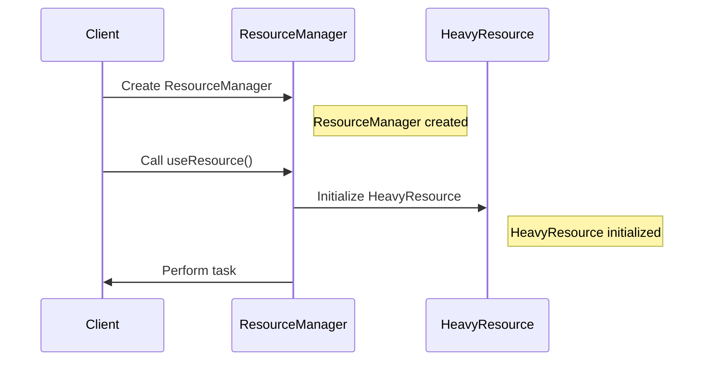

## 4.10 Lazy Initialization Pattern

In the world of software development, efficient resource management is crucial, especially in mobile applications where memory and processing power are limited. The Lazy Initialization Pattern is a creational design pattern that addresses this concern by delaying the creation of an object until it is actually needed. This approach can significantly optimize resource usage and improve application performance.

### **Intent**

The primary intent of the Lazy Initialization Pattern is to defer the creation of an object until the point at which it is needed. This can help in reducing the application's memory footprint and improving startup times, especially when dealing with resource-intensive objects.

### **Key Participants**

1. **Lazy Object**: The object whose initialization is deferred.
2. **Client**: The entity that accesses the lazy object.
3. **Initialization Logic**: The mechanism that ensures the object is created only when needed.

### **Implementing Lazy Initialization in Dart**

Dart provides several mechanisms to implement lazy initialization, making it a powerful tool in the hands of developers aiming to optimize their applications. Let's explore two primary methods: using `late` variables and getters with initialization logic.

#### **Using `late` Variables**

Dart introduced the `late` keyword to allow for deferred initialization of variables. This is particularly useful when you want to ensure that a variable is initialized only when it is accessed for the first time.

```dart
class HeavyResource {
  HeavyResource() {
    print('HeavyResource initialized');
  }

  void performTask() {
    print('Performing a heavy task');
  }
}

class ResourceManager {
  late HeavyResource _resource;

  void useResource() {
    _resource = HeavyResource();
    _resource.performTask();
  }
}

void main() {
  ResourceManager manager = ResourceManager();
  print('ResourceManager created');
  manager.useResource(); // HeavyResource is initialized here
}
```

**Explanation**: In this example, the `HeavyResource` object is not created until the `useResource` method is called. The `late` keyword ensures that `_resource` is initialized only when it is accessed.

#### **Getters with Initialization Logic**

Another approach to lazy initialization in Dart is using getters with initialization logic. This method involves defining a getter that initializes the object the first time it is accessed.

```dart
class HeavyResource {
  HeavyResource() {
    print('HeavyResource initialized');
  }

  void performTask() {
    print('Performing a heavy task');
  }
}

class ResourceManager {
  HeavyResource? _resource;

  HeavyResource get resource {
    if (_resource == null) {
      _resource = HeavyResource();
    }
    return _resource!;
  }

  void useResource() {
    resource.performTask();
  }
}

void main() {
  ResourceManager manager = ResourceManager();
  print('ResourceManager created');
  manager.useResource(); // HeavyResource is initialized here
}
```

**Explanation**: Here, the `resource` getter checks if `_resource` is `null` and initializes it if necessary. This ensures that the `HeavyResource` is only created when `resource` is accessed.

### **Use Cases and Examples**

Lazy initialization is particularly beneficial in scenarios where resource-intensive objects are involved. Let's explore some common use cases.

#### **Heavy Resources**

In applications that deal with large images, complex data structures, or network resources, lazy initialization can defer the loading of these resources until they are actually needed.

```dart
class ImageLoader {
  late Image _image;

  void loadImage(String path) {
    _image = Image.asset(path);
    print('Image loaded from $path');
  }

  void displayImage() {
    // Logic to display the image
  }
}

void main() {
  ImageLoader loader = ImageLoader();
  print('ImageLoader created');
  loader.loadImage('assets/large_image.png'); // Image is loaded here
}
```

**Explanation**: In this example, the image is not loaded until the `loadImage` method is called, which can help in reducing the initial load time of the application.

#### **Performance Optimization**

Lazy initialization can also be used to improve the startup times of applications by deferring the creation of non-essential objects.

```dart
class AnalyticsService {
  AnalyticsService() {
    print('AnalyticsService initialized');
  }

  void trackEvent(String event) {
    print('Tracking event: $event');
  }
}

class App {
  late AnalyticsService _analyticsService;

  void start() {
    print('App started');
    _analyticsService = AnalyticsService();
    _analyticsService.trackEvent('App Launch');
  }
}

void main() {
  App app = App();
  print('App instance created');
  app.start(); // AnalyticsService is initialized here
}
```

**Explanation**: The `AnalyticsService` is initialized only when the `start` method is called, which can help in reducing the startup time of the application.

### **Design Considerations**

When implementing lazy initialization, consider the following:

- **Thread Safety**: Ensure that the initialization logic is thread-safe, especially in multi-threaded environments.
- **Error Handling**: Handle potential errors during initialization gracefully.
- **Performance Trade-offs**: While lazy initialization can improve startup times, it may introduce a delay when the object is first accessed.

### **Differences and Similarities**

Lazy initialization is often confused with other creational patterns like Singleton or Factory. However, it is distinct in its focus on deferring object creation rather than managing the lifecycle or instantiation logic.

### **Visualizing Lazy Initialization**

To better understand the lazy initialization process, let's visualize it using a sequence diagram.



**Description**: This diagram illustrates the sequence of events in lazy initialization. The `HeavyResource` is only initialized when `useResource` is called by the client.

### **Try It Yourself**

Experiment with the provided code examples by modifying them to suit different scenarios. For instance, try implementing lazy initialization for a network request or a database connection.

### **References and Links**

- [Dart Language Tour](https://dart.dev/guides/language/language-tour)
- [Flutter Documentation](https://flutter.dev/docs)
- [Effective Dart: Usage](https://dart.dev/guides/language/effective-dart/usage)

### **Knowledge Check**

- What is the primary benefit of using lazy initialization?
- How does the `late` keyword facilitate lazy initialization in Dart?
- What are some potential pitfalls of lazy initialization?

### **Embrace the Journey**

Remember, mastering design patterns like lazy initialization is a journey. As you continue to explore and experiment, you'll gain deeper insights into optimizing your applications. Keep experimenting, stay curious, and enjoy the journey!

## Quiz Time!



### What is the primary purpose of the Lazy Initialization Pattern?

- [x] To defer object creation until it is needed
- [ ] To create multiple instances of an object
- [ ] To ensure thread safety
- [ ] To manage object lifecycle

> **Explanation:** The Lazy Initialization Pattern is used to delay the creation of an object until it is actually needed, optimizing resource usage.

### Which Dart keyword is used for lazy initialization?

- [x] late
- [ ] async
- [ ] final
- [ ] const

> **Explanation:** The `late` keyword in Dart is used to defer the initialization of a variable until it is accessed for the first time.

### What is a potential drawback of lazy initialization?

- [x] It may introduce a delay when the object is first accessed
- [ ] It increases memory usage
- [ ] It complicates code readability
- [ ] It requires more lines of code

> **Explanation:** Lazy initialization can introduce a delay when the object is first accessed, as the initialization occurs at that moment.

### How can lazy initialization improve application performance?

- [x] By reducing startup times
- [ ] By increasing memory usage
- [ ] By creating multiple instances of objects
- [ ] By simplifying code logic

> **Explanation:** Lazy initialization can improve application performance by reducing startup times, as objects are only created when needed.

### Which of the following is a common use case for lazy initialization?

- [x] Deferring loading of images or data until necessary
- [ ] Creating multiple instances of a singleton
- [ ] Managing object lifecycle
- [ ] Ensuring thread safety

> **Explanation:** Lazy initialization is commonly used to defer the loading of heavy resources like images or data until they are needed.

### What should be considered when implementing lazy initialization?

- [x] Thread safety
- [x] Error handling
- [ ] Code readability
- [ ] Memory usage

> **Explanation:** When implementing lazy initialization, it's important to consider thread safety and error handling to ensure robust and reliable code.

### How does a getter with initialization logic work in Dart?

- [x] It initializes the object the first time the getter is accessed
- [ ] It creates multiple instances of the object
- [ ] It defers initialization until the program ends
- [ ] It ensures the object is always initialized

> **Explanation:** A getter with initialization logic in Dart initializes the object the first time the getter is accessed, ensuring lazy initialization.

### What is a key benefit of using the `late` keyword in Dart?

- [x] It allows for deferred initialization
- [ ] It simplifies code readability
- [ ] It increases memory usage
- [ ] It ensures thread safety

> **Explanation:** The `late` keyword allows for deferred initialization, meaning the variable is only initialized when it is accessed for the first time.

### Can lazy initialization be used for network requests?

- [x] True
- [ ] False

> **Explanation:** Lazy initialization can be used for network requests by deferring the request until it is needed, optimizing resource usage.

### What is the main difference between lazy initialization and the Singleton pattern?

- [x] Lazy initialization focuses on deferring object creation, while Singleton manages a single instance
- [ ] Lazy initialization ensures thread safety, while Singleton does not
- [ ] Lazy initialization creates multiple instances, while Singleton creates one
- [ ] Lazy initialization is used for resource management, while Singleton is not

> **Explanation:** Lazy initialization focuses on deferring object creation until needed, while the Singleton pattern manages a single instance of an object.


