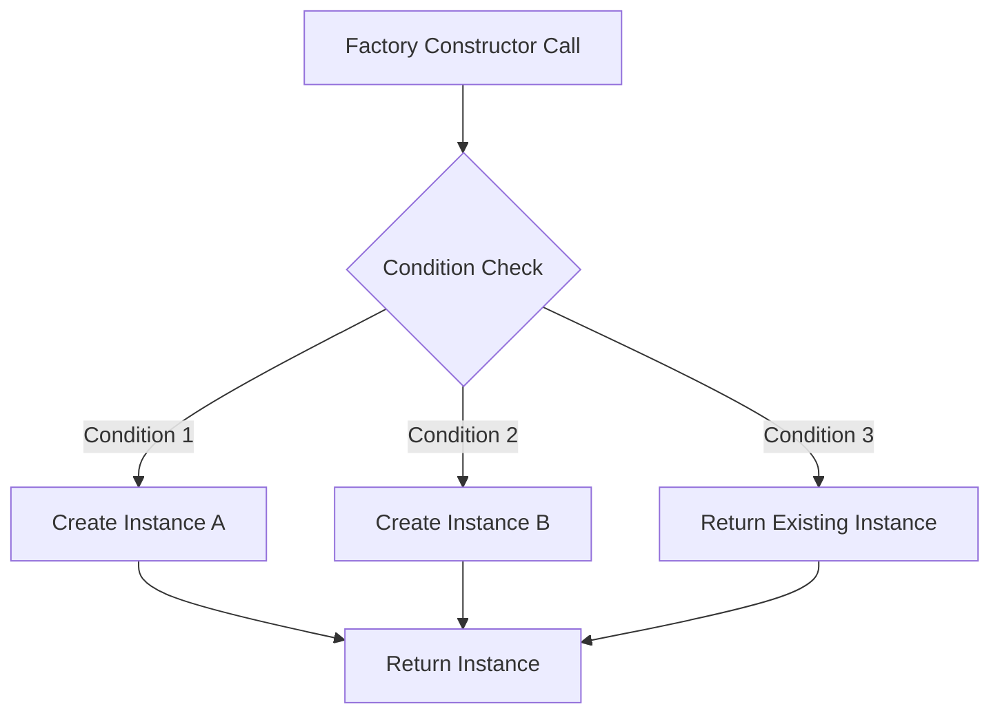

## 4.11 Factory Constructors in Dart

In the realm of Dart programming, factory constructors play a pivotal role in the creation of objects. They provide a mechanism to control the instantiation process, allowing developers to implement complex object creation logic, manage polymorphic instantiation, and efficiently handle singletons and caching. In this section, we will delve deep into the concept of factory constructors, exploring their syntax, use cases, and best practices.

### Understanding Factory Constructors

Factory constructors in Dart are a special type of constructor that can return an instance of the class or a subclass. Unlike regular constructors, which always create a new instance of a class, factory constructors can return existing instances, making them ideal for implementing the Singleton pattern or caching mechanisms.

#### Syntax of Factory Constructors

A factory constructor is defined using the `factory` keyword, followed by the class name and the constructor body. Here's a basic example:

```dart
class MyClass {
  factory MyClass() {
    // Logic to return an instance of MyClass
    return MyClass._internal();
  }

  MyClass._internal(); // Private named constructor
}
```

In this example, the `MyClass` factory constructor uses a private named constructor `_internal` to create an instance. This pattern is often used to control the instantiation process.

### Key Features of Factory Constructors

1. **Polymorphic Instantiation**: Factory constructors can decide which class to instantiate at runtime, enabling polymorphic behavior.

2. **Singletons and Caching**: They can return existing instances, making them suitable for implementing singletons or caching objects.

3. **Conditional Object Creation**: Factory constructors can create objects based on specific conditions or configurations.

4. **Instance Control**: They provide control over the number and type of instances created.

### Implementing Polymorphic Instantiation

Polymorphic instantiation allows a factory constructor to decide which subclass to instantiate based on runtime conditions. This is particularly useful in scenarios where the exact type of object to be created is determined at runtime.

#### Example: Shape Factory

Consider a scenario where we have different types of shapes, and we want to create a specific shape based on input parameters.

```dart
abstract class Shape {
  void draw();
}

class Circle implements Shape {
  @override
  void draw() {
    print('Drawing a Circle');
  }
}

class Square implements Shape {
  @override
  void draw() {
    print('Drawing a Square');
  }
}

class ShapeFactory {
  factory ShapeFactory(String type) {
    if (type == 'circle') {
      return Circle();
    } else if (type == 'square') {
      return Square();
    } else {
      throw Exception('Invalid shape type');
    }
  }
}
```

In this example, the `ShapeFactory` factory constructor decides which shape to instantiate based on the `type` parameter.

### Singleton Pattern with Factory Constructors

The Singleton pattern ensures that a class has only one instance and provides a global point of access to it. Factory constructors are well-suited for implementing singletons in Dart.

#### Example: Logger Singleton

Let's implement a simple logger singleton using a factory constructor.

```dart
class Logger {
  static final Logger _instance = Logger._internal();

  factory Logger() {
    return _instance;
  }

  Logger._internal();

  void log(String message) {
    print('Log: $message');
  }
}

void main() {
  var logger1 = Logger();
  var logger2 = Logger();

  logger1.log('This is a log message.');

  print(logger1 == logger2); // Outputs: true
}
```

In this example, the `Logger` class uses a factory constructor to return the same instance every time, ensuring that only one instance exists.

### Conditional Object Creation

Factory constructors can be used to create objects based on specific conditions or configurations. This is particularly useful in scenarios where the object creation logic is complex or depends on external factors.

#### Example: Configuration-Based Object Creation

Consider a scenario where we create a database connection object based on configuration settings.

```dart
class DatabaseConnection {
  factory DatabaseConnection(String environment) {
    if (environment == 'production') {
      return ProductionDatabaseConnection();
    } else if (environment == 'development') {
      return DevelopmentDatabaseConnection();
    } else {
      throw Exception('Invalid environment');
    }
  }

  void connect() {}
}

class ProductionDatabaseConnection implements DatabaseConnection {
  @override
  void connect() {
    print('Connecting to production database');
  }
}

class DevelopmentDatabaseConnection implements DatabaseConnection {
  @override
  void connect() {
    print('Connecting to development database');
  }
}
```

In this example, the `DatabaseConnection` factory constructor creates a connection object based on the `environment` parameter.

### Instance Control and Management

Factory constructors provide a mechanism to control and manage the instances of a class. This is particularly useful in scenarios where the number of instances needs to be limited or managed.

#### Example: Instance Pooling

Consider a scenario where we want to manage a pool of reusable objects.

```dart
class Connection {
  static final List<Connection> _pool = [];
  static const int _maxPoolSize = 5;

  factory Connection() {
    if (_pool.isNotEmpty) {
      return _pool.removeLast();
    } else if (_pool.length < _maxPoolSize) {
      return Connection._internal();
    } else {
      throw Exception('No available connections');
    }
  }

  Connection._internal();

  void release() {
    _pool.add(this);
  }
}

void main() {
  var connection1 = Connection();
  connection1.release();

  var connection2 = Connection();
  print(connection1 == connection2); // Outputs: true
}
```

In this example, the `Connection` class manages a pool of reusable connections, limiting the number of instances to a maximum pool size.

### Design Considerations

When using factory constructors, consider the following design considerations:

- **Performance**: Factory constructors can improve performance by reusing existing instances and reducing the overhead of object creation.
- **Complexity**: While factory constructors provide flexibility, they can also introduce complexity in the codebase. Ensure that the logic within factory constructors is well-documented and easy to understand.
- **Testing**: Test factory constructors thoroughly to ensure that they return the correct instances under various conditions.

### Differences and Similarities with Other Patterns

Factory constructors are often compared to other creational patterns, such as the Factory Method and Abstract Factory patterns. While they share similarities, there are key differences:

- **Factory Method**: Defines an interface for creating an object but allows subclasses to alter the type of objects that will be created. Factory constructors, on the other hand, are specific to Dart and provide a mechanism to control the instantiation process within a single class.
- **Abstract Factory**: Provides an interface for creating families of related or dependent objects without specifying their concrete classes. Factory constructors are more lightweight and are used within a single class to control object creation.

### Try It Yourself

Experiment with the examples provided by modifying the conditions or adding new subclasses. For instance, try adding a new shape type to the `ShapeFactory` example or implement a new environment configuration in the `DatabaseConnection` example. This hands-on approach will help solidify your understanding of factory constructors in Dart.

### Visualizing Factory Constructors

To better understand the flow of factory constructors, let's visualize the process using a Mermaid.js diagram.



This diagram illustrates how a factory constructor can decide which instance to create or return based on specific conditions.

### Knowledge Check

Before we conclude, let's reinforce your understanding with a few questions:

1. What is the primary purpose of a factory constructor in Dart?
2. How can factory constructors be used to implement the Singleton pattern?
3. What are the benefits of using factory constructors for conditional object creation?
4. How do factory constructors differ from the Factory Method pattern?

### Embrace the Journey

Remember, mastering factory constructors is just one step in your journey to becoming a proficient Dart developer. As you continue to explore and experiment with different design patterns, you'll gain a deeper understanding of how to build efficient and scalable applications. Keep experimenting, stay curious, and enjoy the journey!

## Quiz Time!



### What is the primary purpose of a factory constructor in Dart?

- [x] To control the instantiation process and return existing instances
- [ ] To always create a new instance of a class
- [ ] To define an interface for creating objects
- [ ] To provide a global point of access to a class

> **Explanation:** Factory constructors in Dart are used to control the instantiation process and can return existing instances, unlike regular constructors that always create new instances.

### How can factory constructors be used to implement the Singleton pattern?

- [x] By returning the same instance every time the constructor is called
- [ ] By creating a new instance each time
- [ ] By defining an interface for creating objects
- [ ] By using a private constructor

> **Explanation:** Factory constructors can implement the Singleton pattern by returning the same instance every time, ensuring only one instance exists.

### What are the benefits of using factory constructors for conditional object creation?

- [x] They allow for creating objects based on specific conditions or configurations
- [ ] They always create new instances
- [ ] They define an interface for creating objects
- [ ] They provide a global point of access to a class

> **Explanation:** Factory constructors can create objects based on specific conditions or configurations, providing flexibility in object creation.

### How do factory constructors differ from the Factory Method pattern?

- [x] Factory constructors are specific to Dart and control instantiation within a single class
- [ ] Factory constructors define an interface for creating objects
- [ ] Factory constructors are used to create families of related objects
- [ ] Factory constructors are used to alter the type of objects created by subclasses

> **Explanation:** Factory constructors are specific to Dart and provide a mechanism to control the instantiation process within a single class, unlike the Factory Method pattern.

### Which keyword is used to define a factory constructor in Dart?

- [x] factory
- [ ] new
- [ ] create
- [ ] constructor

> **Explanation:** The `factory` keyword is used to define a factory constructor in Dart.

### What is a common use case for factory constructors?

- [x] Implementing singletons and caching
- [ ] Defining interfaces for object creation
- [ ] Creating new instances every time
- [ ] Providing a global point of access to a class

> **Explanation:** Factory constructors are commonly used for implementing singletons and caching by returning existing instances.

### What is the benefit of using a private named constructor with a factory constructor?

- [x] It allows for controlled instantiation within the class
- [ ] It always creates new instances
- [ ] It defines an interface for creating objects
- [ ] It provides a global point of access to a class

> **Explanation:** A private named constructor allows for controlled instantiation within the class, often used in conjunction with factory constructors.

### How can factory constructors improve performance?

- [x] By reusing existing instances and reducing object creation overhead
- [ ] By always creating new instances
- [ ] By defining interfaces for object creation
- [ ] By providing a global point of access to a class

> **Explanation:** Factory constructors can improve performance by reusing existing instances and reducing the overhead of object creation.

### What should be considered when using factory constructors?

- [x] Performance, complexity, and testing
- [ ] Always creating new instances
- [ ] Defining interfaces for object creation
- [ ] Providing a global point of access to a class

> **Explanation:** When using factory constructors, consider performance, complexity, and testing to ensure they are used effectively.

### True or False: Factory constructors can only be used to create new instances.

- [ ] True
- [x] False

> **Explanation:** False. Factory constructors can return existing instances, making them suitable for implementing singletons and caching.




