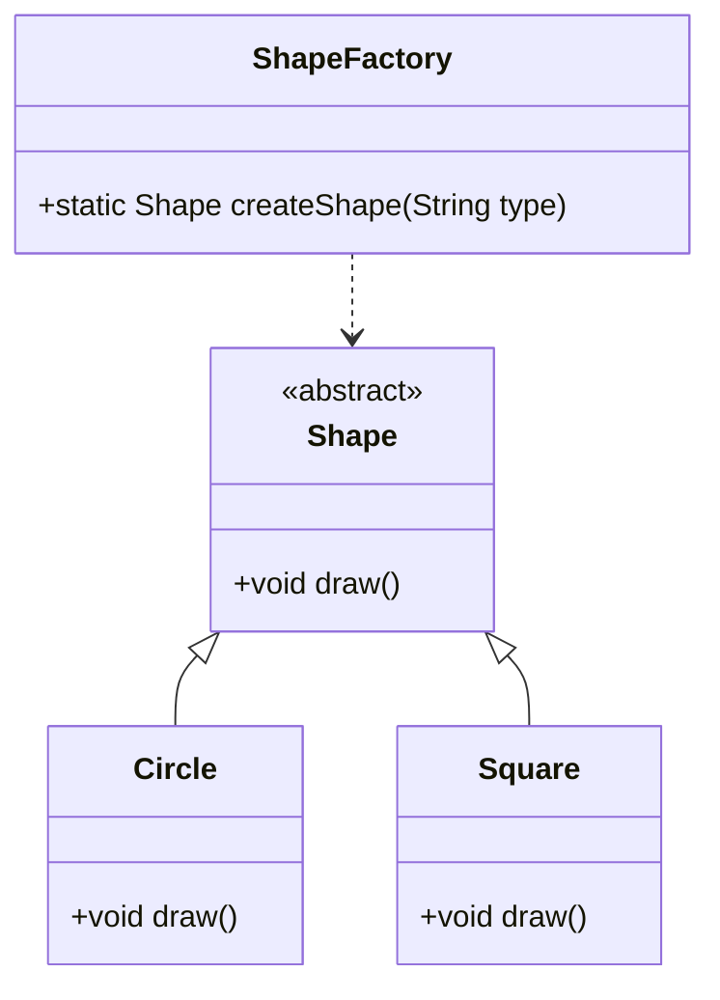

## 4.12 Static Factory Methods

In the realm of software design patterns, Static Factory Methods stand out as a powerful tool for object creation. Unlike traditional constructors, Static Factory Methods provide a flexible and descriptive way to instantiate objects. This section delves into the concept of Static Factory Methods in Dart, exploring their benefits, use cases, and practical implementations. By the end of this guide, you'll have a comprehensive understanding of how to leverage Static Factory Methods to enhance your Dart and Flutter applications.

### Understanding Static Factory Methods

#### What are Static Factory Methods?

Static Factory Methods are static methods that return an instance of a class. Unlike constructors, which are tied to the class they instantiate, Static Factory Methods can have descriptive names that convey the purpose of the object being created. This approach not only improves code readability but also allows for more complex object creation logic to be encapsulated within the method.

#### Key Characteristics

- **Static Nature**: As the name suggests, these methods are static, meaning they belong to the class rather than an instance of the class.
- **Return Type Flexibility**: They can return an instance of the class or a subclass, providing flexibility in object creation.
- **Descriptive Naming**: Method names can describe the creation process, making the code more intuitive.
- **Encapsulation**: They encapsulate the creation logic, hiding it from the user and allowing for changes without affecting client code.

### Benefits of Using Static Factory Methods

#### Improving Code Readability

One of the primary advantages of Static Factory Methods is their ability to improve code readability. By using descriptive method names, developers can convey the intent behind the object creation process. For example, consider the difference between a constructor and a Static Factory Method:

```dart
// Using a constructor
User user = User('John', 'Doe', 30);

// Using a Static Factory Method
User user = User.createWithNameAndAge('John', 'Doe', 30);
```

In the second example, the method name `createWithNameAndAge` clearly indicates the purpose of the method, making the code more understandable.

#### Encapsulation of Creation Logic

Static Factory Methods encapsulate the creation logic within the method itself. This encapsulation allows for more complex initialization processes without exposing the details to the client code. It also provides the flexibility to change the creation logic without impacting the code that uses the method.

#### Flexibility in Object Creation

Static Factory Methods offer flexibility in object creation by allowing the method to return different types of objects. This flexibility is particularly useful in scenarios where the exact type of object to be returned is determined at runtime.

### Use Cases and Examples

#### Convenience Methods

Static Factory Methods are often used to provide convenience methods for object creation. These methods simplify the instantiation process by offering predefined configurations or default values. Dart's standard library includes several examples of such methods:

- **`DateTime.now()`**: Returns the current date and time.
- **`List.filled()`**: Creates a list of a specified length, filled with a given value.

Let's explore how these methods work:

```dart
void main() {
  // Using DateTime.now()
  DateTime currentTime = DateTime.now();
  print('Current Time: $currentTime');

  // Using List.filled()
  List<int> numbers = List.filled(5, 0);
  print('Filled List: $numbers');
}
```

In these examples, the Static Factory Methods provide a straightforward way to create objects with specific configurations.

#### Custom Initialization

Static Factory Methods are also useful for custom initialization processes. They can provide easier ways to instantiate objects with common configurations, reducing the need for repetitive code. Consider the following example:

```dart
class Logger {
  final String name;
  final bool isEnabled;

  Logger._(this.name, this.isEnabled);

  // Static Factory Method for creating a Logger
  static Logger createEnabledLogger(String name) {
    return Logger._(name, true);
  }

  static Logger createDisabledLogger(String name) {
    return Logger._(name, false);
  }
}

void main() {
  Logger enabledLogger = Logger.createEnabledLogger('AppLogger');
  Logger disabledLogger = Logger.createDisabledLogger('AppLogger');

  print('Enabled Logger: ${enabledLogger.isEnabled}');
  print('Disabled Logger: ${disabledLogger.isEnabled}');
}
```

In this example, the `Logger` class uses Static Factory Methods to provide different configurations for the logger's enabled state. This approach simplifies the creation process and enhances code clarity.

### Design Considerations

#### When to Use Static Factory Methods

Static Factory Methods are particularly useful in the following scenarios:

- **Complex Initialization**: When object creation involves complex logic or multiple steps, encapsulating this logic in a Static Factory Method can simplify the process.
- **Multiple Constructors**: When a class requires multiple constructors with different parameters, Static Factory Methods can provide a more descriptive alternative.
- **Encapsulation Needs**: When you want to hide the creation logic from the client code, Static Factory Methods offer an effective solution.

#### Potential Pitfalls

While Static Factory Methods offer numerous benefits, there are some potential pitfalls to be aware of:

- **Overuse**: Overusing Static Factory Methods can lead to bloated classes with too many methods. It's important to strike a balance between convenience and maintainability.
- **Testing Challenges**: Testing code that relies heavily on Static Factory Methods can be challenging, as these methods are tied to the class and cannot be easily mocked.

### Differences and Similarities with Other Patterns

Static Factory Methods are often compared to other creational patterns, such as the Factory Method and Abstract Factory patterns. Here are some key differences and similarities:

- **Factory Method Pattern**: While both patterns involve object creation, the Factory Method pattern typically involves inheritance and polymorphism, whereas Static Factory Methods are simpler and do not require subclassing.
- **Abstract Factory Pattern**: The Abstract Factory pattern provides an interface for creating families of related objects, whereas Static Factory Methods focus on creating individual objects with specific configurations.

### Sample Code Snippet

Let's explore a practical example of using Static Factory Methods in a Dart application. We'll create a simple `Shape` class with different types of shapes:

```dart
abstract class Shape {
  void draw();
}

class Circle extends Shape {
  @override
  void draw() {
    print('Drawing a Circle');
  }
}

class Square extends Shape {
  @override
  void draw() {
    print('Drawing a Square');
  }
}

class ShapeFactory {
  // Static Factory Method for creating shapes
  static Shape createShape(String type) {
    switch (type) {
      case 'circle':
        return Circle();
      case 'square':
        return Square();
      default:
        throw ArgumentError('Invalid shape type');
    }
  }
}

void main() {
  Shape circle = ShapeFactory.createShape('circle');
  Shape square = ShapeFactory.createShape('square');

  circle.draw();
  square.draw();
}
```

In this example, the `ShapeFactory` class provides a Static Factory Method `createShape` that returns different types of shapes based on the input parameter. This approach encapsulates the creation logic and provides a flexible way to create objects.

### Visualizing Static Factory Methods

To better understand the concept of Static Factory Methods, let's visualize the process using a class diagram:



**Diagram Description**: The diagram illustrates the relationship between the `Shape`, `Circle`, `Square`, and `ShapeFactory` classes. The `ShapeFactory` class provides a Static Factory Method `createShape` to instantiate different types of shapes.

### Try It Yourself

To deepen your understanding of Static Factory Methods, try modifying the code examples provided in this guide. Here are some suggestions:

- **Add a New Shape**: Extend the `Shape` class to include a new shape, such as a `Triangle`, and update the `ShapeFactory` to support this new type.
- **Enhance the Logger Example**: Add additional configurations to the `Logger` class, such as log levels, and create corresponding Static Factory Methods.
- **Experiment with Return Types**: Modify the `ShapeFactory` to return a list of shapes instead of a single shape, and explore how this affects the code.

### Knowledge Check

Before we conclude, let's reinforce your understanding of Static Factory Methods with a few questions:

- What are the key benefits of using Static Factory Methods?
- How do Static Factory Methods improve code readability?
- In what scenarios are Static Factory Methods particularly useful?
- What are some potential pitfalls of overusing Static Factory Methods?

### Embrace the Journey

Remember, mastering design patterns is a journey, not a destination. As you continue to explore and experiment with Static Factory Methods, you'll discover new ways to enhance your Dart and Flutter applications. Keep pushing the boundaries, stay curious, and enjoy the process of learning and growth.

## Quiz Time!



### What is a primary advantage of using Static Factory Methods?

- [x] They improve code readability with descriptive method names.
- [ ] They require subclassing for implementation.
- [ ] They are always faster than constructors.
- [ ] They eliminate the need for constructors.

> **Explanation:** Static Factory Methods improve code readability by allowing developers to use descriptive method names that convey the purpose of the object being created.

### How do Static Factory Methods encapsulate creation logic?

- [x] By hiding the creation logic within the method itself.
- [ ] By exposing all creation details to the client code.
- [ ] By requiring subclassing for each object type.
- [ ] By using complex inheritance hierarchies.

> **Explanation:** Static Factory Methods encapsulate creation logic by hiding it within the method, allowing for changes without affecting client code.

### What is a potential pitfall of overusing Static Factory Methods?

- [x] Classes can become bloated with too many methods.
- [ ] They always require more memory than constructors.
- [ ] They cannot be used with abstract classes.
- [ ] They are incompatible with Dart's type system.

> **Explanation:** Overusing Static Factory Methods can lead to bloated classes with too many methods, making the code harder to maintain.

### In what scenario are Static Factory Methods particularly useful?

- [x] When object creation involves complex logic.
- [ ] When a class has only one constructor.
- [ ] When subclassing is not allowed.
- [ ] When performance is the only concern.

> **Explanation:** Static Factory Methods are useful when object creation involves complex logic, as they encapsulate this logic within the method.

### What is a key difference between Static Factory Methods and the Factory Method Pattern?

- [x] Static Factory Methods do not require subclassing.
- [ ] Static Factory Methods always use inheritance.
- [ ] Static Factory Methods are only used in Dart.
- [ ] Static Factory Methods require polymorphism.

> **Explanation:** Unlike the Factory Method Pattern, Static Factory Methods do not require subclassing and are simpler to implement.

### Which of the following is an example of a Static Factory Method in Dart's standard library?

- [x] `DateTime.now()`
- [ ] `StringBuffer()`
- [ ] `int.parse()`
- [ ] `Map()`

> **Explanation:** `DateTime.now()` is a Static Factory Method that returns the current date and time.

### How can Static Factory Methods improve testing?

- [x] By providing a single point of object creation.
- [ ] By making objects immutable.
- [ ] By eliminating the need for mock objects.
- [ ] By using complex inheritance hierarchies.

> **Explanation:** Static Factory Methods provide a single point of object creation, which can simplify testing by centralizing the creation logic.

### What is a common use case for Static Factory Methods?

- [x] Providing convenience methods for object creation.
- [ ] Replacing all constructors in a class.
- [ ] Implementing complex inheritance hierarchies.
- [ ] Eliminating the need for interfaces.

> **Explanation:** Static Factory Methods are commonly used to provide convenience methods for object creation, simplifying the instantiation process.

### What is a benefit of using descriptive names for Static Factory Methods?

- [x] They make the code more intuitive and understandable.
- [ ] They eliminate the need for comments.
- [ ] They always improve performance.
- [ ] They require less memory.

> **Explanation:** Descriptive names for Static Factory Methods make the code more intuitive and understandable by conveying the intent behind the object creation process.

### True or False: Static Factory Methods can return different types of objects.

- [x] True
- [ ] False

> **Explanation:** Static Factory Methods can return different types of objects, providing flexibility in object creation.


