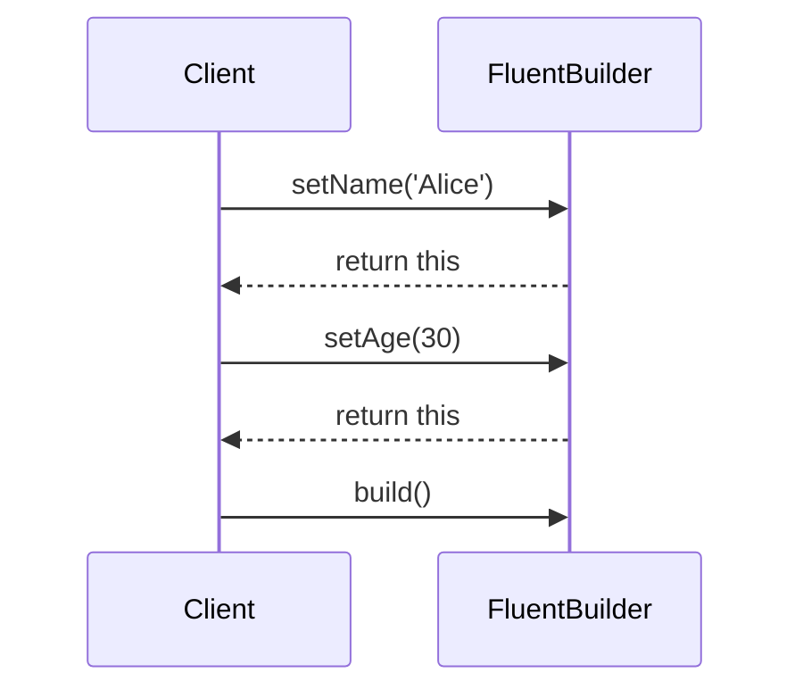

## 4.13 Fluent Interface Pattern

In the realm of software development, the quest for writing clean, readable, and maintainable code is perpetual. The Fluent Interface Pattern is a design pattern that enhances code readability and expressiveness by allowing method chaining. This pattern is particularly useful in Dart and Flutter development, where clarity and simplicity are paramount. In this section, we will delve into the Fluent Interface Pattern, exploring its implementation, use cases, and benefits in Dart.

### Introduction to Fluent Interface Pattern

The Fluent Interface Pattern is a style of object-oriented API design that allows for chaining method calls in a way that mimics natural language. This pattern is characterized by methods that return the current object instance (`this`), enabling a sequence of method calls to be linked together in a single statement. The result is code that is not only more concise but also more intuitive and easier to read.

#### Key Characteristics

- **Chained Method Calls**: Methods return the current object, allowing for a sequence of calls.
- **Improved Readability**: Code reads like a sentence, enhancing clarity.
- **Expressiveness**: The pattern allows for expressive and self-documenting code.

### Implementing Fluent APIs in Dart

Implementing a fluent API in Dart involves designing classes and methods that support method chaining. The core idea is to have methods return `this`, the current instance, so that subsequent method calls can be chained.

#### Returning `this`: Enabling Method Chaining

To implement method chaining, ensure that each method in your class returns the current instance. This is typically done by returning `this` at the end of each method.

```dart
class FluentBuilder {
  String _name;
  int _age;

  FluentBuilder setName(String name) {
    _name = name;
    return this; // Return the current instance
  }

  FluentBuilder setAge(int age) {
    _age = age;
    return this; // Return the current instance
  }

  void build() {
    print('Name: $_name, Age: $_age');
  }
}

void main() {
  FluentBuilder()
    .setName('Alice')
    .setAge(30)
    .build();
}
```

In this example, the `FluentBuilder` class allows for setting properties through chained method calls, culminating in a `build()` method that outputs the constructed object.

#### Combining with Builders: Streamlining Object Construction

The Fluent Interface Pattern is often combined with the Builder Pattern to streamline the construction of complex objects. This combination allows for a more readable and maintainable way to configure objects.

```dart
class Car {
  String _make;
  String _model;
  int _year;

  Car setMake(String make) {
    _make = make;
    return this;
  }

  Car setModel(String model) {
    _model = model;
    return this;
  }

  Car setYear(int year) {
    _year = year;
    return this;
  }

  void build() {
    print('Car: $_make $_model, Year: $_year');
  }
}

void main() {
  Car()
    .setMake('Toyota')
    .setModel('Corolla')
    .setYear(2020)
    .build();
}
```

In this example, the `Car` class uses a fluent interface to allow for the easy configuration of a car object, demonstrating how the pattern can simplify object construction.

### Use Cases and Examples

The Fluent Interface Pattern is versatile and can be applied in various scenarios, from configuration builders to query builders. Let's explore some common use cases.

#### Configuration Builders: Setting Up Complex Objects

Configuration builders benefit greatly from the Fluent Interface Pattern, as they often involve setting multiple properties. The pattern allows for a more readable and organized way to configure objects.

```dart
class DatabaseConfig {
  String _host;
  int _port;
  String _username;
  String _password;

  DatabaseConfig setHost(String host) {
    _host = host;
    return this;
  }

  DatabaseConfig setPort(int port) {
    _port = port;
    return this;
  }

  DatabaseConfig setUsername(String username) {
    _username = username;
    return this;
  }

  DatabaseConfig setPassword(String password) {
    _password = password;
    return this;
  }

  void connect() {
    print('Connecting to $_host:$_port as $_username');
  }
}

void main() {
  DatabaseConfig()
    .setHost('localhost')
    .setPort(5432)
    .setUsername('admin')
    .setPassword('secret')
    .connect();
}
```

In this example, the `DatabaseConfig` class uses a fluent interface to configure database connection settings, making the code more readable and intuitive.

#### Query Builders: Constructing Database or API Queries

Query builders are another area where the Fluent Interface Pattern shines. By allowing for method chaining, query builders can construct complex queries in a concise and readable manner.

```dart
class QueryBuilder {
  String _table;
  List<String> _fields = [];
  String _condition;

  QueryBuilder select(List<String> fields) {
    _fields = fields;
    return this;
  }

  QueryBuilder from(String table) {
    _table = table;
    return this;
  }

  QueryBuilder where(String condition) {
    _condition = condition;
    return this;
  }

  String build() {
    return 'SELECT ${_fields.join(', ')} FROM $_table WHERE $_condition';
  }
}

void main() {
  String query = QueryBuilder()
    .select(['name', 'age'])
    .from('users')
    .where('age > 18')
    .build();

  print(query); // Outputs: SELECT name, age FROM users WHERE age > 18
}
```

The `QueryBuilder` class demonstrates how the Fluent Interface Pattern can be used to construct SQL queries in a clear and concise manner.

### Visualizing the Fluent Interface Pattern

To better understand the Fluent Interface Pattern, let's visualize the flow of method calls using a sequence diagram.



This diagram illustrates how the client interacts with the `FluentBuilder`, chaining method calls to configure and build an object.

### Design Considerations

When implementing the Fluent Interface Pattern, consider the following:

- **Consistency**: Ensure that all methods in the chain return the current instance to maintain consistency.
- **Readability**: Aim for method names that clearly convey their purpose, enhancing the readability of the chained calls.
- **Error Handling**: Consider how errors will be handled within the chain, as exceptions can disrupt the flow of method calls.

### Differences and Similarities with Other Patterns

The Fluent Interface Pattern is often compared to the Builder Pattern due to their complementary nature. While both patterns aim to simplify object construction, the Fluent Interface Pattern focuses on enhancing readability through method chaining, whereas the Builder Pattern provides a structured approach to constructing complex objects.

### Try It Yourself

Experiment with the Fluent Interface Pattern by modifying the code examples provided. Try adding new methods to the `FluentBuilder` or `QueryBuilder` classes, or create your own fluent API for a different use case. Observe how method chaining affects the readability and maintainability of your code.

### References and Links

- [Fluent Interface Pattern on Wikipedia](https://en.wikipedia.org/wiki/Fluent_interface)
- [Dart Language Tour](https://dart.dev/guides/language/language-tour)
- [Effective Dart: Style](https://dart.dev/guides/language/effective-dart/style)

### Knowledge Check

- What is the primary benefit of using the Fluent Interface Pattern?
- How does the Fluent Interface Pattern enhance code readability?
- What is the role of returning `this` in a fluent API?
- How can the Fluent Interface Pattern be combined with the Builder Pattern?

### Embrace the Journey

Remember, mastering design patterns like the Fluent Interface Pattern is a journey. As you continue to explore and experiment with these patterns, you'll gain a deeper understanding of how to write clean, maintainable, and expressive code. Keep experimenting, stay curious, and enjoy the journey!

## Quiz Time!



### What is the primary benefit of the Fluent Interface Pattern?

- [x] Enhances code readability and expressiveness
- [ ] Increases code execution speed
- [ ] Reduces memory usage
- [ ] Simplifies error handling

> **Explanation:** The Fluent Interface Pattern primarily enhances code readability and expressiveness by allowing method chaining.

### How does the Fluent Interface Pattern improve code readability?

- [x] By allowing method chaining that mimics natural language
- [ ] By reducing the number of lines of code
- [ ] By enforcing strict typing
- [ ] By using complex algorithms

> **Explanation:** The pattern improves readability by allowing method chaining, making the code read like a sentence.

### What is the role of returning `this` in a fluent API?

- [x] It enables method chaining by returning the current instance
- [ ] It increases performance by reducing object creation
- [ ] It simplifies error handling
- [ ] It enforces type safety

> **Explanation:** Returning `this` allows for method chaining by returning the current instance of the object.

### Which pattern is often combined with the Fluent Interface Pattern?

- [x] Builder Pattern
- [ ] Singleton Pattern
- [ ] Observer Pattern
- [ ] Factory Pattern

> **Explanation:** The Fluent Interface Pattern is often combined with the Builder Pattern to streamline object construction.

### What is a common use case for the Fluent Interface Pattern?

- [x] Configuration builders
- [ ] Singleton management
- [ ] Event handling
- [ ] Dependency injection

> **Explanation:** Configuration builders are a common use case for the Fluent Interface Pattern, as they involve setting multiple properties.

### How can the Fluent Interface Pattern be applied in query builders?

- [x] By allowing method chaining to construct complex queries
- [ ] By reducing the number of queries
- [ ] By enforcing strict query syntax
- [ ] By optimizing query execution

> **Explanation:** The pattern allows for method chaining, which can be used to construct complex queries in a readable manner.

### What should be considered when implementing the Fluent Interface Pattern?

- [x] Consistency in method return values
- [ ] Reducing the number of methods
- [ ] Increasing the number of parameters
- [ ] Enforcing strict typing

> **Explanation:** Consistency in method return values is crucial to maintain the chain of method calls.

### What is a potential pitfall of the Fluent Interface Pattern?

- [x] Difficulty in handling errors within the chain
- [ ] Increased memory usage
- [ ] Reduced code readability
- [ ] Complexity in implementation

> **Explanation:** Handling errors within a chain of method calls can be challenging and may disrupt the flow.

### How does the Fluent Interface Pattern differ from the Builder Pattern?

- [x] It focuses on readability through method chaining
- [ ] It provides a structured approach to object construction
- [ ] It enforces type safety
- [ ] It reduces code complexity

> **Explanation:** The Fluent Interface Pattern focuses on enhancing readability through method chaining, while the Builder Pattern provides a structured approach to object construction.

### True or False: The Fluent Interface Pattern is only applicable in Dart.

- [ ] True
- [x] False

> **Explanation:** The Fluent Interface Pattern is not limited to Dart; it can be applied in various programming languages to enhance code readability.




