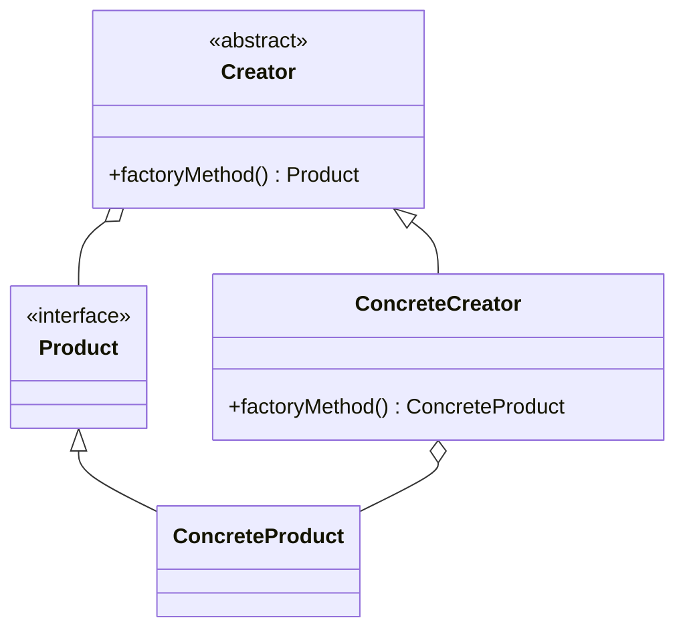

## 4.2 Factory Method Design Pattern

The Factory Method Design Pattern is a creational pattern that provides an interface for creating objects in a superclass but allows subclasses to alter the type of objects that will be created. This pattern is particularly useful in scenarios where a class cannot anticipate the class of objects it must create. By delegating the responsibility of instantiation to subclasses, the Factory Method pattern promotes loose coupling and enhances code flexibility and scalability.

### Intent of the Factory Method Pattern

The primary intent of the Factory Method pattern is to define an interface for creating an object, but let subclasses decide which class to instantiate. This pattern allows a class to defer instantiation to subclasses, thereby promoting flexibility and reuse.

### Key Participants

1. **Product**: Defines the interface of objects the factory method creates.
2. **ConcreteProduct**: Implements the Product interface.
3. **Creator**: Declares the factory method, which returns an object of type Product. Creator may also define a default implementation of the factory method that returns a default ConcreteProduct object.
4. **ConcreteCreator**: Overrides the factory method to return an instance of a ConcreteProduct.

### Implementing Factory Method in Dart

In Dart, the Factory Method pattern can be implemented using abstract classes, interfaces, and factory constructors. Let's explore each of these components in detail.

#### Abstract Classes and Interfaces

Abstract classes in Dart are used to define the interface for creating an object. They can contain abstract methods that must be implemented by subclasses. Interfaces in Dart are implicitly defined by classes, and any class can implement multiple interfaces.

```dart
// Abstract class defining the Product interface
abstract class Button {
  void render();
  void onClick();
}

// ConcreteProduct implementing the Product interface
class WindowsButton implements Button {
  @override
  void render() {
    print('Render a button in Windows style');
  }

  @override
  void onClick() {
    print('Handle click in Windows style');
  }
}

// Another ConcreteProduct implementing the Product interface
class MacOSButton implements Button {
  @override
  void render() {
    print('Render a button in macOS style');
  }

  @override
  void onClick() {
    print('Handle click in macOS style');
  }
}
```

#### Factory Constructors

Dart provides a `factory` keyword that allows you to define constructors that can return instances of subclasses. This is particularly useful for implementing the Factory Method pattern, as it allows you to encapsulate the object creation logic within a factory method.

```dart
// Creator class with a factory method
abstract class Dialog {
  factory Dialog(String osType) {
    switch (osType) {
      case 'Windows':
        return WindowsDialog();
      case 'macOS':
        return MacOSDialog();
      default:
        throw Exception('Unsupported OS type');
    }
  }

  Button createButton();
}

// ConcreteCreator for Windows
class WindowsDialog implements Dialog {
  @override
  Button createButton() {
    return WindowsButton();
  }
}

// ConcreteCreator for macOS
class MacOSDialog implements Dialog {
  @override
  Button createButton() {
    return MacOSButton();
  }
}
```

#### Parameterization

Dart's support for optional and named parameters enhances the flexibility of the Factory Method pattern. By parameterizing the factory method, you can create objects with varying configurations.

```dart
// Factory method with parameterization
abstract class Shape {
  void draw();
}

class Circle implements Shape {
  final double radius;

  Circle({required this.radius});

  @override
  void draw() {
    print('Drawing a circle with radius $radius');
  }
}

class Square implements Shape {
  final double side;

  Square({required this.side});

  @override
  void draw() {
    print('Drawing a square with side $side');
  }
}

class ShapeFactory {
  static Shape createShape(String type, {double size = 0}) {
    switch (type) {
      case 'Circle':
        return Circle(radius: size);
      case 'Square':
        return Square(side: size);
      default:
        throw Exception('Unknown shape type');
    }
  }
}
```

### Use Cases and Examples

The Factory Method pattern is versatile and can be applied in various scenarios. Let's explore some practical use cases and examples.

#### Widgets with Varying Implementations

In Flutter, you may need to create platform-specific widgets. The Factory Method pattern allows you to encapsulate the creation logic and return different widget implementations based on the platform.

```dart
import 'dart:io';

abstract class PlatformWidget {
  Widget build();
}

class AndroidWidget implements PlatformWidget {
  @override
  Widget build() {
    return Text('Android Widget');
  }
}

class IOSWidget implements PlatformWidget {
  @override
  Widget build() {
    return Text('iOS Widget');
  }
}

class PlatformWidgetFactory {
  static PlatformWidget createPlatformWidget() {
    if (Platform.isAndroid) {
      return AndroidWidget();
    } else if (Platform.isIOS) {
      return IOSWidget();
    } else {
      throw Exception('Unsupported platform');
    }
  }
}
```

#### Parsing Data

When dealing with data parsing, you may need to return different parser implementations based on the input format. The Factory Method pattern can help you encapsulate this logic.

```dart
abstract class DataParser {
  void parse(String data);
}

class JsonParser implements DataParser {
  @override
  void parse(String data) {
    print('Parsing JSON data: $data');
  }
}

class XmlParser implements DataParser {
  @override
  void parse(String data) {
    print('Parsing XML data: $data');
  }
}

class DataParserFactory {
  static DataParser createParser(String format) {
    switch (format) {
      case 'JSON':
        return JsonParser();
      case 'XML':
        return XmlParser();
      default:
        throw Exception('Unsupported format');
    }
  }
}
```

#### Service Classes

In a development environment, you may want to return mock services for testing purposes, while in production, you would return real services. The Factory Method pattern allows you to encapsulate this decision-making process.

```dart
abstract class ApiService {
  void fetchData();
}

class RealApiService implements ApiService {
  @override
  void fetchData() {
    print('Fetching data from real API');
  }
}

class MockApiService implements ApiService {
  @override
  void fetchData() {
    print('Fetching data from mock API');
  }
}

class ApiServiceFactory {
  static ApiService createApiService(bool isProduction) {
    if (isProduction) {
      return RealApiService();
    } else {
      return MockApiService();
    }
  }
}
```

### Design Considerations

When implementing the Factory Method pattern in Dart, consider the following:

- **Flexibility**: The pattern provides flexibility by allowing subclasses to decide which class to instantiate. This is particularly useful in scenarios where the exact class of the object to be created is not known until runtime.
- **Code Reuse**: By encapsulating the object creation logic, the Factory Method pattern promotes code reuse and reduces duplication.
- **Complexity**: While the pattern provides flexibility, it can also introduce complexity, especially if there are many subclasses involved. It's important to balance flexibility with simplicity.
- **Dart-Specific Features**: Utilize Dart's factory constructors and parameterization features to enhance the implementation of the Factory Method pattern.

### Differences and Similarities

The Factory Method pattern is often confused with the Abstract Factory pattern. While both patterns deal with object creation, they differ in their approach:

- **Factory Method**: Focuses on defining an interface for creating a single object, but lets subclasses decide which class to instantiate.
- **Abstract Factory**: Provides an interface for creating families of related or dependent objects without specifying their concrete classes.

### Visualizing the Factory Method Pattern

To better understand the Factory Method pattern, let's visualize the relationships between the key participants using a class diagram.



**Diagram Description**: The class diagram illustrates the relationship between the Creator, ConcreteCreator, Product, and ConcreteProduct classes. The Creator class defines the factory method, which returns a Product. The ConcreteCreator class overrides the factory method to return a ConcreteProduct.

### Try It Yourself

To deepen your understanding of the Factory Method pattern, try modifying the code examples provided. Here are some suggestions:

- **Add a New Product**: Extend the example by adding a new product type and updating the factory method to handle it.
- **Parameterize the Factory Method**: Experiment with different parameterization techniques to create more flexible factory methods.
- **Implement a New Use Case**: Think of a real-world scenario where the Factory Method pattern could be applied and implement it in Dart.

### Knowledge Check

Before moving on, let's reinforce what we've learned about the Factory Method pattern. Consider the following questions:

- What is the primary intent of the Factory Method pattern?
- How does the Factory Method pattern promote flexibility and code reuse?
- What are some practical use cases for the Factory Method pattern in Dart and Flutter?

### Embrace the Journey

Remember, mastering design patterns is a journey. As you continue to explore and implement the Factory Method pattern, you'll gain a deeper understanding of its benefits and applications. Keep experimenting, stay curious, and enjoy the journey!

## Quiz Time!



### What is the primary intent of the Factory Method pattern?

- [x] To define an interface for creating an object, but let subclasses decide which class to instantiate.
- [ ] To create a family of related objects without specifying their concrete classes.
- [ ] To allow objects to change their behavior when their internal state changes.
- [ ] To provide a way to access the elements of an aggregate object sequentially.

> **Explanation:** The Factory Method pattern's primary intent is to define an interface for creating an object, but let subclasses decide which class to instantiate.

### Which Dart feature is particularly useful for implementing the Factory Method pattern?

- [x] Factory constructors
- [ ] Extension methods
- [ ] Mixins
- [ ] Generics

> **Explanation:** Factory constructors in Dart allow you to define constructors that can return instances of subclasses, making them particularly useful for implementing the Factory Method pattern.

### What is a key difference between the Factory Method and Abstract Factory patterns?

- [x] Factory Method focuses on creating a single object, while Abstract Factory creates families of related objects.
- [ ] Factory Method is used for object creation, while Abstract Factory is used for object destruction.
- [ ] Factory Method is a structural pattern, while Abstract Factory is a behavioral pattern.
- [ ] Factory Method is used for creating immutable objects, while Abstract Factory is used for mutable objects.

> **Explanation:** The Factory Method pattern focuses on creating a single object, while the Abstract Factory pattern creates families of related objects.

### In the Factory Method pattern, what role does the Creator class play?

- [x] It declares the factory method, which returns an object of type Product.
- [ ] It implements the Product interface.
- [ ] It overrides the factory method to return a ConcreteProduct.
- [ ] It defines the interface for creating an object.

> **Explanation:** The Creator class declares the factory method, which returns an object of type Product.

### How does the Factory Method pattern promote code reuse?

- [x] By encapsulating the object creation logic, reducing duplication.
- [ ] By allowing objects to change their behavior when their internal state changes.
- [ ] By providing a way to access the elements of an aggregate object sequentially.
- [ ] By creating a family of related objects without specifying their concrete classes.

> **Explanation:** The Factory Method pattern promotes code reuse by encapsulating the object creation logic, reducing duplication.

### What is a practical use case for the Factory Method pattern in Flutter?

- [x] Creating platform-specific widgets.
- [ ] Implementing state management.
- [ ] Handling user input.
- [ ] Managing application lifecycle.

> **Explanation:** A practical use case for the Factory Method pattern in Flutter is creating platform-specific widgets.

### Which of the following is NOT a key participant in the Factory Method pattern?

- [x] Observer
- [ ] Product
- [ ] ConcreteProduct
- [ ] Creator

> **Explanation:** Observer is not a key participant in the Factory Method pattern. The key participants are Product, ConcreteProduct, Creator, and ConcreteCreator.

### How can parameterization enhance the Factory Method pattern in Dart?

- [x] By allowing the creation of objects with varying configurations.
- [ ] By enabling the use of mixins for code reuse.
- [ ] By providing a way to handle asynchronous operations.
- [ ] By allowing objects to change their behavior when their internal state changes.

> **Explanation:** Parameterization enhances the Factory Method pattern in Dart by allowing the creation of objects with varying configurations.

### What is the role of the ConcreteCreator class in the Factory Method pattern?

- [x] It overrides the factory method to return an instance of a ConcreteProduct.
- [ ] It declares the factory method, which returns an object of type Product.
- [ ] It defines the interface for creating an object.
- [ ] It implements the Product interface.

> **Explanation:** The ConcreteCreator class overrides the factory method to return an instance of a ConcreteProduct.

### True or False: The Factory Method pattern can introduce complexity if there are many subclasses involved.

- [x] True
- [ ] False

> **Explanation:** True. While the Factory Method pattern provides flexibility, it can introduce complexity, especially if there are many subclasses involved.


