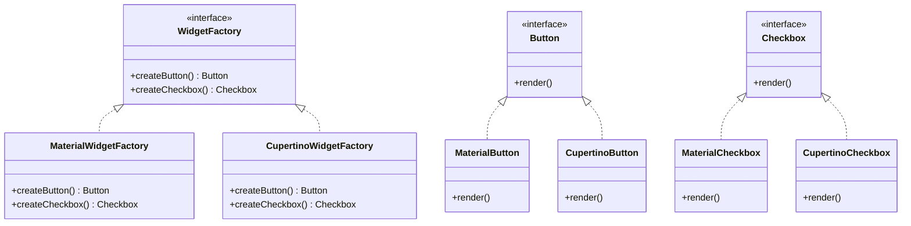

## 4.3 Abstract Factory Design Pattern

The Abstract Factory Design Pattern is a creational pattern that provides an interface for creating families of related or dependent objects without specifying their concrete classes. This pattern is particularly useful in scenarios where a system needs to be independent of how its objects are created, composed, and represented. In Dart, this pattern can be effectively utilized to enhance the modularity and scalability of Flutter applications.

### Intent

The primary intent of the Abstract Factory Design Pattern is to encapsulate a group of individual factories that have a common theme. It provides a way to create objects that are related or dependent on each other without having to specify their concrete classes. This pattern is beneficial when a system needs to be configured with one of multiple families of products.

### Key Participants

1. **Abstract Factory**: Declares an interface for operations that create abstract product objects.
2. **Concrete Factory**: Implements the operations to create concrete product objects.
3. **Abstract Product**: Declares an interface for a type of product object.
4. **Concrete Product**: Defines a product object to be created by the corresponding concrete factory; implements the abstract product interface.
5. **Client**: Uses only interfaces declared by Abstract Factory and Abstract Product classes.

### Implementing Abstract Factory in Dart

#### Abstract Factory Classes

In Dart, you begin by defining abstract factory classes that declare methods for creating abstract products. These classes serve as blueprints for concrete factories.

```dart
// Abstract Factory
abstract class WidgetFactory {
  Button createButton();
  Checkbox createCheckbox();
}

// Abstract Product A
abstract class Button {
  void render();
}

// Abstract Product B
abstract class Checkbox {
  void render();
}
```

#### Concrete Factories

Concrete factories implement the abstract factory interface to create concrete objects. Each concrete factory corresponds to a specific variant of products.

```dart
// Concrete Factory 1
class MaterialWidgetFactory implements WidgetFactory {
  @override
  Button createButton() => MaterialButton();

  @override
  Checkbox createCheckbox() => MaterialCheckbox();
}

// Concrete Factory 2
class CupertinoWidgetFactory implements WidgetFactory {
  @override
  Button createButton() => CupertinoButton();

  @override
  Checkbox createCheckbox() => CupertinoCheckbox();
}

// Concrete Product A1
class MaterialButton implements Button {
  @override
  void render() {
    print('Rendering Material Button');
  }
}

// Concrete Product B1
class MaterialCheckbox implements Checkbox {
  @override
  void render() {
    print('Rendering Material Checkbox');
  }
}

// Concrete Product A2
class CupertinoButton implements Button {
  @override
  void render() {
    print('Rendering Cupertino Button');
  }
}

// Concrete Product B2
class CupertinoCheckbox implements Checkbox {
  @override
  void render() {
    print('Rendering Cupertino Checkbox');
  }
}
```

#### Dependency Injection

Dependency injection is a technique used to inject factory implementations where needed. This allows for greater flexibility and testability.

```dart
class Application {
  final WidgetFactory widgetFactory;

  Application(this.widgetFactory);

  void renderUI() {
    final button = widgetFactory.createButton();
    final checkbox = widgetFactory.createCheckbox();
    button.render();
    checkbox.render();
  }
}

void main() {
  // Injecting MaterialWidgetFactory
  final app = Application(MaterialWidgetFactory());
  app.renderUI();

  // Injecting CupertinoWidgetFactory
  final app2 = Application(CupertinoWidgetFactory());
  app2.renderUI();
}
```

### Use Cases and Examples

#### Theming Systems

In Flutter, theming systems can benefit from the Abstract Factory pattern by providing different UI components based on a theme. This allows for seamless switching between themes without altering the core logic.

#### Cross-Platform Support

Flutter applications often need to support multiple platforms. The Abstract Factory pattern can be used to create platform-specific elements, ensuring that the app behaves consistently across different environments.

#### Modular Applications

For modular applications, the Abstract Factory pattern allows for swapping out entire modules or services seamlessly. This is particularly useful in large-scale applications where different modules might need to be replaced or upgraded independently.

### Visualizing the Abstract Factory Pattern

To better understand the Abstract Factory pattern, let's visualize the relationships between the components using a class diagram.



### Design Considerations

When implementing the Abstract Factory pattern in Dart, consider the following:

- **Flexibility**: The pattern provides flexibility in terms of product creation, allowing for easy addition of new product families.
- **Complexity**: The pattern can introduce complexity due to the increased number of classes and interfaces.
- **Consistency**: Ensure that all products created by a factory are compatible with each other.

### Differences and Similarities

The Abstract Factory pattern is often confused with the Factory Method pattern. While both are creational patterns, the key difference is that the Abstract Factory pattern involves multiple factory methods for creating families of related products, whereas the Factory Method pattern involves a single method for creating a single product.

### Try It Yourself

To deepen your understanding of the Abstract Factory pattern, try modifying the code examples provided:

- **Add a new product type**: Implement a new product type, such as a `Slider`, and update the factories to create this new product.
- **Create a new concrete factory**: Implement a new concrete factory that produces a different style of widgets, such as `WindowsWidgetFactory`.
- **Experiment with themes**: Implement a theming system that switches between `Material` and `Cupertino` themes based on user preferences.

### Knowledge Check

- **What is the primary intent of the Abstract Factory pattern?**
- **How does the Abstract Factory pattern differ from the Factory Method pattern?**
- **What are the key participants in the Abstract Factory pattern?**

### Embrace the Journey

Remember, mastering design patterns is an ongoing journey. As you continue to explore and implement these patterns, you'll gain a deeper understanding of how to create scalable and maintainable applications. Keep experimenting, stay curious, and enjoy the process!

## Quiz Time!



### What is the primary intent of the Abstract Factory pattern?

- [x] To create families of related objects without specifying their concrete classes.
- [ ] To create a single object without specifying its concrete class.
- [ ] To provide a way to access the elements of an aggregate object sequentially.
- [ ] To define a skeleton of an algorithm in an operation.

> **Explanation:** The Abstract Factory pattern is used to create families of related objects without specifying their concrete classes.

### Which of the following is a key participant in the Abstract Factory pattern?

- [x] Abstract Factory
- [ ] Singleton
- [ ] Adapter
- [ ] Observer

> **Explanation:** The Abstract Factory is a key participant in the Abstract Factory pattern, responsible for declaring an interface for creating abstract product objects.

### How does the Abstract Factory pattern differ from the Factory Method pattern?

- [x] Abstract Factory involves multiple factory methods for creating families of related products, whereas Factory Method involves a single method for creating a single product.
- [ ] Abstract Factory creates a single object, while Factory Method creates multiple objects.
- [ ] Abstract Factory is used for structural patterns, while Factory Method is used for behavioral patterns.
- [ ] Abstract Factory is used for concurrency patterns, while Factory Method is used for creational patterns.

> **Explanation:** The Abstract Factory pattern involves multiple factory methods for creating families of related products, whereas the Factory Method pattern involves a single method for creating a single product.

### What is a common use case for the Abstract Factory pattern in Flutter?

- [x] Theming systems
- [ ] State management
- [ ] Data persistence
- [ ] Network requests

> **Explanation:** The Abstract Factory pattern is commonly used in theming systems to provide different UI components based on a theme.

### Which of the following is NOT a key participant in the Abstract Factory pattern?

- [ ] Concrete Factory
- [ ] Abstract Product
- [x] Singleton
- [ ] Concrete Product

> **Explanation:** Singleton is not a key participant in the Abstract Factory pattern. The key participants include Concrete Factory, Abstract Product, and Concrete Product.

### What is the role of the Client in the Abstract Factory pattern?

- [x] To use only interfaces declared by Abstract Factory and Abstract Product classes.
- [ ] To implement the operations to create concrete product objects.
- [ ] To declare an interface for a type of product object.
- [ ] To define a product object to be created by the corresponding concrete factory.

> **Explanation:** The Client uses only interfaces declared by Abstract Factory and Abstract Product classes.

### What is a benefit of using the Abstract Factory pattern?

- [x] It provides flexibility in terms of product creation.
- [ ] It simplifies the code by reducing the number of classes.
- [ ] It ensures that all products are created by a single factory.
- [ ] It eliminates the need for interfaces.

> **Explanation:** The Abstract Factory pattern provides flexibility in terms of product creation, allowing for easy addition of new product families.

### What is a potential drawback of the Abstract Factory pattern?

- [x] It can introduce complexity due to the increased number of classes and interfaces.
- [ ] It limits the flexibility of product creation.
- [ ] It makes it difficult to add new product families.
- [ ] It requires all products to be created by a single factory.

> **Explanation:** The Abstract Factory pattern can introduce complexity due to the increased number of classes and interfaces.

### True or False: The Abstract Factory pattern is used to create a single object without specifying its concrete class.

- [ ] True
- [x] False

> **Explanation:** False. The Abstract Factory pattern is used to create families of related objects without specifying their concrete classes.

### Which pattern is often confused with the Abstract Factory pattern?

- [x] Factory Method
- [ ] Singleton
- [ ] Adapter
- [ ] Observer

> **Explanation:** The Factory Method pattern is often confused with the Abstract Factory pattern, but they differ in their approach to product creation.




