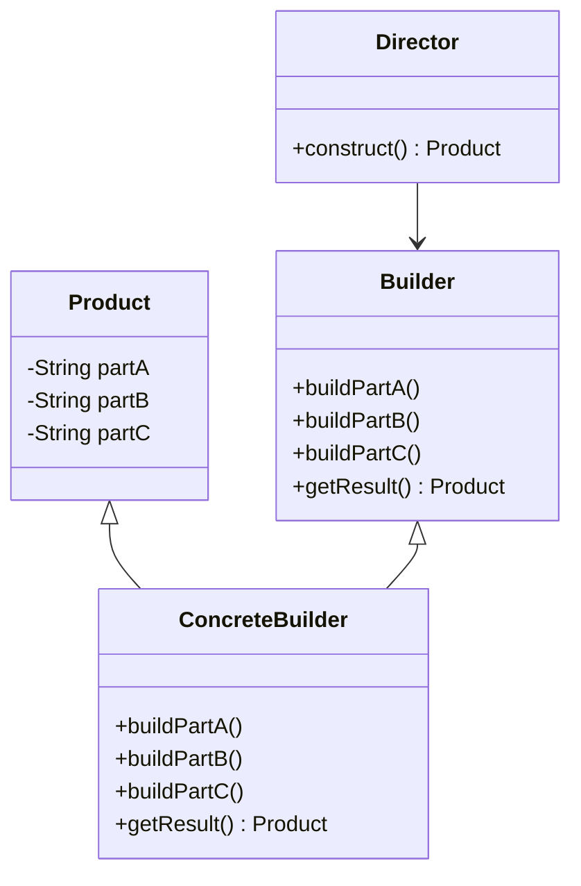

## 4.4 Builder Design Pattern

The Builder Design Pattern is a creational pattern that provides a flexible solution to constructing complex objects. It separates the construction of a complex object from its representation, allowing the same construction process to create different representations. This pattern is particularly useful in Dart and Flutter development, where you often deal with complex UI components and configurations.

### Intent

The primary intent of the Builder Design Pattern is to construct a complex object step by step. It allows for greater control over the construction process and enables the creation of different representations of the object. This pattern is particularly beneficial when an object requires numerous parameters for its creation, or when the construction process involves multiple steps.

### Key Participants

1. **Builder**: An interface that defines the steps to build the product.
2. **ConcreteBuilder**: A class that implements the Builder interface and provides specific implementations for the construction steps.
3. **Director**: A class that constructs the object using the Builder interface.
4. **Product**: The complex object that is being built.

### Implementing Builder in Dart

In Dart, implementing the Builder Design Pattern involves creating a Builder class with methods to set properties incrementally. This can be achieved using method chaining and fluent interfaces to make the code more readable and expressive.

#### Builder Classes

Builder classes in Dart are responsible for constructing the object. They provide methods to set each property of the object. Here's a simple example of a Builder class in Dart:

```dart
class Pizza {
  String dough;
  String sauce;
  String topping;

  Pizza._builder(PizzaBuilder builder)
      : dough = builder.dough,
        sauce = builder.sauce,
        topping = builder.topping;
}

class PizzaBuilder {
  String dough;
  String sauce;
  String topping;

  PizzaBuilder setDough(String dough) {
    this.dough = dough;
    return this;
  }

  PizzaBuilder setSauce(String sauce) {
    this.sauce = sauce;
    return this;
  }

  PizzaBuilder setTopping(String topping) {
    this.topping = topping;
    return this;
  }

  Pizza build() {
    return Pizza._builder(this);
  }
}
```

In this example, the `PizzaBuilder` class provides methods to set each property of the `Pizza` object. The `build` method constructs the `Pizza` object using the values set in the builder.

#### Method Chaining

Method chaining is a technique used in the Builder pattern to allow multiple method calls to be chained together. This is achieved by returning `this` from each method, enabling a fluent interface.

```dart
var pizza = PizzaBuilder()
  .setDough('Thin Crust')
  .setSauce('Tomato')
  .setTopping('Pepperoni')
  .build();
```

In this example, method chaining allows us to set the properties of the `Pizza` object in a single line of code, making it more readable and expressive.

#### Fluent Interfaces

Fluent interfaces are a style of designing object-oriented APIs that rely on method chaining to provide a more readable and expressive code. They are particularly useful in the Builder pattern, where multiple properties need to be set.

```dart
class Car {
  String engine;
  String color;
  int seats;

  Car._builder(CarBuilder builder)
      : engine = builder.engine,
        color = builder.color,
        seats = builder.seats;
}

class CarBuilder {
  String engine;
  String color;
  int seats;

  CarBuilder setEngine(String engine) {
    this.engine = engine;
    return this;
  }

  CarBuilder setColor(String color) {
    this.color = color;
    return this;
  }

  CarBuilder setSeats(int seats) {
    this.seats = seats;
    return this;
  }

  Car build() {
    return Car._builder(this);
  }
}

var car = CarBuilder()
  .setEngine('V8')
  .setColor('Red')
  .setSeats(4)
  .build();
```

The `CarBuilder` class uses a fluent interface to set the properties of the `Car` object, making the code more readable and expressive.

#### Step Builder Pattern

The Step Builder Pattern is a variation of the Builder pattern that guides the object creation process through defined steps. This pattern is useful when the construction process involves multiple steps that need to be followed in a specific order.

```dart
class House {
  String foundation;
  String structure;
  String roof;

  House._builder(HouseBuilder builder)
      : foundation = builder.foundation,
        structure = builder.structure,
        roof = builder.roof;
}

class HouseBuilder {
  String foundation;
  String structure;
  String roof;

  HouseBuilder setFoundation(String foundation) {
    this.foundation = foundation;
    return this;
  }

  HouseBuilder setStructure(String structure) {
    this.structure = structure;
    return this;
  }

  HouseBuilder setRoof(String roof) {
    this.roof = roof;
    return this;
  }

  House build() {
    return House._builder(this);
  }
}

var house = HouseBuilder()
  .setFoundation('Concrete')
  .setStructure('Wood')
  .setRoof('Tiles')
  .build();
```

In this example, the `HouseBuilder` class guides the construction process through defined steps, ensuring that the foundation, structure, and roof are set in the correct order.

### Use Cases and Examples

The Builder Design Pattern is particularly useful in scenarios where complex objects need to be constructed. Here are some common use cases and examples:

#### Complex Widgets

In Flutter, widgets can have many configurable options, making the Builder pattern an ideal choice for constructing complex widgets.

```dart
class CustomWidget {
  final String title;
  final String description;
  final Color color;

  CustomWidget._builder(CustomWidgetBuilder builder)
      : title = builder.title,
        description = builder.description,
        color = builder.color;
}

class CustomWidgetBuilder {
  String title;
  String description;
  Color color;

  CustomWidgetBuilder setTitle(String title) {
    this.title = title;
    return this;
  }

  CustomWidgetBuilder setDescription(String description) {
    this.description = description;
    return this;
  }

  CustomWidgetBuilder setColor(Color color) {
    this.color = color;
    return this;
  }

  CustomWidget build() {
    return CustomWidget._builder(this);
  }
}

var widget = CustomWidgetBuilder()
  .setTitle('My Widget')
  .setDescription('This is a custom widget')
  .setColor(Colors.blue)
  .build();
```

In this example, the `CustomWidgetBuilder` class is used to construct a `CustomWidget` with various configurable options.

#### Configuration Objects

Configuration objects often require numerous parameters, making the Builder pattern an ideal choice for constructing them.

```dart
class Configuration {
  final String apiUrl;
  final int timeout;
  final bool useHttps;

  Configuration._builder(ConfigurationBuilder builder)
      : apiUrl = builder.apiUrl,
        timeout = builder.timeout,
        useHttps = builder.useHttps;
}

class ConfigurationBuilder {
  String apiUrl;
  int timeout;
  bool useHttps;

  ConfigurationBuilder setApiUrl(String apiUrl) {
    this.apiUrl = apiUrl;
    return this;
  }

  ConfigurationBuilder setTimeout(int timeout) {
    this.timeout = timeout;
    return this;
  }

  ConfigurationBuilder setUseHttps(bool useHttps) {
    this.useHttps = useHttps;
    return this;
  }

  Configuration build() {
    return Configuration._builder(this);
  }
}

var config = ConfigurationBuilder()
  .setApiUrl('https://api.example.com')
  .setTimeout(5000)
  .setUseHttps(true)
  .build();
```

In this example, the `ConfigurationBuilder` class is used to construct a `Configuration` object with various parameters.

#### Network Requests

The Builder pattern can be used to set up HTTP requests with various parameters, making it easier to configure and manage network requests.

```dart
class HttpRequest {
  final String url;
  final String method;
  final Map<String, String> headers;
  final String body;

  HttpRequest._builder(HttpRequestBuilder builder)
      : url = builder.url,
        method = builder.method,
        headers = builder.headers,
        body = builder.body;
}

class HttpRequestBuilder {
  String url;
  String method;
  Map<String, String> headers = {};
  String body;

  HttpRequestBuilder setUrl(String url) {
    this.url = url;
    return this;
  }

  HttpRequestBuilder setMethod(String method) {
    this.method = method;
    return this;
  }

  HttpRequestBuilder addHeader(String key, String value) {
    headers[key] = value;
    return this;
  }

  HttpRequestBuilder setBody(String body) {
    this.body = body;
    return this;
  }

  HttpRequest build() {
    return HttpRequest._builder(this);
  }
}

var request = HttpRequestBuilder()
  .setUrl('https://api.example.com/data')
  .setMethod('POST')
  .addHeader('Content-Type', 'application/json')
  .setBody('{"key": "value"}')
  .build();
```

In this example, the `HttpRequestBuilder` class is used to construct an `HttpRequest` object with various parameters.

### Design Considerations

When using the Builder Design Pattern, consider the following:

- **When to Use**: Use the Builder pattern when the construction process is complex or involves multiple steps. It is also useful when an object requires numerous parameters for its creation.
- **Pitfalls**: Avoid using the Builder pattern for simple objects, as it can add unnecessary complexity. Ensure that the Builder class provides a clear and intuitive interface for constructing the object.
- **Dart-Specific Features**: Take advantage of Dart's named parameters and optional parameters to simplify the Builder pattern. Use method chaining and fluent interfaces to make the code more readable and expressive.

### Differences and Similarities

The Builder Design Pattern is often confused with other creational patterns, such as the Factory Method and Abstract Factory patterns. Here are some key differences and similarities:

- **Builder vs. Factory Method**: The Factory Method pattern creates objects through a single method, while the Builder pattern constructs objects step by step.
- **Builder vs. Abstract Factory**: The Abstract Factory pattern provides an interface for creating families of related objects, while the Builder pattern focuses on constructing a single complex object.
- **Similarities**: Both the Builder and Factory patterns are creational patterns that abstract the object creation process.

### Visualizing the Builder Pattern

To better understand the Builder Design Pattern, let's visualize the process using a class diagram.



**Diagram Description**: This class diagram illustrates the relationship between the `Product`, `Builder`, `ConcreteBuilder`, and `Director` classes. The `ConcreteBuilder` class implements the `Builder` interface to construct the `Product` object. The `Director` class uses the `Builder` interface to construct the `Product`.

### Try It Yourself

Experiment with the Builder Design Pattern by modifying the code examples provided. Try adding new properties to the objects being constructed or changing the order of the construction steps. This will help you gain a deeper understanding of how the Builder pattern works and how it can be applied in different scenarios.

### Knowledge Check

- What is the primary intent of the Builder Design Pattern?
- How does method chaining enhance the Builder pattern?
- In what scenarios is the Builder pattern most useful?
- How does the Builder pattern differ from the Factory Method pattern?

### Embrace the Journey

Remember, mastering design patterns is a journey. As you continue to explore and experiment with the Builder Design Pattern, you'll gain a deeper understanding of how to construct complex objects in Dart and Flutter. Keep experimenting, stay curious, and enjoy the journey!

## Quiz Time!



### What is the primary intent of the Builder Design Pattern?

- [x] To separate the construction of a complex object from its representation.
- [ ] To create families of related objects.
- [ ] To provide a single method for object creation.
- [ ] To manage object lifecycles.

> **Explanation:** The Builder Design Pattern aims to separate the construction of a complex object from its representation, allowing for different representations to be created using the same construction process.

### How does method chaining enhance the Builder pattern?

- [x] By allowing multiple method calls to be chained together for readability.
- [ ] By enforcing a strict order of method calls.
- [ ] By reducing the number of methods required.
- [ ] By simplifying the object construction process.

> **Explanation:** Method chaining enhances the Builder pattern by allowing multiple method calls to be chained together, making the code more readable and expressive.

### In what scenarios is the Builder pattern most useful?

- [x] When constructing complex objects with many parameters.
- [ ] When creating simple objects with few parameters.
- [ ] When managing object lifecycles.
- [ ] When creating families of related objects.

> **Explanation:** The Builder pattern is most useful when constructing complex objects with many parameters or when the construction process involves multiple steps.

### How does the Builder pattern differ from the Factory Method pattern?

- [x] The Builder pattern constructs objects step by step, while the Factory Method creates objects through a single method.
- [ ] The Builder pattern creates families of related objects, while the Factory Method focuses on a single object.
- [ ] The Builder pattern manages object lifecycles, while the Factory Method does not.
- [ ] The Builder pattern is used for simple objects, while the Factory Method is for complex objects.

> **Explanation:** The Builder pattern constructs objects step by step, providing greater control over the construction process, while the Factory Method pattern creates objects through a single method.

### What is a key benefit of using fluent interfaces in the Builder pattern?

- [x] They make the code more readable and expressive.
- [ ] They enforce a strict order of method calls.
- [ ] They reduce the number of methods required.
- [ ] They simplify the object construction process.

> **Explanation:** Fluent interfaces make the code more readable and expressive by allowing method calls to be chained together in a natural and intuitive way.

### What is the role of the Director in the Builder pattern?

- [x] To construct the object using the Builder interface.
- [ ] To define the steps to build the product.
- [ ] To implement the Builder interface.
- [ ] To provide specific implementations for the construction steps.

> **Explanation:** The Director's role in the Builder pattern is to construct the object using the Builder interface, orchestrating the construction process.

### Which of the following is a Dart-specific feature that can simplify the Builder pattern?

- [x] Named parameters and optional parameters.
- [ ] Method overloading.
- [ ] Inheritance.
- [ ] Polymorphism.

> **Explanation:** Dart's named parameters and optional parameters can simplify the Builder pattern by reducing the need for a separate Builder class for simple objects.

### What is a potential pitfall of using the Builder pattern?

- [x] Adding unnecessary complexity for simple objects.
- [ ] Enforcing a strict order of method calls.
- [ ] Reducing the number of methods required.
- [ ] Simplifying the object construction process.

> **Explanation:** A potential pitfall of using the Builder pattern is adding unnecessary complexity for simple objects, where a simpler construction method may be more appropriate.

### How can the Step Builder Pattern guide the object creation process?

- [x] By defining steps that need to be followed in a specific order.
- [ ] By allowing method calls to be chained together.
- [ ] By reducing the number of methods required.
- [ ] By simplifying the object construction process.

> **Explanation:** The Step Builder Pattern guides the object creation process by defining steps that need to be followed in a specific order, ensuring that the construction process is completed correctly.

### True or False: The Builder pattern is only useful for constructing UI components in Flutter.

- [ ] True
- [x] False

> **Explanation:** False. The Builder pattern is useful for constructing any complex object, not just UI components in Flutter. It can be applied to various scenarios, such as configuration objects and network requests.


