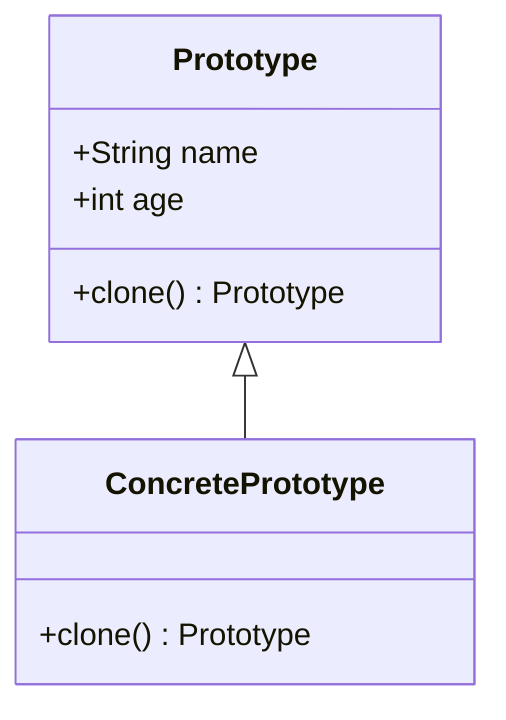

## 4.5 Prototype Design Pattern

The Prototype Design Pattern is a creational pattern that allows for the creation of new objects by cloning an existing object, known as the prototype. This pattern is particularly useful in scenarios where the cost of creating a new instance of an object is more expensive than copying an existing one. In Dart, the Prototype Design Pattern can be implemented using various techniques such as clone methods, copy constructors, and serialization. This section will delve into these techniques, providing comprehensive examples and use cases to enhance your understanding and application of the Prototype Design Pattern in Dart and Flutter development.

### Intent of the Prototype Design Pattern

The primary intent of the Prototype Design Pattern is to:

- **Facilitate Object Creation**: By cloning existing objects, we can efficiently create new instances without the overhead of initializing a new object from scratch.
- **Promote Flexibility**: Enable the creation of new objects with varying configurations by modifying the cloned prototype.
- **Enhance Performance**: Reduce the cost associated with the creation of complex objects.

### Key Participants

The Prototype Design Pattern involves the following key participants:

- **Prototype Interface**: Declares the `clone()` method for cloning objects.
- **Concrete Prototype**: Implements the `clone()` method to create a copy of itself.
- **Client**: Uses the `clone()` method to create new objects.

### Implementing Prototype in Dart

In Dart, implementing the Prototype Design Pattern involves several approaches. Let's explore these methods in detail:

#### Clone Method

The `clone()` method is a common approach to implement the Prototype Design Pattern. It involves creating a method that returns a copy of the object. This can be either a shallow copy or a deep copy, depending on the requirements.

```dart
class Prototype {
  String name;
  int age;

  Prototype(this.name, this.age);

  // Clone method for shallow copy
  Prototype clone() {
    return Prototype(name, age);
  }
}

void main() {
  Prototype original = Prototype('John Doe', 30);
  Prototype copy = original.clone();

  print('Original: ${original.name}, ${original.age}');
  print('Copy: ${copy.name}, ${copy.age}');
}
```

In the above example, the `clone()` method creates a shallow copy of the `Prototype` object. This means that the fields are copied directly, and any changes to the fields in the copy will not affect the original object.

#### Copy Constructors

Copy constructors provide another way to implement the Prototype Design Pattern. They allow for the creation of a new instance by copying the fields of an existing object.

```dart
class Prototype {
  String name;
  int age;

  // Copy constructor
  Prototype.copy(Prototype prototype)
      : name = prototype.name,
        age = prototype.age;

  Prototype(this.name, this.age);
}

void main() {
  Prototype original = Prototype('Jane Doe', 25);
  Prototype copy = Prototype.copy(original);

  print('Original: ${original.name}, ${original.age}');
  print('Copy: ${copy.name}, ${copy.age}');
}
```

The copy constructor in the above example creates a new `Prototype` object by copying the fields from an existing object. This approach is particularly useful when you want to create a new instance with the same state as an existing object.

#### `copyWith` Pattern

The `copyWith` pattern is commonly used in Dart, especially in data classes, to create immutable objects with slight modifications. This pattern is particularly useful in Flutter for state management.

```dart
class Prototype {
  final String name;
  final int age;

  Prototype({required this.name, required this.age});

  // copyWith method
  Prototype copyWith({String? name, int? age}) {
    return Prototype(
      name: name ?? this.name,
      age: age ?? this.age,
    );
  }
}

void main() {
  Prototype original = Prototype(name: 'Alice', age: 28);
  Prototype modified = original.copyWith(age: 29);

  print('Original: ${original.name}, ${original.age}');
  print('Modified: ${modified.name}, ${modified.age}');
}
```

The `copyWith` method allows for the creation of a new object with modified fields, while retaining the original object's state. This is particularly useful for managing immutable state in Flutter applications.

#### Serialization

Serialization can be used to create deep copies of objects by converting them to a serial format and then deserializing them back into a new object. This approach is useful when dealing with complex objects that require deep copying.

```dart
import 'dart:convert';

class Prototype {
  String name;
  int age;

  Prototype(this.name, this.age);

  // Convert object to JSON
  String toJson() {
    return jsonEncode({'name': name, 'age': age});
  }

  // Create object from JSON
  static Prototype fromJson(String jsonString) {
    Map<String, dynamic> json = jsonDecode(jsonString);
    return Prototype(json['name'], json['age']);
  }
}

void main() {
  Prototype original = Prototype('Bob', 35);
  String jsonString = original.toJson();
  Prototype copy = Prototype.fromJson(jsonString);

  print('Original: ${original.name}, ${original.age}');
  print('Copy: ${copy.name}, ${copy.age}');
}
```

In this example, the `Prototype` object is serialized to a JSON string and then deserialized back into a new object. This approach ensures a deep copy, as all nested objects are also copied.

### Use Cases and Examples

The Prototype Design Pattern is applicable in various scenarios. Let's explore some common use cases:

#### State Management

In Flutter, managing state is crucial for building responsive applications. The Prototype Design Pattern can be used to update immutable state objects efficiently.

```dart
class AppState {
  final String user;
  final int counter;

  AppState({required this.user, required this.counter});

  AppState copyWith({String? user, int? counter}) {
    return AppState(
      user: user ?? this.user,
      counter: counter ?? this.counter,
    );
  }
}

void main() {
  AppState state = AppState(user: 'Charlie', counter: 0);
  AppState newState = state.copyWith(counter: state.counter + 1);

  print('User: ${newState.user}, Counter: ${newState.counter}');
}
```

In this example, the `AppState` class uses the `copyWith` pattern to create a new state object with an updated counter value. This approach ensures that the state remains immutable while allowing for efficient updates.

#### Duplication of Configurations

The Prototype Design Pattern is useful for duplicating configurations with slight variations. This can be particularly beneficial in scenarios where you need to create multiple configurations based on a template.

```dart
class Configuration {
  String theme;
  int fontSize;

  Configuration(this.theme, this.fontSize);

  Configuration clone() {
    return Configuration(theme, fontSize);
  }
}

void main() {
  Configuration defaultConfig = Configuration('Light', 12);
  Configuration customConfig = defaultConfig.clone();
  customConfig.theme = 'Dark';

  print('Default Theme: ${defaultConfig.theme}');
  print('Custom Theme: ${customConfig.theme}');
}
```

In this example, the `Configuration` class uses the `clone()` method to create a copy of the default configuration. The cloned configuration is then modified to create a custom configuration.

#### Prototyping Objects

The Prototype Design Pattern is ideal for creating new instances based on a template object. This is particularly useful in scenarios where you need to create multiple objects with similar properties.

```dart
class Shape {
  String color;

  Shape(this.color);

  Shape clone() {
    return Shape(color);
  }
}

void main() {
  Shape circle = Shape('Red');
  Shape anotherCircle = circle.clone();
  anotherCircle.color = 'Blue';

  print('Original Circle Color: ${circle.color}');
  print('Another Circle Color: ${anotherCircle.color}');
}
```

In this example, the `Shape` class uses the `clone()` method to create a new instance based on the original circle. The cloned circle is then modified to have a different color.

### Design Considerations

When implementing the Prototype Design Pattern in Dart, consider the following:

- **Shallow vs. Deep Copy**: Determine whether a shallow or deep copy is required based on the complexity of the object.
- **Immutability**: Use the `copyWith` pattern for immutable objects to ensure efficient state management.
- **Performance**: Consider the performance implications of cloning objects, especially when dealing with large or complex objects.

### Differences and Similarities

The Prototype Design Pattern is often compared with other creational patterns such as Singleton and Factory. Here are some key differences and similarities:

- **Prototype vs. Singleton**: The Prototype pattern focuses on cloning existing objects, while the Singleton pattern ensures a single instance of a class.
- **Prototype vs. Factory**: The Prototype pattern creates new objects by cloning, whereas the Factory pattern creates new instances based on a set of parameters or conditions.

### Visualizing the Prototype Design Pattern

To better understand the Prototype Design Pattern, let's visualize the process of cloning objects using a class diagram.



This diagram illustrates the relationship between the `Prototype` interface and the `ConcretePrototype` class. The `ConcretePrototype` class implements the `clone()` method to create a copy of itself.

### Try It Yourself

To solidify your understanding of the Prototype Design Pattern, try modifying the code examples provided. Experiment with creating deep copies using serialization or implementing the `copyWith` pattern in your own classes. Consider the performance implications of each approach and how they can be applied to your Flutter applications.

### References and Links

For further reading on the Prototype Design Pattern and its applications in Dart and Flutter, consider the following resources:

- [Design Patterns: Elements of Reusable Object-Oriented Software](https://en.wikipedia.org/wiki/Design_Patterns) - A foundational book on design patterns.
- [Dart Language Tour](https://dart.dev/guides/language/language-tour) - Official Dart documentation.
- [Flutter State Management](https://flutter.dev/docs/development/data-and-backend/state-mgmt) - Official Flutter documentation on state management.

### Knowledge Check

Before moving on, take a moment to review the key concepts covered in this section. Consider the scenarios where the Prototype Design Pattern can be applied and the benefits it offers in terms of performance and flexibility.

### Embrace the Journey

Remember, mastering design patterns is a journey. As you continue to explore and apply these patterns in your Dart and Flutter development, you'll gain a deeper understanding of their benefits and how they can enhance your applications. Keep experimenting, stay curious, and enjoy the journey!

## Quiz Time!



### What is the primary intent of the Prototype Design Pattern?

- [x] To create new objects by cloning existing ones
- [ ] To ensure a single instance of a class
- [ ] To create new instances based on a set of parameters
- [ ] To separate the construction of a complex object from its representation

> **Explanation:** The Prototype Design Pattern focuses on creating new objects by cloning existing ones, which enhances flexibility and performance.

### Which method is commonly used in Dart to implement the Prototype Design Pattern?

- [x] clone() method
- [ ] build() method
- [ ] init() method
- [ ] create() method

> **Explanation:** The `clone()` method is commonly used to create a copy of an object in the Prototype Design Pattern.

### What is the purpose of the copyWith pattern in Dart?

- [x] To create immutable objects with slight modifications
- [ ] To ensure a single instance of a class
- [ ] To serialize objects to JSON
- [ ] To manage state in Flutter applications

> **Explanation:** The `copyWith` pattern is used to create immutable objects with slight modifications, which is useful for state management in Flutter.

### How can deep copies be achieved in Dart?

- [x] Using serialization
- [ ] Using shallow copy
- [ ] Using the Singleton pattern
- [ ] Using the Factory pattern

> **Explanation:** Serialization can be used to achieve deep copies by converting objects to a serial format and then deserializing them back into new objects.

### What is a key difference between the Prototype and Singleton patterns?

- [x] Prototype focuses on cloning objects, while Singleton ensures a single instance
- [ ] Prototype ensures a single instance, while Singleton focuses on cloning objects
- [ ] Both patterns focus on cloning objects
- [ ] Both patterns ensure a single instance of a class

> **Explanation:** The Prototype pattern focuses on cloning objects, whereas the Singleton pattern ensures a single instance of a class.

### Which of the following is a use case for the Prototype Design Pattern?

- [x] State management in Flutter
- [ ] Ensuring a single instance of a class
- [ ] Creating new instances based on a set of parameters
- [ ] Separating the construction of a complex object from its representation

> **Explanation:** The Prototype Design Pattern is useful for state management in Flutter, where immutable state objects need to be updated efficiently.

### What is the benefit of using copy constructors in Dart?

- [x] They allow for the creation of new instances by copying fields
- [ ] They ensure a single instance of a class
- [ ] They serialize objects to JSON
- [ ] They manage state in Flutter applications

> **Explanation:** Copy constructors allow for the creation of new instances by copying the fields of an existing object, which is useful for implementing the Prototype Design Pattern.

### How does the Prototype Design Pattern enhance performance?

- [x] By reducing the cost associated with creating complex objects
- [ ] By ensuring a single instance of a class
- [ ] By creating new instances based on a set of parameters
- [ ] By separating the construction of a complex object from its representation

> **Explanation:** The Prototype Design Pattern enhances performance by reducing the cost associated with creating complex objects through cloning.

### What is the role of the client in the Prototype Design Pattern?

- [x] To use the clone() method to create new objects
- [ ] To declare the clone() method
- [ ] To implement the clone() method
- [ ] To ensure a single instance of a class

> **Explanation:** The client uses the `clone()` method to create new objects based on the prototype.

### True or False: The Prototype Design Pattern is only applicable in Dart and Flutter development.

- [ ] True
- [x] False

> **Explanation:** The Prototype Design Pattern is a general design pattern applicable in various programming languages and development environments, not just Dart and Flutter.


