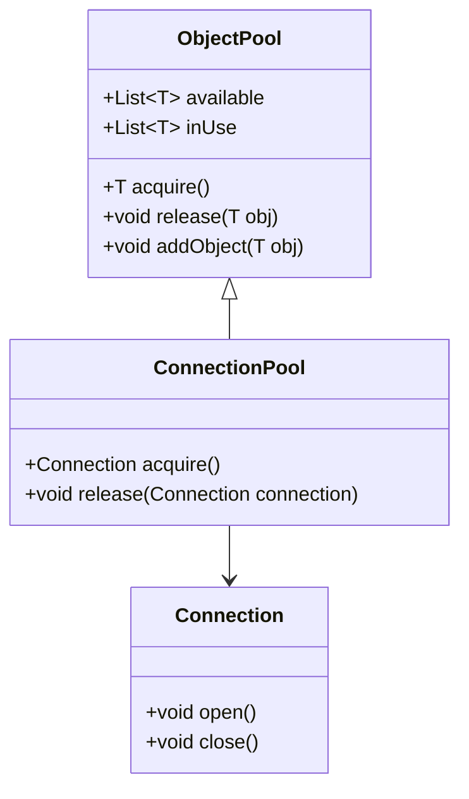

## 4.6 Object Pool Pattern

In the realm of software design, the Object Pool Pattern stands out as a creational pattern that focuses on the reuse of objects. This pattern is particularly useful in scenarios where object creation is costly in terms of time or resources. By maintaining a pool of reusable objects, the Object Pool Pattern helps in reducing the overhead associated with creating new instances, thus enhancing performance and resource utilization.

### Intent

The primary intent of the Object Pool Pattern is to manage a pool of reusable objects, avoiding the overhead of creating new instances. This pattern is particularly beneficial when dealing with resource-intensive objects, such as database connections or large data structures.

### Key Participants

1. **Object Pool**: Manages the pool of reusable objects. It keeps track of available and in-use objects, ensuring efficient resource management.
2. **Client**: Requests objects from the pool and returns them after use.
3. **Reusable Object**: The object that is being managed by the pool. It should be designed to be reusable and resettable.

### Applicability

The Object Pool Pattern is applicable in scenarios where:

- Object creation is expensive in terms of time or resources.
- A large number of objects are needed for short periods.
- The system can benefit from reusing objects instead of creating new ones.

### Implementing Object Pool in Dart

Implementing the Object Pool Pattern in Dart involves several key components:

#### Resource Management

Resource management is a critical aspect of the Object Pool Pattern. It involves tracking available and in-use objects to ensure efficient utilization of resources.

```dart
class ObjectPool<T> {
  final List<T> _available = [];
  final List<T> _inUse = [];

  T acquire() {
    if (_available.isEmpty) {
      throw Exception('No objects available');
    }
    final obj = _available.removeLast();
    _inUse.add(obj);
    return obj;
  }

  void release(T obj) {
    _inUse.remove(obj);
    _available.add(obj);
  }

  void addObject(T obj) {
    _available.add(obj);
  }
}
```

In this example, the `ObjectPool` class manages a list of available and in-use objects. The `acquire` method retrieves an object from the pool, while the `release` method returns an object to the pool.

#### Factory and Disposal Methods

Factory and disposal methods are essential for creating or recycling objects as needed. These methods ensure that objects are properly initialized and reset before being reused.

```dart
class Connection {
  void open() {
    print('Connection opened');
  }

  void close() {
    print('Connection closed');
  }
}

class ConnectionPool extends ObjectPool<Connection> {
  @override
  Connection acquire() {
    final connection = super.acquire();
    connection.open();
    return connection;
  }

  @override
  void release(Connection connection) {
    connection.close();
    super.release(connection);
  }
}
```

In this example, the `ConnectionPool` class extends the `ObjectPool` class to manage `Connection` objects. The `acquire` method opens a connection before returning it, while the `release` method closes the connection before returning it to the pool.

### Use Cases and Examples

The Object Pool Pattern is widely used in various scenarios, including:

#### Database Connections

Managing database connections is a common use case for the Object Pool Pattern. By reusing connections, applications can reduce the overhead associated with establishing new connections.

```dart
class DatabaseConnection {
  void connect() {
    print('Database connected');
  }

  void disconnect() {
    print('Database disconnected');
  }
}

class DatabaseConnectionPool extends ObjectPool<DatabaseConnection> {
  @override
  DatabaseConnection acquire() {
    final connection = super.acquire();
    connection.connect();
    return connection;
  }

  @override
  void release(DatabaseConnection connection) {
    connection.disconnect();
    super.release(connection);
  }
}
```

In this example, the `DatabaseConnectionPool` class manages a pool of `DatabaseConnection` objects, ensuring efficient connection management.

#### Heavy Objects

Reusing heavy objects that are expensive to initialize is another common use case for the Object Pool Pattern. This can include large data structures or complex objects that require significant resources to create.

```dart
class HeavyObject {
  HeavyObject() {
    print('Heavy object created');
  }

  void reset() {
    print('Heavy object reset');
  }
}

class HeavyObjectPool extends ObjectPool<HeavyObject> {
  @override
  HeavyObject acquire() {
    final obj = super.acquire();
    obj.reset();
    return obj;
  }
}
```

In this example, the `HeavyObjectPool` class manages a pool of `HeavyObject` instances, ensuring efficient reuse of these resource-intensive objects.

#### Pooling Widgets

While pooling widgets is less common due to Flutter’s widget philosophy, it can still be useful in certain scenarios where widget creation is costly.

```dart
class CustomWidget {
  void build() {
    print('Widget built');
  }

  void dispose() {
    print('Widget disposed');
  }
}

class WidgetPool extends ObjectPool<CustomWidget> {
  @override
  CustomWidget acquire() {
    final widget = super.acquire();
    widget.build();
    return widget;
  }

  @override
  void release(CustomWidget widget) {
    widget.dispose();
    super.release(widget);
  }
}
```

In this example, the `WidgetPool` class manages a pool of `CustomWidget` instances, demonstrating how widgets can be pooled for reuse.

### Design Considerations

When implementing the Object Pool Pattern, consider the following:

- **Thread Safety**: Ensure that the pool is thread-safe if it will be accessed by multiple threads.
- **Object Lifecycle**: Properly manage the lifecycle of objects, including initialization and cleanup.
- **Pool Size**: Determine an appropriate pool size to balance resource utilization and performance.

### Differences and Similarities

The Object Pool Pattern is often compared to other creational patterns, such as the Factory Method and Singleton patterns. While all these patterns deal with object creation, the Object Pool Pattern focuses on reusing existing objects rather than creating new ones.

### Visualizing the Object Pool Pattern

To better understand the Object Pool Pattern, let's visualize its components and interactions using a class diagram.



This diagram illustrates the relationship between the `ObjectPool`, `Connection`, and `ConnectionPool` classes, highlighting how the pool manages reusable objects.

### Try It Yourself

To deepen your understanding of the Object Pool Pattern, try modifying the code examples provided. Experiment with different object types, pool sizes, and lifecycle management strategies. Consider implementing a thread-safe version of the pool or integrating it into a larger application.

### Knowledge Check

- What are the key benefits of using the Object Pool Pattern?
- How does the Object Pool Pattern differ from the Factory Method Pattern?
- In what scenarios is the Object Pool Pattern most beneficial?

### Embrace the Journey

Remember, mastering design patterns is a journey. As you explore the Object Pool Pattern, you'll gain valuable insights into efficient resource management and performance optimization. Keep experimenting, stay curious, and enjoy the process of becoming a more proficient Dart and Flutter developer!

## Quiz Time!



### What is the primary intent of the Object Pool Pattern?

- [x] To manage a pool of reusable objects and avoid the overhead of creating new instances.
- [ ] To create a single instance of an object.
- [ ] To provide an interface for creating families of related objects.
- [ ] To separate the construction of a complex object from its representation.

> **Explanation:** The Object Pool Pattern focuses on managing a pool of reusable objects to reduce the overhead of creating new instances.

### Which of the following is a key participant in the Object Pool Pattern?

- [x] Object Pool
- [ ] Singleton
- [ ] Abstract Factory
- [ ] Observer

> **Explanation:** The Object Pool is a key participant in the Object Pool Pattern, responsible for managing reusable objects.

### In which scenario is the Object Pool Pattern most beneficial?

- [x] When object creation is expensive in terms of time or resources.
- [ ] When a single instance of an object is needed.
- [ ] When objects need to be created in a specific sequence.
- [ ] When objects need to be notified of changes in other objects.

> **Explanation:** The Object Pool Pattern is beneficial when object creation is expensive, allowing for efficient reuse of objects.

### What is a common use case for the Object Pool Pattern?

- [x] Managing database connections
- [ ] Implementing a user interface
- [ ] Handling user input
- [ ] Rendering graphics

> **Explanation:** Managing database connections is a common use case for the Object Pool Pattern, as it helps reduce the overhead of establishing new connections.

### How does the Object Pool Pattern differ from the Singleton Pattern?

- [x] The Object Pool Pattern manages multiple reusable objects, while the Singleton Pattern ensures a single instance.
- [ ] The Object Pool Pattern creates a single instance, while the Singleton Pattern manages multiple instances.
- [ ] The Object Pool Pattern is used for object creation, while the Singleton Pattern is used for object destruction.
- [ ] The Object Pool Pattern is used for managing object states, while the Singleton Pattern is used for managing object behavior.

> **Explanation:** The Object Pool Pattern manages multiple reusable objects, whereas the Singleton Pattern ensures only one instance of an object exists.

### What is a key consideration when implementing the Object Pool Pattern?

- [x] Thread safety
- [ ] User interface design
- [ ] Network latency
- [ ] Data encryption

> **Explanation:** Thread safety is a key consideration when implementing the Object Pool Pattern, especially if the pool will be accessed by multiple threads.

### Which method is used to retrieve an object from the pool?

- [x] acquire()
- [ ] release()
- [ ] create()
- [ ] dispose()

> **Explanation:** The `acquire()` method is used to retrieve an object from the pool.

### Which method is used to return an object to the pool?

- [x] release()
- [ ] acquire()
- [ ] create()
- [ ] dispose()

> **Explanation:** The `release()` method is used to return an object to the pool.

### What is the role of the Client in the Object Pool Pattern?

- [x] To request objects from the pool and return them after use.
- [ ] To manage the pool of reusable objects.
- [ ] To create new instances of objects.
- [ ] To destroy objects when they are no longer needed.

> **Explanation:** The Client requests objects from the pool and returns them after use.

### True or False: The Object Pool Pattern is often compared to the Factory Method Pattern.

- [x] True
- [ ] False

> **Explanation:** True. The Object Pool Pattern is often compared to the Factory Method Pattern, as both deal with object creation, but the Object Pool Pattern focuses on reusing existing objects.


