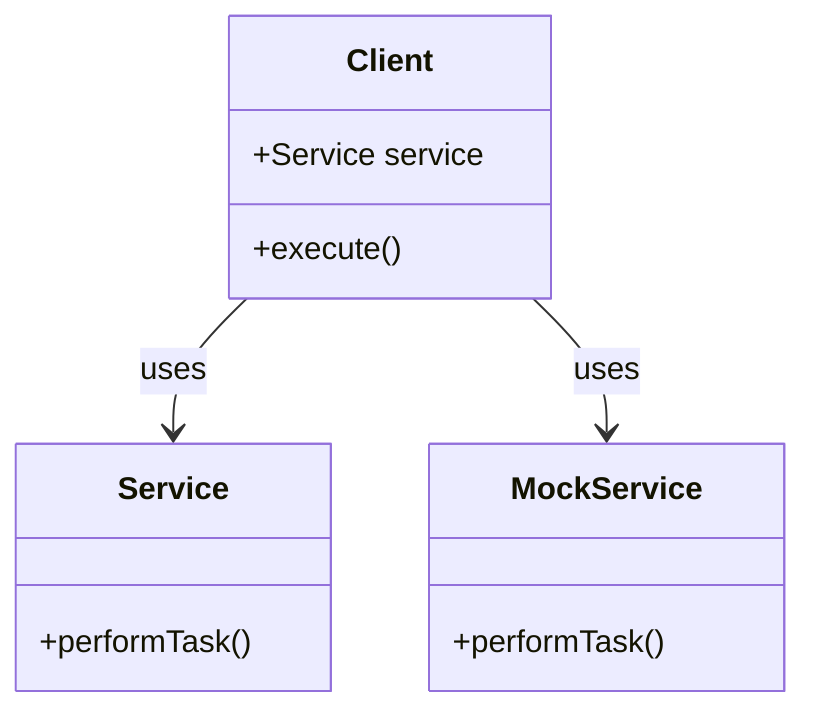

## 4.7 Dependency Injection Pattern

In the realm of software design, the Dependency Injection (DI) pattern stands out as a powerful technique for promoting loose coupling and enhancing the flexibility and testability of applications. By injecting dependencies rather than creating them, developers can build systems that are easier to maintain, extend, and test. In this section, we will delve into the intricacies of the Dependency Injection pattern, focusing on its implementation in Dart and Flutter, and explore its various use cases.

### Understanding Dependency Injection

Dependency Injection is a design pattern used to implement Inversion of Control (IoC) between classes and their dependencies. Instead of a class creating its dependencies, they are provided externally, typically by a framework or a container. This approach decouples the creation of an object from its usage, allowing for more modular and testable code.

#### Key Concepts of Dependency Injection

- **Loose Coupling**: By injecting dependencies, classes are not tightly bound to specific implementations, making it easier to swap out components.
- **Inversion of Control**: The control of dependency creation is inverted from the class itself to an external entity.
- **Flexibility and Testability**: DI facilitates testing by allowing mock dependencies to be injected, and it enables flexible architectures where components can be easily replaced or extended.

### Implementing Dependency Injection in Dart

Dart, with its robust language features, provides several ways to implement Dependency Injection. Let's explore some common methods:

#### Constructor Injection

Constructor Injection is one of the most straightforward ways to implement DI. Dependencies are passed to a class through its constructor, ensuring that the class is provided with all necessary dependencies at the time of instantiation.

```dart
class Service {
  void performTask() {
    print('Performing task...');
  }
}

class Client {
  final Service service;

  // Constructor Injection
  Client(this.service);

  void execute() {
    service.performTask();
  }
}

void main() {
  final service = Service();
  final client = Client(service);
  client.execute();
}
```

In this example, the `Client` class depends on the `Service` class. By injecting the `Service` instance through the constructor, we achieve loose coupling, allowing for easy substitution of different `Service` implementations.

#### Provider Packages

In Flutter, provider packages like `provider` and `get_it` are commonly used for dependency management. These packages offer a more structured approach to DI, allowing for global access to dependencies and facilitating state management.

##### Using `provider`

The `provider` package is a popular choice for state management and DI in Flutter. It allows dependencies to be injected into the widget tree, making them accessible to any widget that needs them.

```dart
import 'package:flutter/material.dart';
import 'package:provider/provider.dart';

class Counter {
  int value = 0;

  void increment() {
    value++;
  }
}

class CounterProvider extends StatelessWidget {
  @override
  Widget build(BuildContext context) {
    return ChangeNotifierProvider(
      create: (_) => Counter(),
      child: CounterApp(),
    );
  }
}

class CounterApp extends StatelessWidget {
  @override
  Widget build(BuildContext context) {
    final counter = Provider.of<Counter>(context);

    return MaterialApp(
      home: Scaffold(
        appBar: AppBar(title: Text('Counter')),
        body: Center(
          child: Text('Counter: ${counter.value}'),
        ),
        floatingActionButton: FloatingActionButton(
          onPressed: counter.increment,
          child: Icon(Icons.add),
        ),
      ),
    );
  }
}

void main() {
  runApp(CounterProvider());
}
```

In this example, the `Counter` class is injected into the widget tree using `ChangeNotifierProvider`, allowing the `CounterApp` widget to access and modify the counter value.

##### Using `get_it`

The `get_it` package is a simple service locator for Dart and Flutter, providing a way to register and retrieve dependencies.

```dart
import 'package:get_it/get_it.dart';

class ApiService {
  void fetchData() {
    print('Fetching data...');
  }
}

final getIt = GetIt.instance;

void setup() {
  getIt.registerSingleton<ApiService>(ApiService());
}

void main() {
  setup();
  final apiService = getIt<ApiService>();
  apiService.fetchData();
}
```

Here, the `ApiService` is registered as a singleton with `get_it`, allowing it to be retrieved and used anywhere in the application.

#### Inversion of Control

Inversion of Control (IoC) is a broader concept that encompasses Dependency Injection. It refers to the inversion of the flow of control in a program, where the framework or container manages the lifecycle and dependencies of objects.

In Dart, IoC can be achieved through DI frameworks or by manually managing dependencies using patterns like Service Locator or Factory.

### Use Cases and Examples

Dependency Injection is a versatile pattern with numerous applications in software development. Let's explore some common use cases:

#### Testing

DI is particularly beneficial for testing, as it allows for the injection of mock dependencies. This makes it easier to isolate and test individual components without relying on real implementations.

```dart
class MockService implements Service {
  @override
  void performTask() {
    print('Mock task performed.');
  }
}

void main() {
  final mockService = MockService();
  final client = Client(mockService);
  client.execute(); // Outputs: Mock task performed.
}
```

In this example, a `MockService` is injected into the `Client` class, allowing for testing without the need for the real `Service` implementation.

#### Modular Design

DI promotes modular design by decoupling components and allowing for easy substitution of implementations. This is particularly useful in large applications where different modules may require different implementations of the same interface.

```dart
abstract class Database {
  void query(String sql);
}

class MySQLDatabase implements Database {
  @override
  void query(String sql) {
    print('Querying MySQL: $sql');
  }
}

class PostgreSQLDatabase implements Database {
  @override
  void query(String sql) {
    print('Querying PostgreSQL: $sql');
  }
}

class DataService {
  final Database database;

  DataService(this.database);

  void fetchData() {
    database.query('SELECT * FROM users');
  }
}

void main() {
  final mysqlService = DataService(MySQLDatabase());
  mysqlService.fetchData();

  final postgresService = DataService(PostgreSQLDatabase());
  postgresService.fetchData();
}
```

Here, the `DataService` class can work with any `Database` implementation, allowing for easy swapping between `MySQLDatabase` and `PostgreSQLDatabase`.

#### Flexible Architecture

DI enables flexible architectures by allowing components to be easily replaced or extended. This is particularly useful in applications that require different configurations or environments.

```dart
class Logger {
  void log(String message) {
    print('Log: $message');
  }
}

class FileLogger implements Logger {
  @override
  void log(String message) {
    print('Writing to file: $message');
  }
}

class ConsoleLogger implements Logger {
  @override
  void log(String message) {
    print('Console: $message');
  }
}

class Application {
  final Logger logger;

  Application(this.logger);

  void run() {
    logger.log('Application started.');
  }
}

void main() {
  final app = Application(ConsoleLogger());
  app.run();

  final fileApp = Application(FileLogger());
  fileApp.run();
}
```

In this example, the `Application` class can use different `Logger` implementations, allowing for flexibility in how logging is handled.

### Visualizing Dependency Injection

To better understand the flow of Dependency Injection, let's visualize the process using a class diagram:



**Diagram Description**: This class diagram illustrates the relationship between the `Client`, `Service`, and `MockService` classes. The `Client` class depends on the `Service` class, but it can also use the `MockService` for testing purposes.

### Design Considerations

When implementing Dependency Injection, consider the following:

- **Complexity**: While DI promotes flexibility, it can also introduce complexity, especially in large applications. Use DI judiciously and avoid over-engineering.
- **Performance**: Be mindful of the performance implications of DI, particularly when using reflection-based frameworks.
- **Configuration**: Properly configure DI containers to ensure that dependencies are correctly resolved and managed.

### Differences and Similarities

Dependency Injection is often compared to the Service Locator pattern. While both patterns aim to decouple dependencies, they differ in their approach:

- **Dependency Injection**: Dependencies are injected into a class, typically through constructors or setters. This approach promotes transparency and testability.
- **Service Locator**: Dependencies are retrieved from a central registry or locator. This approach can lead to hidden dependencies and is generally less favored in modern design.

### Try It Yourself

To deepen your understanding of Dependency Injection, try modifying the code examples provided:

- **Experiment with different DI techniques**: Implement setter injection or interface injection in addition to constructor injection.
- **Create your own DI container**: Build a simple DI container that resolves dependencies based on configuration.
- **Integrate DI with state management**: Use DI in combination with state management solutions like `provider` or `bloc`.

### Knowledge Check

To reinforce your understanding of Dependency Injection, consider the following questions:

- What are the benefits of using Dependency Injection in software design?
- How does Dependency Injection promote loose coupling?
- What are the differences between Dependency Injection and Service Locator?
- How can Dependency Injection improve testability in applications?

### Embrace the Journey

Remember, mastering Dependency Injection is a journey. As you continue to explore and experiment with DI, you'll discover new ways to enhance the flexibility and maintainability of your applications. Keep learning, stay curious, and enjoy the process of building better software!

## Quiz Time!



### What is the primary benefit of using Dependency Injection?

- [x] Promotes loose coupling between components
- [ ] Increases code complexity
- [ ] Reduces code readability
- [ ] Forces the use of specific frameworks

> **Explanation:** Dependency Injection promotes loose coupling by allowing dependencies to be injected rather than created within a class, making it easier to swap out components.

### Which of the following is a common method of implementing Dependency Injection in Dart?

- [x] Constructor Injection
- [ ] Singleton Pattern
- [ ] Observer Pattern
- [ ] Factory Pattern

> **Explanation:** Constructor Injection is a common method of implementing Dependency Injection, where dependencies are passed through the constructor.

### What is the role of the `provider` package in Flutter?

- [x] It facilitates dependency injection and state management
- [ ] It provides a way to create singleton instances
- [ ] It is used for network requests
- [ ] It handles user authentication

> **Explanation:** The `provider` package is used for dependency injection and state management in Flutter applications.

### How does Dependency Injection improve testability?

- [x] By allowing mock dependencies to be injected
- [ ] By making code more complex
- [ ] By enforcing strict type checking
- [ ] By reducing the number of classes

> **Explanation:** Dependency Injection improves testability by allowing mock dependencies to be injected, making it easier to isolate and test individual components.

### What is the difference between Dependency Injection and Service Locator?

- [x] DI injects dependencies, while Service Locator retrieves them from a central registry
- [ ] DI is used for state management, while Service Locator is not
- [ ] DI is a creational pattern, while Service Locator is a structural pattern
- [ ] DI is less flexible than Service Locator

> **Explanation:** Dependency Injection injects dependencies into a class, while Service Locator retrieves them from a central registry or locator.

### Which package is commonly used for dependency management in Dart?

- [x] get_it
- [ ] http
- [ ] dio
- [ ] bloc

> **Explanation:** The `get_it` package is commonly used for dependency management in Dart and Flutter applications.

### What is Inversion of Control in the context of Dependency Injection?

- [x] The control of dependency creation is inverted from the class to an external entity
- [ ] The control of application flow is inverted
- [ ] The control of user input is inverted
- [ ] The control of data storage is inverted

> **Explanation:** Inversion of Control refers to the inversion of dependency creation control from the class itself to an external entity, such as a DI container.

### How can Dependency Injection facilitate modular design?

- [x] By decoupling components and allowing for easy substitution of implementations
- [ ] By enforcing strict class hierarchies
- [ ] By reducing the number of classes
- [ ] By increasing code complexity

> **Explanation:** Dependency Injection facilitates modular design by decoupling components and allowing for easy substitution of implementations.

### What is a potential drawback of using Dependency Injection?

- [x] It can introduce complexity, especially in large applications
- [ ] It reduces code readability
- [ ] It forces the use of specific frameworks
- [ ] It limits the use of design patterns

> **Explanation:** While Dependency Injection promotes flexibility, it can also introduce complexity, particularly in large applications.

### True or False: Dependency Injection is only useful for testing purposes.

- [ ] True
- [x] False

> **Explanation:** Dependency Injection is not only useful for testing but also for promoting loose coupling, modular design, and flexible architectures.


