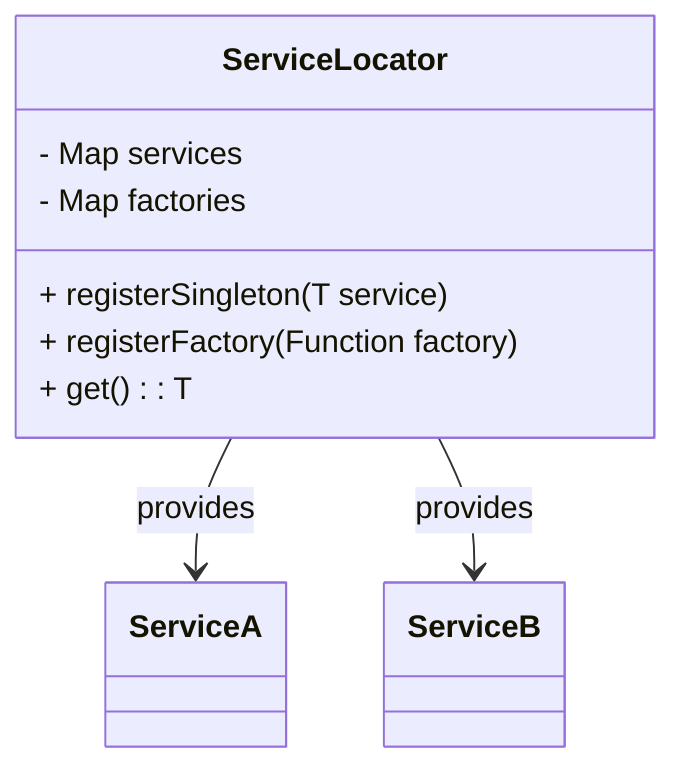

## 4.8 Service Locator Pattern

The Service Locator pattern is a creational design pattern that provides a centralized registry for managing dependencies and services. It offers a global access point to services, making it easier to manage and retrieve them throughout an application. This pattern is particularly useful in scenarios where dependency injection is not feasible or when working with legacy codebases. However, it comes with its own set of criticisms and considerations.

### Introduction to the Service Locator Pattern

The Service Locator pattern acts as a centralized registry that manages the lifecycle and access of services within an application. It allows developers to register services and retrieve them as needed, providing a level of abstraction that decouples service consumers from the concrete implementations of those services.

#### Key Concepts

- **Centralized Registry**: A single point of access for all services, simplifying service management.
- **Global Access**: Services can be accessed from anywhere in the application, promoting reuse.
- **Decoupling**: Consumers of services are decoupled from the concrete implementations, promoting flexibility.

### Implementing Service Locator in Dart

Implementing the Service Locator pattern in Dart involves creating a class that acts as the registry for services. This class is responsible for registering services and providing access to them.

#### Singleton Service Locator

A common approach to implementing a Service Locator is to use the Singleton pattern, ensuring that there is only one instance of the Service Locator throughout the application.

```dart
class ServiceLocator {
  static final ServiceLocator _instance = ServiceLocator._internal();
  final Map<Type, dynamic> _services = {};

  ServiceLocator._internal();

  factory ServiceLocator() {
    return _instance;
  }

  void register<T>(T service) {
    _services[T] = service;
  }

  T get<T>() {
    return _services[T];
  }
}
```

- **Singleton Pattern**: Ensures a single instance of the Service Locator.
- **Service Registration**: Services are registered with a type and instance.
- **Service Retrieval**: Services are retrieved by type, promoting type safety.

#### Registering Factories and Instances

The Service Locator can be extended to support both singleton and prototype services by registering factories.

```dart
class ServiceLocator {
  static final ServiceLocator _instance = ServiceLocator._internal();
  final Map<Type, dynamic> _services = {};
  final Map<Type, Function> _factories = {};

  ServiceLocator._internal();

  factory ServiceLocator() {
    return _instance;
  }

  void registerSingleton<T>(T service) {
    _services[T] = service;
  }

  void registerFactory<T>(Function factory) {
    _factories[T] = factory;
  }

  T get<T>() {
    if (_services.containsKey(T)) {
      return _services[T];
    } else if (_factories.containsKey(T)) {
      return _factories[T]();
    } else {
      throw Exception('Service not found');
    }
  }
}
```

- **Singleton Registration**: Services are registered as singletons.
- **Factory Registration**: Factories are registered for prototype services.
- **Dynamic Retrieval**: Services are retrieved dynamically, either as singletons or new instances.

### Criticism and Alternatives

While the Service Locator pattern offers convenience, it is not without its criticisms. Understanding these criticisms is crucial for making informed architectural decisions.

#### Hidden Dependencies

One of the primary criticisms of the Service Locator pattern is that it can lead to hidden dependencies. Since services are retrieved globally, it becomes less clear which dependencies a class relies on.

- **Lack of Transparency**: Dependencies are not explicitly declared, making the code harder to understand.
- **Increased Complexity**: Managing dependencies becomes more complex as the application grows.

#### Testability Concerns

The global nature of the Service Locator can make testing more challenging. Mocking dependencies becomes difficult, as they are not explicitly passed to classes.

- **Difficult Mocking**: Dependencies are not easily mockable, complicating unit testing.
- **Tight Coupling**: Classes become tightly coupled to the Service Locator, reducing flexibility.

#### Recommendation

While the Service Locator pattern can be useful, it is generally recommended to prefer dependency injection when possible. Dependency injection provides more explicit dependency management and improves testability.

### Use Cases and Examples

Despite its criticisms, the Service Locator pattern has valid use cases, particularly in specific scenarios where its benefits outweigh its drawbacks.

#### Legacy Codebases

In legacy codebases, refactoring to implement dependency injection may be impractical. The Service Locator pattern offers a way to manage dependencies without extensive refactoring.

- **Minimal Refactoring**: Allows for dependency management without significant code changes.
- **Gradual Transition**: Can be used as a stepping stone towards more modern architectures.

#### Quick Prototyping

For quick prototyping, the Service Locator pattern simplifies the initial development stages by providing a straightforward way to manage dependencies.

- **Rapid Development**: Speeds up development by reducing boilerplate code.
- **Simplified Architecture**: Provides a simple architecture for small projects or prototypes.

### Visualizing the Service Locator Pattern

To better understand the Service Locator pattern, let's visualize its structure and interactions using a class diagram.



- **ServiceLocator**: Centralized registry managing services.
- **ServiceA and ServiceB**: Example services provided by the Service Locator.

### Design Considerations

When using the Service Locator pattern, consider the following design aspects:

- **When to Use**: Ideal for legacy systems or quick prototyping where dependency injection is not feasible.
- **Pitfalls**: Be cautious of hidden dependencies and testability issues.
- **Dart Features**: Utilize Dart's type system to ensure type safety when registering and retrieving services.

### Differences and Similarities

The Service Locator pattern is often compared to dependency injection. While both manage dependencies, they differ in their approach:

- **Service Locator**: Centralized registry, global access, less explicit dependencies.
- **Dependency Injection**: Dependencies are explicitly passed, improving transparency and testability.

### Try It Yourself

To better understand the Service Locator pattern, try implementing it in a small Dart project. Experiment with registering different types of services and retrieving them. Consider the following modifications:

- **Add Logging**: Implement logging to track service registration and retrieval.
- **Error Handling**: Enhance error handling for missing services.
- **Performance Testing**: Measure the performance impact of using the Service Locator pattern.

### Knowledge Check

- **What are the main criticisms of the Service Locator pattern?**
- **How does the Service Locator pattern differ from dependency injection?**
- **In what scenarios is the Service Locator pattern most useful?**

### Embrace the Journey

Remember, mastering design patterns is a journey. The Service Locator pattern is just one tool in your toolkit. As you progress, you'll encounter more patterns and architectural decisions. Keep experimenting, stay curious, and enjoy the journey!

## Quiz Time!



### What is the primary purpose of the Service Locator pattern?

- [x] To provide a centralized registry for managing dependencies
- [ ] To enforce strict type safety in Dart applications
- [ ] To replace all instances of dependency injection
- [ ] To improve the performance of Dart applications

> **Explanation:** The Service Locator pattern provides a centralized registry for managing dependencies, allowing for global access to services.

### Which of the following is a criticism of the Service Locator pattern?

- [x] Hidden dependencies
- [ ] Improved testability
- [ ] Simplified architecture
- [ ] Enhanced performance

> **Explanation:** The Service Locator pattern is criticized for hidden dependencies, as it makes dependencies less explicit.

### How does the Service Locator pattern differ from dependency injection?

- [x] Service Locator provides global access to services
- [ ] Service Locator explicitly passes dependencies
- [ ] Dependency injection uses a centralized registry
- [ ] Dependency injection hides dependencies

> **Explanation:** The Service Locator pattern provides global access to services, while dependency injection explicitly passes dependencies to classes.

### In which scenario is the Service Locator pattern most useful?

- [x] Legacy codebases where refactoring is impractical
- [ ] Applications requiring strict type safety
- [ ] Projects with extensive unit testing
- [ ] Systems with high performance requirements

> **Explanation:** The Service Locator pattern is useful in legacy codebases where refactoring for dependency injection is impractical.

### What is a common approach to implementing a Service Locator in Dart?

- [x] Using the Singleton pattern
- [ ] Using the Factory pattern
- [ ] Using the Observer pattern
- [ ] Using the Adapter pattern

> **Explanation:** A common approach to implementing a Service Locator in Dart is to use the Singleton pattern to ensure a single instance.

### What is a potential drawback of using the Service Locator pattern?

- [x] Difficulties in mocking dependencies for testing
- [ ] Increased code readability
- [ ] Enhanced modularity
- [ ] Improved performance

> **Explanation:** A potential drawback of the Service Locator pattern is the difficulty in mocking dependencies for testing, as they are not explicitly passed.

### What feature of Dart can be utilized to ensure type safety in a Service Locator?

- [x] Dart's type system
- [ ] Dart's async/await
- [ ] Dart's mixins
- [ ] Dart's reflection

> **Explanation:** Dart's type system can be utilized to ensure type safety when registering and retrieving services in a Service Locator.

### Which design pattern is often compared to the Service Locator pattern?

- [x] Dependency Injection
- [ ] Observer
- [ ] Factory
- [ ] Adapter

> **Explanation:** The Service Locator pattern is often compared to the Dependency Injection pattern, as both manage dependencies.

### What is a benefit of using the Service Locator pattern for quick prototyping?

- [x] Simplified initial development stages
- [ ] Improved testability
- [ ] Enhanced performance
- [ ] Strict type safety

> **Explanation:** The Service Locator pattern simplifies initial development stages, making it beneficial for quick prototyping.

### True or False: The Service Locator pattern is always the best choice for managing dependencies in Dart applications.

- [ ] True
- [x] False

> **Explanation:** False. The Service Locator pattern is not always the best choice; dependency injection is generally preferred for its explicit dependency management and testability.


