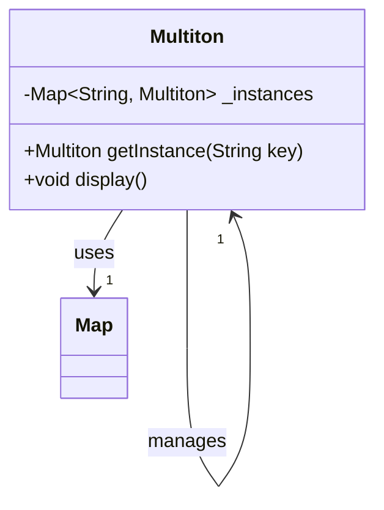

## 4.9 Multiton Pattern

In the world of software design patterns, the Multiton Pattern stands out as a powerful tool for managing instances in a controlled manner. Unlike the Singleton Pattern, which restricts the instantiation of a class to a single object, the Multiton Pattern allows for multiple instances, each identified by a unique key. This pattern is particularly useful in scenarios where you need to manage a set of related instances, such as theming or resource management in Flutter applications.

### Understanding the Multiton Pattern

The Multiton Pattern is a creational design pattern that ensures a class has only one instance per key. It provides a global point of access to these instances, similar to the Singleton Pattern, but with the added flexibility of handling multiple instances. This pattern is often implemented using a factory method that returns cached instances based on keys, and it can be thought of as a registry of instances.

#### Key Concepts

- **Instance Control**: The Multiton Pattern controls the creation and access of instances using unique keys.
- **Caching**: Instances are cached and reused, reducing the overhead of creating new objects.
- **Registry**: A map or dictionary is used to store and retrieve instances based on keys.

### Implementing Multiton in Dart

Implementing the Multiton Pattern in Dart involves creating a class that manages a collection of instances. This is typically done using a factory method that checks if an instance for a given key already exists. If it does, the existing instance is returned; otherwise, a new instance is created, stored, and returned.

#### Factory with Caching

The factory method is a common approach to implementing the Multiton Pattern. It involves creating a static method that manages the creation and caching of instances.

```dart
class Multiton {
  static final Map<String, Multiton> _instances = {};

  final String key;

  Multiton._internal(this.key);

  factory Multiton(String key) {
    if (_instances.containsKey(key)) {
      return _instances[key]!;
    } else {
      final instance = Multiton._internal(key);
      _instances[key] = instance;
      return instance;
    }
  }

  void display() {
    print('Instance with key: $key');
  }
}

void main() {
  final instance1 = Multiton('theme1');
  final instance2 = Multiton('theme2');
  final instance3 = Multiton('theme1');

  instance1.display(); // Instance with key: theme1
  instance2.display(); // Instance with key: theme2
  instance3.display(); // Instance with key: theme1

  print(instance1 == instance3); // true
  print(instance1 == instance2); // false
}
```

**Explanation**: In this example, the `Multiton` class uses a private constructor `_internal` to create instances. The factory method checks if an instance with the given key already exists in the `_instances` map. If it does, it returns the existing instance; otherwise, it creates a new one.

#### Registry Pattern

The Registry Pattern is another approach to implementing the Multiton Pattern. It involves maintaining a map of instances and providing methods to access and manage them.

```dart
class MultitonRegistry {
  static final Map<String, MultitonRegistry> _registry = {};

  final String key;

  MultitonRegistry._internal(this.key);

  static MultitonRegistry getInstance(String key) {
    return _registry.putIfAbsent(key, () => MultitonRegistry._internal(key));
  }

  void show() {
    print('Registry instance with key: $key');
  }
}

void main() {
  final registry1 = MultitonRegistry.getInstance('resource1');
  final registry2 = MultitonRegistry.getInstance('resource2');
  final registry3 = MultitonRegistry.getInstance('resource1');

  registry1.show(); // Registry instance with key: resource1
  registry2.show(); // Registry instance with key: resource2
  registry3.show(); // Registry instance with key: resource1

  print(registry1 == registry3); // true
  print(registry1 == registry2); // false
}
```

**Explanation**: The `MultitonRegistry` class uses a static method `getInstance` to manage instances. The `putIfAbsent` method is used to add a new instance to the registry if it doesn't already exist.

### Use Cases and Examples

The Multiton Pattern is particularly useful in scenarios where you need to manage multiple instances of a class, each identified by a unique key. Here are some common use cases:

#### Theming

In Flutter applications, theming is a common requirement. You might have different themes for different parts of your application, and the Multiton Pattern can help manage these themes efficiently.

```dart
class ThemeManager {
  static final Map<String, ThemeManager> _themes = {};

  final String themeName;

  ThemeManager._internal(this.themeName);

  factory ThemeManager(String themeName) {
    return _themes.putIfAbsent(themeName, () => ThemeManager._internal(themeName));
  }

  void applyTheme() {
    print('Applying theme: $themeName');
  }
}

void main() {
  final darkTheme = ThemeManager('dark');
  final lightTheme = ThemeManager('light');
  final anotherDarkTheme = ThemeManager('dark');

  darkTheme.applyTheme(); // Applying theme: dark
  lightTheme.applyTheme(); // Applying theme: light
  anotherDarkTheme.applyTheme(); // Applying theme: dark

  print(darkTheme == anotherDarkTheme); // true
  print(darkTheme == lightTheme); // false
}
```

**Explanation**: The `ThemeManager` class manages different themes using the Multiton Pattern. Each theme is identified by a unique name, and the `applyTheme` method applies the selected theme.

#### Resource Management

Managing shared resources, such as database connections or network clients, can be efficiently handled using the Multiton Pattern. This ensures that resources are reused rather than recreated, improving performance and reducing overhead.

```dart
class ResourceManager {
  static final Map<String, ResourceManager> _resources = {};

  final String resourceName;

  ResourceManager._internal(this.resourceName);

  factory ResourceManager(String resourceName) {
    return _resources.putIfAbsent(resourceName, () => ResourceManager._internal(resourceName));
  }

  void useResource() {
    print('Using resource: $resourceName');
  }
}

void main() {
  final dbConnection1 = ResourceManager('database');
  final dbConnection2 = ResourceManager('database');
  final apiClient = ResourceManager('api');

  dbConnection1.useResource(); // Using resource: database
  dbConnection2.useResource(); // Using resource: database
  apiClient.useResource(); // Using resource: api

  print(dbConnection1 == dbConnection2); // true
  print(dbConnection1 == apiClient); // false
}
```

**Explanation**: The `ResourceManager` class manages shared resources using the Multiton Pattern. Each resource is identified by a unique name, and the `useResource` method uses the selected resource.

### Visualizing the Multiton Pattern

To better understand the Multiton Pattern, let's visualize it using a class diagram. This diagram illustrates the relationship between the Multiton class, the registry, and the instances.



**Diagram Explanation**: The class diagram shows the `Multiton` class with a private map `_instances` that stores instances. The `getInstance` method is used to retrieve or create instances, and the `display` method is used to demonstrate the instance.

### Design Considerations

When implementing the Multiton Pattern, there are several design considerations to keep in mind:

- **Thread Safety**: Ensure that the implementation is thread-safe if your application is multi-threaded. This may involve using synchronization mechanisms to protect the shared map of instances.
- **Memory Management**: Be mindful of memory usage, as instances are cached and may not be garbage collected until the application terminates.
- **Key Management**: Choose meaningful and unique keys to avoid conflicts and ensure that instances are correctly identified.

### Differences and Similarities

The Multiton Pattern is often compared to the Singleton Pattern, as both manage the creation and access of instances. However, there are key differences:

- **Singleton Pattern**: Restricts a class to a single instance, providing a global point of access.
- **Multiton Pattern**: Allows multiple instances, each identified by a unique key, providing a global point of access for each instance.

### Try It Yourself

To deepen your understanding of the Multiton Pattern, try modifying the code examples provided. Here are some suggestions:

- **Add Logging**: Implement logging to track when instances are created and accessed.
- **Thread Safety**: Modify the implementation to ensure thread safety in a multi-threaded environment.
- **Custom Keys**: Experiment with different types of keys, such as integers or custom objects, to see how the pattern adapts.

### Knowledge Check

Before we wrap up, let's reinforce what we've learned with a few questions:

- What is the primary difference between the Singleton and Multiton Patterns?
- How does the Multiton Pattern manage instances?
- What are some common use cases for the Multiton Pattern?

### Embrace the Journey

Remember, mastering design patterns is a journey. The Multiton Pattern is just one of many tools in your toolkit. As you continue to explore and experiment, you'll gain a deeper understanding of how to apply these patterns effectively in your Dart and Flutter applications. Keep experimenting, stay curious, and enjoy the journey!

## Quiz Time!



### What is the primary purpose of the Multiton Pattern?

- [x] To manage multiple instances identified by unique keys.
- [ ] To restrict a class to a single instance.
- [ ] To provide a global point of access to a single instance.
- [ ] To manage memory usage in applications.

> **Explanation:** The Multiton Pattern manages multiple instances, each identified by a unique key, providing a global point of access for each instance.

### How does the Multiton Pattern differ from the Singleton Pattern?

- [x] The Multiton Pattern allows multiple instances, while the Singleton Pattern allows only one.
- [ ] The Multiton Pattern restricts a class to a single instance.
- [ ] The Multiton Pattern is used for memory management.
- [ ] The Multiton Pattern provides a global point of access to a single instance.

> **Explanation:** The Multiton Pattern allows multiple instances, each identified by a unique key, whereas the Singleton Pattern restricts a class to a single instance.

### What is a common use case for the Multiton Pattern?

- [x] Theming in Flutter applications.
- [ ] Restricting a class to a single instance.
- [ ] Memory management in applications.
- [ ] Providing a global point of access to a single instance.

> **Explanation:** Theming in Flutter applications is a common use case for the Multiton Pattern, as it allows for managing multiple theme instances.

### Which method is commonly used to implement the Multiton Pattern?

- [x] Factory method with caching.
- [ ] Singleton method.
- [ ] Memory management method.
- [ ] Global access method.

> **Explanation:** The factory method with caching is commonly used to implement the Multiton Pattern, managing the creation and caching of instances.

### What is a key consideration when implementing the Multiton Pattern?

- [x] Thread safety in multi-threaded environments.
- [ ] Restricting a class to a single instance.
- [ ] Providing a global point of access to a single instance.
- [ ] Memory management in applications.

> **Explanation:** Thread safety is a key consideration when implementing the Multiton Pattern, especially in multi-threaded environments.

### What is the role of the registry in the Multiton Pattern?

- [x] To store and retrieve instances based on keys.
- [ ] To restrict a class to a single instance.
- [ ] To manage memory usage in applications.
- [ ] To provide a global point of access to a single instance.

> **Explanation:** The registry in the Multiton Pattern stores and retrieves instances based on keys, managing the collection of instances.

### How can you ensure thread safety in a Multiton implementation?

- [x] Use synchronization mechanisms to protect shared resources.
- [ ] Restrict a class to a single instance.
- [ ] Provide a global point of access to a single instance.
- [ ] Manage memory usage in applications.

> **Explanation:** Using synchronization mechanisms to protect shared resources ensures thread safety in a Multiton implementation.

### What is a potential drawback of the Multiton Pattern?

- [x] Increased memory usage due to cached instances.
- [ ] Restricting a class to a single instance.
- [ ] Providing a global point of access to a single instance.
- [ ] Managing memory usage in applications.

> **Explanation:** A potential drawback of the Multiton Pattern is increased memory usage due to cached instances, which may not be garbage collected until the application terminates.

### What type of keys can be used in a Multiton Pattern?

- [x] Strings, integers, or custom objects.
- [ ] Only strings.
- [ ] Only integers.
- [ ] Only custom objects.

> **Explanation:** Strings, integers, or custom objects can be used as keys in a Multiton Pattern, providing flexibility in instance identification.

### True or False: The Multiton Pattern provides a global point of access to a single instance.

- [ ] True
- [x] False

> **Explanation:** False. The Multiton Pattern provides a global point of access to multiple instances, each identified by a unique key.


