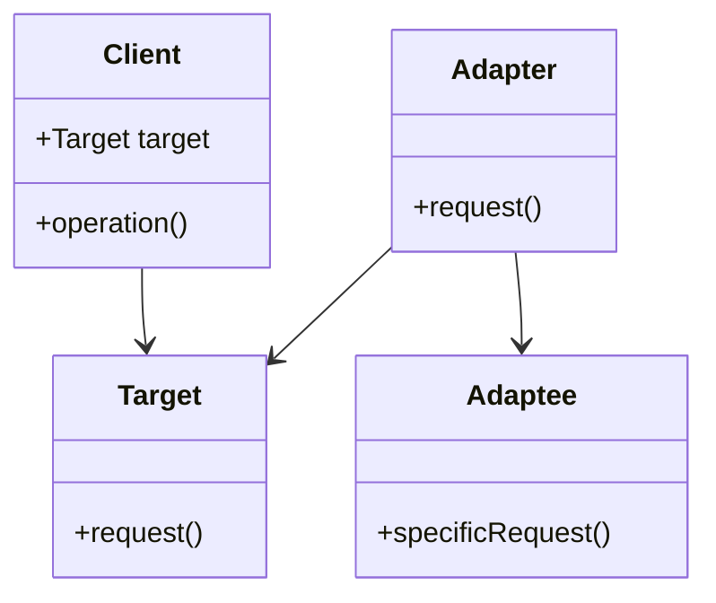

## 5.1 Adapter Design Pattern

The Adapter Design Pattern is a structural pattern that plays a crucial role in software development by allowing incompatible interfaces to work together. In the context of Dart and Flutter, this pattern can be particularly useful when integrating third-party libraries or legacy code into your applications. Let's delve into the intricacies of the Adapter Design Pattern, exploring its implementation in Dart, use cases, and practical examples.

### Intent of the Adapter Design Pattern

The primary intent of the Adapter Design Pattern is to convert the interface of a class into another interface that clients expect. This pattern allows classes to work together that otherwise couldn't due to incompatible interfaces. By using an adapter, you can create a bridge between two incompatible interfaces, enabling seamless integration and interaction.

### Key Participants

1. **Target**: The interface that the client expects.
2. **Client**: The class that interacts with the target interface.
3. **Adaptee**: The existing interface that needs adapting.
4. **Adapter**: The class that implements the target interface and holds an instance of the adaptee.

### Implementing Adapter in Dart

In Dart, there are several ways to implement the Adapter Design Pattern, including class adapters, object adapters, and using extension methods. Each approach has its own advantages and is suited to different scenarios.

#### Class Adapter

A class adapter uses inheritance to extend the adaptee class and implement the target interface. This approach is straightforward but limited by Dart's single inheritance model.

```dart
// Target interface
abstract class Target {
  void request();
}

// Adaptee class
class Adaptee {
  void specificRequest() {
    print("Adaptee's specific request");
  }
}

// Class Adapter
class ClassAdapter extends Adaptee implements Target {
  @override
  void request() {
    specificRequest();
  }
}

void main() {
  Target target = ClassAdapter();
  target.request(); // Output: Adaptee's specific request
}
```

In this example, `ClassAdapter` extends `Adaptee` and implements the `Target` interface, allowing the client to interact with the adaptee through the target interface.

#### Object Adapter

An object adapter uses composition to hold a reference to an instance of the adaptee. This approach is more flexible as it allows the adapter to work with multiple adaptees.

```dart
// Target interface
abstract class Target {
  void request();
}

// Adaptee class
class Adaptee {
  void specificRequest() {
    print("Adaptee's specific request");
  }
}

// Object Adapter
class ObjectAdapter implements Target {
  final Adaptee _adaptee;

  ObjectAdapter(this._adaptee);

  @override
  void request() {
    _adaptee.specificRequest();
  }
}

void main() {
  Adaptee adaptee = Adaptee();
  Target target = ObjectAdapter(adaptee);
  target.request(); // Output: Adaptee's specific request
}
```

Here, the `ObjectAdapter` holds a reference to an `Adaptee` instance, allowing it to delegate calls to the adaptee's methods.

#### Extension Methods

Dart's extension methods provide a way to add new functionality to existing classes without modifying them. This can be used to simplify adaptation by adding methods that conform to the target interface.

```dart
// Adaptee class
class Adaptee {
  void specificRequest() {
    print("Adaptee's specific request");
  }
}

// Extension method as Adapter
extension AdapteeExtension on Adaptee {
  void request() {
    specificRequest();
  }
}

void main() {
  Adaptee adaptee = Adaptee();
  adaptee.request(); // Output: Adaptee's specific request
}
```

In this example, an extension method is used to add a `request` method to the `Adaptee` class, effectively adapting it to the target interface.

### Use Cases and Examples

The Adapter Design Pattern is particularly useful in scenarios where you need to integrate third-party libraries or legacy code into your Dart and Flutter applications.

#### Third-Party Libraries

When working with third-party libraries, you may encounter interfaces that do not match the ones used in your application. The adapter pattern can bridge this gap, allowing you to use these libraries without modifying your existing code.

```dart
// Third-party library class
class ThirdPartyService {
  void performAction() {
    print("Performing action in third-party service");
  }
}

// Target interface
abstract class MyService {
  void execute();
}

// Adapter for third-party service
class ThirdPartyAdapter implements MyService {
  final ThirdPartyService _service;

  ThirdPartyAdapter(this._service);

  @override
  void execute() {
    _service.performAction();
  }
}

void main() {
  ThirdPartyService thirdPartyService = ThirdPartyService();
  MyService myService = ThirdPartyAdapter(thirdPartyService);
  myService.execute(); // Output: Performing action in third-party service
}
```

In this example, `ThirdPartyAdapter` adapts the `ThirdPartyService` to the `MyService` interface, allowing it to be used seamlessly within the application.

#### Legacy Code Integration

When dealing with legacy code, you may need to adapt old interfaces to work with new ones. The adapter pattern provides a way to do this without rewriting the legacy code.

```dart
// Legacy code class
class LegacySystem {
  void oldMethod() {
    print("Executing old method in legacy system");
  }
}

// New system interface
abstract class NewSystem {
  void newMethod();
}

// Adapter for legacy system
class LegacyAdapter implements NewSystem {
  final LegacySystem _legacySystem;

  LegacyAdapter(this._legacySystem);

  @override
  void newMethod() {
    _legacySystem.oldMethod();
  }
}

void main() {
  LegacySystem legacySystem = LegacySystem();
  NewSystem newSystem = LegacyAdapter(legacySystem);
  newSystem.newMethod(); // Output: Executing old method in legacy system
}
```

Here, `LegacyAdapter` adapts the `LegacySystem` to the `NewSystem` interface, enabling the legacy code to be used in a modern context.

### Visualizing the Adapter Design Pattern

To better understand the Adapter Design Pattern, let's visualize the relationships between the key participants using a class diagram.



**Diagram Description**: This class diagram illustrates the relationships between the client, target, adaptee, and adapter in the Adapter Design Pattern. The client interacts with the target interface, while the adapter implements the target interface and holds a reference to the adaptee.

### Design Considerations

When implementing the Adapter Design Pattern in Dart, consider the following:

- **Single Inheritance Limitation**: Dart's single inheritance model limits the use of class adapters. Object adapters are often more flexible and preferred.
- **Performance Overhead**: Adapters introduce an additional layer of abstraction, which may impact performance. Ensure that the benefits of using an adapter outweigh the potential overhead.
- **Maintainability**: Adapters can increase the complexity of your codebase. Use them judiciously to maintain code readability and maintainability.

### Differences and Similarities

The Adapter Design Pattern is often confused with the Facade Design Pattern. While both patterns provide a simplified interface, the adapter focuses on converting an existing interface to a new one, whereas the facade provides a unified interface to a set of interfaces.

### Try It Yourself

To deepen your understanding of the Adapter Design Pattern, try modifying the code examples provided. Experiment with different scenarios, such as adapting multiple adaptees or using extension methods to add additional functionality.

### Knowledge Check

- What is the primary intent of the Adapter Design Pattern?
- How does a class adapter differ from an object adapter in Dart?
- What are some common use cases for the Adapter Design Pattern?
- How can extension methods be used to implement the Adapter Design Pattern in Dart?

### Embrace the Journey

Remember, mastering design patterns is a journey. As you continue to explore and apply these patterns in your Dart and Flutter applications, you'll gain a deeper understanding of their benefits and nuances. Keep experimenting, stay curious, and enjoy the process of becoming a more effective developer!

## Quiz Time!



### What is the primary intent of the Adapter Design Pattern?

- [x] To convert the interface of a class into another interface that clients expect.
- [ ] To provide a simplified interface to a set of interfaces.
- [ ] To create a bridge between two classes.
- [ ] To encapsulate a group of individual factories.

> **Explanation:** The Adapter Design Pattern is intended to convert the interface of a class into another interface that clients expect, allowing incompatible interfaces to work together.

### How does a class adapter differ from an object adapter in Dart?

- [x] A class adapter uses inheritance, while an object adapter uses composition.
- [ ] A class adapter uses composition, while an object adapter uses inheritance.
- [ ] Both use inheritance.
- [ ] Both use composition.

> **Explanation:** A class adapter uses inheritance to extend the adaptee class, while an object adapter uses composition to hold a reference to an instance of the adaptee.

### Which of the following is a common use case for the Adapter Design Pattern?

- [x] Integrating third-party libraries with incompatible interfaces.
- [ ] Creating a new interface for a set of classes.
- [ ] Simplifying complex interfaces.
- [ ] Encapsulating a group of individual factories.

> **Explanation:** The Adapter Design Pattern is commonly used to integrate third-party libraries with incompatible interfaces, allowing them to work seamlessly with existing code.

### How can extension methods be used to implement the Adapter Design Pattern in Dart?

- [x] By adding methods to existing classes that conform to the target interface.
- [ ] By creating a new class that extends the adaptee.
- [ ] By holding a reference to an instance of the adaptee.
- [ ] By providing a unified interface to a set of interfaces.

> **Explanation:** Extension methods can be used to add new methods to existing classes, allowing them to conform to the target interface without modifying the original class.

### What is a key consideration when using the Adapter Design Pattern in Dart?

- [x] Dart's single inheritance model limits the use of class adapters.
- [ ] Adapters always improve performance.
- [ ] Adapters simplify code complexity.
- [ ] Adapters eliminate the need for interfaces.

> **Explanation:** Dart's single inheritance model limits the use of class adapters, making object adapters a more flexible choice.

### Which pattern is often confused with the Adapter Design Pattern?

- [x] Facade Design Pattern
- [ ] Singleton Design Pattern
- [ ] Factory Method Design Pattern
- [ ] Observer Design Pattern

> **Explanation:** The Adapter Design Pattern is often confused with the Facade Design Pattern, as both provide simplified interfaces, but they serve different purposes.

### What is the role of the adapter in the Adapter Design Pattern?

- [x] To implement the target interface and hold a reference to the adaptee.
- [ ] To provide a unified interface to a set of interfaces.
- [ ] To encapsulate a group of individual factories.
- [ ] To create a bridge between two classes.

> **Explanation:** The adapter implements the target interface and holds a reference to the adaptee, allowing the client to interact with the adaptee through the target interface.

### In the Adapter Design Pattern, what does the client interact with?

- [x] The target interface
- [ ] The adaptee
- [ ] The adapter
- [ ] The facade

> **Explanation:** In the Adapter Design Pattern, the client interacts with the target interface, which is implemented by the adapter.

### What is a potential drawback of using the Adapter Design Pattern?

- [x] It can introduce performance overhead.
- [ ] It always simplifies code complexity.
- [ ] It eliminates the need for interfaces.
- [ ] It always improves performance.

> **Explanation:** The Adapter Design Pattern can introduce performance overhead due to the additional layer of abstraction it creates.

### True or False: The Adapter Design Pattern can be used to integrate legacy code with new interfaces.

- [x] True
- [ ] False

> **Explanation:** True. The Adapter Design Pattern can be used to adapt legacy code to work with new interfaces, allowing it to be integrated into modern applications.


