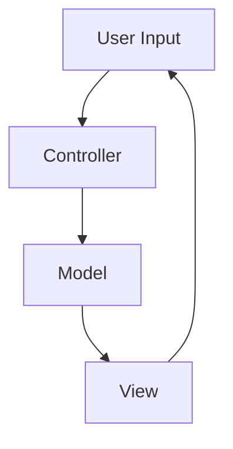
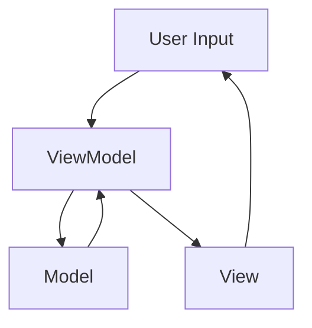

## 5.10 MVC and MVVM Patterns in Flutter

In the world of software development, especially in mobile app development with Flutter, maintaining a clean and scalable architecture is crucial. Two of the most prominent architectural patterns that help achieve this are the Model-View-Controller (MVC) and Model-View-ViewModel (MVVM) patterns. These patterns are designed to separate concerns, making your code more modular, testable, and maintainable. In this section, we will delve into these patterns, their implementation in Flutter, and how they can be leveraged to build robust applications.

### Model-View-Controller (MVC) Pattern

#### Intent

The MVC pattern is a software architectural pattern that separates an application into three main logical components: Model, View, and Controller. Each of these components is built to handle specific development aspects of an application.

- **Model**: Represents the data or business logic of the application. It directly manages the data, logic, and rules of the application.
- **View**: Represents the UI components of the application. It displays the data from the model to the user and sends user commands to the controller.
- **Controller**: Acts as an intermediary between Model and View. It listens to the input from the View, processes it (often updating the Model), and returns the output display to the View.

#### Key Participants

- **Model**: Manages the data and business logic.
- **View**: Displays the data and sends user inputs to the Controller.
- **Controller**: Handles user input and updates the Model.

#### Applicability

Use the MVC pattern when you want to:

- Separate the internal representations of information from the ways that information is presented and accepted by the user.
- Enable multiple views of the same data.
- Improve the modularity of your application.

#### Implementing MVC in Flutter

In Flutter, implementing MVC can be a bit challenging due to its widget-based architecture. However, it can be achieved by clearly defining the roles of each component.

```dart
// Model
class CounterModel {
  int _counter = 0;

  int get counter => _counter;

  void increment() {
    _counter++;
  }
}

// View
class CounterView extends StatelessWidget {
  final CounterController controller;

  CounterView(this.controller);

  @override
  Widget build(BuildContext context) {
    return Scaffold(
      appBar: AppBar(title: Text('MVC Pattern')),
      body: Center(
        child: Text(
          'Counter: ${controller.model.counter}',
          style: TextStyle(fontSize: 24),
        ),
      ),
      floatingActionButton: FloatingActionButton(
        onPressed: controller.incrementCounter,
        child: Icon(Icons.add),
      ),
    );
  }
}

// Controller
class CounterController {
  final CounterModel model;

  CounterController(this.model);

  void incrementCounter() {
    model.increment();
  }
}

void main() {
  final model = CounterModel();
  final controller = CounterController(model);
  runApp(MaterialApp(home: CounterView(controller)));
}
```

In this example, the `CounterModel` manages the counter state, the `CounterView` displays the counter, and the `CounterController` handles the logic of incrementing the counter.

#### Design Considerations

- **Separation of Concerns**: Ensure that each component only handles its specific responsibility.
- **Testing**: With MVC, you can test each component independently, making it easier to identify and fix bugs.
- **Complexity**: For simple applications, MVC might introduce unnecessary complexity.

### Model-View-ViewModel (MVVM) Pattern

#### Intent

The MVVM pattern is an evolution of the MVC pattern that introduces the ViewModel component. It is designed to provide a clear separation between the UI and business logic, making it easier to manage complex UIs.

- **Model**: Similar to MVC, it represents the data and business logic.
- **View**: Displays the data and sends user inputs to the ViewModel.
- **ViewModel**: Acts as an intermediary between the View and Model. It handles the presentation logic and data binding.

#### Key Participants

- **Model**: Manages the data and business logic.
- **View**: Displays the data and interacts with the user.
- **ViewModel**: Manages the presentation logic and data binding.

#### Applicability

Use the MVVM pattern when you want to:

- Enhance the separation of concerns in your application.
- Facilitate two-way data binding between the View and ViewModel.
- Improve testability by isolating the UI from the business logic.

#### Implementing MVVM in Flutter

Flutter does not have built-in support for MVVM, but it can be implemented using state management solutions like Provider or Riverpod.

```dart
import 'package:flutter/material.dart';
import 'package:provider/provider.dart';

// Model
class CounterModel {
  int _counter = 0;

  int get counter => _counter;

  void increment() {
    _counter++;
  }
}

// ViewModel
class CounterViewModel extends ChangeNotifier {
  final CounterModel _model;

  CounterViewModel(this._model);

  int get counter => _model.counter;

  void incrementCounter() {
    _model.increment();
    notifyListeners();
  }
}

// View
class CounterView extends StatelessWidget {
  @override
  Widget build(BuildContext context) {
    final viewModel = Provider.of<CounterViewModel>(context);

    return Scaffold(
      appBar: AppBar(title: Text('MVVM Pattern')),
      body: Center(
        child: Text(
          'Counter: ${viewModel.counter}',
          style: TextStyle(fontSize: 24),
        ),
      ),
      floatingActionButton: FloatingActionButton(
        onPressed: viewModel.incrementCounter,
        child: Icon(Icons.add),
      ),
    );
  }
}

void main() {
  final model = CounterModel();
  final viewModel = CounterViewModel(model);

  runApp(
    ChangeNotifierProvider(
      create: (_) => viewModel,
      child: MaterialApp(home: CounterView()),
    ),
  );
}
```

In this example, the `CounterModel` manages the counter state, the `CounterViewModel` handles the presentation logic and notifies the `CounterView` of changes, and the `CounterView` displays the counter.

#### Design Considerations

- **Data Binding**: MVVM facilitates two-way data binding, which can simplify UI updates.
- **Testability**: The ViewModel can be tested independently of the UI.
- **Complexity**: MVVM can introduce complexity, especially in smaller applications.

### Differences and Similarities

- **Separation of Concerns**: Both patterns aim to separate concerns, but MVVM provides a clearer separation between UI and business logic.
- **Data Binding**: MVVM supports two-way data binding, while MVC typically does not.
- **Complexity**: MVC is simpler to implement but can become cumbersome in large applications. MVVM is more complex but scales better.

### Implementing Patterns in Flutter

#### State Management Techniques

Flutter offers various state management solutions that can be used to implement MVC and MVVM patterns. Some popular ones include:

- **Provider**: A simple and efficient way to manage state and implement MVVM.
- **BLoC (Business Logic Component)**: A pattern that uses streams to manage state and can be used to implement MVC.
- **Riverpod**: A modern state management solution that improves upon Provider.

#### Data Binding

Data binding is a key feature of MVVM that allows the View to automatically update when the ViewModel changes. In Flutter, data binding can be achieved using state management solutions like Provider or Riverpod.

### Use Cases and Examples

#### Scalable Applications

For large applications, using MVC or MVVM can help structure the code in a way that is easy to maintain and scale. By separating concerns, developers can work on different parts of the application simultaneously without interfering with each other's work.

#### Team Development

In a team setting, MVC and MVVM allow developers to work on the UI and business logic independently. This parallel development can speed up the development process and reduce conflicts.

### Visualizing MVC and MVVM Patterns

To better understand the flow of data and control in MVC and MVVM patterns, let's visualize them using Mermaid.js diagrams.

#### MVC Pattern



**Description**: In the MVC pattern, the user input is handled by the Controller, which updates the Model. The Model then updates the View, which displays the data to the user.

#### MVVM Pattern



**Description**: In the MVVM pattern, the user input is handled by the ViewModel, which updates the Model. The Model updates the ViewModel, which in turn updates the View. The View displays the data to the user.

### Try It Yourself

To better understand MVC and MVVM patterns, try modifying the code examples provided. Experiment with adding new features or changing the way data is managed. This hands-on approach will help solidify your understanding of these patterns.

### References and Links

- [Flutter Documentation](https://flutter.dev/docs)
- [Provider Package](https://pub.dev/packages/provider)
- [Riverpod Package](https://pub.dev/packages/riverpod)
- [BLoC Pattern](https://bloclibrary.dev)

### Knowledge Check

- What are the main components of the MVC pattern?
- How does the MVVM pattern enhance the separation of concerns?
- What are some state management solutions in Flutter that can be used to implement MVVM?
- How does data binding work in MVVM?

### Embrace the Journey

Remember, mastering design patterns is a journey. As you continue to build more complex applications, you'll find that these patterns become invaluable tools in your development toolkit. Keep experimenting, stay curious, and enjoy the journey!

## Quiz Time!



### What are the main components of the MVC pattern?

- [x] Model, View, Controller
- [ ] Model, View, ViewModel
- [ ] Model, View, Presenter
- [ ] Model, View, Adapter

> **Explanation:** The MVC pattern consists of three main components: Model, View, and Controller.

### How does the MVVM pattern enhance the separation of concerns?

- [x] By introducing the ViewModel to handle presentation logic
- [ ] By combining the View and Model into a single component
- [ ] By eliminating the need for a Controller
- [ ] By using a single class for all logic

> **Explanation:** The MVVM pattern introduces the ViewModel, which handles presentation logic and enhances the separation of concerns between the UI and business logic.

### What is a key feature of the MVVM pattern?

- [x] Two-way data binding
- [ ] Single-way data flow
- [ ] No separation of concerns
- [ ] Direct manipulation of the Model by the View

> **Explanation:** A key feature of the MVVM pattern is two-way data binding, which allows the View to automatically update when the ViewModel changes.

### Which state management solution in Flutter is commonly used to implement MVVM?

- [x] Provider
- [ ] Redux
- [ ] InheritedWidget
- [ ] ScopedModel

> **Explanation:** Provider is a commonly used state management solution in Flutter to implement the MVVM pattern.

### What role does the Controller play in the MVC pattern?

- [x] It acts as an intermediary between the Model and View
- [ ] It directly manipulates the View
- [ ] It stores the application's data
- [ ] It handles data binding

> **Explanation:** In the MVC pattern, the Controller acts as an intermediary between the Model and View, handling user input and updating the Model.

### What is the main advantage of using MVVM over MVC?

- [x] Better separation of concerns and testability
- [ ] Simplicity and ease of implementation
- [ ] Direct manipulation of the UI by the Model
- [ ] Less code to write

> **Explanation:** MVVM offers better separation of concerns and testability compared to MVC, making it more suitable for complex applications.

### Which component in MVVM handles the presentation logic?

- [x] ViewModel
- [ ] View
- [ ] Model
- [ ] Controller

> **Explanation:** In the MVVM pattern, the ViewModel handles the presentation logic and acts as an intermediary between the View and Model.

### How can data binding be achieved in Flutter?

- [x] Using state management solutions like Provider or Riverpod
- [ ] By directly manipulating the UI from the Model
- [ ] By using a single class for all logic
- [ ] By eliminating the need for a ViewModel

> **Explanation:** In Flutter, data binding can be achieved using state management solutions like Provider or Riverpod.

### What is a potential drawback of using MVVM?

- [x] Increased complexity
- [ ] Lack of separation of concerns
- [ ] Difficulty in testing
- [ ] Limited scalability

> **Explanation:** A potential drawback of using MVVM is increased complexity, especially in smaller applications.

### True or False: In MVC, the View directly updates the Model.

- [ ] True
- [x] False

> **Explanation:** In MVC, the View does not directly update the Model. The Controller handles user input and updates the Model.


