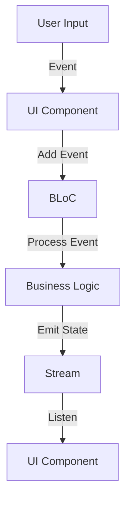

## 5.11 BLoC Pattern (Business Logic Component)

The BLoC (Business Logic Component) pattern is a powerful architectural pattern in Flutter that helps manage state and business logic by separating it from the presentation layer. This separation allows for more scalable, maintainable, and testable code. In this section, we will delve into the intricacies of the BLoC pattern, its implementation in Dart, and its application in complex Flutter applications.

### Understanding the BLoC Pattern

The BLoC pattern is a design pattern that leverages reactive programming principles to manage state and business logic in Flutter applications. It uses Streams and Sinks to handle events and states, allowing for a clear separation between the UI and the business logic. This separation is crucial for building scalable and maintainable applications.

#### Key Concepts of BLoC

- **Business Logic**: The core functionality of your application, which includes data processing, validation, and decision-making.
- **State Management**: The process of managing the state of your application, ensuring that the UI reflects the current state of the business logic.
- **Reactive Programming**: A programming paradigm that deals with asynchronous data streams and the propagation of change.

### Implementing BLoC in Dart

Implementing the BLoC pattern in Dart involves using Streams and Sinks to handle events and states. Let's explore these concepts in detail.

#### Streams and Sinks

Streams are a core part of Dart's asynchronous programming model. They provide a way to handle a sequence of asynchronous events. In the context of BLoC, Streams are used to emit states, while Sinks are used to add events.

```dart
import 'dart:async';

class CounterBloc {
  int _counter = 0;

  // StreamController to handle the counter state
  final _counterStateController = StreamController<int>();

  // Sink to add events
  StreamSink<int> get _inCounter => _counterStateController.sink;

  // Stream to output the counter state
  Stream<int> get counter => _counterStateController.stream;

  // StreamController to handle increment events
  final _counterEventController = StreamController<void>();

  // Sink to add increment events
  Sink<void> get increment => _counterEventController.sink;

  CounterBloc() {
    // Listen to increment events and update the counter state
    _counterEventController.stream.listen(_incrementCounter);
  }

  void _incrementCounter(void event) {
    _counter++;
    _inCounter.add(_counter);
  }

  void dispose() {
    _counterStateController.close();
    _counterEventController.close();
  }
}
```

In this example, we have a simple `CounterBloc` that manages a counter state. The `StreamController` is used to manage the state and events. The `increment` method adds an event to the `_counterEventController`, which is then listened to and processed by the `_incrementCounter` method.

#### Reusability: Sharing BLoCs Across Widgets

One of the key advantages of the BLoC pattern is its reusability. BLoCs can be shared across multiple widgets, allowing for a consistent and centralized management of business logic.

To share a BLoC across widgets, you can use the `Provider` package, which is a popular dependency injection library in Flutter.

```dart
import 'package:flutter/material.dart';
import 'package:provider/provider.dart';

void main() {
  runApp(
    MultiProvider(
      providers: [
        Provider<CounterBloc>(
          create: (_) => CounterBloc(),
          dispose: (_, bloc) => bloc.dispose(),
        ),
      ],
      child: MyApp(),
    ),
  );
}

class MyApp extends StatelessWidget {
  @override
  Widget build(BuildContext context) {
    return MaterialApp(
      home: CounterScreen(),
    );
  }
}

class CounterScreen extends StatelessWidget {
  @override
  Widget build(BuildContext context) {
    final counterBloc = Provider.of<CounterBloc>(context);

    return Scaffold(
      appBar: AppBar(
        title: Text('Counter App'),
      ),
      body: Center(
        child: StreamBuilder<int>(
          stream: counterBloc.counter,
          builder: (context, snapshot) {
            if (!snapshot.hasData) {
              return CircularProgressIndicator();
            }
            return Text('Counter: ${snapshot.data}');
          },
        ),
      ),
      floatingActionButton: FloatingActionButton(
        onPressed: () => counterBloc.increment.add(null),
        child: Icon(Icons.add),
      ),
    );
  }
}
```

In this example, we use the `Provider` package to inject the `CounterBloc` into the widget tree. The `CounterScreen` widget retrieves the `CounterBloc` using `Provider.of<CounterBloc>(context)` and uses a `StreamBuilder` to listen to the counter state.

### Use Cases and Examples

The BLoC pattern is particularly useful in large Flutter applications where complex state management is required. Let's explore some common use cases and examples.

#### Complex State Management in Large Flutter Apps

In large Flutter applications, managing state can become challenging. The BLoC pattern provides a structured approach to handle complex state management by separating business logic from the UI.

Consider an e-commerce application where you need to manage the state of a shopping cart. The BLoC pattern allows you to handle events such as adding or removing items from the cart, updating the total price, and managing user authentication.

```dart
class ShoppingCartBloc {
  final List<Item> _items = [];

  final _cartStateController = StreamController<List<Item>>.broadcast();

  StreamSink<List<Item>> get _inCart => _cartStateController.sink;

  Stream<List<Item>> get cart => _cartStateController.stream;

  final _cartEventController = StreamController<CartEvent>();

  Sink<CartEvent> get cartEventSink => _cartEventController.sink;

  ShoppingCartBloc() {
    _cartEventController.stream.listen(_mapEventToState);
  }

  void _mapEventToState(CartEvent event) {
    if (event is AddItemEvent) {
      _items.add(event.item);
    } else if (event is RemoveItemEvent) {
      _items.remove(event.item);
    }
    _inCart.add(_items);
  }

  void dispose() {
    _cartStateController.close();
    _cartEventController.close();
  }
}

class Item {
  final String name;
  final double price;

  Item(this.name, this.price);
}

abstract class CartEvent {}

class AddItemEvent extends CartEvent {
  final Item item;

  AddItemEvent(this.item);
}

class RemoveItemEvent extends CartEvent {
  final Item item;

  RemoveItemEvent(this.item);
}
```

In this example, we have a `ShoppingCartBloc` that manages the state of a shopping cart. The `CartEvent` class is used to define different types of events, such as adding or removing items from the cart.

#### Reactive Programming: Responding to User Input and Data Changes

The BLoC pattern leverages reactive programming principles to respond to user input and data changes. This is particularly useful in applications where real-time updates are required.

Consider a chat application where you need to update the UI in real-time as new messages are received. The BLoC pattern allows you to handle incoming messages and update the UI accordingly.

```dart
class ChatBloc {
  final List<Message> _messages = [];

  final _messageStateController = StreamController<List<Message>>.broadcast();

  StreamSink<List<Message>> get _inMessages => _messageStateController.sink;

  Stream<List<Message>> get messages => _messageStateController.stream;

  final _messageEventController = StreamController<MessageEvent>();

  Sink<MessageEvent> get messageEventSink => _messageEventController.sink;

  ChatBloc() {
    _messageEventController.stream.listen(_mapEventToState);
  }

  void _mapEventToState(MessageEvent event) {
    if (event is NewMessageEvent) {
      _messages.add(event.message);
    }
    _inMessages.add(_messages);
  }

  void dispose() {
    _messageStateController.close();
    _messageEventController.close();
  }
}

class Message {
  final String content;
  final DateTime timestamp;

  Message(this.content, this.timestamp);
}

abstract class MessageEvent {}

class NewMessageEvent extends MessageEvent {
  final Message message;

  NewMessageEvent(this.message);
}
```

In this example, we have a `ChatBloc` that manages the state of chat messages. The `MessageEvent` class is used to define different types of events, such as receiving a new message.

### Visualizing the BLoC Pattern

To better understand the BLoC pattern, let's visualize the flow of data using a Mermaid.js diagram.



**Diagram Description**: This diagram illustrates the flow of data in the BLoC pattern. User input triggers an event in the UI component, which is added to the BLoC. The BLoC processes the event and updates the business logic. The updated state is emitted as a stream, which the UI component listens to and updates the UI accordingly.

### Design Considerations

When implementing the BLoC pattern, there are several design considerations to keep in mind:

- **Separation of Concerns**: Ensure that the business logic is completely separated from the UI. This allows for better testability and maintainability.
- **Scalability**: The BLoC pattern is well-suited for large applications with complex state management requirements.
- **Reusability**: BLoCs can be shared across multiple widgets, allowing for a consistent and centralized management of business logic.
- **Performance**: Be mindful of the performance implications of using Streams and Sinks, especially in applications with a large number of events and states.

### Differences and Similarities

The BLoC pattern is often compared to other state management solutions in Flutter, such as the Provider pattern and Redux. Here are some key differences and similarities:

- **Provider Pattern**: The Provider pattern is a simpler state management solution that is often used in smaller applications. It does not enforce a strict separation between business logic and UI, unlike the BLoC pattern.
- **Redux**: Redux is a state management solution that is inspired by the Redux library in JavaScript. It provides a centralized store for managing state, similar to the BLoC pattern. However, Redux can be more complex to implement and may not be necessary for smaller applications.

### Try It Yourself

To get a better understanding of the BLoC pattern, try modifying the code examples provided in this section. Here are some suggestions:

- **Add a new event**: Extend the `CounterBloc` example by adding a new event to decrement the counter.
- **Implement a new feature**: Use the `ShoppingCartBloc` example to implement a feature that calculates the total price of the items in the cart.
- **Experiment with reactive programming**: Modify the `ChatBloc` example to handle additional events, such as deleting a message or marking a message as read.

### Knowledge Check

Before we wrap up, let's reinforce what we've learned with a few questions:

1. What is the primary purpose of the BLoC pattern in Flutter?
2. How does the BLoC pattern separate business logic from the UI?
3. What are Streams and Sinks used for in the BLoC pattern?
4. How can BLoCs be shared across multiple widgets?
5. What are some common use cases for the BLoC pattern in Flutter applications?

### Embrace the Journey

Remember, mastering the BLoC pattern is just the beginning of your journey in Flutter development. As you continue to build more complex applications, you'll find that the principles of reactive programming and state management become increasingly important. Keep experimenting, stay curious, and enjoy the journey!

## Quiz Time!



### What is the primary purpose of the BLoC pattern in Flutter?

- [x] To separate business logic from the UI
- [ ] To manage animations
- [ ] To handle network requests
- [ ] To create custom widgets

> **Explanation:** The BLoC pattern is designed to separate business logic from the UI, allowing for more scalable, maintainable, and testable code.

### How does the BLoC pattern separate business logic from the UI?

- [x] By using Streams and Sinks
- [ ] By using Stateful Widgets
- [ ] By using Inherited Widgets
- [ ] By using Provider

> **Explanation:** The BLoC pattern uses Streams and Sinks to handle events and states, ensuring a clear separation between the UI and the business logic.

### What are Streams used for in the BLoC pattern?

- [x] To emit states
- [ ] To add events
- [ ] To manage animations
- [ ] To handle network requests

> **Explanation:** In the BLoC pattern, Streams are used to emit states, allowing the UI to listen for changes and update accordingly.

### How can BLoCs be shared across multiple widgets?

- [x] By using the Provider package
- [ ] By using Stateful Widgets
- [ ] By using Inherited Widgets
- [ ] By using Redux

> **Explanation:** The Provider package is a popular dependency injection library in Flutter that allows BLoCs to be shared across multiple widgets.

### What is a common use case for the BLoC pattern in Flutter applications?

- [x] Complex state management
- [ ] Simple UI updates
- [ ] Animation management
- [ ] Network requests

> **Explanation:** The BLoC pattern is particularly useful in large Flutter applications where complex state management is required.

### What is a key advantage of using the BLoC pattern?

- [x] Reusability of business logic
- [ ] Simplified UI design
- [ ] Faster network requests
- [ ] Improved animations

> **Explanation:** One of the key advantages of the BLoC pattern is the reusability of business logic, which can be shared across multiple widgets.

### What is a potential drawback of the BLoC pattern?

- [x] Performance implications with large numbers of events
- [ ] Difficulty in creating custom widgets
- [ ] Limited support for animations
- [ ] Incompatibility with Provider

> **Explanation:** The BLoC pattern can have performance implications when dealing with a large number of events and states, so it's important to be mindful of this when implementing it.

### What is the role of Sinks in the BLoC pattern?

- [x] To add events
- [ ] To emit states
- [ ] To manage animations
- [ ] To handle network requests

> **Explanation:** In the BLoC pattern, Sinks are used to add events, which are then processed by the BLoC to update the state.

### How does the BLoC pattern leverage reactive programming?

- [x] By responding to user input and data changes
- [ ] By simplifying UI design
- [ ] By improving network performance
- [ ] By creating custom widgets

> **Explanation:** The BLoC pattern leverages reactive programming principles to respond to user input and data changes, ensuring that the UI is always up-to-date.

### True or False: The BLoC pattern is only suitable for large applications.

- [ ] True
- [x] False

> **Explanation:** While the BLoC pattern is particularly useful in large applications, it can also be used in smaller applications where a clear separation of business logic and UI is desired.


