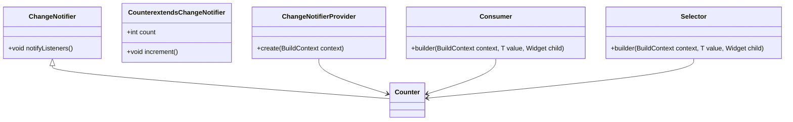

## 5.12 Provider Pattern

In the realm of Flutter development, managing state and dependencies efficiently is crucial for building scalable and maintainable applications. The Provider Pattern emerges as a powerful solution, simplifying data sharing across the widget tree and enhancing the overall architecture of Flutter apps. In this section, we will delve into the intricacies of the Provider Pattern, exploring its implementation, use cases, and best practices.

### Introduction to the Provider Pattern

The Provider Pattern is a design pattern used in Flutter for state management and dependency injection. It leverages the InheritedWidget to efficiently propagate data down the widget tree, allowing widgets to access shared data without the need for complex boilerplate code. By utilizing the Provider Pattern, developers can achieve a clean separation of concerns, making their applications more modular and easier to maintain.

#### Key Concepts

- **InheritedWidget**: A base class in Flutter that allows data to be passed down the widget tree efficiently.
- **ChangeNotifier**: A class that provides a mechanism for notifying listeners of state changes.
- **Consumer and Selector Widgets**: Widgets that listen to changes in the provided data and rebuild the UI accordingly.

### Implementing Provider in Flutter

To effectively implement the Provider Pattern in Flutter, it's essential to understand the core components and their roles in the architecture.

#### ChangeNotifier

The `ChangeNotifier` class is a fundamental building block in the Provider Pattern. It acts as a state holder and notifies listeners when the state changes. This notification mechanism is crucial for updating the UI in response to state changes.

```dart
import 'package:flutter/material.dart';

class Counter extends ChangeNotifier {
  int _count = 0;

  int get count => _count;

  void increment() {
    _count++;
    notifyListeners(); // Notify listeners of state change
  }
}
```

In this example, the `Counter` class extends `ChangeNotifier` and provides a simple counter functionality. The `increment` method updates the counter and calls `notifyListeners` to inform any listeners about the state change.

#### Providing the ChangeNotifier

To make the `Counter` instance available to the widget tree, we use the `ChangeNotifierProvider`. This widget wraps the root of the widget tree and provides the `Counter` instance to its descendants.

```dart
import 'package:flutter/material.dart';
import 'package:provider/provider.dart';

void main() {
  runApp(
    ChangeNotifierProvider(
      create: (context) => Counter(),
      child: MyApp(),
    ),
  );
}

class MyApp extends StatelessWidget {
  @override
  Widget build(BuildContext context) {
    return MaterialApp(
      home: CounterScreen(),
    );
  }
}
```

In this setup, the `ChangeNotifierProvider` is used to create and provide the `Counter` instance to the entire widget tree.

#### Consumer and Selector Widgets

The `Consumer` and `Selector` widgets are used to listen to changes in the provided data and rebuild the UI accordingly.

- **Consumer**: Rebuilds the entire widget when the provided data changes.
- **Selector**: Selectively rebuilds parts of the widget based on specific changes in the provided data.

```dart
class CounterScreen extends StatelessWidget {
  @override
  Widget build(BuildContext context) {
    return Scaffold(
      appBar: AppBar(title: Text('Counter')),
      body: Center(
        child: Consumer<Counter>(
          builder: (context, counter, child) {
            return Text('Count: ${counter.count}');
          },
        ),
      ),
      floatingActionButton: FloatingActionButton(
        onPressed: () => context.read<Counter>().increment(),
        child: Icon(Icons.add),
      ),
    );
  }
}
```

In this example, the `Consumer` widget listens to changes in the `Counter` instance and rebuilds the `Text` widget whenever the count changes.

### Use Cases and Examples

The Provider Pattern is versatile and can be applied to various scenarios in Flutter development, including state management and dependency injection.

#### State Management

For both small and large applications, managing state efficiently is crucial. The Provider Pattern offers a clean and scalable solution for state management.

- **Small Applications**: In small applications, the Provider Pattern can be used to manage simple state changes, such as toggling a theme or managing a counter.
- **Large Applications**: In larger applications, the Provider Pattern can be combined with other state management solutions, such as BLoC or Redux, to manage complex state changes across multiple modules.

#### Dependency Injection

The Provider Pattern also facilitates dependency injection, allowing services to be provided to widgets without tight coupling.

- **Service Locator**: By using the Provider Pattern, you can implement a service locator pattern, where services are registered and accessed throughout the application.
- **Loose Coupling**: The Provider Pattern promotes loose coupling by decoupling the creation and consumption of services, making the application more modular and testable.

### Design Considerations

When using the Provider Pattern, it's essential to consider the following design aspects:

- **Performance**: Use `Selector` widgets to optimize performance by rebuilding only the necessary parts of the UI.
- **Modularity**: Structure your application into modules, each with its own providers, to enhance maintainability.
- **Testing**: Write unit tests for your `ChangeNotifier` classes to ensure the correctness of state changes.

### Differences and Similarities

The Provider Pattern is often compared to other state management solutions in Flutter, such as BLoC and Redux. While each pattern has its strengths and weaknesses, the Provider Pattern is known for its simplicity and ease of use, making it an excellent choice for many applications.

- **Provider vs. BLoC**: The Provider Pattern is simpler and more straightforward, while BLoC offers more control over state transitions.
- **Provider vs. Redux**: Redux provides a more structured approach to state management, but the Provider Pattern is easier to integrate and use in smaller applications.

### Visualizing the Provider Pattern

To better understand the flow of data in the Provider Pattern, let's visualize the architecture using a class diagram.



This diagram illustrates the relationship between the `ChangeNotifier`, `Counter`, `ChangeNotifierProvider`, `Consumer`, and `Selector` classes.

### Try It Yourself

To deepen your understanding of the Provider Pattern, try modifying the code examples provided:

- **Experiment with Selectors**: Replace the `Consumer` widget with a `Selector` widget and observe the performance improvements.
- **Add More State**: Extend the `Counter` class to manage additional state, such as a list of items or a boolean flag.
- **Implement Dependency Injection**: Use the Provider Pattern to inject a service, such as a network client, into your application.

### Knowledge Check

Before we conclude, let's review some key takeaways:

- The Provider Pattern simplifies state management and dependency injection in Flutter applications.
- `ChangeNotifier` is a core component for managing state changes.
- `Consumer` and `Selector` widgets efficiently rebuild the UI in response to state changes.
- The Provider Pattern promotes loose coupling and modularity.

### Embrace the Journey

Remember, mastering the Provider Pattern is just the beginning. As you continue your Flutter development journey, you'll encounter more complex patterns and architectures. Keep experimenting, stay curious, and enjoy the process of building amazing applications!

## Quiz Time!



### What is the primary purpose of the Provider Pattern in Flutter?

- [x] Simplifying state management and dependency injection
- [ ] Enhancing UI animations
- [ ] Improving network performance
- [ ] Managing database connections

> **Explanation:** The Provider Pattern is primarily used for simplifying state management and dependency injection in Flutter applications.

### Which class in the Provider Pattern is responsible for notifying listeners of state changes?

- [x] ChangeNotifier
- [ ] Consumer
- [ ] Selector
- [ ] InheritedWidget

> **Explanation:** The `ChangeNotifier` class is responsible for notifying listeners of state changes in the Provider Pattern.

### What is the role of the Consumer widget in the Provider Pattern?

- [x] Listening to changes in provided data and rebuilding the UI
- [ ] Managing network requests
- [ ] Handling user input
- [ ] Storing application settings

> **Explanation:** The `Consumer` widget listens to changes in provided data and rebuilds the UI accordingly.

### How does the Selector widget differ from the Consumer widget?

- [x] Selector selectively rebuilds parts of the UI based on specific changes
- [ ] Selector manages network requests
- [ ] Selector handles user input
- [ ] Selector stores application settings

> **Explanation:** The `Selector` widget selectively rebuilds parts of the UI based on specific changes, optimizing performance.

### In which scenarios is the Provider Pattern particularly useful?

- [x] State management and dependency injection
- [ ] UI animations and transitions
- [ ] Network performance optimization
- [ ] Database management

> **Explanation:** The Provider Pattern is particularly useful for state management and dependency injection in Flutter applications.

### What is a key benefit of using the Provider Pattern for dependency injection?

- [x] Promotes loose coupling and modularity
- [ ] Enhances UI animations
- [ ] Improves network performance
- [ ] Manages database connections

> **Explanation:** The Provider Pattern promotes loose coupling and modularity, making applications more maintainable and testable.

### Which widget is used to provide a ChangeNotifier instance to the widget tree?

- [x] ChangeNotifierProvider
- [ ] Consumer
- [ ] Selector
- [ ] InheritedWidget

> **Explanation:** The `ChangeNotifierProvider` widget is used to provide a `ChangeNotifier` instance to the widget tree.

### What is the relationship between ChangeNotifier and Counter in the Provider Pattern?

- [x] Counter extends ChangeNotifier
- [ ] ChangeNotifier extends Counter
- [ ] Counter implements ChangeNotifier
- [ ] ChangeNotifier implements Counter

> **Explanation:** In the Provider Pattern, `Counter` extends `ChangeNotifier` to manage state changes.

### Which pattern is often compared to the Provider Pattern in Flutter for state management?

- [x] BLoC
- [ ] MVC
- [ ] MVVM
- [ ] Singleton

> **Explanation:** The BLoC pattern is often compared to the Provider Pattern in Flutter for state management.

### True or False: The Provider Pattern is only suitable for small applications.

- [ ] True
- [x] False

> **Explanation:** False. The Provider Pattern is suitable for both small and large applications, offering scalability and flexibility.


