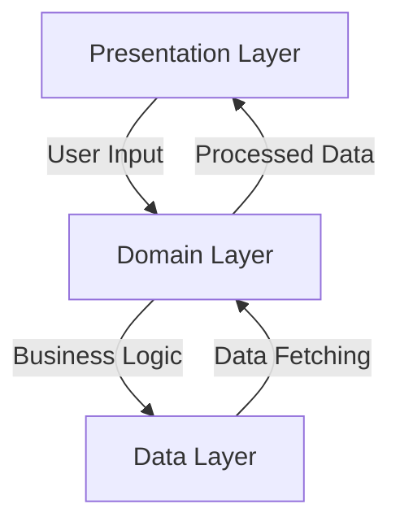

## 5.13 Clean Architecture in Flutter Apps

Clean Architecture is a software design philosophy that emphasizes the separation of concerns, making it easier to manage complex applications. In the context of Flutter development, Clean Architecture helps organize code into distinct layers, each with its own responsibility. This approach not only enhances testability and scalability but also improves the maintainability of your Flutter applications.

### Organizing Code into Layers

Clean Architecture divides an application into three primary layers: Presentation, Domain, and Data. Each layer has a specific role and interacts with other layers through well-defined interfaces.

#### 1. Presentation Layer

The Presentation Layer is responsible for the user interface and user interaction. In Flutter, this typically includes widgets and UI logic. This layer should be as dumb as possible, focusing solely on displaying data and capturing user input.

#### 2. Domain Layer

The Domain Layer contains the business logic of the application. It is independent of any framework or external library, making it highly testable. This layer includes entities and use cases that define the core functionality of the application.

#### 3. Data Layer

The Data Layer handles data management, including network requests, database operations, and caching. It is responsible for fetching data from external sources and providing it to the Domain Layer.

### Implementing Clean Architecture

To implement Clean Architecture in Flutter, follow these key principles:

#### Dependency Rules

The Dependency Rule is a fundamental principle of Clean Architecture. It states that dependencies should point inward, meaning that inner layers should not depend on outer layers. This ensures that the core business logic remains unaffected by changes in the presentation or data layers.

#### Data Flow

Data flow in Clean Architecture follows a unidirectional pattern: from the UI to the domain to the data layer and back. This clear separation of concerns makes it easier to track data transformations and debug issues.

### Use Cases and Examples

Clean Architecture offers several benefits, including improved testability and scalability. Let's explore these advantages with practical examples.

#### Testability

By isolating business logic in the Domain Layer, Clean Architecture makes it easier to write unit tests. You can test the core functionality of your application without worrying about UI or data dependencies.

```dart
// Example of a use case in the Domain Layer
class GetUserProfile {
  final UserRepository repository;

  GetUserProfile(this.repository);

  Future<User> execute(String userId) {
    return repository.getUserById(userId);
  }
}
```

In this example, the `GetUserProfile` use case is independent of any UI or data concerns, making it easy to test.

#### Scalability

As your application grows, Clean Architecture helps manage complexity by keeping each layer focused on its specific responsibilities. This modular approach allows you to add new features or make changes without affecting the entire codebase.

### Visualizing Clean Architecture

To better understand the structure of Clean Architecture, let's visualize it using a diagram.



**Figure 1: Visualizing Clean Architecture in Flutter**

This diagram illustrates the flow of data and dependencies between the layers in a Flutter application using Clean Architecture.

### Design Considerations

When implementing Clean Architecture, consider the following:

- **Separation of Concerns**: Ensure each layer has a clear responsibility.
- **Interface Segregation**: Use interfaces to define interactions between layers.
- **Testability**: Write tests for each layer independently.
- **Scalability**: Design your architecture to accommodate future growth.

### Differences and Similarities

Clean Architecture shares similarities with other architectural patterns like MVVM (Model-View-ViewModel) and MVC (Model-View-Controller). However, it emphasizes the independence of business logic from UI and data concerns, making it more suitable for complex applications.

### Code Example: Implementing Clean Architecture in Flutter

Let's walk through a simple example of implementing Clean Architecture in a Flutter application.

#### Step 1: Define the Domain Layer

Create a `User` entity and a `UserRepository` interface.

```dart
// Domain Layer: User entity
class User {
  final String id;
  final String name;
  final String email;

  User({required this.id, required this.name, required this.email});
}

// Domain Layer: UserRepository interface
abstract class UserRepository {
  Future<User> getUserById(String id);
}
```

#### Step 2: Implement the Data Layer

Create a `UserRepositoryImpl` class that fetches data from a remote source.

```dart
// Data Layer: UserRepository implementation
class UserRepositoryImpl implements UserRepository {
  @override
  Future<User> getUserById(String id) async {
    // Simulate a network request
    await Future.delayed(Duration(seconds: 2));
    return User(id: id, name: 'John Doe', email: 'john.doe@example.com');
  }
}
```

#### Step 3: Create the Presentation Layer

Build a simple Flutter widget that displays user information.

```dart
// Presentation Layer: UserProfile widget
class UserProfile extends StatelessWidget {
  final GetUserProfile getUserProfile;

  UserProfile({required this.getUserProfile});

  @override
  Widget build(BuildContext context) {
    return FutureBuilder<User>(
      future: getUserProfile.execute('123'),
      builder: (context, snapshot) {
        if (snapshot.connectionState == ConnectionState.waiting) {
          return CircularProgressIndicator();
        } else if (snapshot.hasError) {
          return Text('Error: ${snapshot.error}');
        } else {
          final user = snapshot.data!;
          return Column(
            children: [
              Text('Name: ${user.name}'),
              Text('Email: ${user.email}'),
            ],
          );
        }
      },
    );
  }
}
```

### Try It Yourself

Experiment with the code examples by modifying the `UserRepositoryImpl` class to fetch data from a local database or a different API. Observe how the separation of concerns in Clean Architecture allows you to make these changes without affecting the rest of the application.

### Knowledge Check

- What are the three primary layers in Clean Architecture?
- How does the Dependency Rule affect the structure of a Flutter application?
- Why is testability improved in Clean Architecture?

### Embrace the Journey

Remember, mastering Clean Architecture is a journey. As you continue to build more complex Flutter applications, you'll appreciate the benefits of this design philosophy. Keep experimenting, stay curious, and enjoy the process of creating scalable and maintainable software.

### References and Links

- [Uncle Bob's Clean Architecture](https://blog.cleancoder.com/uncle-bob/2012/08/13/the-clean-architecture.html)
- [Flutter Documentation](https://flutter.dev/docs)

## Quiz Time!



### What is the primary goal of Clean Architecture in Flutter apps?

- [x] To separate concerns and improve testability and scalability
- [ ] To increase the complexity of the codebase
- [ ] To make the UI layer dependent on the data layer
- [ ] To eliminate the need for unit testing

> **Explanation:** Clean Architecture aims to separate concerns, making the codebase more testable and scalable.

### Which layer in Clean Architecture is responsible for business logic?

- [ ] Presentation Layer
- [x] Domain Layer
- [ ] Data Layer
- [ ] UI Layer

> **Explanation:** The Domain Layer contains the business logic of the application.

### What is the Dependency Rule in Clean Architecture?

- [x] Inner layers should not depend on outer layers
- [ ] Outer layers should not depend on inner layers
- [ ] All layers should depend on each other
- [ ] There are no dependencies between layers

> **Explanation:** The Dependency Rule states that inner layers should not depend on outer layers.

### How does Clean Architecture improve testability?

- [x] By isolating business logic in the Domain Layer
- [ ] By combining UI and data concerns
- [ ] By reducing the number of tests needed
- [ ] By making the codebase more complex

> **Explanation:** Clean Architecture improves testability by isolating business logic, making it easier to test independently.

### What is the role of the Presentation Layer in Clean Architecture?

- [x] To handle user interface and interaction
- [ ] To manage data fetching and storage
- [ ] To contain business logic
- [ ] To define application entities

> **Explanation:** The Presentation Layer is responsible for the user interface and interaction.

### Which of the following is a benefit of Clean Architecture?

- [x] Improved scalability
- [ ] Increased code complexity
- [ ] Reduced testability
- [ ] Dependency on specific frameworks

> **Explanation:** Clean Architecture improves scalability by organizing code into layers with clear responsibilities.

### What is the primary focus of the Data Layer in Clean Architecture?

- [ ] User interface management
- [ ] Business logic processing
- [x] Data management and fetching
- [ ] Application configuration

> **Explanation:** The Data Layer handles data management, including fetching and storage.

### How does Clean Architecture handle data flow?

- [x] From UI to domain to data and back
- [ ] From data to domain to UI and back
- [ ] In a circular pattern
- [ ] Without any specific flow

> **Explanation:** Data flows from the UI to the domain to the data layer and back in Clean Architecture.

### What is a key design consideration in Clean Architecture?

- [x] Separation of concerns
- [ ] Combining all logic in one layer
- [ ] Ignoring interface segregation
- [ ] Making all layers dependent on each other

> **Explanation:** Separation of concerns is a key design consideration in Clean Architecture.

### True or False: Clean Architecture eliminates the need for unit testing.

- [ ] True
- [x] False

> **Explanation:** Clean Architecture does not eliminate the need for unit testing; it enhances testability by organizing code into layers.


