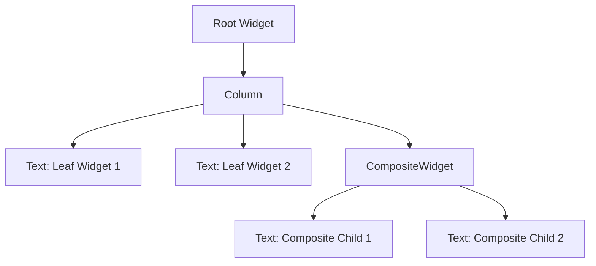

## 5.14 Composite Pattern with Widgets in Flutter

In the world of Flutter development, building complex user interfaces (UIs) is a common task. The Composite Pattern, a structural design pattern, provides a powerful way to manage and organize these complex UIs by treating individual components and compositions of components uniformly. This pattern is particularly useful in Flutter, where the UI is constructed using a tree of widgets. In this section, we will explore how to implement the Composite Pattern with widgets in Flutter, create custom composites, and examine use cases for reusable UI components and dynamic interfaces.

### Understanding the Composite Pattern

#### Intent

The Composite Pattern is intended to allow you to compose objects into tree structures to represent part-whole hierarchies. It lets clients treat individual objects and compositions of objects uniformly. In Flutter, this translates to building UIs where individual widgets and groups of widgets can be treated the same way, allowing for more flexible and scalable UI design.

#### Key Participants

- **Component**: An interface for all objects in the composition, both leaf and composite.
- **Leaf**: Represents leaf objects in the composition. A leaf has no children.
- **Composite**: Defines behavior for components having children and stores child components.
- **Client**: Manipulates objects in the composition through the component interface.

### Implementing Composite in Flutter

#### Widget Trees: Nesting Widgets to Create UI

In Flutter, the UI is built using a tree of widgets. This tree structure naturally lends itself to the Composite Pattern. Each widget in Flutter can be thought of as a component in the Composite Pattern, with some widgets acting as leaves and others as composites.

```dart
import 'package:flutter/material.dart';

void main() {
  runApp(MyApp());
}

class MyApp extends StatelessWidget {
  @override
  Widget build(BuildContext context) {
    return MaterialApp(
      home: Scaffold(
        appBar: AppBar(title: Text('Composite Pattern in Flutter')),
        body: Column(
          children: [
            Text('Leaf Widget 1'),
            Text('Leaf Widget 2'),
            CompositeWidget(),
          ],
        ),
      ),
    );
  }
}

class CompositeWidget extends StatelessWidget {
  @override
  Widget build(BuildContext context) {
    return Column(
      children: [
        Text('Composite Widget - Child 1'),
        Text('Composite Widget - Child 2'),
      ],
    );
  }
}
```

In this example, `Text` widgets act as leaf components, while `Column` acts as a composite component that can contain multiple children.

#### Custom Composites: Creating Reusable Components

Creating custom composite widgets allows you to encapsulate complex UI logic into reusable components. This is particularly useful for creating consistent UI elements across your application.

```dart
class CustomCard extends StatelessWidget {
  final String title;
  final String content;

  CustomCard({required this.title, required this.content});

  @override
  Widget build(BuildContext context) {
    return Card(
      child: Column(
        children: [
          Text(title, style: TextStyle(fontWeight: FontWeight.bold)),
          Text(content),
        ],
      ),
    );
  }
}
```

By using the `CustomCard` widget, you can easily create consistent card components throughout your application, enhancing reusability and maintainability.

### Use Cases and Examples

#### Reusable UI Components: Building Libraries of UI Elements

One of the primary benefits of the Composite Pattern is the ability to create libraries of reusable UI components. By encapsulating complex UI logic into composite widgets, you can build a library of UI elements that can be reused across different parts of your application.

```dart
class IconLabelButton extends StatelessWidget {
  final IconData icon;
  final String label;
  final VoidCallback onPressed;

  IconLabelButton({required this.icon, required this.label, required this.onPressed});

  @override
  Widget build(BuildContext context) {
    return ElevatedButton.icon(
      icon: Icon(icon),
      label: Text(label),
      onPressed: onPressed,
    );
  }
}
```

The `IconLabelButton` widget can be used throughout your application wherever you need a button with an icon and label, ensuring consistency and reducing code duplication.

#### Dynamic Interfaces: Constructing UIs Based on Data

The Composite Pattern also facilitates the construction of dynamic interfaces that adapt based on data. This is particularly useful in applications that need to display varying content based on user input or external data sources.

```dart
class DynamicList extends StatelessWidget {
  final List<String> items;

  DynamicList({required this.items});

  @override
  Widget build(BuildContext context) {
    return ListView.builder(
      itemCount: items.length,
      itemBuilder: (context, index) {
        return ListTile(
          title: Text(items[index]),
        );
      },
    );
  }
}
```

The `DynamicList` widget can display a list of items that changes based on the data provided, making it a versatile component for dynamic UIs.

### Visualizing the Composite Pattern in Flutter

To better understand how the Composite Pattern works in Flutter, let's visualize a simple widget tree using Mermaid.js.



This diagram illustrates a simple widget tree where a `Column` widget acts as a composite, containing both leaf widgets (`Text`) and another composite widget (`CompositeWidget`).

### Design Considerations

When using the Composite Pattern in Flutter, consider the following:

- **Performance**: Deep widget trees can impact performance. Use composite widgets judiciously and optimize where necessary.
- **Reusability**: Aim to create reusable components that encapsulate complex UI logic.
- **Consistency**: Use composite widgets to ensure consistent UI elements across your application.

### Differences and Similarities

The Composite Pattern is often compared to other structural patterns like the Decorator Pattern. While both involve composing objects, the Composite Pattern focuses on part-whole hierarchies, whereas the Decorator Pattern is about adding responsibilities to objects dynamically.

### Try It Yourself

Experiment with the code examples provided by modifying them to suit your needs. Try creating your own composite widgets and see how they can simplify your UI development process.

### References and Links

For further reading on the Composite Pattern and Flutter development, consider the following resources:

- [Flutter Documentation](https://flutter.dev/docs)
- [Design Patterns: Elements of Reusable Object-Oriented Software](https://en.wikipedia.org/wiki/Design_Patterns)
- [Dart Language Tour](https://dart.dev/guides/language/language-tour)

### Knowledge Check

To reinforce your understanding of the Composite Pattern in Flutter, consider the following questions:

1. What is the primary intent of the Composite Pattern?
2. How does the Composite Pattern relate to widget trees in Flutter?
3. What are the key participants in the Composite Pattern?
4. How can custom composite widgets enhance reusability in Flutter applications?
5. What are some design considerations when using the Composite Pattern in Flutter?

### Embrace the Journey

Remember, mastering design patterns like the Composite Pattern is a journey. As you continue to experiment and build with Flutter, you'll find new ways to apply these patterns to create efficient and scalable applications. Keep exploring, stay curious, and enjoy the process of becoming a more proficient Flutter developer.

## Quiz Time!



### What is the primary intent of the Composite Pattern?

- [x] To compose objects into tree structures to represent part-whole hierarchies.
- [ ] To add responsibilities to objects dynamically.
- [ ] To define a family of algorithms and make them interchangeable.
- [ ] To provide a way to access the elements of an aggregate object sequentially.

> **Explanation:** The Composite Pattern is intended to allow you to compose objects into tree structures to represent part-whole hierarchies.

### In Flutter, what acts as the composite component in a widget tree?

- [x] Column
- [ ] Text
- [ ] Icon
- [ ] Button

> **Explanation:** In Flutter, a `Column` can act as a composite component that contains multiple children.

### How can custom composite widgets enhance reusability?

- [x] By encapsulating complex UI logic into reusable components.
- [ ] By adding more widgets to the tree.
- [ ] By reducing the number of widgets in the tree.
- [ ] By making widgets less flexible.

> **Explanation:** Custom composite widgets encapsulate complex UI logic into reusable components, enhancing reusability.

### What is a key design consideration when using the Composite Pattern in Flutter?

- [x] Performance impact of deep widget trees.
- [ ] Reducing the number of widgets.
- [ ] Avoiding the use of leaf widgets.
- [ ] Ensuring all widgets are stateless.

> **Explanation:** Deep widget trees can impact performance, so it's important to consider this when using the Composite Pattern.

### Which pattern is often compared to the Composite Pattern?

- [x] Decorator Pattern
- [ ] Singleton Pattern
- [ ] Factory Pattern
- [ ] Observer Pattern

> **Explanation:** The Composite Pattern is often compared to the Decorator Pattern, as both involve composing objects.

### What is a benefit of using the Composite Pattern in Flutter?

- [x] It allows for more flexible and scalable UI design.
- [ ] It reduces the need for state management.
- [ ] It simplifies asynchronous programming.
- [ ] It eliminates the need for testing.

> **Explanation:** The Composite Pattern allows for more flexible and scalable UI design by treating individual widgets and groups of widgets uniformly.

### What is a leaf component in the Composite Pattern?

- [x] A component that has no children.
- [ ] A component that contains other components.
- [ ] A component that manages state.
- [ ] A component that handles user input.

> **Explanation:** A leaf component in the Composite Pattern is a component that has no children.

### How does the Composite Pattern facilitate dynamic interfaces?

- [x] By allowing UIs to adapt based on data.
- [ ] By reducing the number of widgets.
- [ ] By simplifying asynchronous programming.
- [ ] By eliminating the need for state management.

> **Explanation:** The Composite Pattern facilitates dynamic interfaces by allowing UIs to adapt based on data.

### What is a composite component in the Composite Pattern?

- [x] A component that defines behavior for components having children.
- [ ] A component that has no children.
- [ ] A component that manages state.
- [ ] A component that handles user input.

> **Explanation:** A composite component in the Composite Pattern defines behavior for components having children and stores child components.

### True or False: The Composite Pattern is only useful for building static UIs.

- [ ] True
- [x] False

> **Explanation:** False. The Composite Pattern is useful for building both static and dynamic UIs, as it allows for flexible and scalable design.


