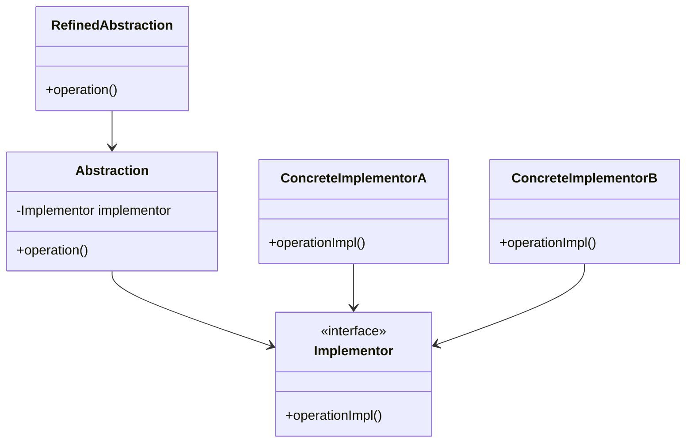

## 5.2 Bridge Design Pattern

The Bridge Design Pattern is a structural pattern that plays a crucial role in software architecture by decoupling abstraction from implementation, allowing both to vary independently. This pattern is particularly useful in scenarios where you need to switch between different implementations without altering the client code. In this section, we'll explore the Bridge Design Pattern in the context of Dart and Flutter development, providing a comprehensive understanding of its implementation and use cases.

### Intent of the Bridge Design Pattern

The primary intent of the Bridge Design Pattern is to separate an abstraction from its implementation so that the two can evolve independently. This separation is achieved by defining a bridge interface that acts as an intermediary between the abstraction and the implementation. By doing so, the pattern promotes flexibility and scalability in code design.

### Key Participants

1. **Abstraction**: Defines the abstraction's interface and maintains a reference to an object of type Implementor.
2. **Refined Abstraction**: Extends the interface defined by Abstraction.
3. **Implementor**: Defines the interface for implementation classes. This interface doesn't need to correspond exactly to Abstraction's interface; in fact, the two interfaces can be quite different.
4. **Concrete Implementor**: Implements the Implementor interface and defines its concrete implementation.

### Visualizing the Bridge Pattern

To better understand the Bridge Design Pattern, let's visualize its structure using a class diagram:



In this diagram, the `Abstraction` class maintains a reference to an `Implementor` object, which allows the abstraction and implementation to vary independently.

### Implementing Bridge in Dart

Let's dive into implementing the Bridge Design Pattern in Dart. We'll start by defining the abstraction and implementation hierarchies.

#### Abstraction and Implementation Hierarchies

First, define the `Implementor` interface and its concrete implementations:

```dart
// Implementor interface
abstract class Implementor {
  void operationImpl();
}

// Concrete Implementor A
class ConcreteImplementorA implements Implementor {
  @override
  void operationImpl() {
    print('ConcreteImplementorA operation implementation.');
  }
}

// Concrete Implementor B
class ConcreteImplementorB implements Implementor {
  @override
  void operationImpl() {
    print('ConcreteImplementorB operation implementation.');
  }
}
```

Next, define the `Abstraction` class and its refined abstraction:

```dart
// Abstraction class
class Abstraction {
  final Implementor implementor;

  Abstraction(this.implementor);

  void operation() {
    implementor.operationImpl();
  }
}

// Refined Abstraction
class RefinedAbstraction extends Abstraction {
  RefinedAbstraction(Implementor implementor) : super(implementor);

  @override
  void operation() {
    print('RefinedAbstraction operation.');
    implementor.operationImpl();
  }
}
```

In this implementation, the `Abstraction` class holds a reference to an `Implementor` object, allowing the abstraction and implementation to vary independently.

#### Composition Over Inheritance

The Bridge Design Pattern emphasizes composition over inheritance. By holding a reference to the implementation, the abstraction can delegate work to the implementor, promoting flexibility and reducing tight coupling.

### Use Cases and Examples

The Bridge Design Pattern is particularly useful in scenarios where you need to handle platform-specific implementations or separate high-level logic from low-level rendering. Let's explore some practical examples.

#### Platform-Specific Implementations

In Flutter development, you might encounter situations where you need to handle different platform-specific implementations. The Bridge Design Pattern can help you achieve this by decoupling the abstraction from the platform-specific implementation.

Consider a scenario where you need to implement a logging system that behaves differently on Android and iOS. You can use the Bridge Design Pattern to separate the logging abstraction from the platform-specific implementations.

```dart
// Implementor interface for logging
abstract class Logger {
  void log(String message);
}

// Concrete Implementor for Android
class AndroidLogger implements Logger {
  @override
  void log(String message) {
    print('Android Logger: $message');
  }
}

// Concrete Implementor for iOS
class IOSLogger implements Logger {
  @override
  void log(String message) {
    print('iOS Logger: $message');
  }
}

// Abstraction for logging
class LogManager {
  final Logger logger;

  LogManager(this.logger);

  void logMessage(String message) {
    logger.log(message);
  }
}

void main() {
  // Use Android logger
  LogManager androidLogManager = LogManager(AndroidLogger());
  androidLogManager.logMessage('Logging on Android');

  // Use iOS logger
  LogManager iosLogManager = LogManager(IOSLogger());
  iosLogManager.logMessage('Logging on iOS');
}
```

In this example, the `LogManager` class acts as the abstraction, while `AndroidLogger` and `IOSLogger` are concrete implementors. This setup allows you to switch between different logging implementations without altering the client code.

#### Graphics and Rendering Engines

Another common use case for the Bridge Design Pattern is in graphics and rendering engines, where you need to separate high-level logic from low-level rendering.

Consider a graphics application where you need to render shapes using different rendering engines. You can use the Bridge Design Pattern to separate the shape abstraction from the rendering implementation.

```dart
// Implementor interface for rendering
abstract class Renderer {
  void renderCircle(double radius);
}

// Concrete Implementor for OpenGL
class OpenGLRenderer implements Renderer {
  @override
  void renderCircle(double radius) {
    print('Rendering circle with OpenGL: radius = $radius');
  }
}

// Concrete Implementor for DirectX
class DirectXRenderer implements Renderer {
  @override
  void renderCircle(double radius) {
    print('Rendering circle with DirectX: radius = $radius');
  }
}

// Abstraction for shapes
abstract class Shape {
  final Renderer renderer;

  Shape(this.renderer);

  void draw();
}

// Refined Abstraction for Circle
class Circle extends Shape {
  final double radius;

  Circle(Renderer renderer, this.radius) : super(renderer);

  @override
  void draw() {
    renderer.renderCircle(radius);
  }
}

void main() {
  // Use OpenGL renderer
  Shape circleOpenGL = Circle(OpenGLRenderer(), 5.0);
  circleOpenGL.draw();

  // Use DirectX renderer
  Shape circleDirectX = Circle(DirectXRenderer(), 5.0);
  circleDirectX.draw();
}
```

In this example, the `Shape` class acts as the abstraction, while `OpenGLRenderer` and `DirectXRenderer` are concrete implementors. This setup allows you to switch between different rendering engines without altering the client code.

### Design Considerations

When implementing the Bridge Design Pattern, consider the following:

- **When to Use**: Use the Bridge Design Pattern when you need to separate abstraction from implementation, especially when both need to vary independently.
- **Flexibility**: The pattern promotes flexibility by allowing you to switch between different implementations without altering the client code.
- **Complexity**: The pattern can introduce additional complexity, so use it judiciously when the benefits outweigh the costs.

### Differences and Similarities

The Bridge Design Pattern is often confused with the Adapter Design Pattern. While both patterns involve interfaces and implementations, they serve different purposes:

- **Bridge Pattern**: Separates abstraction from implementation, allowing both to vary independently.
- **Adapter Pattern**: Converts the interface of a class into another interface that clients expect, allowing incompatible interfaces to work together.

### Try It Yourself

To deepen your understanding of the Bridge Design Pattern, try modifying the code examples provided. Experiment with adding new implementors or refining the abstraction to see how the pattern promotes flexibility and scalability.

### Knowledge Check

Let's reinforce your understanding of the Bridge Design Pattern with some questions and exercises.

- **Question**: What is the primary intent of the Bridge Design Pattern?
- **Exercise**: Implement a payment processing system using the Bridge Design Pattern, where the abstraction is the payment method and the implementation is the payment gateway.

### Embrace the Journey

Remember, mastering design patterns is a journey. As you progress, you'll build more complex and scalable applications. Keep experimenting, stay curious, and enjoy the journey!

## Quiz Time!



### What is the primary intent of the Bridge Design Pattern?

- [x] To separate abstraction from implementation so that they can vary independently.
- [ ] To convert the interface of a class into another interface that clients expect.
- [ ] To provide a simplified interface to a complex subsystem.
- [ ] To define a family of algorithms and make them interchangeable.

> **Explanation:** The Bridge Design Pattern's primary intent is to separate abstraction from implementation, allowing both to vary independently.

### Which of the following is a key participant in the Bridge Design Pattern?

- [x] Abstraction
- [ ] Adapter
- [ ] Facade
- [ ] Singleton

> **Explanation:** The key participants in the Bridge Design Pattern include Abstraction, Refined Abstraction, Implementor, and Concrete Implementor.

### How does the Bridge Design Pattern promote flexibility?

- [x] By allowing you to switch between different implementations without altering the client code.
- [ ] By providing a simplified interface to a complex subsystem.
- [ ] By converting the interface of a class into another interface that clients expect.
- [ ] By defining a family of algorithms and making them interchangeable.

> **Explanation:** The Bridge Design Pattern promotes flexibility by allowing you to switch between different implementations without altering the client code.

### In the Bridge Design Pattern, what role does the Implementor play?

- [x] It defines the interface for implementation classes.
- [ ] It acts as the intermediary between the client and the subsystem.
- [ ] It provides a simplified interface to a complex subsystem.
- [ ] It defines a family of algorithms and makes them interchangeable.

> **Explanation:** In the Bridge Design Pattern, the Implementor defines the interface for implementation classes.

### What is the difference between the Bridge and Adapter Design Patterns?

- [x] The Bridge Pattern separates abstraction from implementation, while the Adapter Pattern converts the interface of a class into another interface.
- [ ] The Bridge Pattern provides a simplified interface to a complex subsystem, while the Adapter Pattern separates abstraction from implementation.
- [ ] The Bridge Pattern defines a family of algorithms, while the Adapter Pattern provides a simplified interface.
- [ ] The Bridge Pattern converts the interface of a class, while the Adapter Pattern defines a family of algorithms.

> **Explanation:** The Bridge Pattern separates abstraction from implementation, while the Adapter Pattern converts the interface of a class into another interface.

### When should you use the Bridge Design Pattern?

- [x] When you need to separate abstraction from implementation, especially when both need to vary independently.
- [ ] When you need to provide a simplified interface to a complex subsystem.
- [ ] When you need to convert the interface of a class into another interface.
- [ ] When you need to define a family of algorithms and make them interchangeable.

> **Explanation:** Use the Bridge Design Pattern when you need to separate abstraction from implementation, especially when both need to vary independently.

### Which of the following is a use case for the Bridge Design Pattern?

- [x] Platform-specific implementations
- [ ] Simplifying a complex subsystem
- [ ] Converting incompatible interfaces
- [ ] Defining a family of algorithms

> **Explanation:** The Bridge Design Pattern is useful for platform-specific implementations, among other use cases.

### What is the role of the Refined Abstraction in the Bridge Design Pattern?

- [x] It extends the interface defined by Abstraction.
- [ ] It defines the interface for implementation classes.
- [ ] It acts as the intermediary between the client and the subsystem.
- [ ] It provides a simplified interface to a complex subsystem.

> **Explanation:** The Refined Abstraction extends the interface defined by Abstraction in the Bridge Design Pattern.

### True or False: The Bridge Design Pattern can introduce additional complexity.

- [x] True
- [ ] False

> **Explanation:** The Bridge Design Pattern can introduce additional complexity, so it should be used judiciously when the benefits outweigh the costs.

### What is a common pitfall when using the Bridge Design Pattern?

- [x] Introducing unnecessary complexity when the pattern is not needed.
- [ ] Failing to convert incompatible interfaces.
- [ ] Not providing a simplified interface to a complex subsystem.
- [ ] Defining too many algorithms in the pattern.

> **Explanation:** A common pitfall when using the Bridge Design Pattern is introducing unnecessary complexity when the pattern is not needed.




