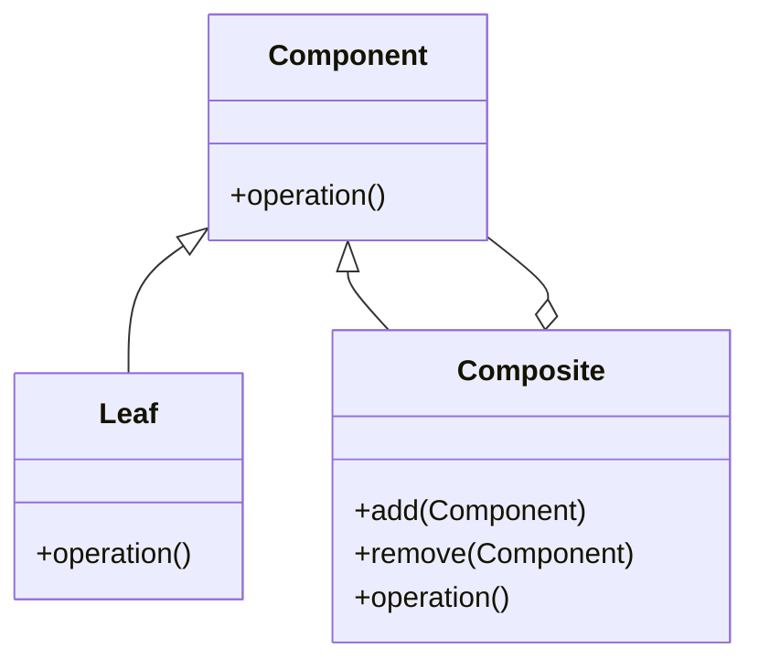
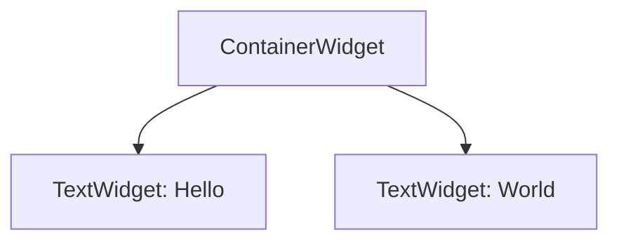

## 5.3 Composite Design Pattern

The Composite Design Pattern is a structural pattern that enables you to compose objects into tree structures to represent part-whole hierarchies. This pattern allows clients to treat individual objects and compositions of objects uniformly. In Dart, this pattern is particularly useful for managing complex UI hierarchies in Flutter applications, as well as for representing structures like file systems.

### Intent

The primary intent of the Composite Design Pattern is to allow clients to work with individual objects and compositions of objects in a consistent manner. This is achieved by defining a common interface for all objects in the composition, whether they are individual elements (leaves) or composite elements (containers).

### Key Participants

1. **Component Interface**: This is the common interface for all objects in the composition. It declares the interface for objects in the composition and implements default behavior for the interface common to all classes.

2. **Leaf Class**: Represents leaf objects in the composition. A leaf has no children and implements the component interface.

3. **Composite Class**: Represents a composite object (container) that can have children. It implements the component interface and defines behavior for components having children.

4. **Client**: Manipulates objects in the composition through the component interface.

### Diagrams

To better understand the Composite Design Pattern, let's visualize it using a class diagram.



**Diagram Description**: The diagram illustrates the relationship between the `Component`, `Leaf`, and `Composite` classes. The `Composite` class can contain multiple `Component` objects, which can be either `Leaf` or other `Composite` objects.

### Implementing Composite in Dart

#### Component Interface

The component interface is the foundation of the Composite Design Pattern. It defines the operations that both leaf and composite objects must implement.

```dart
abstract class Component {
  void operation();
}
```

#### Leaf Class

The leaf class represents the basic elements of the composition. It implements the component interface and provides the specific behavior for leaf objects.

```dart
class Leaf implements Component {
  final String name;

  Leaf(this.name);

  @override
  void operation() {
    print('Leaf $name operation');
  }
}
```

#### Composite Class

The composite class can contain other components, both leaves and composites. It implements the component interface and provides methods for adding and removing child components.

```dart
class Composite implements Component {
  final String name;
  final List<Component> _children = [];

  Composite(this.name);

  void add(Component component) {
    _children.add(component);
  }

  void remove(Component component) {
    _children.remove(component);
  }

  @override
  void operation() {
    print('Composite $name operation');
    for (var child in _children) {
      child.operation();
    }
  }
}
```

#### Client Code

The client code interacts with the objects through the component interface. It can treat individual objects and compositions uniformly.

```dart
void main() {
  Leaf leaf1 = Leaf('Leaf 1');
  Leaf leaf2 = Leaf('Leaf 2');
  Composite composite1 = Composite('Composite 1');
  Composite composite2 = Composite('Composite 2');

  composite1.add(leaf1);
  composite1.add(composite2);
  composite2.add(leaf2);

  composite1.operation();
}
```

**Output**:
```
Composite Composite 1 operation
Leaf Leaf 1 operation
Composite Composite 2 operation
Leaf Leaf 2 operation
```

### Use Cases and Examples

#### UI Hierarchies

In Flutter, the Composite Design Pattern is particularly useful for managing complex UI hierarchies. Widgets in Flutter can be composed of other widgets, forming a tree structure. This pattern allows developers to treat individual widgets and compositions of widgets uniformly.

**Example**: Consider a Flutter application with a complex UI hierarchy. You can use the Composite Design Pattern to manage the hierarchy and simplify the code.

```dart
abstract class Widget {
  void draw();
}

class TextWidget implements Widget {
  final String text;

  TextWidget(this.text);

  @override
  void draw() {
    print('Drawing TextWidget: $text');
  }
}

class ContainerWidget implements Widget {
  final List<Widget> _children = [];

  void add(Widget widget) {
    _children.add(widget);
  }

  void remove(Widget widget) {
    _children.remove(widget);
  }

  @override
  void draw() {
    print('Drawing ContainerWidget');
    for (var child in _children) {
      child.draw();
    }
  }
}

void main() {
  TextWidget text1 = TextWidget('Hello');
  TextWidget text2 = TextWidget('World');
  ContainerWidget container = ContainerWidget();

  container.add(text1);
  container.add(text2);

  container.draw();
}
```

**Output**:
```
Drawing ContainerWidget
Drawing TextWidget: Hello
Drawing TextWidget: World
```

#### File System Structures

The Composite Design Pattern is also applicable to file system structures, where files and folders form a hierarchical structure. Files are leaf nodes, and folders are composite nodes that can contain other files and folders.

**Example**: Implement a simple file system structure using the Composite Design Pattern.

```dart
abstract class FileSystemNode {
  void display();
}

class File implements FileSystemNode {
  final String name;

  File(this.name);

  @override
  void display() {
    print('File: $name');
  }
}

class Directory implements FileSystemNode {
  final String name;
  final List<FileSystemNode> _children = [];

  Directory(this.name);

  void add(FileSystemNode node) {
    _children.add(node);
  }

  void remove(FileSystemNode node) {
    _children.remove(node);
  }

  @override
  void display() {
    print('Directory: $name');
    for (var child in _children) {
      child.display();
    }
  }
}

void main() {
  File file1 = File('file1.txt');
  File file2 = File('file2.txt');
  Directory dir1 = Directory('dir1');
  Directory dir2 = Directory('dir2');

  dir1.add(file1);
  dir1.add(dir2);
  dir2.add(file2);

  dir1.display();
}
```

**Output**:
```
Directory: dir1
File: file1.txt
Directory: dir2
File: file2.txt
```

### Design Considerations

- **When to Use**: Use the Composite Design Pattern when you need to represent part-whole hierarchies and want to treat individual objects and compositions uniformly. This pattern is particularly useful for UI hierarchies and file system structures.

- **Dart-Specific Features**: Dart's support for interfaces and abstract classes makes it easy to implement the Composite Design Pattern. Use Dart's collection classes to manage child components efficiently.

- **Pitfalls**: Be cautious of overusing the Composite Design Pattern, as it can lead to complex and hard-to-maintain code if not used appropriately. Ensure that the pattern is the right fit for your problem before implementing it.

### Differences and Similarities

- **Composite vs. Decorator**: Both patterns involve tree structures, but the Composite pattern is used for part-whole hierarchies, while the Decorator pattern is used to add responsibilities to objects dynamically.

- **Composite vs. Chain of Responsibility**: The Composite pattern focuses on part-whole hierarchies, while the Chain of Responsibility pattern focuses on passing requests along a chain of handlers.

### Try It Yourself

Experiment with the code examples provided by modifying the structure and behavior of the components. Try adding new types of components or changing the way operations are performed. This will help you gain a deeper understanding of the Composite Design Pattern and its applications.

### Visualizing Composite Design Pattern in Dart

To further illustrate the Composite Design Pattern, let's visualize a UI hierarchy using a tree diagram.



**Diagram Description**: This diagram represents a simple UI hierarchy with a `ContainerWidget` containing two `TextWidget` elements.

### Knowledge Check

To reinforce your understanding of the Composite Design Pattern, consider the following questions:

- What is the primary intent of the Composite Design Pattern?
- How does the Composite Design Pattern simplify the management of complex UI hierarchies in Flutter?
- What are the key participants in the Composite Design Pattern?
- How can you implement the Composite Design Pattern in Dart?
- What are some common use cases for the Composite Design Pattern?

### Embrace the Journey

Remember, mastering design patterns is a journey. As you progress, you'll build more complex and interactive applications. Keep experimenting, stay curious, and enjoy the journey!

## Quiz Time!



### What is the primary intent of the Composite Design Pattern?

- [x] To allow clients to treat individual objects and compositions uniformly
- [ ] To add responsibilities to objects dynamically
- [ ] To pass requests along a chain of handlers
- [ ] To encapsulate a request as an object

> **Explanation:** The Composite Design Pattern allows clients to treat individual objects and compositions uniformly, enabling part-whole hierarchies.

### Which class in the Composite Design Pattern represents leaf objects?

- [ ] Component
- [x] Leaf
- [ ] Composite
- [ ] Client

> **Explanation:** The Leaf class represents leaf objects in the composition, which have no children.

### What is a common use case for the Composite Design Pattern in Flutter?

- [ ] Managing network requests
- [x] Managing complex UI hierarchies
- [ ] Handling asynchronous operations
- [ ] Implementing state management

> **Explanation:** The Composite Design Pattern is commonly used in Flutter to manage complex UI hierarchies, allowing widgets to be composed of other widgets.

### How does the Composite class manage its children?

- [ ] By using a map
- [x] By using a list
- [ ] By using a set
- [ ] By using a queue

> **Explanation:** The Composite class typically manages its children using a list, allowing it to add and remove components dynamically.

### What is the role of the Component interface in the Composite Design Pattern?

- [x] To declare the interface for objects in the composition
- [ ] To represent leaf objects
- [ ] To represent composite objects
- [ ] To manage client interactions

> **Explanation:** The Component interface declares the interface for objects in the composition, ensuring that both leaf and composite objects implement the same operations.

### In the Composite Design Pattern, what does the Client interact with?

- [ ] Leaf objects directly
- [ ] Composite objects directly
- [x] The Component interface
- [ ] The Composite class

> **Explanation:** The Client interacts with the Component interface, allowing it to treat individual objects and compositions uniformly.

### What is a potential pitfall of using the Composite Design Pattern?

- [ ] It can lead to tight coupling
- [ ] It can make code less reusable
- [x] It can lead to complex and hard-to-maintain code
- [ ] It can reduce performance

> **Explanation:** Overusing the Composite Design Pattern can lead to complex and hard-to-maintain code if not used appropriately.

### Which pattern is commonly confused with the Composite Design Pattern?

- [ ] Singleton
- [x] Decorator
- [ ] Observer
- [ ] Factory

> **Explanation:** The Decorator pattern is commonly confused with the Composite Design Pattern, as both involve tree structures, but they serve different purposes.

### True or False: The Composite Design Pattern is only applicable to UI hierarchies.

- [ ] True
- [x] False

> **Explanation:** False. The Composite Design Pattern is applicable to various part-whole hierarchies, such as file system structures, not just UI hierarchies.

### What is the primary benefit of using the Composite Design Pattern?

- [ ] It improves performance
- [x] It simplifies client code by treating individual and composite objects uniformly
- [ ] It enhances security
- [ ] It reduces memory usage

> **Explanation:** The primary benefit of the Composite Design Pattern is that it simplifies client code by allowing it to treat individual and composite objects uniformly.


